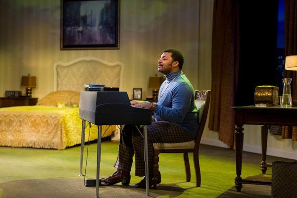
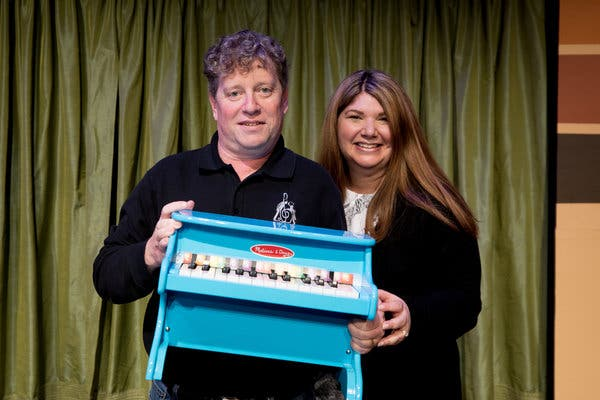

One Fateful Night With Donny Hathaway

Advertisement

[](https://adclick.g.doubleclick.net/pcs/click?xai=AKAOjsu2lHlC_YLtr51vFcxbYy7TEOXYbFDHi36lwxSiIS1ojOh_Xt5SR1sEsmEYTkd3BnXfgr2QrhH6Chr3-hvGtQRvgz0442PbW4zRwMu-WowKeiCfhyZZGKbNSae0YaxBbw9np7ghKN-2cq5SzoiANNQ4c7QKsWUuZifG_hfkQMqjCecXbPHRW08JG_zfWleqkNORWfmdlLjVdElABFvNjwaNPZChRYW5l8BF3mDU-lsZ5vBctkzv1xqNzofUkAd2&sig=Cg0ArKJSzK7DSNQkqbvVEAE&urlfix=1&adurl=https://ad.doubleclick.net/ddm/trackclk/N296811.6440THENEWYORKTIMESCOMPA/B22187340.237970964%3Bdc_trk_aid%3D435228218%3Bdc_trk_cid%3D111025435%3Bdc_lat%3D%3Bdc_rdid%3D%3Btag_for_child_directed_treatment%3D%3Btfua%3D)

[      The truth is worth it.         See the stories               ](https://adclick.g.doubleclick.net/pcs/click?xai=AKAOjsu2lHlC_YLtr51vFcxbYy7TEOXYbFDHi36lwxSiIS1ojOh_Xt5SR1sEsmEYTkd3BnXfgr2QrhH6Chr3-hvGtQRvgz0442PbW4zRwMu-WowKeiCfhyZZGKbNSae0YaxBbw9np7ghKN-2cq5SzoiANNQ4c7QKsWUuZifG_hfkQMqjCecXbPHRW08JG_zfWleqkNORWfmdlLjVdElABFvNjwaNPZChRYW5l8BF3mDU-lsZ5vBctkzv1xqNzofUkAd2&sig=Cg0ArKJSzK7DSNQkqbvVEAE&urlfix=1&adurl=https://ad.doubleclick.net/ddm/trackclk/N296811.6440THENEWYORKTIMESCOMPA/B22187340.237970964%3Bdc_trk_aid%3D435228218%3Bdc_trk_cid%3D111025435%3Bdc_lat%3D%3Bdc_rdid%3D%3Btag_for_child_directed_treatment%3D%3Btfua%3D)

# One Fateful Night with Donny HathawayOne Fateful Night with Donny Hathaway

The bio-play “Twisted Melodies” aims to remind us of his timeless musicianship and unsettling personal struggles.

Kelvin Roston Jr. as Donny Hathaway in “Twisted Melodies,” which is set during the end of the musician's life.CreditRichard Anderson

Image

Kelvin Roston Jr. as Donny Hathaway in “Twisted Melodies,” which is set during the end of the musician's life.CreditCreditRichard Anderson

By [Salamishah Tillet](https://www.nytimes.com/by/salamishah-tillet)

- May 27, 2019

-

    - 
    - 
    - [](https://www.nytimes.com/2019/05/27/theater/twisted-melodies-donny-hathaway.html?action=click&module=Features&pgtype=Homepagemailto:?subject=NYTimes.com%3A%20One%20Fateful%20Night%20With%20Donny%20Hathaway&body=From%20The%20New%20York%20Times%3A%0A%0AOne%20Fateful%20Night%20With%20Donny%20Hathaway%0A%0AThe%20bio-play%20%E2%80%9CTwisted%20Melodies%E2%80%9D%20aims%20to%20remind%20us%20of%20his%20timeless%20musicianship%20and%20unsettling%20personal%20struggles.%0A%0Ahttps%3A%2F%2Fwww.nytimes.com%2F2019%2F05%2F27%2Ftheater%2Ftwisted-melodies-donny-hathaway.html)

    -
    -
    -

BALTIMORE — A reporter once asked the soul singer Donny Hathaway, “What would you be if you were not a musician?” His answer: “Dead.” So ends Ebony*  *magazine’s posthumous April 1979 profile of Hathaway, appearing just two months after he was found lifeless on the sidewalk outside a Manhattan hotel where he was staying.

As a result of his tragic end, fans and friends, especially those unaware of his diagnosis as a paranoid schizophrenic, publicly speculated whether his death was an accident, even though it was [ruled a suicide](https://www.nytimes.com/1979/01/15/archives/donny-hathaway-33-pop-and-blues-singer-dead-in-hotel-plunge-hit.html?module=inline).

No such tension exist in “Twisted Melodies,” the one-man show about Hathaway that begins a five-day run at the [Apollo Theater](https://www.apollotheater.org/event/twisted-melodies/2019-05-30/#schedule)on May 30.

Set in the Essex House hotel room on that fateful night, the play — written by and starring Kelvin Roston Jr. — explores the stirring sounds of Hathaway’s voice and his struggle with his mental health.

Advertisement

[      The truth is worth it.        See the stories               ](https://adclick.g.doubleclick.net/pcs/click?xai=AKAOjstKkEm-5zYLPE-rjKpHOwS4HQ-l4pNoiVKUa0ozeBd0nEs4070n2Arlfr-3seaMo8XCLpgajk_aPG8natFDZq2BLnlWWwjmO_K83N6vR7H9LBCrfeRfgj6hdpyoJXa5fMIFzTI4WJb2ehIg0YKdvrgEM3sFdZ0sEg8NWk96EGLbsq95ZjyRvotSNZGi3mo1-JLiwvu9Zuw3PkHjp79gzgf71HlcOrwMXbcbAc2RV4IeXti0MmdLGqDNZ2k782MF&sig=Cg0ArKJSzH6XZnnjOI1_EAE&urlfix=1&adurl=https://ad.doubleclick.net/ddm/trackclk/N296811.6440THENEWYORKTIMESCOMPA/B22187340.237970964%3Bdc_trk_aid%3D435228218%3Bdc_trk_cid%3D111025435%3Bdc_lat%3D%3Bdc_rdid%3D%3Btag_for_child_directed_treatment%3D%3Btfua%3D)

The play captures these contradictions by weaving Hathaway’s songs in and out of his  deterioration, and through thoughtful set design which allows the audience to see the room, and thus the world, through Hathaway’s troubled eyes.

Mr. Roston originally conceived of a show that would feature Ray Charles, Stevie Wonder and Hathaway. He was working as an intern at [The Black Rep,](http://theblackrep.org/) a professional African-American theater company in St. Louis, and quickly realized that he had to whittle it down to a single character.

“There’s no way I would be able to adequately cover all three of them,” Mr. Roston said. “Once I started doing the research, it actually was the mental illness of Donny Hathaway that pulled me in his direction.”

Hathaway at work.CreditMichael Ochs Archives/Getty Images

Image

Hathaway at work.CreditMichael Ochs Archives/Getty Images

Hathaway was a prodigy, showing signs of preternatural musicianship as early as 3 years old. Raised in a religious St. Louis household by his grandmother, he honed his voice and piano skills in their church’s choir. He studied classical music at Howard University, where he formed a jazz trio with the drummer Ric Powell and met the singer [Roberta Flack,](http://www.robertaflack.com/) a future collaborator and lifetime friend.

Advertisement

[      The truth is worth it.         See the stories               ](https://adclick.g.doubleclick.net/pcs/click?xai=AKAOjsvC77EgJWLYuOXpl-p30iI4uM9mygPOOadTLG_RUYmy5DQkx8Dh874tA2_KYtZyy98PRSkuaGYd73x2m1FmlmaD0_BNxTwa4v76yvqv7UhkVDpZEZtsZPdsoyP6I0NUW4vviWqLNJo1t8PbpVHfyBQBzuRVCTseFztGjtegmRXIlI81U-lxc9aMyloZxbc0YP2Qo2kflziaueNfpOeiUk2TYNrD9ncDrthXRILO44uNNyZOg1trNUCfHDYurOIO&sig=Cg0ArKJSzCJU5ji_iR-6EAE&urlfix=1&adurl=https://ad.doubleclick.net/ddm/trackclk/N296811.6440THENEWYORKTIMESCOMPA/B22187340.237970964%3Bdc_trk_aid%3D435228218%3Bdc_trk_cid%3D111025435%3Bdc_lat%3D%3Bdc_rdid%3D%3Btag_for_child_directed_treatment%3D%3Btfua%3D)

He left Howard early and quickly landed work as a producer and arranger for the likes of Aretha Franklin and the Staple Singers. A year after signing with Atlantic, Rolling Stone magazine dubbed him “a major new force in soul music.” His hits included “This Christmas,” “Someday We’ll All Be Free” and “A Song for You.” His duet with Ms. Flack, “Where is the Love?,” won them a Grammy Award in 1973.

The breadth of Hathaway’s musical interests made adapting his story no easy feat. First produced in 2015 at Chicago’s [Congo Square Theater,](http://www.congosquaretheatre.org/) where Mr. Roston was an artistic associate, the play moved to [Baltimore Center Stage](https://www.centerstage.org/) in 2017, and was revived there in early May. The Apollo run is a coproduction among the three theaters in association with Washington’s [Mosaic Theater Company](https://www.mosaictheater.org/), where it will run from June 19 through July 21.

Derrick Sanders, the founding artistic director of Congo Square, came on board to direct during its first Baltimore run.

“My initial approach to the piece was that Hathaway was an American ‘Amadeus’ story,” he said, referring to Peter Shaffer’s award-winning play about Mozart. “Like Amadeus, he was a musical genius, but he was a tortured and lost soul.”

Yet while it was important to tell a story about mental illness in the black community, Mr. Sanders said that the show needed to be entertaining as well. “One thing I know is that people don’t want to sit here and listen unless you can do Donny’s music,” he explained.

Fortunately, Mr. Roston who was also musically trained in the Baptist church, is such a gifted singer that he is able to channel the Hathaway’s artistry without distracting from the momentum of the story or the integrity of Hathaway’s own musical legacy.

Advertisement

[      The truth is worth it.        See the stories               ](https://adclick.g.doubleclick.net/pcs/click?xai=AKAOjsuoNTc5Zfe7hZ1kEX3FLEzUUvlhKwydIOFDljIPf2bkPBgQNopNyS60zxz435_fORfE4w41IAyEvqxFNcUfPFKAKPOEpy98seTYxpXX901cDgdgAXzDm79baQDi17nEP2TCtctKFOwnYmzsORbaokTBYGgG_XNqFCrv-5dK63OWFXnTChPkCydViELOwRGerQaEY429IOMJ_McjwiY7l5EEtokn-PFKqHU_woPXD_3JFD35p1qruCy6n_hLju_4&sig=Cg0ArKJSzPS-7YkFLFTlEAE&urlfix=1&adurl=https://ad.doubleclick.net/ddm/trackclk/N296811.6440THENEWYORKTIMESCOMPA/B22187340.237970964%3Bdc_trk_aid%3D435228218%3Bdc_trk_cid%3D111025435%3Bdc_lat%3D%3Bdc_rdid%3D%3Btag_for_child_directed_treatment%3D%3Btfua%3D)

To date, Hathaway has been the subject of two poetry collections, a quasi-biography and a documentary, and this month he was honored with a Grammy Lifetime Achievement Award, to coincide with the 40th anniversary of his death.

His appeal appears to stem from the timelessness of his songs and the timeliness of his persona.

“Hathaway was not flashy like Sly Stone nor sexy like Marvin Gaye or some of the other soul men of that moment,” said Emily J. Lordi, the author of “Donny Hathaway Live.” “But what I think  makes him so enduring is that he performed black masculinity in a really different way. He wasn’t the kind of classic macho soul man.”

Hathaway, Ms. Lordi said, deserves to be contextualized in the era of the Black Power movement. “There is a greater interest in telling the untold stories of soul by recuperating and illuminating some of those previously marginalized artists that haven’t neatly fit into the narrow frameworks that we’ve had for that political and artistic moment,” she explained.

Diagnosed at his professional peak in the early 1970s, Hathaway spent that decade in and out of hospitals, eventually separating from his wife, Eulaulah Hathaway, and their two daughters and going five years without recording a song.

When he did perform, band members, not to mention critics, often found him erratic. Yet in 1979, he was on his way to comeback. That year, Ms. Flack released their chart-topping duet “The Closer I Get to You,” and they spent many hours together in the recording studio on the day that he died.

“Twisted Melodies” considers Hathaway’s ability to push beyond the sonic boundaries of “time and space,” to quote one of his most famous songs. But it also seeks to deconstruct popular conceptions about madness and music — the myth that suffering is only the path to great art.

Advertisement

 [(L)](https://adclick.g.doubleclick.net/pcs/click%253Fxai%253DAKAOjstqqf6lihNPeq188nLf83P-n2EhP3ymYzTKwzCxCAHSfG-fFNIoSkaV-Jsn7UTJWrBbvL-W-9M4J2E70vUqdK4UgIBtKe-cvtaT6CuTfPj6jhMHcFR8uP7DhyiaX7_jrPvfZJMnIi9iBYBxHcJ0fL4dOr_HNFo1JbmuEkabUWU2dzdg_pX6FjhIJK-E85uHbiBKmgv9I3PvQvujIraeCWzo7LaMjpc64UunYWqZoiMW0KyF-qFoECEhphegwrv-PN-6lA%2526sig%253DCg0ArKJSzBbWr8oL2dC0EAE%2526urlfix%253D1%2526adurl%253Dhttps://ad.doubleclick.net/ddm/trackclk/N296811.6440THENEWYORKTIMESCOMPA/B22283637.240761726%3Bdc_trk_aid%3D437792132%3Bdc_trk_cid%3D112659762%3Bdc_lat%3D%3Bdc_rdid%3D%3Btag_for_child_directed_treatment%3D%3Btfua%3D)

[                  Make your inbox environmentally conscious.           Sign up for the newsletter that brings understanding and insight about climate change right to your inbox.        sign up      ](https://adclick.g.doubleclick.net/pcs/click%253Fxai%253DAKAOjstqqf6lihNPeq188nLf83P-n2EhP3ymYzTKwzCxCAHSfG-fFNIoSkaV-Jsn7UTJWrBbvL-W-9M4J2E70vUqdK4UgIBtKe-cvtaT6CuTfPj6jhMHcFR8uP7DhyiaX7_jrPvfZJMnIi9iBYBxHcJ0fL4dOr_HNFo1JbmuEkabUWU2dzdg_pX6FjhIJK-E85uHbiBKmgv9I3PvQvujIraeCWzo7LaMjpc64UunYWqZoiMW0KyF-qFoECEhphegwrv-PN-6lA%2526sig%253DCg0ArKJSzBbWr8oL2dC0EAE%2526urlfix%253D1%2526adurl%253Dhttps://ad.doubleclick.net/ddm/trackclk/N296811.6440THENEWYORKTIMESCOMPA/B22283637.240761726%3Bdc_trk_aid%3D437792132%3Bdc_trk_cid%3D112659762%3Bdc_lat%3D%3Bdc_rdid%3D%3Btag_for_child_directed_treatment%3D%3Btfua%3D)

Rather than romanticize Hathaway’s fate, the play demands that we see him as both marvelous and morally complicated, a man who had to fight himself in order to be heard.

“Knowing that he was mentally ill means that we don’t get angry at people when their performances are not up to their usual standards because of some crisis they may be going through,” said Guthrie Ramsey, a music professor at the University of Pennsylvania who has written about [the jazz pianist Bud Powell’s schizophrenia.](https://www.ucpress.edu/book/9780520243910/the-amazing-bud-powell)

“Conversely, we shouldn’t think that it’s because of their mental illness they have some great artistic power,” Mr. Ramsey added. “We should simply put it into context, like we do other aspects of their upbringing, rather than making it some mysterious gift that they seem to be bestowed.”

A version of this article appears in print on May 28, 2019, on Page C2 of the New York edition with the headline: Channeling the Soul Of a Troubled Singer. [Order Reprints](http://www.nytreprints.com/) | [Today’s Paper](http://www.nytimes.com/pages/todayspaper/index.html) | [Subscribe](https://www.nytimes.com/subscriptions/Multiproduct/lp8HYKU.html?campaignId=48JQY)

- 
- 
- [](https://www.nytimes.com/2019/05/27/theater/twisted-melodies-donny-hathaway.html?action=click&module=Features&pgtype=Homepagemailto:?subject=NYTimes.com%3A%20One%20Fateful%20Night%20With%20Donny%20Hathaway&body=From%20The%20New%20York%20Times%3A%0A%0AOne%20Fateful%20Night%20With%20Donny%20Hathaway%0A%0AThe%20bio-play%20%E2%80%9CTwisted%20Melodies%E2%80%9D%20aims%20to%20remind%20us%20of%20his%20timeless%20musicianship%20and%20unsettling%20personal%20struggles.%0A%0Ahttps%3A%2F%2Fwww.nytimes.com%2F2019%2F05%2F27%2Ftheater%2Ftwisted-melodies-donny-hathaway.html)

-

## Sign up for the Theater Update Newsletter

Every week, stay on top of the top-grossing Broadway shows, recent reviews, Critics’ Picks and more.

I want to receive updates and promotions from The New York Times. I can opt out any time.

- [Privacy Policy](https://www.nytimes.com/privacy)
- [Contact us](https://www.nytimes.com/help/index.html)

## [More in Theater](https://www.nytimes.com/section/theater)

[   Allison V. Smith for The New York Times](https://www.nytimes.com/2019/05/28/theater/theyre-playing-our-song-hamlisch-fans.html?action=click&module=MoreInSection&pgtype=Article&region=Footer&contentCollection=Theater)

[## ‘They’re Playing Our Song,’ Over and Over and Over Again](https://www.nytimes.com/2019/05/28/theater/theyre-playing-our-song-hamlisch-fans.html?action=click&module=MoreInSection&pgtype=Article&region=Footer&contentCollection=Theater)May 28

[   Sara Krulwich/The New York Times](https://www.nytimes.com/2019/05/29/arts/dance/tony-awards-choreography-broadway.html?action=click&module=MoreInSection&pgtype=Article&region=Footer&contentCollection=Theater)

[## There’s Great Dance on Broadway. Hello, Tony Awards?](https://www.nytimes.com/2019/05/29/arts/dance/tony-awards-choreography-broadway.html?action=click&module=MoreInSection&pgtype=Article&region=Footer&contentCollection=Theater)May 29

 [   PAID POST: AUDEMARS PIGUET](https://adclick.g.doubleclick.net/pcs/click?xai=AKAOjssiUKmUJFdwRPZTMjppN6qcp8YkFCK-9D_2bn5tp3MSFsW0sFtN1yBjkHk4mmJgJ0uZ8K4gebvd8OsmNxNaPkughHg8aM0Vl-sPHBdrb_G-dADWhlQY-PaARw_3k1QtCwBv-OINBFEroJrGFZ51SVRtusRrDAgBUqAvUkuC9HXM7FIlEr6B607_JAknvJuPLIoYlsOJJ9_P1OC71VTUWT1wnp_k0fmac8nARZpu0RUrr_PZFOE7jHaIdL4eQW8EymU&sig=Cg0ArKJSzDDlE5Ervjy5EAE&urlfix=1&adurl=https://www.nytimes.com/paidpost/audemars-piguet/enter-the-data-verse.html%3Fcpv_ap_id%3D50010981%26sr_source%3Dlift_morein%26tbs_nyt%3D2019-may-nytnative_morein)  [This Artistic Interpretation of the Universe Is Built on Years of Research](https://adclick.g.doubleclick.net/pcs/click?xai=AKAOjssiUKmUJFdwRPZTMjppN6qcp8YkFCK-9D_2bn5tp3MSFsW0sFtN1yBjkHk4mmJgJ0uZ8K4gebvd8OsmNxNaPkughHg8aM0Vl-sPHBdrb_G-dADWhlQY-PaARw_3k1QtCwBv-OINBFEroJrGFZ51SVRtusRrDAgBUqAvUkuC9HXM7FIlEr6B607_JAknvJuPLIoYlsOJJ9_P1OC71VTUWT1wnp_k0fmac8nARZpu0RUrr_PZFOE7jHaIdL4eQW8EymU&sig=Cg0ArKJSzDDlE5Ervjy5EAE&urlfix=1&adurl=https://www.nytimes.com/paidpost/audemars-piguet/enter-the-data-verse.html%3Fcpv_ap_id%3D50010981%26sr_source%3Dlift_morein%26tbs_nyt%3D2019-may-nytnative_morein)

[](https://adclick.g.doubleclick.net/pcs/click?xai=AKAOjssiUKmUJFdwRPZTMjppN6qcp8YkFCK-9D_2bn5tp3MSFsW0sFtN1yBjkHk4mmJgJ0uZ8K4gebvd8OsmNxNaPkughHg8aM0Vl-sPHBdrb_G-dADWhlQY-PaARw_3k1QtCwBv-OINBFEroJrGFZ51SVRtusRrDAgBUqAvUkuC9HXM7FIlEr6B607_JAknvJuPLIoYlsOJJ9_P1OC71VTUWT1wnp_k0fmac8nARZpu0RUrr_PZFOE7jHaIdL4eQW8EymU&sig=Cg0ArKJSzDDlE5Ervjy5EAE&urlfix=1&adurl=https://www.nytimes.com/paidpost/audemars-piguet/enter-the-data-verse.html%3Fcpv_ap_id%3D50010981%26sr_source%3Dlift_morein%26tbs_nyt%3D2019-may-nytnative_morein)

[   Sara Krulwich/The New York Times](https://www.nytimes.com/2019/05/29/theater/animals-in-plays.html?action=click&module=MoreInSection&pgtype=Article&region=Footer&contentCollection=Theater)

[## Does Anything Awful Happen to the Cat in the Play?](https://www.nytimes.com/2019/05/29/theater/animals-in-plays.html?action=click&module=MoreInSection&pgtype=Article&region=Footer&contentCollection=Theater)May 29

[   Brinkhoff-Moegenburg](https://www.nytimes.com/2019/05/30/theater/london-theater-death-of-a-salesman-.html?action=click&module=MoreInSection&pgtype=Article&region=Footer&contentCollection=Theater)

[## In This ‘Death of a Salesman,’ Willy Loman Is Black](https://www.nytimes.com/2019/05/30/theater/london-theater-death-of-a-salesman-.html?action=click&module=MoreInSection&pgtype=Article&region=Footer&contentCollection=Theater)2h ago

[   T. Charles Erickson](https://www.nytimes.com/2019/05/28/theater/the-flamingo-kid-review-hartford-stage.html?action=click&module=MoreInSection&pgtype=Article&region=Footer&contentCollection=Theater)

[## Review: ‘The Flamingo Kid,’ a Musical Not Yet in Flight](https://www.nytimes.com/2019/05/28/theater/the-flamingo-kid-review-hartford-stage.html?action=click&module=MoreInSection&pgtype=Article&region=Footer&contentCollection=Theater)May 28

## Editors’ Picks

[   via YouTube](https://www.nytimes.com/2019/05/22/magazine/burger-king-real-meals-ad.html?fallback=0&recId=1LxAFExradhfB6Q9uGnaxbKxq0d&locked=0&geoContinent=EU&geoRegion=LND&recAlloc=story&geoCountry=GB&blockId=home-featured&imp_id=276327212&action=click&module=editorsPicks&pgtype=Article&region=Footer)

[## This Is What It Sounds Like When Brands Cry](https://www.nytimes.com/2019/05/22/magazine/burger-king-real-meals-ad.html?fallback=0&recId=1LxAFExradhfB6Q9uGnaxbKxq0d&locked=0&geoContinent=EU&geoRegion=LND&recAlloc=story&geoCountry=GB&blockId=home-featured&imp_id=276327212&action=click&module=editorsPicks&pgtype=Article&region=Footer)May 22

[   Cari Vander Yacht](https://www.nytimes.com/2019/05/28/books/review/david-epstein-range.html?fallback=0&recId=1LxAFExradhfB6Q9uGnaxbKxq0d&locked=0&geoContinent=EU&geoRegion=LND&recAlloc=story&geoCountry=GB&blockId=home-featured&imp_id=687613344&action=click&module=editorsPicks&pgtype=Article&region=Footer)

[## Remember the ‘10,000 Hours’ Rule for Success? Forget About It](https://www.nytimes.com/2019/05/28/books/review/david-epstein-range.html?fallback=0&recId=1LxAFExradhfB6Q9uGnaxbKxq0d&locked=0&geoContinent=EU&geoRegion=LND&recAlloc=story&geoCountry=GB&blockId=home-featured&imp_id=687613344&action=click&module=editorsPicks&pgtype=Article&region=Footer)May 28

[   Thomas Samson/Agence France-Presse — Getty Images](https://www.nytimes.com/2019/05/28/fashion/serena-williams-french-open-fashion-statement.html?fallback=0&recId=1LxAFExradhfB6Q9uGnaxbKxq0d&locked=0&geoContinent=EU&geoRegion=LND&recAlloc=story&geoCountry=GB&blockId=home-featured&imp_id=248842690&action=click&module=editorsPicks&pgtype=Article&region=Footer)

[## Serena Williams Won’t Be Silenced. Her Clothes Are Doing the Talking.](https://www.nytimes.com/2019/05/28/fashion/serena-williams-french-open-fashion-statement.html?fallback=0&recId=1LxAFExradhfB6Q9uGnaxbKxq0d&locked=0&geoContinent=EU&geoRegion=LND&recAlloc=story&geoCountry=GB&blockId=home-featured&imp_id=248842690&action=click&module=editorsPicks&pgtype=Article&region=Footer)May 28

Most Popular

- [Mueller, in First Comments on Russia Inquiry, Declines to Clear Trump](https://www.nytimes.com/2019/05/29/us/politics/mueller-special-counsel.html?fallback=0&recId=1LxAFBOxhcujVYLcxFhDXBnQkLY&locked=0&geoContinent=EU&geoRegion=LND&recAlloc=top_conversion&geoCountry=GB&blockId=most-popular&imp_id=33909741&action=click&module=trending&pgtype=Article&region=Footer)
- [Next Out of Prince’s Vaults: The Hits He Gave Away](https://www.nytimes.com/2019/05/29/arts/music/prince-originals-demo-album.html?fallback=0&recId=1LxAFBOxhcujVYLcxFhDXBnQkLY&locked=0&geoContinent=EU&geoRegion=LND&recAlloc=top_conversion&geoCountry=GB&blockId=most-popular&imp_id=337523267&action=click&module=trending&pgtype=Article&region=Footer)
- [White House Asked Navy to Hide John McCain Warship During Trump’s Visit](https://www.nytimes.com/2019/05/29/us/politics/uss-mccain-navy-ship.html?fallback=0&recId=1LxAFBOxhcujVYLcxFhDXBnQkLY&locked=0&geoContinent=EU&geoRegion=LND&recAlloc=top_conversion&geoCountry=GB&blockId=most-popular&imp_id=995926097&action=click&module=trending&pgtype=Article&region=Footer)
- [Opinion: Robert De Niro: Robert Mueller, We Need to Hear More](https://www.nytimes.com/2019/05/29/opinion/robert-de-niro-robert-mueller-we-need-to-hear-more.html?fallback=0&recId=1LxAFBOxhcujVYLcxFhDXBnQkLY&locked=0&geoContinent=EU&geoRegion=LND&recAlloc=top_conversion&geoCountry=GB&blockId=most-popular&imp_id=987842003&action=click&module=trending&pgtype=Article&region=Footer)
- [‘Rocketman’ Review: The Fantastical Tale of Elton John, Survivor, Rock God, Camp Icon](https://www.nytimes.com/2019/05/28/movies/rocketman-review.html?fallback=0&recId=1LxAFBOxhcujVYLcxFhDXBnQkLY&locked=0&geoContinent=EU&geoRegion=LND&recAlloc=top_conversion&geoCountry=GB&blockId=most-popular&imp_id=755430670&action=click&module=trending&pgtype=Article&region=Footer)
- [Bad Health and Worse Luck? Time for a Family Bike Trip](https://www.nytimes.com/interactive/2019/05/27/travel/canada-quebec-family-bike-trip.html?fallback=0&recId=1LxAFBOxhcujVYLcxFhDXBnQkLY&locked=0&geoContinent=EU&geoRegion=LND&recAlloc=top_conversion&geoCountry=GB&blockId=most-popular&imp_id=435205140&action=click&module=trending&pgtype=Article&region=Footer)
- [Eat, Pray, Love, Lose, Write a Book, Repeat](https://www.nytimes.com/2019/05/29/style/who-wrote-eat-pray-love-elizabeth-gilbert.html?fallback=0&recId=1LxAFBOxhcujVYLcxFhDXBnQkLY&locked=0&geoContinent=EU&geoRegion=LND&recAlloc=top_conversion&geoCountry=GB&blockId=most-popular&imp_id=705956471&action=click&module=trending&pgtype=Article&region=Footer)
- [Rise in Unruly Behavior on Planes Is Tied to Stress of Flying](https://www.nytimes.com/2019/05/27/business/unruly-behavior-planes-inequality.html?fallback=0&recId=1LxAFBOxhcujVYLcxFhDXBnQkLY&locked=0&geoContinent=EU&geoRegion=LND&recAlloc=top_conversion&geoCountry=GB&blockId=most-popular&imp_id=495760875&action=click&module=trending&pgtype=Article&region=Footer)
- [The Bond Market Is Giving Ominous Warnings About the Global Economy](https://www.nytimes.com/2019/05/29/upshot/the-bond-market-is-giving-ominous-warnings-about-the-global-economy.html?fallback=0&recId=1LxAFBOxhcujVYLcxFhDXBnQkLY&locked=0&geoContinent=EU&geoRegion=LND&recAlloc=top_conversion&geoCountry=GB&blockId=most-popular&imp_id=224506372&action=click&module=trending&pgtype=Article&region=Footer)
- [30 Years After Tiananmen, a Chinese Military Insider Warns: Never Forget](https://www.nytimes.com/2019/05/28/world/asia/china-tiananmen-square-massacre.html?fallback=0&recId=1LxAFBOxhcujVYLcxFhDXBnQkLY&locked=0&geoContinent=EU&geoRegion=LND&recAlloc=top_conversion&geoCountry=GB&blockId=most-popular&imp_id=659052125&action=click&module=trending&pgtype=Article&region=Footer)

Advertisement