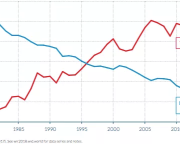

One chart that shows how much worse income inequality is in America than Europe

One chart that shows how much worse income inequality is in America than Europe

https://www.vox.com/2018/7/29/17627134/income-inequality-chart

The income share of the poorest half of Americans is declining while the richest have grabbed more. In Europe, it’s not happening.