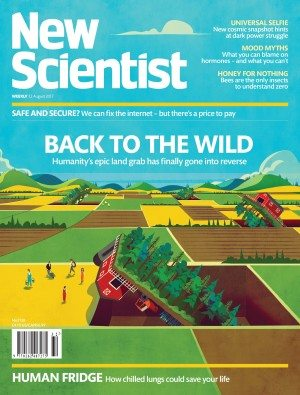

One day without notifications changes behaviour for two years

[(L)](https://www.newscientist.com/article/2142807-one-day-without-notifications-changes-behaviour-for-two-years/#)[(L)](https://www.newscientist.com/article/2142807-one-day-without-notifications-changes-behaviour-for-two-years/#)[(L)](https://www.newscientist.com/article/2142807-one-day-without-notifications-changes-behaviour-for-two-years/#)[(L)](https://www.newscientist.com/article/2142807-one-day-without-notifications-changes-behaviour-for-two-years/#)[(L)](https://www.newscientist.com/article/2142807-one-day-without-notifications-changes-behaviour-for-two-years/#)[(L)](https://www.newscientist.com/article/2142807-one-day-without-notifications-changes-behaviour-for-two-years/#)[[74](https://www.newscientist.com/article/2142807-one-day-without-notifications-changes-behaviour-for-two-years/#)](https://www.newscientist.com/article/2142807-one-day-without-notifications-changes-behaviour-for-two-years/#)

[Daily news](https://www.newscientist.com/article_type/daily-news/)

3 August 2017

# One day without notifications changes behaviour for two years

Attention-seeking
Stephen Frost/Alamy Stock Photo
By Timothy Revell

Look at me! Look at me! There’s no denying apps are needy. Every time you glance at your phone there’s [another demand for your attention](https://www.newscientist.com/app-download/). Apps don’t even care if you’re already using one of their brethren, ruthlessly jockeying to get you to switch your focus.

So why not just turn them off? To try this, Martin Pielot of Spanish telecommunications firm Telefónica and Luz Rello of Carnegie Mellon University, Pennsylvania, decided to create the Do Not Disturb Challenge – one week without notifications. “But we couldn’t recruit anybody to take part,” says Pielot. “We just got empty, horrified stares. And so eventually we backed down to 24 hours.”

Although a day without notifications might not seem that long, it was enough for the 30 participants to notice some sizeable effects. People worried they were being less responsive and were generally more anxious about what they were missing. On the flip side, they were less distracted and more productive.

The biggest indicator of how stressful someone would find the experience was the social expectation on them. “If people don’t think of you as likely to respond quickly, you were unlikely to feel stressed during the challenge, but if you have a boss who expects a quick response, then things were different,” says Pielot.

## Promises kept

After the challenge, two-thirds of the participants said they would change how they managed their notifications. Surprisingly, half had actually stuck with this goal two years on, suggesting that even a short, enforced holiday is a powerful intervention. The results will be presented at a [conference on human-computer interaction](https://mobilehci.acm.org/2017/) next month in Austria.

[One day without notifications changes behaviour for two years](https://www.youtube.com/watch?v=pjtxpnEDDDM)

We need all the help we can get. “If you have notifications constantly grabbing your attention, we know that you are [more likely to make mistakes and you are less likely to get stuff done](https://www.newscientist.com/article/mg23431250-100-why-the-fight-for-a-shorter-working-week-is-missing-the-point/),” says [Anna Cox](https://uclic.ucl.ac.uk/people/anna-cox) of the University College London Interaction Centre. Because of this, it is important to find ways to manage not just notifications, but also the tendency to check them.

Cox suggests putting small hurdles called [microboundaries](https://digitalboundariesresearch.wordpress.com/home/what-are-microboundaries/) between you and the behaviour you are trying to reduce. This could be as simple as turning off email notifications when with friends or taking off your smartwatch when you get home.

“People check social media all the time without even thinking just because it’s right there on your phone,” says Cox. “Anything that makes that just a little bit harder can help you avoid the bad habit.”

Journal reference: *ACM MobileHCI ’17*, [DOI: 10.1145/3098279.3098526](http://pielot.org/pubs/PielotRello2017-MHCI-DoNotDisturb.pdf)

More on these topics:

- [cellphones](https://www.newscientist.com/article-topic/cellphones/)
- [mental health](https://www.newscientist.com/article-topic/mental-health/)
- [psychology](https://www.newscientist.com/article-topic/psychology/)

[A shorter version of this article](https://www.newscientist.com/article/mg23531382-700-one-day-without-notifications-changes-behaviour-for-two-years/) was published in *New Scientist* magazine on 12 August 2017

[(L)](https://www.newscientist.com/article/2142807-one-day-without-notifications-changes-behaviour-for-two-years/#)[(L)](https://www.newscientist.com/article/2142807-one-day-without-notifications-changes-behaviour-for-two-years/#)[(L)](https://www.newscientist.com/article/2142807-one-day-without-notifications-changes-behaviour-for-two-years/#)[(L)](https://www.newscientist.com/article/2142807-one-day-without-notifications-changes-behaviour-for-two-years/#)[(L)](https://www.newscientist.com/article/2142807-one-day-without-notifications-changes-behaviour-for-two-years/#)[(L)](https://www.newscientist.com/article/2142807-one-day-without-notifications-changes-behaviour-for-two-years/#)[[74](https://www.newscientist.com/article/2142807-one-day-without-notifications-changes-behaviour-for-two-years/#)](https://www.newscientist.com/article/2142807-one-day-without-notifications-changes-behaviour-for-two-years/#)

 

- [Download](https://www.newscientist.com/app-download)

- [Buy In Print](http://mags-uk.com/)

- [Subscribe](http://subscription.newscientist.com/packages/newscientist.php?promCode=9677&packageCodes=TPA&offerCode=Q&intcmp=SUBS-articlefooter-2017-Q1-mug&cmpid=Q1)

##### Advertisement

