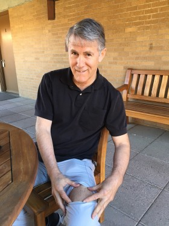

One man’s quest to hack his own genes

# [Rewriting Life](https://www.technologyreview.com/topic/rewriting-life/)

## One Man’s Quest to Hack His Own Genes

When Brian Hanley set out to test a gene therapy, he started with himself.

- by[Antonio Regalado](https://www.technologyreview.com/profile/antonio-regalado/)
- January 10, 2017

- [41](https://www.technologyreview.com/s/603217/one-mans-quest-to-hack-his-own-genes/#disqus_thread)
- [**](https://www.technologyreview.com/s/603217/one-mans-quest-to-hack-his-own-genes/#)
- [**](https://www.technologyreview.com/s/603217/one-mans-quest-to-hack-his-own-genes/#)
- [**](https://www.technologyreview.com/s/603217/one-mans-quest-to-hack-his-own-genes/#)
- [**](https://www.technologyreview.com/s/603217/one-mans-quest-to-hack-his-own-genes/#)

In a dream Brian Hanley told me about, he’s riding a bus when he meets a man in dark leather clothing. Next thing he knows, he is splayed across a tilted metal bed, being electrocuted.

The dream was no doubt connected to events that took place last June at a plastic surgeon’s office in Davis, California. At Hanley’s request, a doctor had injected into his thighs copies of a gene that Hanley, a PhD microbiologist, had designed and ordered from a research supply company. Then, plunging two pointed electrodes into his leg, the doctor had passed a strong current into his body, causing his muscle cells to open and absorb the new DNA.

The effort is the second case *MIT **Technology Review* has documented of unregulated gene therapy, a risky undertaking that is being embraced by a few daring individuals seeking to develop anti-aging treatments. The gene Hanley added to his muscle cells would make his body produce more of a potent hormone—potentially increasing his strength, stamina, and life span.

>
>

## > Should people be able to experiment on themselves using gene therapy without the FDA's sign-off?

>   > [> Tell us what you think.](https://www.technologyreview.com/s/603217/one-mans-quest-to-hack-his-own-genes/#comments)>

>

Hanley, 60, is the founder of a one-man company called [Butterfly Sciences](https://bf-sci.com/), also in Davis. After encountering little interest from investors for his ideas about using DNA injections to help strengthen AIDS patients, he determined that he should be the first to try it. “I wanted to prove it, I wanted to do it for myself, and I wanted to make progress,” says Hanley.

Most gene therapy involves high-tech, multimillion-dollar experiments carried out by large teams at top medical centers, with an eye to correcting rare illnesses like hemophilia. But Hanley showed that gene therapy can be also carried out on the cheap in the same setting as liposuction or a nose job, and might one day be easily accessed by anyone.

In an attempt to live longer, some enthusiasts of anti-aging medicine already inject growth hormone, swallow fullerenes, or gulp megavitamins, sometimes with disregard for mainstream medical thinking. Now unregulated gene therapy could be the next frontier. “I think it’s damn crazy,” says Bruce Smith, a professor at Auburn University who develops genetic treatments for dogs. “But that is human nature, and it’s colliding with technology.”

To pull off his experiment, Hanley used his scientific knowledge and part of his life savings. He put his insider know-how to work to procure supplies, order blood tests, win the sign-off of a local ethics committee, and engage a plastic surgeon who helped give him two treatments, a small dose in 2015 and then a larger one last June.

Hanley, who drives a battered sedan humming with Hindu rave music, fits the profile of an underappreciated genius on a self-improvement quest. He’s a prolific online commenter whose opinions touch on everything from radiation to electric cars and street pickup of leaf piles. But his scientific thinking seems generally sound, and he says the meaning of his dream is straightforward too: he’d become Dr. Frankenstein’s monster. “My unconscious is really not that subtle,” says Hanley. *“*I had become something else, not entirely me.”

Biologist Brian Hanley shows a tattoo on his thigh marking the location where a "DIY" gene-therapy he developed was administered.

Hanley’s undertaking has caught the attention of big-league scientists. His blood is now being studied by researchers at Harvard University at the laboratory of George Church, the renowned genomics expert. Church, who provided *MIT **Technology Review* with an introduction to Hanley, says he knows of a handful of other cases of do-it-yourself gene therapy as well. “And there are probably a lot more,” he says, although no one is quite sure, since regulators have not signed off on the experiments. “This is a completely free-form exercise.”

In 2015, we* *[wrote about the case of Liz Parrish](https://www.technologyreview.com/s/542371/a-tale-of-do-it-yourself-gene-therapy/), an entrepreneur without a background in biology who claimed to have received a dose of gene therapy in Latin America. Parrish briefly worked for Hanley, whom she knew from anti-aging meetings. At least one additional person who underwent self-administered gene therapy is a U.S. biotech executive who did not want his experience publicly known because he is dealing with the U.S. Food and Drug Administration on other matters.

Hanley says he did not secure the approval of the FDA before carrying out his experiment either. The agency requires companies to seek an authorization called an investigational new drug application, or IND, before administering any novel drug or gene therapy to people. “They said ‘You need an IND’ and I said, ‘No, I don’t,’” recalls Hanley, who traded e-mails with officials at the federal agency. He argued that self-experiments should be exempt, in part because they don’t pose any risk to the public.

That’s not to say gene therapy is without dangers, such as immune reactions. “I spent years doing very little else other than iterating designs and thinking of all the ways something could go wrong,” he says. When I met him on Stanford University’s campus to discuss his project, Hanley zipped open his cargo pants to show me three black dots tattooed on his left thigh, marking the site of one of the injections. Had the gene therapy gone haywire, he says, his fail-safe option was to have the affected tissue surgically removed.

**Informed consent**

During a day I spent with Hanley in Menlo Park, he seemed to burst with energy, several times colliding with me as we tried to walk through doors. Was it the gene therapy at work, an excitable personality, or just a show? “I think getting near Spider-Man-like transformations of people is potentially possible,” he says of gene therapy.

Most often, this approach relies on viruses to shuttle DNA into a person’s cells. Hanley opted instead for a simpler method called electroporation. In this procedure, circular rings of DNA, called plasmids, are passed into cells using an electrical current. Once inside, they don’t become a permanent part of person’s chromosomes. Instead, they float inside the nucleus. And if a gene is coded into the plasmid, it will start to manufacture proteins. The effect of plasmids is temporary, lasting weeks to a few months.

Because of its relative simplicity, the same technique is now eyed as a novel way to quickly deliver vaccines in response to emerging diseases. In August, the U.S. National Institutes of Health began dosing volunteers with [a plasmid containing parts of the Zika virus](https://www.technologyreview.com/s/602073/us-government-starts-test-of-zika-vaccine-in-humans/).

Hanley took the technique in a different direction, poring over decade-old studies by a company called VGX Animal Health that had tried zapping plasmids into the muscles of cows, dogs with kidney disease, and baby piglets. They’d explored adding extra copies of the gene for growth-hormone-releasing hormone (GHRH)—a molecule that is normally made in the brain. One of its roles is to travel to the pituitary gland, where it acts as a regulator of growth hormone itself, telling the body to make more. It also appears to have an array of other roles, including enhancing the immune system.

“We never did try it in humans, but from everything that I saw in dogs, cats, cattle, pigs, and horses, it seems like a reasonable leap forward,” says Douglas Kern, a veterinarian who worked at VGX. “It has very profound positive effects in most species.”

Hanley says he designed a plasmid containing the human GHRH gene on his computer, with the idea of developing it as a treatment for AIDS patients. But no investors wanted to back the plan. He concluded that the way forward was to nominate himself as lab rat. Soon he located a scientific supply company that manufactured the DNA rings for him at a cost of about $10,000. He showed me two vials of the stuff he’d brought along in a thermos, each containing a few drops of water thickened by a half-milligram of DNA.

In planning his study, Hanley skipped some steps that most companies developing a drug would consider essential. In addition to proceeding without FDA approval, he never tested his plasmid in any animals. He did win clearance for the study from the Institute of Regenerative and Cellular Medicine in Santa Monica, California, a private “institutional review board,” or IRB, that furnishes ethics oversight of human experiments.

However, in the application by his company to increase “GHRH levels to more youthful levels," Hanley did not indicate that he planned to be the subject himself. He says that’s not a problem, because he knows the risks so well after working on the idea for so long. “I am informed consent personified,” he says. “There is no one in the world more informed than me.”

But ethicists not involved in the study see a significant omission. “If I found out only after I approved a protocol that it was intended to be self-experimentation, I’d be seriously unhappy,” says Hank Greely, a law professor at Stanford University. “That is definitely the kind of thing an IRB should know about.” He says the issue is one of potentially impaired objectivity, as when a physician proposes to treat family members—except even more so, since Hanley is the designer of the therapy as well as its recipient, and may be financially dependent on the outcome.

“One thing you have when you’re experimenting with yourself is a very, very deep conflict of interest,” says Greely.

**The  video**

When I asked Hanley for proof the treatment had actually occurred, he obliged by providing documentation and playing for me a video of the experiment he had stored on his laptop. In it, Hanley appears sitting in his undershorts in a doctor’s office. The scene, recorded in June, shows the surgeon from the elbows down, wearing shorts, running shoes, and white exam gloves. The two met at a gym working out, Hanley says. Off screen, a female friend of Hanley’s makes small talk as large ice packs are laid on his thighs.

“How are you feeling?” the doctor asks.
“A little nervous,” Hanley replies.

Also watching the experiment that day, via Skype, was Bobby Dhadwar, a postdoc in Church’s Harvard laboratory, which Hanley has kept abreast of his plans. “When I first heard someone is going to electroporate themselves, I thought they had to be kidding. It’s usually something we do to animals,” says Dhadwar.

The procedure, involving an electrical discharge into the body, is painful. Hanley tried it first in the summer of 2015, with no anesthetic. In a diary he keeps to track his results, he compared the feeling to torture. “Pow!” he noted. “No way is that acceptable. Have to work on that protocol.”

This time, Hanley had opted to take six milligrams of the tranquilizer Xanax and got local anesthetic in his thighs. The doctor can be seen placing a plexiglass jig built by Hanley onto the biologist’s thigh. The doctor leans in with a hypodermic needle to inject the sticky solution of GHRH plasmids into the designated spot. He also uses the jig to guide the two electrodes, stiff sharp needles the size of fork tines, into the flesh. The electrodes—one positive, one negative—create a circuit, a little like jump-starting your car.

In the video, Hanley’s thigh shudders as the current is turned on, his cells open momentarily, and the DNA rings slip inside.

“That was better than last time,” he’s heard saying.
**The results**

Three weeks after the treatment in June, Hanley’s diary records that he flew to Boston. By the morning of June 28 he had arrived at Church’s Harvard lab, where he spent two weeks at a vacant desk. The geneticist, who enjoys millions in NIH grants, has a large program testing 45 different gene-therapy interventions in mice to see which extend their lives the most, or even reverse aging.

Church has said he thinks the gene therapy is “underrated” as a way to conquer old age and believes in a not-so-far-off scenario where “[everyone takes gene therapy](https://www.washingtonpost.com/news/achenblog/wp/2015/12/02/professor-george-church-says-he-can-reverse-the-aging-process/?utm_term=.c6f098720d1c)” not in order to cure hemophilia, sickle-cell anemia, or some other rare disease, but to reverse the results of getting old.

That makes Hanley a person of considerable interest to the lab—he’s a sort of visitor from the near future. “We think it’s very interesting to hear about people who are self-medicating with gene therapy,” says Dhadwar. “It’s so easy to acquire these materials; it’s just one step to say ‘I am going to start treating myself.’”

Dhadwar told me the lab had received blood samples from both Hanley and Parrish and was carrying out measurements to determine whether new genes were active in their bodies. He said in Hanley’s case levels of GHRH appeared elevated, suggesting that the treatment had had an effect, although he cautioned that his results are not definitive.

With “indie” gene therapists checking in and out of his Harvard lab, I asked Church if it was becoming a sanctuary for people flouting medical convention, if not the law. One real risk is that gene therapy could become a zone of reckless and unproven treatments. “We certainly don’t encourage people to do this; in fact, we encourage them not to,” Church says. But he doesn’t see why he should give up the chance to offer scientific feedback or assistance: “I don’t think of it as offering a haven so much as a critique.”

**Invictus**

In many conversations and e-mails with Hanley, I frequently wondered what his deepest motive was, and whether he even knew it himself. Was it to “develop products people will *love,*” as he told me, as if he were the Steve Jobs of plasmids? When I described the experiment to Greely, the legal ethicist, he said it reminded him of the treacly 19th-century poem “Invictus,” by William Ernest Henley. It’s the one that ends, “I am the master of my fate: I am the captain of my soul.”

Maybe doing gene therapy on himself was Hanley’s way to take control of his business, his health, and his identity. Altering your DNA, in a very literal way, alters who you are. It also let him play in a big scientific pond alongside people doing “real science,” like those in the Church lab. “To be in that game, you need to be hooked into NIH or Google’s billions,” says Hanley. “Someone like me, I look for things that are proven and that I am convinced of, and then how do we implement it?”

So what happens next? The U.S. Food and Drug Administration could get involved, intervening with warning letters or site visits or auditing his ethics board. The plastic surgeon—whose name Hanley wished to keep confidential—could face questions from California’s medical board. Companies that supply plasmids might start taking a closer look at who is ordering DNA and what they plan to do with it. Or perhaps authorities will simply look the other way because Hanley experimented on himself.

The kind of attention Hanley is hoping for, he says, is from investors. Maybe someone will fund a larger study, or perhaps there is a wealthy person interested in paying for his treatment.

Hanley is proud of what he’s done. He created a company, secured patents, made new contacts, identified a gene therapy that has plausible benefits for people, thought in detail about the risks, and offered himself up as a pioneering volunteer. Doing gene therapy to yourself, Hanley says, “focuses the mind, it really does.”

Become an MIT Technology Review Insider for in-depth analysis and unparalleled perspective.

[Subscribe today](https://ssl.drgnetwork.com/ecom/MTR/app/live/subscriptions?org=MTR&publ=TR&key_code=PRSBAIS&type=S)

### From Our Advertisers

- [Sponsored by**IBM**  #### Digital Consequences](https://www.technologyreview.com/collection/digital-consequences/)
- [in partnership with**SAP**  #### AI is the New Black](https://www.technologyreview.com/s/603748/ai-is-the-new-black/)
- [Provided by**BBVA**  #### The Next Step in Finance: Exponential Banking](https://www.technologyreview.com/s/603574/the-next-step-in-finance-exponential-banking/)

- [41](https://www.technologyreview.com/s/603217/one-mans-quest-to-hack-his-own-genes/#disqus_thread)
- [**](https://www.technologyreview.com/s/603217/one-mans-quest-to-hack-his-own-genes/#)
- [**](https://www.technologyreview.com/s/603217/one-mans-quest-to-hack-his-own-genes/#)
- [**](https://www.technologyreview.com/s/603217/one-mans-quest-to-hack-his-own-genes/#)
- [**](https://www.technologyreview.com/s/603217/one-mans-quest-to-hack-his-own-genes/#)

### Tagged

[George Church](https://www.technologyreview.com/g/george-church/),[gene therapy](https://www.technologyreview.com/g/gene-therapy/),[Brian Hanley](https://www.technologyreview.com/g/brian-hanley/),[Butterfly Sciences](https://www.technologyreview.com/g/butterfly-sciences/),[DIY Biology](https://www.technologyreview.com/g/diy-biology/),[anti-aging medicine](https://www.technologyreview.com/g/anti-aging-medicine/)

### Credit

Illustration by Niv Bavarsky

[Antonio Regalado](https://www.technologyreview.com/profile/antonio-regalado/) Senior Editor, Biomedicine

I am the senior editor for biomedicine for *MIT Technology Review*. I look for stories about how technology is changing medicine and biomedical research. Before joining *MIT Technology Review* in July 2011, I lived in São Paulo, Brazil,… [More](https://www.technologyreview.com/s/603217/one-mans-quest-to-hack-his-own-genes/#) where I wrote about science, technology, and politics in Latin America for *Science* and other publications. From 2000 to 2009, I was the science reporter at the *Wall Street Journal* and later a foreign correspondent.

[READ 41 COMMENTS](https://www.technologyreview.com/s/603217/one-mans-quest-to-hack-his-own-genes/#)

Please read our [commenting guidelines.](https://www.technologyreview.com/about/commenting-guidelines/)