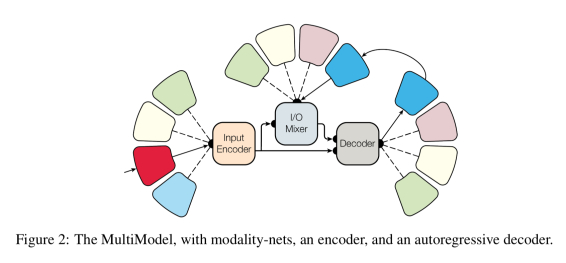
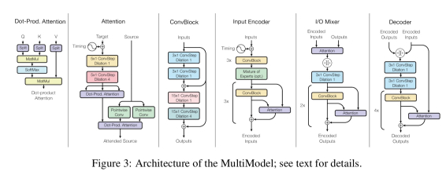
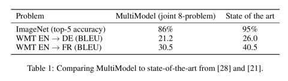
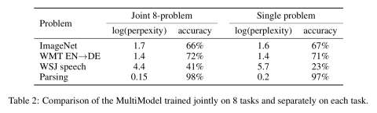
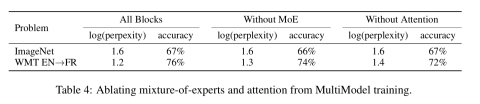

One model to learn them all

# One model to learn them all

January 12, 2018

[One model to learn them all](https://arxiv.org/abs/1706.05137) Kaiser et al., *arXiv 2017*

You almost certainly have an abstract conception of a banana in your head.

Suppose you ask me if I’d like anything to eat. I can *say* the word ‘banana’ (such that you *hear* it spoken), send you a text message whereby you *see* (and read) the word ‘banana,’ show you a *picture* of a banana, and so on. All of these different modalities (the sound waves, the written word, the visual image) tie back to the same concept – they are different ways of ‘inputting’ the banana concept. Your conception of bananas is independent of the way the thought popped into your head. Likewise, as an ‘output’ I could ask you to *say* the word banana, *write* the word banana, draw a *picture* of a banana, and so on. We are able to reason about such concepts independently of the input and output modalities. And we seem able to reuse our conceptual knowledge of bananas in many different contexts (i.e., across many different tasks).

Deep neural networks are typically designed and tuned for the problem at hand. *Generalisation* helps such a network to do well on new instances of the same problem not seen before, and *transfer learning* sometimes gives us a leg up by reusing e.g., learned feature representations from within the same domain. There do exist multi-task models, “*but all these models are trained on other tasks from the same domain: translation tasks are trained with other translation tasks, vision tasks with other vision tasks, speech tasks with other speech tasks*.” It’s as if we had one concept for the written word ‘banana’, another concept for pictures of bananas, and another concept for the spoken word ‘banana’ – but these weren’t linked in any way. The central question in today’s paper choice is this:

>  Can we create a unified deep learning model to solve tasks across multiple domains?

What would we need in order to be able to do that? We’d need to be able to support different input and output modalities (as required by the task in hand), we’d need a common representation of the learned knowledge that was shared across all of these modalities, and we’d need sufficient ‘apparatus’ such that tasks which need a particular capability (e.g. attention) are able to exploit it. ‘One model to rule them all’ introduces a *MultiModel* architecture with exactly these features, and it performs impressively well.

A *single instance* of the MultiModel architecture is trained *simultaneously* on eight different different tasks based on the following datasets:

1. WSJ speech corpus
2. ImageNet
3. COCO image captioning dataset
4. WJS parsing dataset
5. WMT English-German translation corpus
6. The reverse of the above, German-English
7. WMT English-French translation corpus

8. The reverse of the above, French-English (the paper says ‘German-French’ here, but that’s not the reverse, and looks to be a cut-and-paste error?)

Here are some examples of the single trained model performing a variety of different tasks:

>  … it is clear that it can caption images, categorize them, translate to French and German and construct parse trees.

It may not achieve state-of-the-art results on all of these tasks, but it does beat many recently studied task-specific models.

### MultiModel under the hood

At a high level, the MultiModel architecture looks like this:

There are small, *modality-specific* sub-networks that convert into a unified representation and back from it.

>  We call these sub-networks modality nets as they are specific to each modality (images, speech, text) and define transformations between these external domains and a unified representation. We design modality nets to be computationally minimal, promoting heavy feature extraction and ensuring that the majority of computation is performed within the domain-agnostic body of the model.

Different tasks from the some domain (e.g., different speech tasks) *share the same modality nets*. We do not have one modality net per task, merely one modality net per modality. Another important design decision was to allow the unified representation to be variable in size (as opposed to a fixed-size representation which ended up creating a bottleneck and limiting performance).

The outputs of the modality nets become the inputs to a shared **encoder** which creates the unified representation. An **I/O mixer** combines the encoded inputs with the previous outputs (the MultiModel is *autoregressive*, i.e., it uses past output values to help predict the next output), and a **decoder** processes the inputs and the mixture to generate new outputs.

>  To allow the decoder to produce outputs for different tasks even with the same modality, we always start decoding with a command-token, such as ‘To-English’ or ‘To-Parse-Tree.’ We learn an embedding vector corresponding to each of the tokens during training.

As we observed previously, to ensure good performance across a variety of tasks, the MultiModel needs the right apparatus at its disposal. To this end, the MultiModel incorporates building blocks from multiple domains including separable convolutions (first introduced in the context of image problems), an attention mechanism, and sparsely-gated mixture-of-experts layers (first introduced for language processing).

>  We find that each of these mechanisms is indeed crucial for the domain it was introduced, e.g., attention is far more important for language-related tasks than for image-related ones. But, interestingly, adding these computational blocks never hurts performance, even on tasks they were not designed for. In fact, we find that both attention and mixture-of-experts layers slightly improve performance of MultiModel on ImageNet, the task that needs them least.

Putting all these pieces together we end up with an architecture that looks like this:

([Enlarge](https://adriancolyer.files.wordpress.com/2018/01/one-model-fig-3.jpeg)).

The encoder, mixer and decoder are structurally similar to previous fully convolutional sequence models, but use different computational blocks. The encoder has 6 repeated convolutional blocks with a mixture-of-experts layer in the middle. The mixer has an attention block and 4 convolutional blocks. The decoder has 4 blocks of convolution and attention, with a mixture-of-experts layer in the middle.

### MultiModel in action

After being simultaneously trained on the eight tasks, the authors set out to determine:

1. How close the MultiModel gets to state-of-the-art results in each task

2. How training on 8 tasks simultaneously compares to training on each task separately, and

3. How the different computational blocks influence different tasks.

The results achieved by MultiModel are similar to the ones that task-specific models get without heavy tuning (‘*E.g., on English-French translation we improve on the Extended Neural GPU results reported last year*’). Since there wasn’t much tuning done on the MultiModel, it is reasonable to expect the gap to close further.

The jointly trained model turns out to perform similarly to individually trained models on tasks where large amounts of data are available. But most interestingly, *it performs better, sometimes significantly, on tasks where less data is available, such as parsing*.

Further investigation reveals that…

>  …it seems there are computational primitives shared between different tasks that allow for some transfer learning even between such seemingly unrelated tasks as ImageNet and parsing.

This ability to learn from domains with large amounts of data available and give a boost in performance in domains where less data is available feels like it has a lot of potential.

Regarding the third question, by including or excluding different block types it is possible to understand their effect. Both attention and mixture-of-experts mechanisms were designed with machine translation in mind, and in theory ImageNet is the problem that should benefit the least from these blocks. But the results show that even on the ImageNet task, the presence of such blocks does not detract from performance, and may even slightly improve it.

>  This leads us to conclude that mixing different computation blocks is in fact a good way to improve performance on many various tasks.

### The last word

>  We demonstrate, for the first time, that a single deep learning model can jointly learn a number of large-scale tasks from multiple domains. The key to success comes from designing a multi-modal architecture in which as many parameters as possible are shared and from using computational blocks from different domains together. We believe that this treads a path towards interesting future work on more general deep learning architectures, especially since our model shows transfer learning from tasks with a large amount of available data to ones where data is limited.