One neural network, many uses – Towards Data Science

# One neural network, many uses

## Build image search, image captioning, similar words and similar images using a single model

[Paras Chopra](https://towardsdatascience.com/@paraschopra)
Feb 28·15 min read

It’s common knowledge that neural networks are really good at one narrow task, but they fail at handling multiple tasks. This is unlike the human brain which is able to use the same concepts at amazingly diverse tasks. For example, if you have never seen a fractal before and I show you one right now.

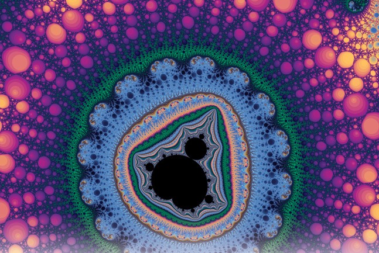

This beauty is courtesy math. (via https://fractalfoundation.org/)

**After seeing the image of a fractal, you’ll be able to handle multiple tasks related to it:**

- •In a set of images, tell apart a fractal from a cat
- •On a piece of paper, draw how a fractal looks like roughly (it’ll not be perfect, but it’ll not be random scribbles)
- •Classify fractal-like images from non-fractal like (you will be able to automatically sort images from most similar to least similar)
- •Close your eyes and imagine how a fractal looks like (even when the visual input isn’t there, you still can imagine it even after a single exposure. How cool!)

How are you able to do all these tasks? Are there dedicated neural networks in your brain specializing in all these tasks?

Modern neuroscience suggests that the answer is that information in your brain is shared and communicated across different parts. Exactly how it’s done is an area of research but we have a few hints at how this multi-task performance might be happening. The answer might be in how data is stored and interpreted inside a neural network.

### The wonderful world of representations

A representation is, as the name suggests, how information is encoded inside a network. When a word or a sentence or an image (or anything else, really) is provided as an input to a trained neural network, it gets transformed over successive layers as weights are multiplied by inputs and activations are applied. Finally, in the output layer, we get numbers that we interpret either as class labels or stock prices or any other task that the network is trained for.

This magical transformation of input -> output happens due to transformations of input that happens in successive layers. These transformations of input data are called representations. **A key idea is that each layer makes it *easy* for the next layer to do its job**. This process of making the life of the successive layer easier results in activations (transformation of input data at a particular layer) **meaningful**.

What do I mean by meaningful? Let’s see an example of activations of different layers of an image classifier.

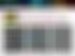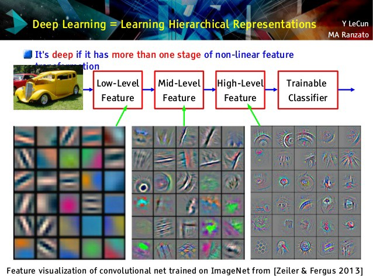

What an image classifying network does is that **it transforms an image in pixel-space to increasingly high-level concept space**. So, an image of a car that’s represented as RGB values will start getting represented in space of edges in the first layer, and then in the space of circles and basic shapes in the second layer and in the pre-final layer, it’ll start getting represented in high-level objects such as wheels, doors, etc.

This increasingly rich representation (that emerges automatically because of the hierarchical nature of deep networks) makes the task of image classification trivial. All that the last layer then has to do is to weigh concepts of wheels and doors more to be like cars and ears and eyes to be more like people.

### What can you do with representations?

Because these intermediate layers store a meaningful encoding of the input data, you can use the same information for multiple tasks. For example, you can take a language model (a recurrent neural network trained to predict the next word) and interpret activations from a specific neuron to [predict sentiment of the sentence](https://blog.openai.com/unsupervised-sentiment-neuron/).

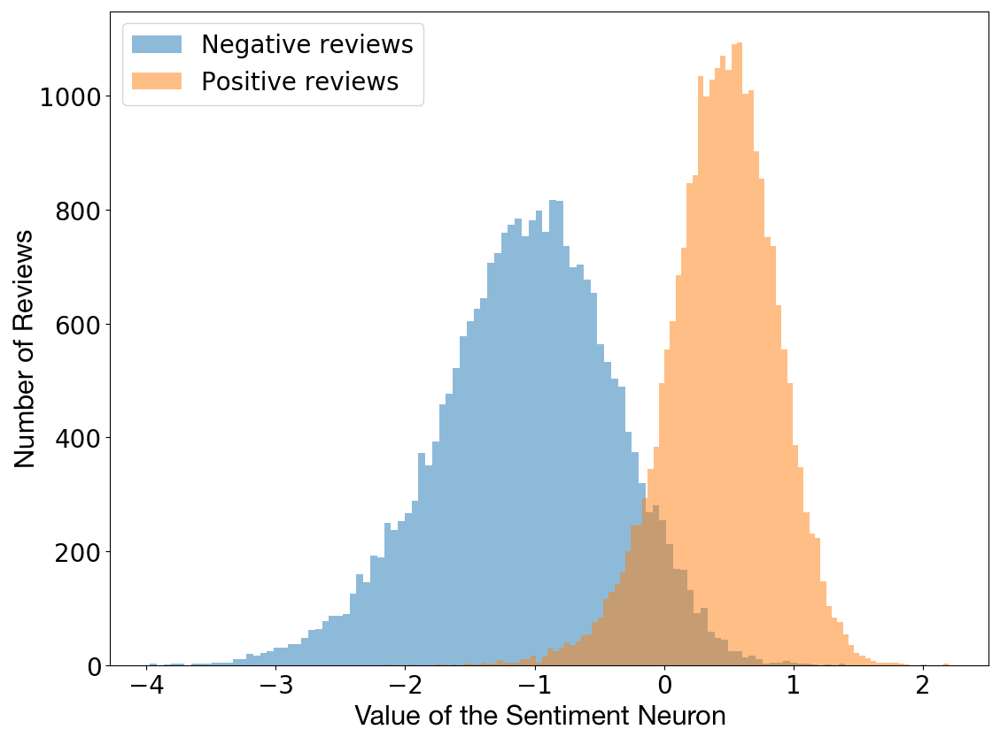

(via [Unsupervised Sentiment Neuron](https://blog.openai.com/unsupervised-sentiment-neuron/))

The amazing fact is that the sentiment neuron emerges naturally in the unsupervised task of language modeling. (See [this tutorial](https://rakeshchada.github.io/Sentiment-Neuron.html) for a good writeup). The network was trained to predict next works, nowhere in the task did we ask the network to predict the sentiment. Perhaps sentiment is such a useful concept that the network invented it in order to do a better job at language modeling.

Once you **get** the idea of representations, you’ll start seeing deep neural networks in a different light altogether. You’ll start sensing representations as a transferable language that makes it possible for different networks (or different parts of the same network) **talk to each other**.

* * *

*...*

### Exploring Representations By Building a Four-in-One Network

To fully understand what representations are, let’s build our own deep neural network that does four things:

- •**Image caption generator**: given an image, generate a caption for it
- •**Similar words generator**: given a word, find other words similar to it
- •**Visually similar image search**: given an image, find the most similar images to it
- •**Search by describing the content of images**: search an image that has contents as described by a textual description

Each one of the three tasks here is a project in itself and traditionally would require three models. But we’re going to do all of them using **one model**.

The code will be written in Pytorch in a Jupyter Notebook. You can download it from [this repository](https://github.com/paraschopra/one-network-many-uses).

→ Github repository: https://github.com/paraschopra/one-network-many-uses ←

#### Part I — Image Captioning

There are many good tutorials on the net to implement image captioning so I’m not going to go in depth into it. My implementation is exactly the same as in this tutorial: [Building an Automated Image Captioning Application](https://daniel.lasiman.com/post/image-captioning/). The key difference is that my implementation is in Pytorch while the tutorial uses Keras.

To follow along, you’ll need to download the Flickr8K dataset. Fill [this form](https://forms.illinois.edu/sec/1713398) and you’ll receive a download link on your email. (There’s also a [direct link to download the 1GB Flickr8K dataset](https://github.com/jbrownlee/Datasets/releases/download/Flickr8k/Flickr8k_Dataset.zip), although I’m not sure how long it will stay like that). Extract the zip file in the ‘Flicker8k_Dataset’ folder in the same directory as your notebook. You’ll also need to download captions [from here](http://cs.stanford.edu/people/karpathy/deepimagesent/caption_datasets.zip). Extract captions in the folder ‘caption_datasets’.

**Model**

There are broadly two components to image captioning: a) an image encoder that takes an input image and represents it in a format that’s meaningful for captioning; b) a caption decoder that takes the image representation and outputs textual description of it.

The image encoder is a deep convolutional network while the caption decoder is a traditional LSTM/GRU recurrent neural network. We can, of course, train both of these from scratch. But doing so will require more data than we have (8k images) and extensive training time. So, instead of training the image encoder from scratch, we’ll take a pre-existing image classifier and use its pre-final layer activations.

This is the first of many magical examples of representations that you’ll see in this post. I’m taking the Inception network available in [PyTorch modelzoo](https://pytorch.org/docs/stable/torchvision/models.html) that’s trained on ImageNet to classify images across 100 categories and using it to give me a representation that can be fed into the recurrent neural network.

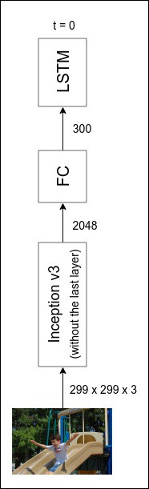

via https://daniel.lasiman.com/post/image-captioning/

Note that Inception network was never trained for the image captioning task. Yet, it works!

Like I did in my [generate machine learning ideas via machine learning](https://towardsdatascience.com/generating-new-ideas-for-machine-learning-projects-through-machine-learning-ce3fee50ec2) post, we could have used a pre-trained language model for caption decoder as well. But for this time, since I was reimplementing a model from the tutorial that worked well, I simply followed along and trained a decoder from scratch.

The full model architecture looks like this:

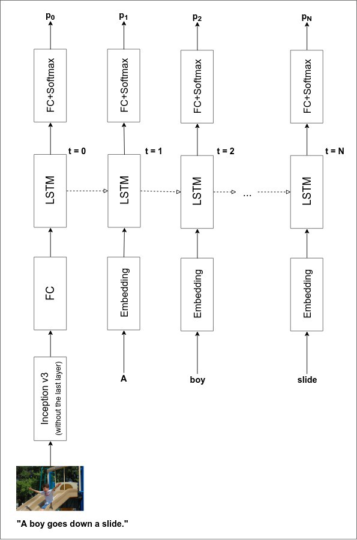

Image via https://daniel.lasiman.com/post/image-captioning/

You can train the model from scratch but it’ll take a couple of days on a CPU (and I haven’t optimized for GPU). But worry not! My laptop has spent sleepless nights so you can enjoy the fruits of an already trained model. (If you’re training from scratch, note that I stopped training at about 40 epochs when the running average loss was around 2.8)

**Performance**

I’ve implemented the beam search method that gives a good performance. Following are examples of captions generated by the network for the images from the test set (it has never seen them before).

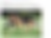

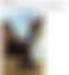

Let’s see what the network captions my own photo:

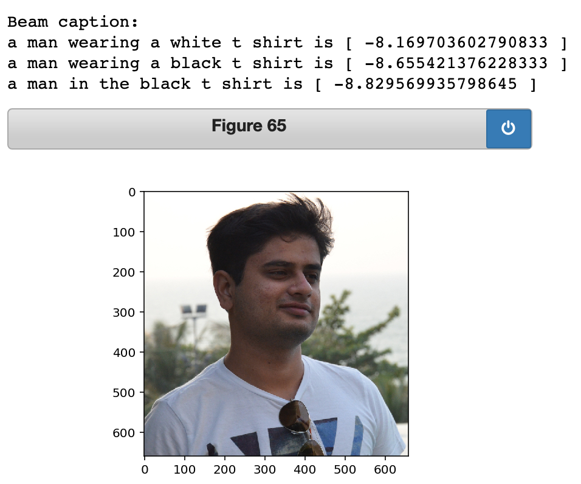

Not bad! It’s impressive that the network knows that the image contains a man who’s wearing a white T-shirt. The grammar is a bit off (which I’m sure more training can fix), but the basic gist is fine.

And if the input image contains something that the network has NEVER seen before, it tends to fail. For example, I was curious about what the network will label an image of the iPhone X.

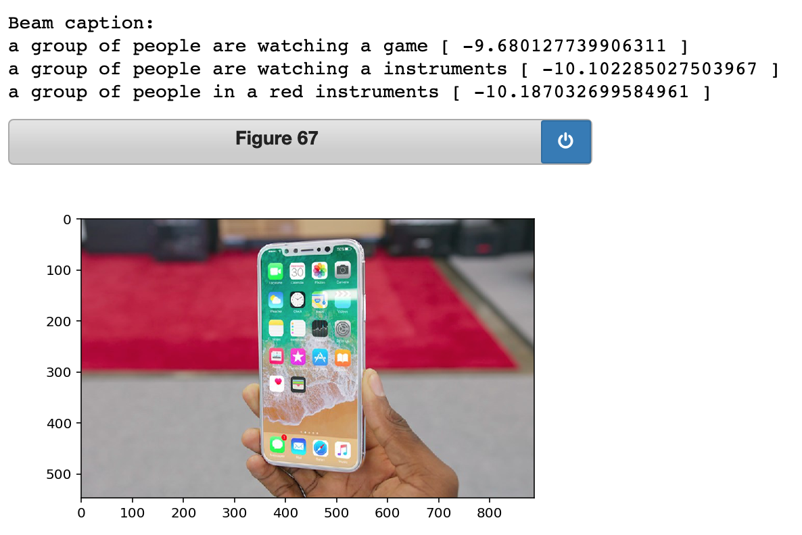

It didn’t do so well. But overall, I’m pretty satisfied with the performance and that gives us a good basis for building other functionalities using the representations that network developed while learning to caption an image.

#### Part II — Similar Words

Recall what we do to decode the caption from an image representation. We feed the representation into the LSTM/GRU network, generate an output, interpret it as the first word and then take the first word and feed it back into the network to generate the second word. This continues until the network generates a special token indicating the end of the sentence.

In order to feedback the words into the network, we need to convert words into representations that become the input for the network. This means that if the input layer comprises of 300 neurons, for each of the 8000+ distinct words across all captions, we need to have a 300 numbers associated that uniquely specify that word. **This process of converting a dictionary of words into numeric representations is called word embeddings (or word representations).**

There are pre-existing word embeddings like word2vec or GLoVE that we can download and use. But in the present case, we learn a word embedding from scratch. We start with randomly generated word embeddings and explore what has our network learned about words by the time training is done.

Since we can’t visualize a 100-dimensional space of numbers, we will use a wonderful technique called [t-SNE](https://lvdmaaten.github.io/tsne/) to visualize learned word embeddings in 2 dimensions. t-SNE is a dimensionality reduction technique that tries to make neighbors in the high-dimensional space remain neighbors in the low-dimensional space as well.

**Visualization of word embeddings**

Enough of talking. Let’s see a space of word embeddings as learned by our caption decoder (unlike other language tasks where there are millions of words and sentences, our decoder only had seen ~30k sentences in the training dataset).

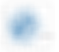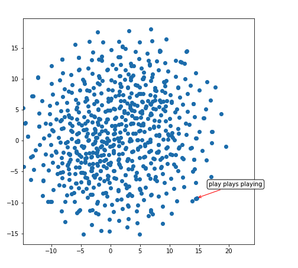

So, our network has learned that words like ‘play’, ‘plays’ and ‘playing’ are very similar (they have similar representations as evident from the tight cluster with the red arrow). Let’s explore another area in this 2D space:

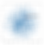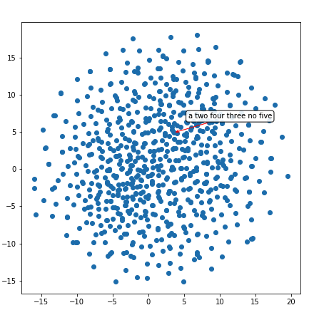

This area seems to have clustered numbers — ‘two’, ‘three’, ‘four’, ‘five’, etc. Another one:

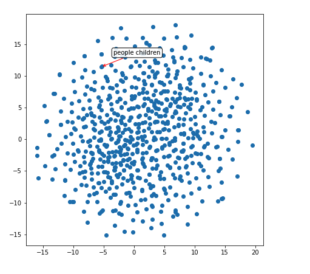

It knows people are similar to children. And also, it has implicitly inferred the shape of objects.

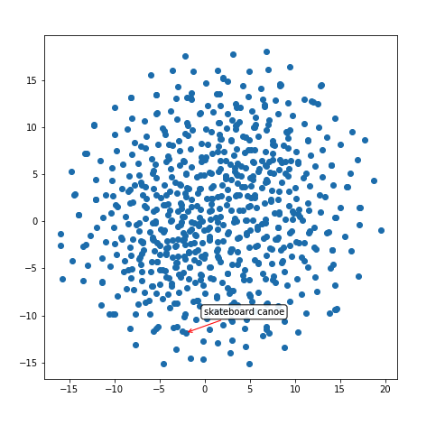

**Similar words**

We can use the 100-dimensional representation to build a function that suggests words most similar to the input word. How it works is simple: take the 100-dimensional representation and find its [cosine similarity](https://en.wikipedia.org/wiki/Cosine_similarity) to all other words in the database.

Let’s see **the most similar words to the word ‘boy’**:

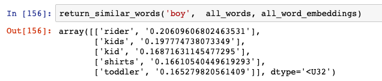

Not bad. ‘Rider’ is an exception but ‘kids’, ‘kid’ and ‘toddler’ is right on. What does the network thinks is similar to the word ‘chasing’:

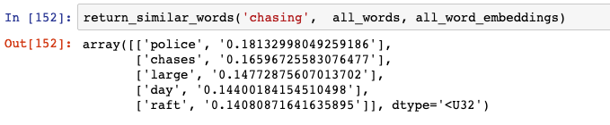

‘Chases’ is fine but I’m not sure why it thinks ‘police’ is similar to chasing.
**Word analogies**

A mind-blowing fact about the word embeddings is that you can do calculus on them. You can take two words (like ‘king’ and ‘queen’) and subtract their representations to get a direction. When you apply this direction to another word representation (say, of ‘man’), you get a representation that’s close to the actual analogous word (say ‘woman’). This magic is why word2vec became so famous when it was introduced:

via https://www.tensorflow.org/images/linear-relationships.png

I was curious if the representations learned by caption decoder had a similar property. Even though I was skeptical because the training data was not much (~30k sentences), I gave it a go.

The analogies that the network learned were not perfect (some of the words literally appeared for <10 times, so network didn’t have enough info to learn). I had to squint my eyes but it sort-of found analogies.

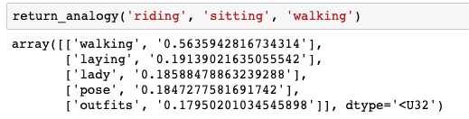

If riding is to sitting, what would walking correspond to? My network things it would be ‘laying’ (which is not bad!).

Similarly, **if the plural of ‘man’ is ‘men’ what would be the plural of ‘woman’**:

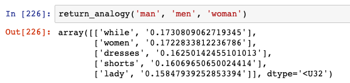

The second result is ‘women’ which is pretty decent.
Lastly, **if the grass is green, what color would be the sky**:

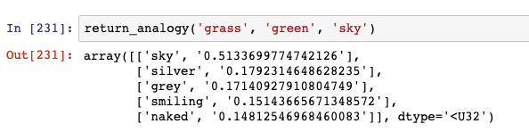

The network thinks it is silver or grey, none of which are blue but both of which are colors. It’s amazing that the network is able to infer the direction of colors.

#### Part III — Similar Images

If word representations cluster similar words together, what about image representations (that Inception powered image encoder outputs). I applied the same t-SNE technique to the image representations (the 300-dimensional tensor that goes as an input in the first step of the caption decoder).

**Visualization**

The dots are representations of different images (I did not take the entire set of 8K images, but it is a sample of about 100 images or so). The red arrow points to a cluster of nearby representations.

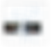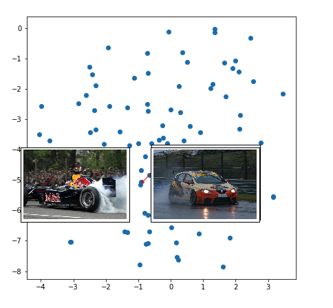

So, racing cars cluster together.

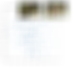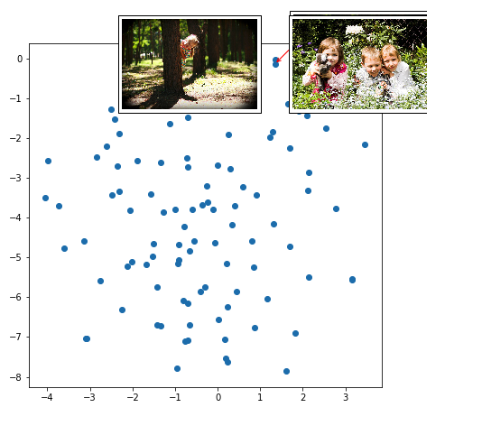

So do kids playing in forest/grass-like area.

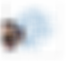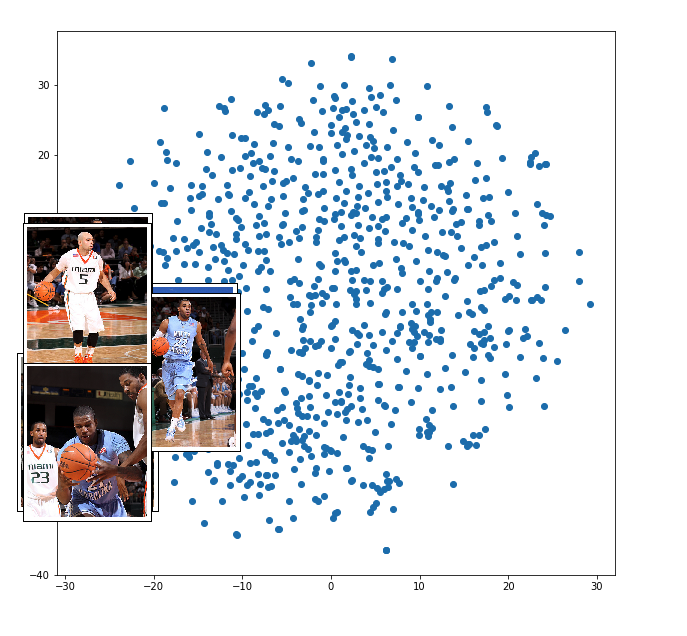

And basketball players are clustered together.
**Finding Images Similar to an Input Image**

For the similar words task, we were limited to our test set vocabulary to find similar words (if a word didn’t exist in the test set, our caption decoder wouldn’t learn its embedding). However, for the similar images task, we have an image representation generator that will take any input image and generate its encoding.

This means we can use the cosine-similarity method to build a search-by-image functionality as follows:

- •Step 1: take all images in the database or target folder and store their representations (as given by the image encoder)
- •Step 2: when a user wants to search images that look most similar to an image that he already has, take the representation of the new image and find the closest ones in the database (as given by cosine similarity)

Google Images is likely using this (or a very similar) method to power their [reverse image search](https://support.google.com/websearch/answer/1325808?co=GENIE.Platform%3DDesktop&hl=en) functionality.

Let’s see how our network does. I clicked the following photo while I was in a vacation in Goa. (PS: I love Goa!)

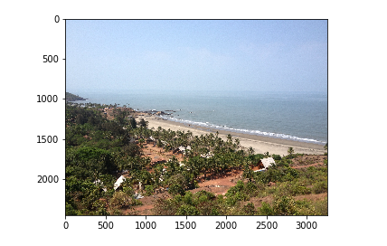

Note that this image is my own. The model we’re using has never seen it before. When I query for similar images to this, the network outputs the following image from the Flickr8K dataset:

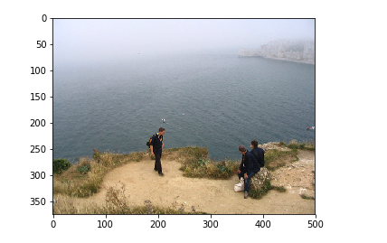

Isn’t this mindblowing? I wasn’t expecting such good performance, but there we are. [Deep neural networks are unreasonably good](https://www.youtube.com/watch?v=Y-WgVcWQYs4).

#### Part IV- Search Images By Describing Them

In this final part, we run the image caption generator in reverse. So rather than taking an image and generating a caption for it, we input a caption (textual description) and find the image that most closely matches it.

Sounds too good to be true? Well, it’s not. Here’s how we do it:

- •Step 1: instead of a 300-dimensional image representation that comes from an encoder, start with a 300-dimensional input tensor that’s completely random
- •Step 2: freeze all layers of the entire network (i.e. instruct PyTorch not to calculate gradients)
- •Step 3: assume that the randomly generated input tensor came out of image encoder and feed it into the caption decoder
- •Step 4: take the caption generated by the network when that random input was given and compare it to the user-supplied caption
- •Step 5: calculate the loss comparing the generated and user-supplied caption and
- •Step 6: find gradients for input tensor that minimize loss (i.e. in which direction and by how much should each of the 300-dimensional numbers should be changed so that when the tensor is input into caption decoder, the caption is close to the user-supplied caption)
- •Step 7: change the input tensor in the direction informed by gradients (take a tiny step as given by learning rate)
- •Continue step 4 through step 7 until convergence or when the loss is below a certain threshold
- •Last step: take the final input tensor and use its value to find images closest to it (in 300-dimensional representations pace) via cosine similarity

When we do this, the results are magical:
I searched for **‘a dog’** and this is the image the network found:

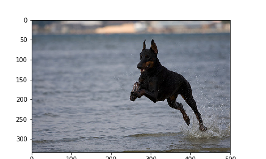

I searched for **‘a boy smiling’**.

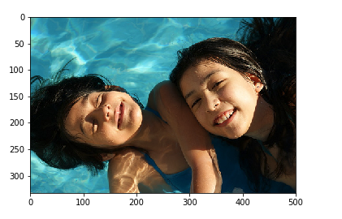

Finally, when I searched for:

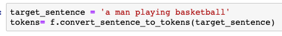
The first two results were:

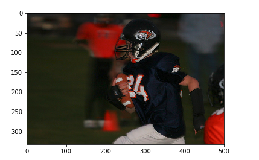

and

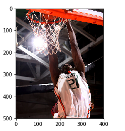

Mindblowing, isn’t it?

#### Summing up and a challenge

As a reminder, you can download the code for doing all this from [my github repository](https://github.com/paraschopra/one-network-many-uses). It includes code for data pre-processing, model description, pretrained image captioning network, visualizations. It does NOT include the Flickr8K dataset or captions which you’ll have to download separately [from here](https://forms.illinois.edu/sec/1713398) and [here](http://cs.stanford.edu/people/karpathy/deepimagesent/caption_datasets.zip).

I hope you enjoyed the article. If you want to go one step further, **here’s a challenge for you: generate an image from a given description**. Just like from a random starting point generated a 300-dimensional image representation that matches the user-supplied caption, can you go one step further and generate an image from scratch for a user-supplied caption?

It’s 10x harder than what we have handled in this post but my sense is that it is doable. How cool would be to have a service that not just searches for an image corresponding to a text, but is able to generate one on the fly.

In the future, I wouldn’t be surprised if Google Images does this and starts giving results for images that don’t yet exist (like ‘two unicorns flying on a carpet made of pizza’).

That’s it. I wish you a safe and enjoyable exploration through the world of representations.

*Thanks *[*Ishan Goel*](https://medium.com/@ishangoel_80223)* for review and comments.*

#### Liked this tutorial? Check out my previous ones too:

- •[Making deep neural networks paint to understand how they work.](https://towardsdatascience.com/making-deep-neural-networks-paint-to-understand-how-they-work-4be0901582ee?source=your_stories_page---------------------------) Generate abstract art in 100 lines of PyTorch code and explore how neural networks work
- •[Making Your Neural Network Say “I Don’t Know” — Bayesian NNs using Pyro and PyTorch](https://towardsdatascience.com/making-your-neural-network-say-i-dont-know-bayesian-nns-using-pyro-and-pytorch-b1c24e6ab8cd). A tutorial + code on writing a Bayesian image classifier on MNIST dataset.
- •[Generating New Ideas for Machine Learning Projects Through Machine Learning](https://towardsdatascience.com/generating-new-ideas-for-machine-learning-projects-through-machine-learning-ce3fee50ec2). Generating style-specific text from a small corpus of 2.5k sentences using a pre-trained language model. Code in PyTorch
- •[Reinforcement learning without gradients: evolving agents using Genetic Algorithms](https://towardsdatascience.com/reinforcement-learning-without-gradients-evolving-agents-using-genetic-algorithms-8685817d84f). Implementing Deep Neuroevolution in PyTorch to evolve an agent for CartPole [code + tutorial]

#### Follow me on Twitter

I regularly tweet on AI, deep learning, startups, science and philosophy. Follow me on https://twitter.com/paraschopra

[**Paras Chopra (@paraschopra) | Twitter** *The latest Tweets from Paras Chopra (@paraschopra). Follow me and I'll lead you to a path of confusion and…*twitter.com](https://twitter.com/paraschopra)[(L)](https://twitter.com/paraschopra)