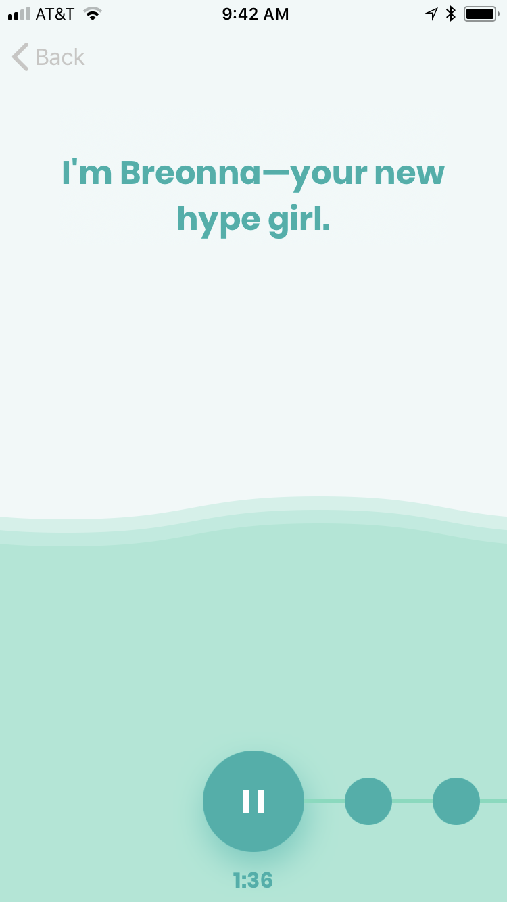
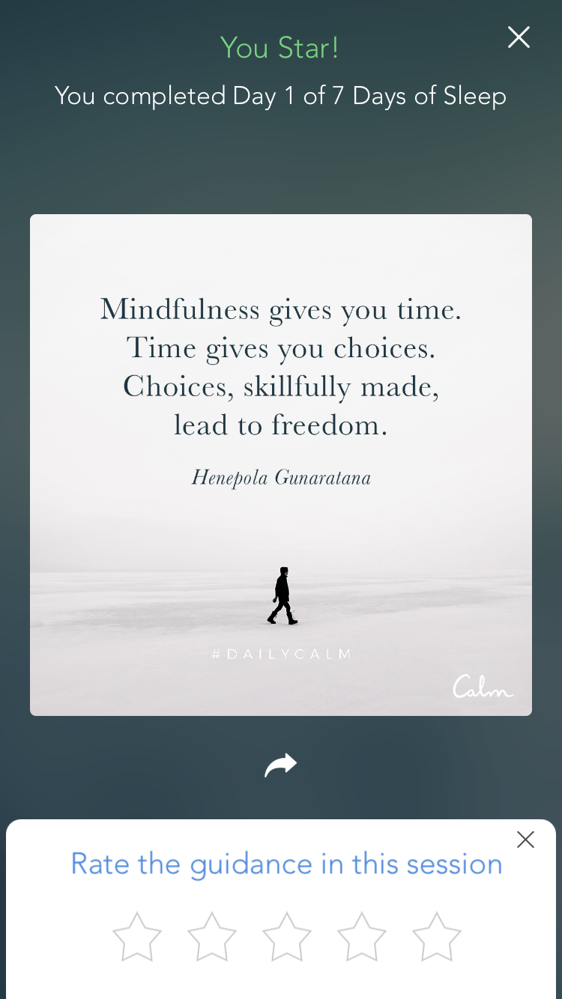
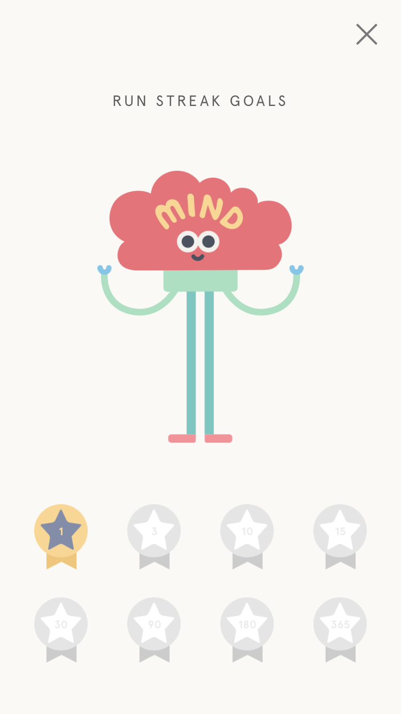
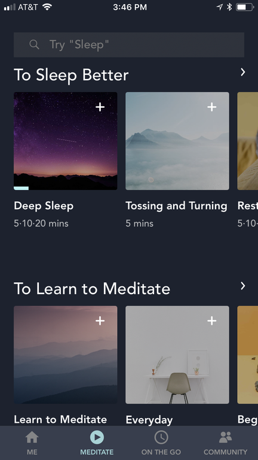
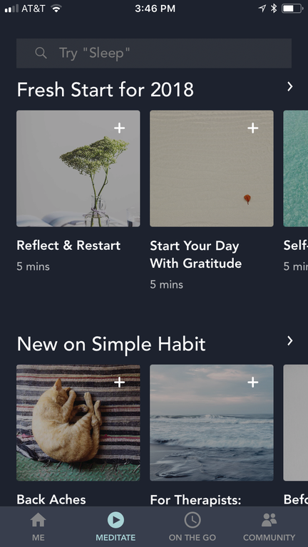
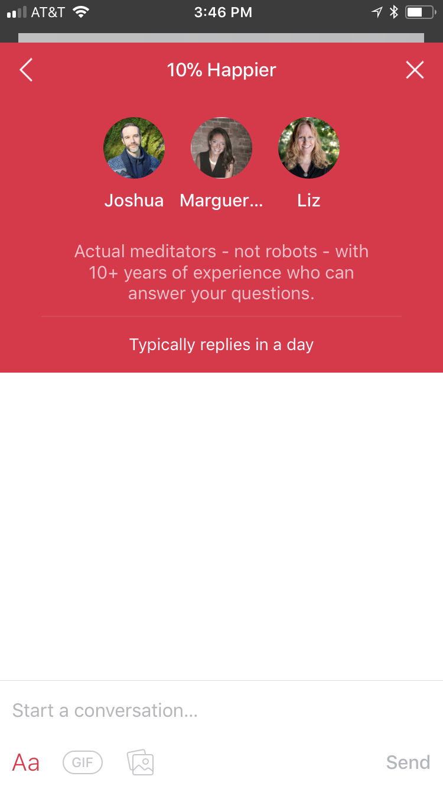
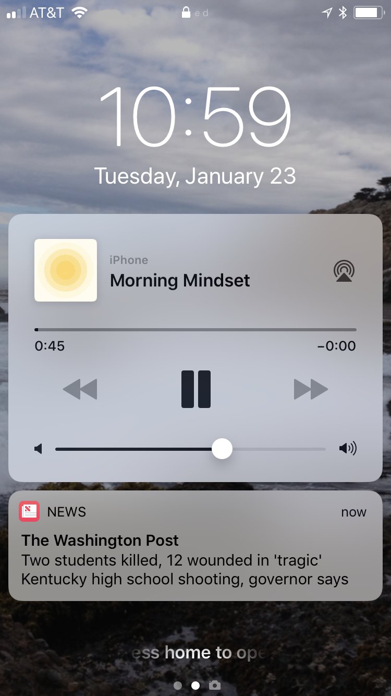
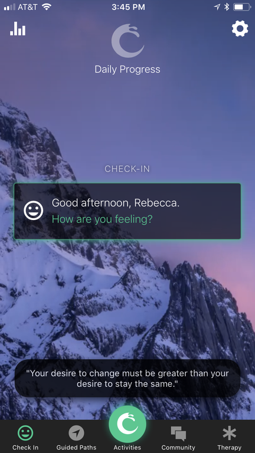
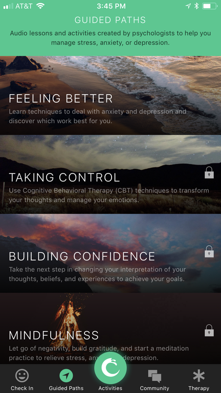
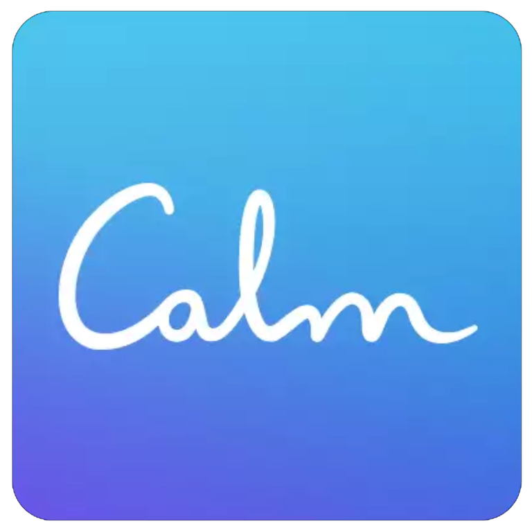

One woman's quest to find the right meditation app in a messed-up world

# One woman's quest to find the right meditation app in a messed-up world

Calm yourself

One woman's quest to find the right meditation app in a messed-up world
[by Rebecca Ruiz](https://mashable.com/author/rebecca-ruiz/)

* * *

My iPhone, normally the quotidian keeper of grocery lists and Fitbit stats, has lately begun to feel like a sprawling self-help library. The transformation began a few weeks ago, when I decided to test several meditation and mindfulness apps in order to share with you, dear reader, tips and insights from my experiment.

At first I felt giddy. I'd downloaded seven different apps that promised, in one way or another, to bring me closer to my best self. I was just days into 2018 and suddenly had access to dozens of meditation sessions that spanned the self-improvement spectrum. Feeling distracted? Here, try this 10-session course on productivity. Not sleeping well? You definitely need to unwind with a guided body scan. Suffering from burnout? There’s a meditation (or 100) for you.

Even though I don’t make New Year's resolutions, the promise of using an app to clear a new path to spiritual and psychological enlightenment felt like as fresh a start as any. So I began exploring the apps [Calm](https://www.calm.com/), [Headspace](https://www.headspace.com/), [10% Happier](http://www.10percenthappier.com/), [Simple Habit](https://www.simplehabit.com/), [LARKR](http://larkr.com/), [Pacifica](http://www.thinkpacifica.com/), and [Shine](https://www.shinetext.com/app) with the hope that one of them could do what my IRL meditation classes hadn't yet done: turn me into someone who makes time, every day, to quiet my mind.

Breonna is here to help you learn about "self-care boundaries" on Shine's app.
Shine

Alas, like many people hoping to develop a new habit via the convenience of an app, I came away from my experiment still searching for answers. I felt overwhelmed by the number of choices I could make in a single sitting. Sessions often revisited the same skills I learned in past real-life classes — let thoughts come and go, "return to the breath" — which made me wonder what exactly I was paying for. And I could feel a twinge of cynicism every time a session wandered perilously close to the line between meditation and self-help. After a week or so, I started ignoring reminders to meditate and instead watched episodes of *The Great British Bake Off* on Netflix.

Of course, plenty of people have downloaded one of these apps, or others like them, and had the opposite reaction. They've found daily reminders and gamified tracking all the motivation they need to stick to their new habit. But I suspect countless others have faced obstacles similar to mine and those hurdles are important, regardless of whether or not a meditation app works for you.

Meditation and mindfulness are becoming a big business, thanks to a growing body of research [suggesting](https://greatergood.berkeley.edu/article/item/can_meditation_lead_to_lasting_change) that the practice of staying in the present moment and experiencing thoughts, feelings, and emotions without judgment can make us more resilient to stress, more compassionate toward others, and increase our ability to focus. Dangling such results in front of anxious consumers is one of Silicon Valley's big [investment plays](https://qz.com/869907/silicon-valley-marketing-meditation/), and the proliferation of mindfulness apps shows there's an audience hungry for guidance.

In fact, mindfulness and meditation apps are so hot right now that Apple editors [named](https://www.apple.com/newsroom/2017/12/apple-reveals-2017-most-popular-apps-music-and-more/) that category as one of four "breakout" trends in app culture in 2017. Maybe it had to do something with American politics turning into a GIF-able dumpster fire — and the avalanche of stressful news notifications that brought. Or perhaps people felt desperate for tranquility amid back-to-back natural disasters. [Media](https://www.wsj.com/articles/the-meditation-cure-1501255415)  [coverage](http://www.latimes.com/opinion/op-ed/la-oe-langer-mindfulness-is-not-a-fad-20171126-story.html) of [mindfulness](https://www.nytimes.com/column/meditation-for-real-life) certainly played a significant role in stoking interest. But whatever led someone to download a meditation app in the first place will only get them so far in developing that new habit.

The first thing to understand about the apps themselves is that many of them have very distinctive personalities (and price points). Meditating with Calm, Apple's [best iPhone app](https://developer.apple.com/app-store/best-of-2017/apps-of-the-year/) of 2017, feels like having the famously relaxed Bob Ross in your pocket. It's the visual and vocal equivalent of golden hour, when life feels peaceful and full of wonder.

The Calm app aims to inspire and encourage users when they start a new course.
Calm

Headspace, with its pastel and neutral tones and quirky illustrations, might remind you of stepping into a high-priced design store. It gives you permission to feel playful while trying to cool the existential angst that simmers just beneath the surface.

In other words, you'll want to select an app that fits naturally with your personality, just as you would choose a meditation instructor at your local yoga studio.

Spending some time to make that choice thoughtfully is in your bank account's best interest; all of the apps I downloaded are free but most of them require a monthly or annual subscription to access their full libraries and services. LARKR, which includes meditation as a free add-on to its paid talk therapy platform, has just a handful of guided sessions. Monthly and annual subscriptions for Calm, Shine, Pacifica, 10% Happier, Simple Habit, and Headspace range from $5.99 per month to $96 per year. If you're struggling to choose between apps, I highly recommend taking advantage of free trials if they're offered.

The most important thing that my experiment taught me, however, is that you must know what you hope to gain from an app before using it. That might sound obvious, but it only rang true when I spoke to Shauna Shapiro, a professor of counseling at Santa Clara University and clinical psychologist who specializes in [teaching mindfulness](https://www.youtube.com/watch?v=IeblJdB2-Vo&vl=en). I downloaded the apps for this story and because I wanted to get better at meditating daily, but I never stopped to consider a more soulful motivation.

"Whenever I begin teaching mindfulness, we always start with an intention," Shapiro says. "It helps set the compass of our heart ... That way they have the motivation [to practice] even if they feel like there's a million other things going on."

You might want to experience more joy in life or be more present with your child. But a practical goal like mine, while worthy, isn't necessarily going to send me back to my app every day. In fact, I suspect having a more spiritually aspirational goal might have increased my determination to meditate consistently.

Shapiro also believes a good app would ask you to reflect on and write your intention at the outset. None that I downloaded had that exact feature, but most of them offer some way of tracking how frequently you meditate and several of them encourage you to focus on "streaks," or consecutive days of use.

Headspace keeps track of your meditation "streaks" with these badges.
Headspace

In return, you'll get positive reinforcement, celebratory banners and badges, and invitations to share your stats publicly. Headspace, for example, denotes meditation milestones (1, 3, 10, 15 and so on) with a gold badge. Simple Habit calls streaks "special moments." Pacifica will show you a pop-up screen with your accomplishment along with a "Good going!" Like with anything else that's gamified, the instant digital back pats can be addictive (hello, Fitbit), but Shapiro warns against going into autopilot as you try to maintain a meditation streak.

"Quantification is OK, but you have to remember why you're doing it," says Shapiro, "and it's not to win at a game — it's to win at life."

Shapiro encourages her clients to use apps when appropriate, but the key to success is how they’re used. (Shapiro is listed as a "featured teacher" on Simple Habit's app.)

A sample of your meditation options on Simple Habit.
Simple Habit

She recommends starting with an in-person meditation class or workshop to better understand the "nuances and paradoxes" of mindfulness. If you rely on an app to impart this insight but don't have the opportunity to get valuable insight and feedback from an instructor, you might end up practicing in a way that isn't helpful.

If you're meditating in what Shapiro describes as a "judgmental frustrated way," that approach will yield only more judgment and frustration. What you want instead for mindfulness is to pay attention in a curious, kind, and open-hearted way.

The instructor in your app can only be so persuasive in helping you adopt this mindset. The beauty of in-person meditation classes, as intimidating or expensive as they may be, is that you sit in communion with other people who are on a journey similar to yours. They may ask questions about how to stay mindful when you’ve been cut off in traffic, bullied by a coworker, or disappointed by a loved one. Learning from these conversations is a vital experience, especially if most of your meditation work will ultimately happen via an app.

Have questions about meditating? 10% Happier coaches will get you an answer.
10% Happier

Some of the apps anticipate that need. 10% Happier, which markets itself as "meditation for fidgety skeptics," offers personal coaching from experts who typically reply to questions within a day. Simple Habit creates challenges where users try to achieve a meditation goal together. The app also shows you how many people are meditating and lets you invite friends to join your practice. Similarly, Headspace lets you "add a buddy."

"The apps can go awry quite quickly," Shapiro says. "But if you have a good foundation, then an app is good scaffolding."

When an app worked for me, I found that I was more conscious of breathing throughout the day. Even taking a minute to practice calmly inhaling and exhaling, as you can do on Pacifica, Calm, Headspace, Simple Habit, and 10% Happier, helped me feel less stressed. Spending five minutes with Calm's "body scan" every night before bed seemed to lead to more restful sleep. And I won't lie: Walking away from my computer to meditate for 10 minutes during the workday *for my job* was heaven.

Yet despite these positive results, I didn't experience the profound benefits that Shapiro described as possible, including feeling more peaceful and present. I wasn't sure I was benefiting significantly from meditating via app, compared to an IRL class, and I was also overwhelmed by the number of meditation sessions available.

John Torous, co-director of the digital psychiatry program at Beth Israel Deaconess Medical Center in Boston, wasn't surprised.

Torous pointed out that we don’t actually know if using digital technology to cultivate mindfulness produces the same results as in-person classes and training. A few of the apps are actively trying to answer this question. Headspace has published [research](https://www.headspace.com/science/meditation-research) suggesting that its app may help increase compassion and improve mood. Pacifica has [partnered](http://www.thinkpacifica.com/research/) with the University of Minnesota to conduct a randomized controlled study using the app, but the results haven't yet been published. There is, however, no scientific consensus that app-based meditation will lead to the same positive outcomes as an in-person practice. Using your phone to meditate might even worsen your experience.

Related pro-tip: Always put your phone on airplane mode or do not disturb while meditating or you’ll end up like me, jolted out of serenity by an epic family group text or notifications about the prospect of nuclear war.

This is what happens when you forget to silence notifications while meditating.
Shine / Apple News

"There's such a rush to translate mindfulness that works well and push it onto a technology platform," says Torous, who leads the American Psychiatric Association's work group on the evaluation of smartphone apps. "What does it mean to be mindful with a phone? Mindfulness in person is a lot different than mindfulness on your phone on the subway during rush hour."

Moreover, Torous says, apps are designed to hook users but don't always have a good plan for how to help users reach a goal. I could relate. I practically salivated over the libraries of content offered in each app at first glance, but it quickly became clear that I could careen from trying to reduce stress to improve sleep to gain better focus, all without making much real progress at all.

A glimpse of Pacifica's home screen and guided "paths."
Pacifica

All of the apps I tried could benefit from a brief orientation that helps people understand how the tool in their hands is meant to used. Headspace's website, for example, had a great explanation of how to use its app, starting with the "foundation" courses and then moving on to "packs" that reflect a specific interest, yet I only found that primer by accident, thanks to a Google search.

Either way, what my experiment taught me is to look past the allure of a well-stocked meditation library and consider instead what personal goal you're hoping to achieve — aside from any core intention for your practice — and which app might be best positioned to help you attain it. And don’t feel guilty when you ignore a session that looks tempting but doesn't seem obviously connected to the intention you've set.

As for me, I haven’t yet given up on meditating consistently. I think I'll take another class at my local yoga studio as a reminder of why mindfulness is so rewarding, even if it takes a lot of work. Then I'll settle on an intention — and just one app to try for a few months. Maybe at that point, I’ll have a completely different story to tell.

 

# **CHOOSE YOUR PATH**

Choosing a meditation app isn't all wind chimes and chants. Before you commit to a monthly or annual (or even lifetime) subscription, you'll need to do a little research. Here's a cheat sheet of what seven apps have to offer in the way of meditation. All apps are available on Android and iOS unless otherwise noted.

Whatever you decide to download, be sure to read the terms of service and look for any language about how the app sells or shares your data. You'll want to know beforehand if information about your nightly meditation practice ends up in another marketer's hands.

## [Calm](https://www.calm.com/)

**The basics**: If you like nature and inspirational quotes, Calm is for you. Every screen is illustrated with tranquil outdoor scenes. The "Daily Calm" is a 10-minute guided meditation that focuses on a specific theme or challenge. Meditations are also broken down by categories: self-care, personal growth, anxiety, sleep, and more. A "masterclass" gives users the opportunity to spend about an hour delving into complex subjects, such as how to break a bad habit.

**Unique feature**: Calm's "Sleep Stories" aim to help ease you into a "deep and natural" sleep with a selection of narrated stories and instrumental musical tracks.

**Subscription price**: $12.99 monthly / $59.99 annual / $299 lifetime

## [Headspace](https://www.headspace.com/)

**The basics**: With its clean lines, cool colors, and quirky animations and illustrations, Headspace is a tidy yet playful space to meditate. The app recommends starting with its foundation courses and then moving on to "packs" that have themes like anxiety, kindness, creativity, and self-esteem.

**Unique feature**: Its "Singles" category has one-off meditations designed, in part, to help you get through challenging everyday moments, like losing your temper, feeling sick, or having a difficult conversation.

**Subscription price**: $12.99 monthly / $96 annual / $399 lifetime

## [LARKR](http://larkr.com/)

**The basics**: LARKR is teletherapy app that allows you to book a session with a licensed therapist. It also has a barebones "meditation corner" with five different guided sessions, including mindful happiness, deep sleep, and relieving stress and anxiety.

**Unique feature**: LARKR includes a daily prompt called "Be The Change" that makes suggestions for how you could complete a "daily act of good," which the app says might help improve your sense of self-worth.

**Subscription price**: There is no subscription fee. Individual therapy sessions are $85. LARKR is available only for iOS devices.

## [Pacifica](http://www.thinkpacifica.com/)

**The basics**: Pacifica relies on a technique called [cognitive behavioral therapy](https://beckinstitute.org/get-informed/what-is-cognitive-therapy/) to provide tools aimed at alleviating stress, anxiety, and depression. In addition to guided meditation sessions, the app offers ways to track mood, set goals, and complete relaxation activities. It will also connect you to a therapist or help you share your app data with your personal therapist.

**Unique feature**: The app hosts thousands of chat groups based on different experiences, such as divorce, sexual assault, and pregnancy. There are clear rules about acceptable behavior.

**Subscription price**: $5.99 monthly / $35.99 annual / $199 lifetime

## [Shine](https://www.shinetext.com/app)

**The basics**: Imagine having an impossibly cool girlfriend who's ready to help you silence your inner critic and cheer you on every chance she gets. That's the Shine app in a nutshell. The guided tracks are a cross between traditional meditation and personalized coaching. Topics like friends, work, and love focus on specific challenges, like defining self-care boundaries or communicating needs. Seven-day challenges zero in on aspects of self-growth, such as fulfillment, productivity, and self-compassion.

**Unique feature**: Shine's daily text will send you words of encouragement and links to inspirational content.

**Subscription price**: $7.99 monthly / $59.99 annual

## [Simple Habit](https://www.simplehabit.com/)

**The basics**: Simple Habit is designed for the busy user who might not try meditation without this app's focus on five-minute sessions. Other sessions, which are grouped in themes like "relax," "focus," and "well-being," are longer, but those new to meditating won't feel intimidated by the length or layout of the courses.

**Unique feature**: Simple Habit has a list of of "featured teachers" and their meditation sessions so users can explore different styles and personalities.

**Subscription price**: $11.99 monthly / $96 annual / $299 lifetime

## [10% Happier](http://www.10percenthappier.com/)

**The basics**: If you're skeptical of meditation, this app is designed to win you over. Developed by journalist [Dan Harris](https://www.amazon.com/Meditation-Fidgety-Skeptics-Happier-How/dp/0399588949/ref=as_at?creativeASIN=0399588949&linkCode=w61&imprToken=LR1MAVOvM.6qMJZLMpupww&slotNum=0) and meditation teacher [Joseph Goldstein](https://www.dharma.org/joseph-goldstein/), 10% Happier offers a lengthy introductory course. It also has featured meditations, such as "Getting Out of Your Head" and "Ten Good Breaths," as well as courses that focus on specific emotional challenges and mindfulness techniques.

**Unique feature**: Have a question about your practice? 10% Happier lets you start a "conversation" with experienced meditators who typically reply in a day.

**Subscription price**: $11.99 monthly / $79.99 annual

Share this story

 [Share]()  [Tweet]()

- Author

Rebecca Ruiz

- Illustrator

Vicky Leta

- Social Good Editor

Matt Petronzio

- Art Director

Dustin Drankoski