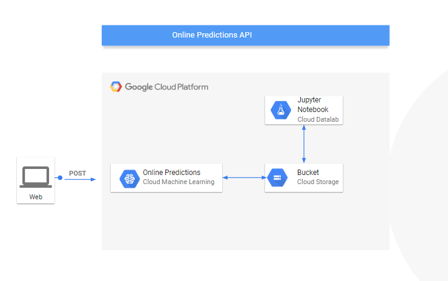
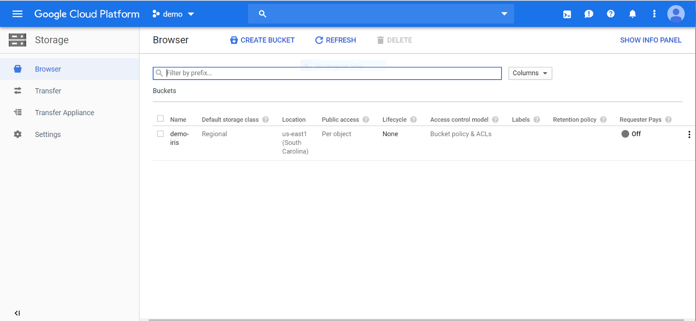
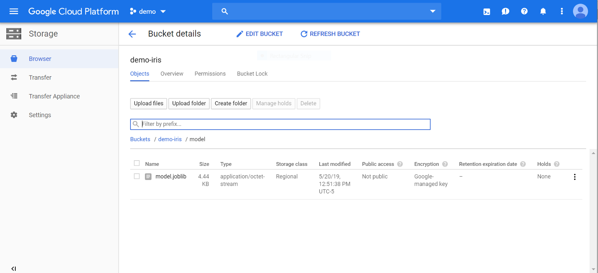
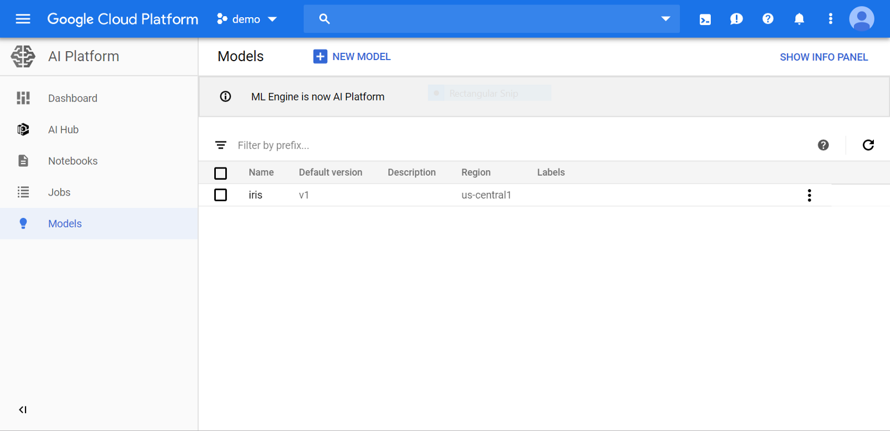
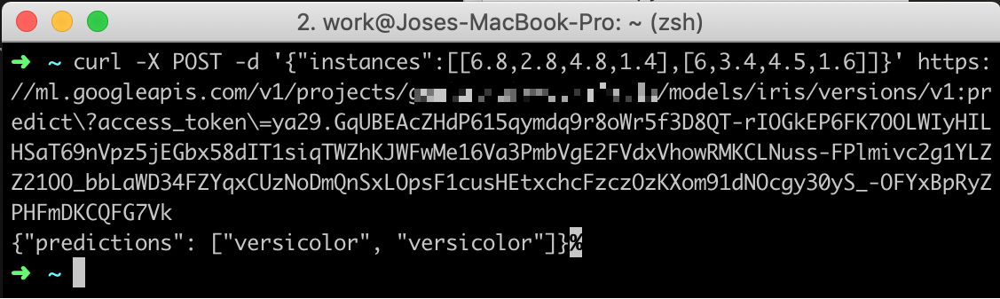
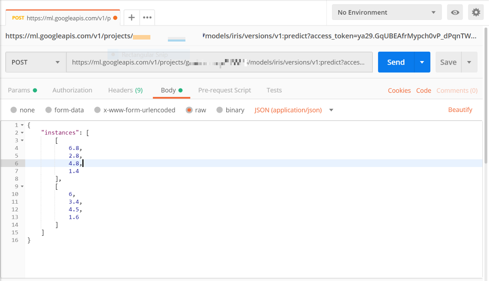
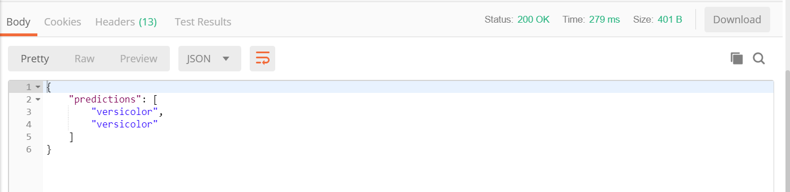

Online predictions API using scikit-learn and Cloud Machine Learning Engine on GCP

# Online predictions API using scikit-learn and Cloud Machine Learning Engine on GCP

[Jose Miguel Arrieta](https://medium.com/@jmarrietar)

May 28·5 min read

Sometimes Data Scientist needs to expose their Machine Learning models to be consumed by other members of the team (e.g Back-ends developers) or directly by final users. In these cases implementing an API is useful.

This post will explain steps to train a model, store classifier on [Google Cloud Storage](https://cloud.google.com/storage/) and use[Cloud Machine Learning](https://cloud.google.com/ml-engine/)to create an API in order to perform online predictions. The classifier will be trained using [***iris flower data set***](https://en.wikipedia.org/wiki/Iris_flower_data_set)***  ***which consists of 3 different types of irises (*Setosa*, *Versicolour*, and *Virginica*). The rows being the samples and the columns being features: *sepal length*, *sepal width*, *petal length, *and *petal width*. *Scikit-learn* library will be used for machine-learning algorithms*.*

> Full code and data are on Github > [https://github.com/jmarrietar/cloudml-iris

**Architecture**

**Prerequisites**

- •Create **Bucket **on [Cloud Storage](https://cloud.google.com/storage/) (and some folders) and save CSV data inside.

### 1. Train

The goal is to use CSV data on Google Data Storage to train a model (this could be done interactively via Datalab or in a training application package using Cloud ML) and save classifier in a Bucket.

**Option 1. Using Cloud Datalab**

> Cloud Datalab is an easy to use interactive tool for data exploration, analysis, visualization and machine learning.

You will need to open Cloud Datalab, download CSV file from Cloud Storage, read CSV file into a pandas dataframe, train model and export classifier to Cloud Storage Bucket.

*Code is explained in the following Jupyter Notebook.*

This Notebooks present an example to retrieve a dataset from [Google Cloud Storage](https://cloud.google.com/storage/), train a simple model using [Datalab](https://cloud.google.com/datalab/), upload classifier to Cloud Storage and use [Cloud Machine Learning Engine](https://cloud.google.com/ml-engine/) to make online predictions.

Dataset to use wll be [Iris data set](https://archive.ics.uci.edu/ml/datasets/iris). The data set contains 3 classes of 50 instances each, where each class refers to a type of iris plant. Predicted attribute is class of iris plant.

** Prerequisites**

- Storage bucket created

- CSV file

In [7]:

*# Libraries *import  datetimeimport  osimport  subprocessimport  sysimport  pandas  as  pdfrom  sklearn  import  svmfrom  sklearn.externals  import  joblib

#### Storage settings[¶](https://render.githubusercontent.com/view/ipynb?commit=383877aea2173f592433402c8a7052841f920202&enc_url=68747470733a2f2f7261772e67697468756275736572636f6e74656e742e636f6d2f676973742f6a6d61727269657461722f33613534616565613939623062323062393138623162656132363766356465382f7261772f333833383737616561323137336635393234333334303263386137303532383431663932303230322f646174616c61622d747261696e2e6970796e62&nwo=jmarrietar%2F3a54aeea99b0b20b918b1bea267f5de8&path=datalab-train.ipynb&repository_id=96329786&repository_type=Gist#Storage-settings)

In [9]:

*# Cloud Storage*BUCKET_NAME  =  '<YOUR_BUCKET_NAME>'FILENAME  =  'data.csv'DIRECTORY  =  'gs://<YOUR_BUCKET_NAME>/data'STORAGE  =  os.path.join(DIRECTORY,  FILENAME)

#### Download data[¶](https://render.githubusercontent.com/view/ipynb?commit=383877aea2173f592433402c8a7052841f920202&enc_url=68747470733a2f2f7261772e67697468756275736572636f6e74656e742e636f6d2f676973742f6a6d61727269657461722f33613534616565613939623062323062393138623162656132363766356465382f7261772f333833383737616561323137336635393234333334303263386137303532383431663932303230322f646174616c61622d747261696e2e6970796e62&nwo=jmarrietar%2F3a54aeea99b0b20b918b1bea267f5de8&path=datalab-train.ipynb&repository_id=96329786&repository_type=Gist#Download-data)

gsutil cp command allows you to copy data between your local file system and the cloud

In [11]:

!gsutil  cp  $STORAGE  .

Updates are available for some Cloud SDK components. To install them,
please run:
$ gcloud components update
Copying gs://demo-iris/data/data.csv...
/ [1 files][ 3.8 KiB/ 3.8 KiB] Operation completed over 1 objects/3.8 KiB.

The gsutil cp command allows you to copy data between your local file system and the cloud, copy data within the cloud

#### Read data[¶](https://render.githubusercontent.com/view/ipynb?commit=383877aea2173f592433402c8a7052841f920202&enc_url=68747470733a2f2f7261772e67697468756275736572636f6e74656e742e636f6d2f676973742f6a6d61727269657461722f33613534616565613939623062323062393138623162656132363766356465382f7261772f333833383737616561323137336635393234333334303263386137303532383431663932303230322f646174616c61622d747261696e2e6970796e62&nwo=jmarrietar%2F3a54aeea99b0b20b918b1bea267f5de8&path=datalab-train.ipynb&repository_id=96329786&repository_type=Gist#Read-data)

In [12]:

iris_data  =  pd.read_csv(FILENAME)iris_data.head()
Out[12]:

|     | sepal_length | sepal_width | petal_length | petal_width | species |
| --- | --- | --- | --- | --- | --- |
| 0   | 5.1 | 3.5 | 1.4 | 0.2 | setosa |
| 1   | 4.9 | 3.0 | 1.4 | 0.2 | setosa |
| 2   | 4.7 | 3.2 | 1.3 | 0.2 | setosa |
| 3   | 4.6 | 3.1 | 1.5 | 0.2 | setosa |
| 4   | 5.0 | 3.6 | 1.4 | 0.2 | setosa |

Get labels
In [13]:

*# labels*iris_label  =  iris_data.pop('species')

#### Train model[¶](https://render.githubusercontent.com/view/ipynb?commit=383877aea2173f592433402c8a7052841f920202&enc_url=68747470733a2f2f7261772e67697468756275736572636f6e74656e742e636f6d2f676973742f6a6d61727269657461722f33613534616565613939623062323062393138623162656132363766356465382f7261772f333833383737616561323137336635393234333334303263386137303532383431663932303230322f646174616c61622d747261696e2e6970796e62&nwo=jmarrietar%2F3a54aeea99b0b20b918b1bea267f5de8&path=datalab-train.ipynb&repository_id=96329786&repository_type=Gist#Train-model)

In [14]:

classifier  =  svm.SVC(gamma='auto')classifier.fit(iris_data,  iris_label)
Out[14]:
SVC(C=1.0, cache_size=200, class_weight=None, coef0=0.0,
decision_function_shape='ovr', degree=3, gamma='auto', kernel='rbf',
max_iter=-1, probability=False, random_state=None, shrinking=True,
tol=0.001, verbose=False)
In [15]:

*# Predict some instances*classifier.predict(iris_data.iloc[147:149])
Out[15]:
array(['virginica', 'virginica'], dtype=object)
In [16]:

*# Classes*classifier.classes_
Out[16]:
array(['setosa', 'versicolor', 'virginica'], dtype=object)

#### Export classifier to file[¶](https://render.githubusercontent.com/view/ipynb?commit=383877aea2173f592433402c8a7052841f920202&enc_url=68747470733a2f2f7261772e67697468756275736572636f6e74656e742e636f6d2f676973742f6a6d61727269657461722f33613534616565613939623062323062393138623162656132363766356465382f7261772f333833383737616561323137336635393234333334303263386137303532383431663932303230322f646174616c61622d747261696e2e6970796e62&nwo=jmarrietar%2F3a54aeea99b0b20b918b1bea267f5de8&path=datalab-train.ipynb&repository_id=96329786&repository_type=Gist#Export-classifier-to-file)

In [18]:

model_filename  =  'model.joblib'joblib.dump(classifier,  model_filename)
Out[18]:
['model.joblib']

#### Copy Classifier to Storage[¶](https://render.githubusercontent.com/view/ipynb?commit=383877aea2173f592433402c8a7052841f920202&enc_url=68747470733a2f2f7261772e67697468756275736572636f6e74656e742e636f6d2f676973742f6a6d61727269657461722f33613534616565613939623062323062393138623162656132363766356465382f7261772f333833383737616561323137336635393234333334303263386137303532383431663932303230322f646174616c61622d747261696e2e6970796e62&nwo=jmarrietar%2F3a54aeea99b0b20b918b1bea267f5de8&path=datalab-train.ipynb&repository_id=96329786&repository_type=Gist#Copy-Classifier-to--Storage)

In [19]:

!gsutil  cp  $model_filename  gs://$BUCKET_NAME/model

Copying file://model.joblib [Content-Type=application/octet-stream]...
/ [1 files][ 4.4 KiB/ 4.4 KiB] Operation completed over 1 objects/4.4 KiB.

##### Resources[¶](https://render.githubusercontent.com/view/ipynb?commit=383877aea2173f592433402c8a7052841f920202&enc_url=68747470733a2f2f7261772e67697468756275736572636f6e74656e742e636f6d2f676973742f6a6d61727269657461722f33613534616565613939623062323062393138623162656132363766356465382f7261772f333833383737616561323137336635393234333334303263386137303532383431663932303230322f646174616c61622d747261696e2e6970796e62&nwo=jmarrietar%2F3a54aeea99b0b20b918b1bea267f5de8&path=datalab-train.ipynb&repository_id=96329786&repository_type=Gist#Resources)

Code reference at: https://github.com/GoogleCloudPlatform/cloudml-samples/blob/master/sklearn/iris_training.py

 [view raw](https://gist.github.com/jmarrietar/3a54aeea99b0b20b918b1bea267f5de8/raw/383877aea2173f592433402c8a7052841f920202/datalab-train.ipynb)  [datalab-train.ipynb](https://gist.github.com/jmarrietar/3a54aeea99b0b20b918b1bea267f5de8#file-datalab-train-ipynb) hosted with ❤ by [GitHub](https://github.com/)

**Option 2. Using Cloud Machine Learning Engine**

> You can scale up model training by using the Cloud ML Engine training service in a serverless environment within GCP

- •*Create a training application package*

Open cloud shell and type
mkdir iris_training
touch iris_training/__init__.py
touch iris_training/train.py
**train.py** have the following code:

|     |     |
| --- | --- |
| 1   | import datetime |
| 2   | import os |
| 3   | import subprocess |
| 4   | import sys |
| 5   | from google.cloud import storage |
| 6   | import pandas as pd |
| 7   | from sklearn import svm |
| 8   | from sklearn.externals import joblib |
| 9   |     |
| 10  | # Storage settings |
| 11  | BUCKET_NAME  =  '<YOUR_BUCKET_NAME>' |
| 12  | FILENAME  =  'data.csv' |
| 13  | bucket = storage.Client().bucket(BUCKET_NAME) |
| 14  |     |
| 15  | # Path to the data inside the public bucket |
| 16  | blob = bucket.blob('data/{}'.format(FILENAME)) |
| 17  |     |
| 18  | # Download the data |
| 19  | blob.download_to_filename(FILENAME) |
| 20  |     |
| 21  | # Read CSV File |
| 22  | iris_data = pd.read_csv(FILENAME) |
| 23  |     |
| 24  | # Get Labels |
| 25  | iris_label = iris_data.pop('species') |
| 26  |     |
| 27  | # Create the classifier |
| 28  | classifier = svm.SVC(gamma='auto') |
| 29  | classifier.fit(iris_data, iris_label) |
| 30  |     |
| 31  | # Export the model to a file |
| 32  | model_filename =  'model.joblib' |
| 33  | joblib.dump(classifier, model_filename) |
| 34  |     |
| 35  | # Upload the model to GCS |
| 36  | bucket = storage.Client().bucket(BUCKET_NAME) |
| 37  | blob = bucket.blob('{}/{}'.format( |
| 38  | datetime.datetime.now().strftime('model_%Y%m%d_%H%M%S'), |
| 39  | model_filename)) |
| 40  | blob.upload_from_filename(model_filename) |

 [view raw](https://gist.github.com/jmarrietar/8810832558852c841948308571c73579/raw/b7dfc872669960d93c1b95d133deb73f22dac22b/train.py)  [train.py](https://gist.github.com/jmarrietar/8810832558852c841948308571c73579#file-train-py) hosted with ❤ by [GitHub](https://github.com/)

- •*Submit a training job*

PROJECT_ID=<YOUR_PROJECT_ID>
BUCKET_NAME=demo-iris
JOB_NAME=iris_training_$(date +"%Y%m%d_%H%M%S")
JOB_DIR=gs://$BUCKET_NAME/scikit_learn_job_dir
TRAINING_PACKAGE_PATH="./iris_training/"
MAIN_TRAINER_MODULE=iris_training.train
REGION=us-central1
RUNTIME_VERSION=1.13
PYTHON_VERSION=3.5
SCALE_TIER=BASIC
gcloud ai-platform jobs submit training $JOB_NAME \
--job-dir $JOB_DIR \
--package-path $TRAINING_PACKAGE_PATH \
--module-name $MAIN_TRAINER_MODULE \
--region $REGION \
--runtime-version=$RUNTIME_VERSION \
--python-version=$PYTHON_VERSION \
--scale-tier $SCALE_TIER

- •*View your training logs*

gcloud ai-platform jobs stream-logs $JOB_NAME

### 2. Deploy

> The AI Platform online prediction service manages computing resources in the cloud to run your models. Serverless, fully managed hosting that responds in real time with high availability. Our global prediction platform automatically scales to adjust to any throughput. It provides a secure web endpoint to integrate ML into your applications.

The goal is to use the classifier saved in Google Cloud Storage Bucket and create an API on Cloud Machine Learning Engine, perform requests and receive online predictions. The classifier trained from *Datalab Jupyter Notebook *is saved inside a folder on the previous bucket I created **gs://*demo-iris/model/model.joblib***

**Deploy models and versions**

> AI Platform organizes your trained models using **> model **> and **> version resources**> . An AI Platform model is a container for the versions of your machine learning model.

**Create a model resource**
Open a cloud shell and type the following:
gcloud ai-platform models create "iris"
**Set Environment Variables**
MODEL_DIR="gs://demo-iris/model"
VERSION_NAME="v1"
MODEL_NAME="iris"
FRAMEWORK="SCIKIT_LEARN"
MODEL_DIR refers to the path where the model was saved, not the model itself.
**Create a version**
gcloud ai-platform versions create $VERSION_NAME \
--model $MODEL_NAME \
--origin $MODEL_DIR \
--runtime-version=1.13 \
--framework $FRAMEWORK \
--python-version=3.5

> AI Platform uses images, based on runtime version designation, to configure cloud resources to service your training and prediction requests.

- •You can check the runtime version list at https://cloud.google.com/ml-engine/docs/tensorflow/runtime-version-list

Get Information about your new version using:
gcloud ai-platform versions describe $VERSION_NAME \
--model $MODEL_NAME
Also, you can check the list of models in the AI Platform dashboard.

### 3. Test API

The online predictions will be tested in 3 ways, from inside Google Cloud, using curl and using Postman.

**Send a request inside Google Cloud**
Create a JSON file this the following information

|     |     |
| --- | --- |
| 1   | [6.8, 2.8, 4.8, 1.4] |
| 2   | [6.0, 3.4, 4.5, 1.6] |

 [view raw](https://gist.github.com/jmarrietar/da9fb46bd59ba7e34acefe7a9c37a3c2/raw/80f96e904f3d3e546d0820be8b83dbb2f0da76bb/instances.json)  [instances.json](https://gist.github.com/jmarrietar/da9fb46bd59ba7e34acefe7a9c37a3c2#file-instances-json) hosted with ❤ by [GitHub](https://github.com/)

Open cloud shell on GCP and type the following.
INPUT_FILE="input.json"
gcloud ai-platform predict --model $MODEL_NAME \
--version $VERSION_NAME \
--json-instances $INPUT_FILE
**Send a POST request using curl**

**> Note 1:**>  For simplicity I will obtain acces_token using cloud shell using the following command. This will be necessary to send POST request outside GCP.

**> Note 2:**>  More info > [https://developers.google.com/identity/protocols/OAuth2

access_token=$(gcloud auth application-default print-access-token)

> AI Platform implements a custom `predict`>  verb on top of an HTTP POST method.

The endpoint is constructed as follows:

`POST [https://ml.googleapis.com/v1/{name=projects/**}:predict](https://ml.googleapis.com/v1/%7Bname=projects/**%7D:predict)`

Example

**Send a POST request using Postman**
Post request as follows:

Returned Status 200 OK and a JSON with the response classes.

Thanks.
[**Jose Miguel**](https://www.linkedin.com/in/jmarrietar/)May 24, 2019