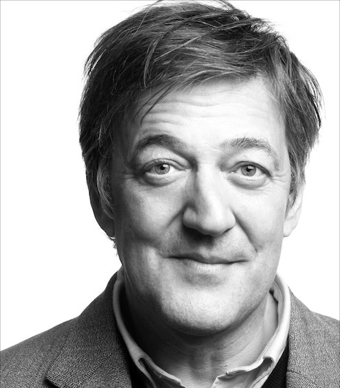

Only The Lonely - Official site of Stephen Fry

There isn’t any point in denying that the outburst of sympathy and support that followed my confession to an attempt at self-slaughter last year ([Richard Herring podcast](http://www.comedy.co.uk/podcasts/richard_herring_lst_podcast/episode_18_stephen_fry/)) has touched me very deeply.

Some people, as some people always will, cannot understand that depression (or in my case cyclothymia, a form of bipolar disorder) is an illness and they are themselves perhaps the sufferers of a malady that one might call either an obsession with money, or a woeful lack of imagination.

“How can someone so well-off, well-known and successful have depression?” they ask. [Alastair Campbell in a marvelous article](http://www.alastaircampbell.org/blog/2013/06/10/response-to-stephen-fry-suicide-interview-shows-attitudes-are-slowly-changing/), suggested changing the word “depression” to “cancer” or “diabetes” in order to reveal how, in its own way, sick a question, it is. Ill-natured, ill-informed, ill-willed or just plain ill, it’s hard to say.

But, most people, a surging, warm, caring majority, have been kind. Almost too kind. There’s something a little flustering and embarrassing when a taxi-driver shakes you by the hand, looks deep into your eyes and says “You look after yourself, mate, yes? Promise me?” And there’s something perhaps not too helpful to one’s mental health when it is the only subject people want to talk to you about, however kindly or for whatever reasons.

But I have nothing to complain about. I won’t go into the terrible details of the bottle of vodka, the mixture of pills and the closeness to permanent oblivion I came. You can imagine them and I don’t want to upset the poor TV producer and hotel staff who had to break down my door and find me in the unconscious state I was in, four broken ribs thanks to some sort of convulsive fit that must have overtaken me while I lay almost comatose, vomit dribbling from my mouth. You can picture the scene.

The episode, plus the relationship I now have with a magnificent psychiatrist, has made made my mental health better, I think, than it’s ever been. I used to think it utterly normal that I suffered from “suicidal ideation” on an almost daily basis. In other words, for as long as I can remember, the thought of ending my life came to me frequently and obsessively. But then it’s the thought behind the most famous speech in all history. To be, or not to be.

To be, or not to be: that is the question:
Whether ’tis nobler in the mind to suffer
The slings and arrows of outrageous fortune,
Or to take arms against a sea of troubles,
And by opposing end them? To die: to sleep;
No more; and by a sleep to say we end
The heart-ache and the thousand natural shocks
That flesh is heir to, ’tis a consummation
Devoutly to be wish’d. To die, to sleep;
To sleep: perchance to dream: ay, there’s the rub;
For in that sleep of death what dreams may come
When we have shuffled off this mortal coil,
Must give us pause: there’s the respect

That makes calamity of so long life;
For who would bear the whips and scorns of time,
The oppressor’s wrong, the proud man’s contumely,
The pangs of despised love, the law’s delay,
The insolence of office and the spurns
That patient merit of the unworthy takes,
When he himself might his quietus make
With a bare bodkin? who would fardels bear,
To grunt and sweat under a weary life,
But that the dread of something after death,
The undiscover’d country from whose bourn
No traveller returns, puzzles the will
And makes us rather bear those ills we have
Than fly to others that we know not of?
Thus conscience does make cowards of us all;
And thus the native hue of resolution
Is sicklied o’er with the pale cast of thought,
And enterprises of great pith and moment
With this regard their currents turn awry,
Advertisement

And lose the name of action…

Take time to read it slowly to yourself or out loud. I don’t have Hamlet’s wit (or Shakespeare’s of course) but every logical or doubtful step from line to line expresses better how hard I thought about the advantages and cursed (as I thought) disadvantages against suicide. The speech, for the most part, stayed my hand. As it did Hamlet’s.

But medicine, much as some don’t like to hear it, can help. I am on a regime of four a day. One is an SNRI, the other a mood-stabilizer. I haven’t considered suicide in anything other than a puzzled intellectual way since this pharmaceutical regime “kicked in”.

But I can still be *sad*. Perhaps you might go to my [tumblr](http://stephen-fry-me.tumblr.com/) page and see what Bertrand Russell wrote about his abiding passions (it’s the last section of the page). I can be sad for the same reason he was, though I do so much less about it than that great man did. But I can be sad for personal reasons because I am often forlorn, unhappy and lonely. These are qualities all humans suffer from and do not qualify (except in their worst extremes) as mental illnesses.

*Lonely*? I get invitation cards through the post almost every day. I shall be in the Royal Box at Wimbledon and I have serious and generous offers from friends asking me to join them in the South of France, Italy, Sicily, South Africa, British Columbia and America this summer. I have two months to start a book before I go off to Broadway for a run of *Twelfth Night* there.

I can read back that last sentence and see that, bipolar or not, if I’m under treatment and not actually depressed, what the *fuck* right do I have to be lonely, unhappy or forlorn? I don’t have the right. But there again I don’t have the right *not* to have those feelings. Feelings are not something to which one does or does not have rights.

In the end loneliness is the most terrible and contradictory of my problems. I hate having only myself to come home to. If I have a book to write, it’s fine. I’m up so early in the morning that even I pop out for an early supper I am happy to go straight to bed, eager to be up and writing at dawn the next day. But otherwise…

It’s not that I want a sexual partner, a long-term partner, someone to share a bed and a snuggle on the sofa with – although perhaps I do and in the past I have had and it has been joyful. But the fact is I value my privacy too. It’s a lose-lose matter. I don’t want to be alone, but I want to be left alone. Perhaps this is just a form of narcissism, vanity, overdemanding entitlement – give it whatever derogatory term you think it deserves. I don’t know the answer.

I suppose I just don’t like my own company very much. Which is odd, given how many times people very kindly tell me that they’d put me on their ideal dinner party guestlist. I do think I can usually be relied upon to be good company when I’m out and about and sitting round a table chatting, being silly, sharing jokes and stories and bringing shy people out of their shells.

But then I get home and I’m all alone again.

I don’t write this for sympathy. I don’t write it as part as my on going and undying commitment to the cause of mental health charities like [Mind](http://www.mind.org.uk/). I don’t quite know why I write it. I think I write it because it fascinates me.

And perhaps I am writing this for any of you out there who are lonely too. There’s not much we can do about it. I am luckier than many of you because I am lonely in a crowd of people who are mostly very nice to me and appear to be pleased to meet me. But I want you to know that you are not alone in your being alone.

Loneliness is not much written about (my spell-check wanted me to say that loveliness is not much written about – how wrong *that* is) but humankind is a social species and maybe it’s something we should think about more than we do. I cannot think of many plays or documentaries or novels about lonely people. Aah, look at them all, Paul McCartney enjoined us in Eleanor Rigby… where do they all come from?

The strange thing is, if you see me in the street and engage in conversation I will probably freeze into polite fear and smile inanely until I can get away to be on my lonely ownsome.

Make of that what you will.
Sx

- Related (0)
- Absolutely unrelated (0)