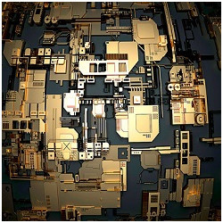

Open Source Firmware

[Home](https://cacm.acm.org/)/[Magazine Archive](https://cacm.acm.org/magazines/decade)/[October 2019 (Vol. 62, No. 10)](https://cacm.acm.org/magazines/2019/10)/[Open Source Firmware](https://cacm.acm.org/magazines/2019/10/239673-open-source-firmware)/Full Text

Practice

# Open Source Firmware

######

* * *

By Jesse Frazelle
Communications of the ACM, October 2019, Vol. 62 No. 10, Pages 34-38
10.1145/3343042

[Comments](https://cacm.acm.org/magazines/2019/10/239673-open-source-firmware/fulltext#comments)

View as:[Print](https://cacm.acm.org/magazines/2019/10/239673-open-source-firmware/fulltext#)[Mobile App](https://cacm.acm.org/about-communications/mobile-apps/)[ACM Digital Library](https://dl.acm.org/citation.cfm?id=3363418.3343042&coll=portal&dl=ACM)[Full Text (PDF)](https://cacm.acm.org/magazines/2019/10/239673-open-source-firmware/pdf)[In the Digital Edition](https://dl.acm.org/ft_gateway.cfm?id=3343042&ftid=2085354&dwn=1)Share:[Send by email](#)[Share on reddit](#)[Share on StumbleUpon](#)[Share on Hacker News](https://news.ycombinator.com/)[Share on Tweeter](#)[Share on Facebook](#)

[Share](https://www.addthis.com/bookmark.php?v=250&pubid=xa-4dcbeff2515fc93c)

Credit: Philipp Tur

[[q_stamp.webp](../_resources/212132a8ce924f81d7050d2c5c9c10d8.gif) ](https://cacm.acm.org/magazines/2019/10/239673-open-source-firmware/fulltext#top)

Operating systems such as Windows, Linux, and macOS have kernels. The kernel controls access to system resources. It contains the logic for allowing multiple processes to share hardware mechanisms such as CPU, memory, disk I/O, and networking.

When a computer boots, the main interface for initializing the DRAM, silicon, and devices is the firmware. The firmware initializes the operating system with a bootloader. You might have heard of GRUB (derived from Grand Unified Bootloader), a common bootloader for Linux distros.

Every computer or server typically comes with firmware produced by the vendor that manufactured it. Firmware lives in the SSD/HD (solid state drive/hard drive), keyboard, mouse, CPU, network card, and other devices.

Exploits in firmware can cause a lot of harm because of the many privileged operations for which firmware is responsible. For example, consider the hack on SoftLayer,[3](https://cacm.acm.org/magazines/2019/10/239673-open-source-firmware/fulltext#R3) a bare-metal cloud, where the base management controller (BMC) was hacked to leave a backdoor so when a server was reprovisioned after a customer used it, the hacker could still have access to that server. The minimum bar for any cloud provider is to provide a machine for a user that gets wiped cleanly and completely after use. This is a clear violation of that promise.

Making matters worse, most firmware is proprietary. The code that runs with the most privilege has the least visibility. This leads to breaches and incidents that have the capacity to affect users on multiple platforms simultaneously. To hackers this is like catnip.

Open source firmware can help bring computing to a more secure place by making the actions of firmware more visible and less likely to do harm. The goal of this article is to make readers feel empowered to demand more from vendors who can help drive this change.

This is an introduction to a complicated topic; some sections just touch the surface, but the intention is to provide a full picture of the world of open source firmware.

[Back to Top](https://cacm.acm.org/magazines/2019/10/239673-open-source-firmware/fulltext#PageTop)

### Privilege Levels

Computers today have various levels of privileges.

- Ring 3—*Userspace.* This ring has the fewest privileges. This is where user programs run. Userspace sandboxes can restrict privileges further.
- Ring 0—*Kernel.* This is the operating-system kernel; open source operating systems allow visibility into the code behind the kernel.
- Ring -1—*Hypervisor.* This VMM (virtual machine monitor) creates and runs virtual machines. Open source hypervisors such as Xen, KVM, bhyve, among others, provide visibility into the code behind this ring.
- Ring -2—System management mode (SMM), unified extensible firmware interface (UEFI) kernel. This is proprietary code that controls all CPU resources (more on this later).
- Ring -3—*Management engine.* This is proprietary code that runs as long as the motherboard is receiving power, even if it is off (more on this later).

This summary makes clear that rings -1 to 3 have the option to use open source software and have a large amount of visibility and control over the software. The privilege levels under ring -1 allow less control, but the situation is improving with the open source firmware community and projects.

It's counterintuitive that the code with the least visibility has the most privilege. This is what open source firmware is aiming to fix. The ecosystem's goals are focused on making firmware less capable of doing harm and making its actions more visible.

**Ring -2. SMM, UEFI kernel.** This ring controls all CPU resources. SMM is invisible to the rest of the stack on top of it. It was originally used for power management and system hardware control. It handles system events such as memory or chipset errors.

UEFI is the interface between the operating system and the BIOS firmware. EFI, the predecessor of UEFI, was made to solve BIOS bit and address limitations. Since then, more functionality has been added to the UEFI spec, including cryptography, networking, and authentication. The UEFI kernel is extremely complex and has millions of lines of code. It consists of boot services and runtime services. The specification (https://uefi.org/specifications) is quite verbose if you want to dig in. UEFI applications such as the UEFI shell, GRUB, Gummiboot, or Windows Boot Manager have the option of being active after boot.

The UEFI kernel is a common vector for many vulnerabilities since it has some of the same proprietary code used on many different platforms. Bootloaders such as GRUB and Windows Boot Manager are platform specific. The UEFI kernel is shared on multiple platforms, making it a great target for attackers.

Additionally, since only UEFI can rewrite itself, exploits can be made persistent. This is because UEFI lives in the processor's firmware, typically stored in the Serial Peripheral Interface (SPI) flash. Even if a user were to wipe the entire operating system or install a new hard drive, an attack would persist in the SPI flash.

**Ring -3. Management engine.** In the case of Intel (x86), Ring -3 is the Intel Management Engine.[7](https://cacm.acm.org/magazines/2019/10/239673-open-source-firmware/fulltext#R7) It can turn on nodes and reimage disks invisibly. It has a kernel that runs Minix,[11](https://cacm.acm.org/magazines/2019/10/239673-open-source-firmware/fulltext#R11) as well as a web server and entire networking stack. Because of this, Minix is the world's most widely used operating system. There is a lot of functionality in the Management Engine; it could take all day to list it all, but many resources are available for digging into more detail.[16](https://cacm.acm.org/magazines/2019/10/239673-open-source-firmware/fulltext#R16)

Between Ring -2 and Ring -3 there are at least two and a half other kernels in our stack that have many capabilities. Each of these kernels has its own networking stacks and web servers, which is unnecessary and potentially dangerous, especially if you do not want these rings reaching out over the network to update themselves. The code can also modify itself and persist across power cycles and reinstalls. There is very little visibility into what the code in these rings is actually doing, which is horrifying, considering these rings have the most privileges.

**They all have exploits.** It should be of no surprise to anyone that Rings -2 and -3 have their fair share of vulnerabilities. Exploits here have a huge impact radius when they happen. For example, there was a bug in the Web server of the Intel Management Engine.[14](https://cacm.acm.org/magazines/2019/10/239673-open-source-firmware/fulltext#R14) No one realized the bug existed for *seven* years.

How can we make it better?

[Back to Top](https://cacm.acm.org/magazines/2019/10/239673-open-source-firmware/fulltext#PageTop)

### Firmware Projects

Firmware projects are typically stored in SPI flash.

**u-boot** (https://www.chromium.org/developers/u-boot) and **coreboot** (https://www.coreboot.org/) are open source firmware. They handle silicon and DRAM initialization. Google Chromebooks use both: coreboot on x86 and u-boot for the rest. This is one part of how Google verifies boot.[2](https://cacm.acm.org/magazines/2019/10/239673-open-source-firmware/fulltext#R2) Verified boot reduces the risk of malware, permits safe software updates, and ensures the integrity of the software on the device.

Coreboot's design philosophy is to "do the bare minimum necessary to ensure hardware is usable and then pass control to a different program called the payload" ([https://doc.coreboot.org](https://doc.coreboot.org/)). The payload in this case is LinuxBoot.

**LinuxBoot** (https://www.linuxboot.org/), formerly known as Non-extensible Reduced Firmware, or NERF (https://trmm.net/NERF), handles device drivers, manages the network stack, and supplies a multiuser, multitasking environment. It is built with Linux so a single kernel can work for several boards. It is arguably better to use an open source kernel with lots of eyes on it, rather than the two and a half other kernels that are all different and closed off. This means that you are lessening the attack surface by using fewer variations of code, and you are making an effort to rely on code that is open source. Linux improves boot reliability by replacing minimally tested firmware drivers with hardened Linux drivers. (Linux is significantly more vetted than most proprietary systems are; it has lots of eyes on it, since it is used quite extensively.)

By using a kernel that already has tooling, firmware devs can build using tools they already know. When they need to write logic for signature verification, disk decryption, and the like, they can use a language that is modern, easily auditable, maintainable, and readable.

[Back to Top](https://cacm.acm.org/magazines/2019/10/239673-open-source-firmware/fulltext#PageTop)

### Runtimes

Runtimes enable systems to use open source firmware and run custom programming logic.

**Heads** (http://osresearch.net/) is a configuration of coreboot that has a securely configured Linux kernel as the coreboot payload. It works on servers and laptops. The project, started by Trammel Hudson, is influenced by several years of firmware vulnerability research (Thunderstrike; https://trmm.net/Thunderstrike; and Thunderstrike 2; https://trmm.net/Thunderstrike_2).

**u-root** (https://github.com/u-root/u-root) is a set of Golang userspace tools and bootloader. It is used as the initramfs for the Linux kernel from LinuxBoot.

By being open source, this new firmware stack helps improve the visibility into many of the components that were previously very proprietary. Using LinuxBoot makes boot times 20 times faster.[12](https://cacm.acm.org/magazines/2019/10/239673-open-source-firmware/fulltext#R12) Booting an open compute node to a Linux shell went from 8 minutes to 17 seconds, a speed improvement of 32 times.

[Back to Top](https://cacm.acm.org/magazines/2019/10/239673-open-source-firmware/fulltext#PageTop)

### What About All the Other Firmware?

Open source firmware is needed for a plethora of other devices, too. These include the following:

- EC (embedded controller)/SIO (super I/O). This is for mobile devices and desk-based platforms. It controls keyboards, temperature monitoring, etc.
- TPM (trusted platform module). This is a secure home for cryptographic keys.
- BMC (baseboard management controller)/ME (management engine). A BMC is associated with server platforms while an ME is typically associated with client platforms. For an open source BMC, there are two projects: OpenBMC (https://github.com/open-bmc/openbmc) and u-bmc (https://github.com/u-root/u-bmc). me_cleaner (https://github.com/corna/me_cleaner) is the project used to clean the Intel Management Engine to the smallest necessary capabilities.
- NIC (network interface controller). Work is being done in the open compute project on NIC 3.0,[13](https://cacm.acm.org/magazines/2019/10/239673-open-source-firmware/fulltext#R13) a spec for a NIC.
- GPU (graphics processing unit).
- HDD/SSD.
- eMMC (embedded MultiMedia-Card (eMMC)/UFS (universal flash storage). Storage devices for mobile systems.
- Power supply.
- CPLDs (complex programmable logic devices), FPGAs (field-programmable gate arrays). The programmable logic components.
- Fans.

Open source firmware is necessary not only to provide visibility into the stack, but also to verify the state of software on a machine.

[Back to Top](https://cacm.acm.org/magazines/2019/10/239673-open-source-firmware/fulltext#PageTop)

### Intel's Boot Guard

Boot Guard is supposed to verify the firmware signatures for the processor. The problem with this, in the case of Intel processors, is that only Intel has the keys for signing firmware packages. This makes it impossible to use coreboot and LinuxBoot or their equivalents as firmware on those processors. If you tried, the firmware would not be signed with Intel's key, and the failed attempt to boot would brick the board.

* * *

**

*> Open source firmware can help bring computing to a more secure place by making the actions of firmware more visible and less likely to do harm.*

**

* * *

A post by Matthew Garrett about Boot Guard highlights the importance of user freedom when it comes to firmware.[1](https://cacm.acm.org/magazines/2019/10/239673-open-source-firmware/fulltext#R1) The owner of the hardware has a right to own the firmware as well. Boot Guard prevents this. In the security keynote at the 2018 Open Source Firmware Conference,[5](https://cacm.acm.org/magazines/2019/10/239673-open-source-firmware/fulltext#R5) Trammel Hudson described how he found a vulnerability to bypass Boot Guard ([http://bit.ly/2S6oGrd](https://bit.ly/2S6oGrd)); the bugzilla details can be found at [http://bit.ly/2XVdAKU](https://bit.ly/2XVdAKU). The bug allows an attacker to use unsigned firmware and boot normally, completely negating the purpose of Boot Guard.

**Root of trust.** The goal of the root of trust should be to verify that the software installed in every component of the hardware is the software that was intended. This way you can know without a doubt and verify if hardware has been hacked. Since you have little to no visibility into the code running in a lot of places in your hardware, it is currently difficult to do this. How do you really know the firmware in a component is not vulnerable or that it doesn't have any backdoors? You cannot know without a firm root of trust.

Every cloud and vendor seem to have its own way of implementing a root of trust. Microsoft has Cerberus,[15](https://cacm.acm.org/magazines/2019/10/239673-open-source-firmware/fulltext#R15) Google has Titan,[18](https://cacm.acm.org/magazines/2019/10/239673-open-source-firmware/fulltext#R18) and Amazon has Nitro.[4](https://cacm.acm.org/magazines/2019/10/239673-open-source-firmware/fulltext#R4)

Paul McMillan and Matt King gave a presentation in 2018 on securing hardware at scale.[8](https://cacm.acm.org/magazines/2019/10/239673-open-source-firmware/fulltext#R8) It covers in great detail how to secure bare metal, while also giving customers access to the bare metal. When customers return hardware to them, they need to ensure with consistency and reliability that nothing from the customer is hiding in any component of the hardware.

All clouds must ensure the hardware they are running has not been compromised after a customer has used compute resources.

Platform firmware resiliency. Chip vendors are investing in platform firmware resiliency (PFR) based on NIST guidelines.[17](https://cacm.acm.org/magazines/2019/10/239673-open-source-firmware/fulltext#R17) These guidelines focus on ensuring the firmware remains in a state of integrity, detecting when it has been corrupted, and recovering the pieces of firmware back to a state of integrity.

Vendors have been building features around the NIST guidelines for PFR. Intel[6](https://cacm.acm.org/magazines/2019/10/239673-open-source-firmware/fulltext#R6) and Lattice semiconductors[10](https://cacm.acm.org/magazines/2019/10/239673-open-source-firmware/fulltext#R10) each have a version. The Open Compute Project (OCP) talk on Intel's firmware innovations[9](https://cacm.acm.org/magazines/2019/10/239673-open-source-firmware/fulltext#R9) states that Intel is using PFR to deliver Microsoft's Cerberus' attestation principles.

[Back to Top](https://cacm.acm.org/magazines/2019/10/239673-open-source-firmware/fulltext#PageTop)

### Challenges

One challenge of open source firmware involves the threat model. Whether you have a root of trust, and how that root of trust operates, depends on the threat model. Let's dive in a bit with an example. If you are an enterprise with your own cloud, your threat model would prevent you from using any firmware that might contain vulnerabilities or backdoors that would threaten your business or customer data. In this case, you would ideally want an entirely open source root of trust, as well as open source firmware for each of the devices in your server or laptop, with reproducible builds to ensure integrity. This would give you the most visibility into the firmware that is running and the logic it is composed of.

Another challenge is writing the firmware for all the devices. There are a lot of device options for vendors to use in their systems, so supporting many of those will be difficult without the device vendors helping out. For example, consider that many different vendors manufacture DRAM or SSDs.

* * *

**

*> All clouds must ensure the hardware they are running has not been compromised after a customer has used compute resources.*

**

* * *

**How to help.** The goal of this article is to provide some insight into what is being built with open source firmware and why making firmware open source is so important. To help with this effort, please help spread the word. Try to use platforms that value open source firmware components. Chromebooks are a great example of this, as are Purism (https://puri.sm/) computers. Ask your providers what they are doing to further the cause of open source firmware or ensuring hardware security with roots of trust.

**Acknowledgments.** Huge thanks to the open source firmware community and a shout out to Ron Minnich, Trammel Hudson, Chris Koch, Rick Altherr, and Zaolin for helping me along this journey.

**Related articles
on [queue.acm.org](http://queue.acm.org/)**
**Continuous Delivery Sounds Great, but Will It Work Here?**
*Jez Humble*
https://queue.acm.org/detail.cfm?id=3190610
**Toward Higher Precision**
*Rick Ratzel and Rodney Greenstreet*
https://queue.acm.org/detail.cfm?id=2354406
**Simulators: Virtual Machines of the Past (and Future)**
*Bob Supnik*
https://queue.acm.org/detail.cfm?id=1017002

[Back to Top](https://cacm.acm.org/magazines/2019/10/239673-open-source-firmware/fulltext#PageTop)

### References

1. Garrett, M. Intel Boot Guard, Coreboot and user freedom, 2015; https://mjg59.dreamwidth.org/33981.html.

2. Glass, S. Verified boot in Chrome OS and how to make it work for you. Embedded Linux Conference Europe, 2013; https://static.googleusercontent.com/media/research.google.com/en//pubs/archive/42038.pdf.

3. Goodin, D. Supermicro hardware weaknesses let researchers backdoor an IBM cloud server. arsTechnica, 2019; https://arstechnica.com/information-technology/2019/02/supermicro-hardware-weaknesses-let-researchers-backdoor-an-ibm-cloud-server/.

4. Hamilton, J. AWS Nitro System. Perspectives, 2019; https://perspectives.mvdirona.com/2019/02/aws-nitro-system/.

5. Hudson, T. Open Source Firmware Conference Security Keynote, 2018; https://trmm.net/OSFC_2018_Security_keynote#Boot_Guard.

6. Intel. Intel Data Center Block with Firmware Resilience. Solution Brief, 2017; https://www.intel.com/content/dam/www/public/us/en/documents/solution-briefs/firmware-resilience-blocks-solution-brief.pdf.

7. Intel. What is Intel Management Engine? Intel, 2017; https://www.intel.com/content/www/us/en/support/articles/000008927/software/chipset-software.html.

8. King, M., McMillan, P. Securing bare metal hardware at scale. BSides PDX, 2018; https://www.youtube.com/watch?v=PEVVRkd-wPM

9. Kumar, M. J. OCP initiatives and Intel implementations, 2018; https://www.opencompute.org/files/Intel-System-Firmware-InnovationsMohanKumar-OCP18.pdf.

10. Lattice Semiconductors. Universal Platform Firmware Resiliency (PFR) – Servers, 2018; http://www.latticesemi.com/en/Solutions/Solutions/SolutionsDetails02/PFR.

11. Leroux, S. The truth about the Intel's hidden Minix OS and security concerns. It's FOSS, 2017; https://itsfoss.com/fact-intel-minix-case/.

12. Minnich, R. et al. Replace your exploit-ridden firmware with a Linux kernel, 2017; https://schd.ws/hosted_files/osseu17/84/Replace%20UEFI%20with%20Linux.pdf.

13. OCP Server Workgroup. OCP NIC subgroup. Open Compute Project OCP NIC 3.0 Design Specification Version 0.85b, 2018 https://www.opencompute.org/wiki/Server/Mezz

14. Newman, L. H. Hack brief: Intel fixes a critical bug that lingered for 7 dang years. *Wired*, 2017; https://www.wired.com/2017/05/hack-brief-intel-fixes-critical-bug-lingered-7-dang-years/.

15. Open Compute Project. Project Cerberus. GitHub, 2018; https://github.com/opencomputeproject/Project_Olympus/tree/master/Project_Cerberus.

16. Pataky, D. Intel Management Engine. Technische Universität Dresden, 2017; https://files.bitkeks.eu/docs/intelme-report.pdf.

17. Regenscheid, A. Platform firmware resiliency guidelines. NIST Special Publication 800-193, 2018; https://nvlpubs.nist.gov/nistpubs/SpecialPublications/NIST.SP.800-193.pdf.

18. Savagaonkar, U. et al. Titan in depth: Security in plaintext. Google Cloud, 2017; https://cloud.google.com/blog/products/gcp/titan-in-depth-security-in-plaintext.

[Back to Top](https://cacm.acm.org/magazines/2019/10/239673-open-source-firmware/fulltext#PageTop)

### Author

**Jessie Frazelle** is an independent contractor. She has worked as an engineer at GitHub, Microsoft, Google, Docker, and several startups.

* * *

Copyright held by author/owner. Publication rights licensed to ACM.

Request permission to publish from [permissions@acm.org](http://delivery.acm.org/10.1145/3350000/3343042/mailto:permissions@acm.org)

The Digital Library is published by the Association for Computing Machinery. Copyright © 2019 ACM, Inc.

* * *

No entries found
Sign In for Full Access
User Name
Password

[» Forgot Password?](https://cacm.acm.org/accounts/forgot-password)[**» Create an ACM Web Account**](https://cacm.acm.org/accounts/new)

###### Article Contents:

[Introduction](https://cacm.acm.org/magazines/2019/10/239673-open-source-firmware/fulltext#body-1)

[Privilege Levels](https://cacm.acm.org/magazines/2019/10/239673-open-source-firmware/fulltext#body-2)

[Firmware Projects](https://cacm.acm.org/magazines/2019/10/239673-open-source-firmware/fulltext#body-3)

[Runtimes](https://cacm.acm.org/magazines/2019/10/239673-open-source-firmware/fulltext#body-4)

[What About All the Other Firmware?](https://cacm.acm.org/magazines/2019/10/239673-open-source-firmware/fulltext#body-5)

[Intel's Boot Guard](https://cacm.acm.org/magazines/2019/10/239673-open-source-firmware/fulltext#body-6)

[Challenges](https://cacm.acm.org/magazines/2019/10/239673-open-source-firmware/fulltext#body-7)

[References](https://cacm.acm.org/magazines/2019/10/239673-open-source-firmware/fulltext#references)

[Author](https://cacm.acm.org/magazines/2019/10/239673-open-source-firmware/fulltext#authorinfo)

More News & opinions[(L)](https://cacm.acm.org/news/237212-what-do-dating-technology-and-alzheimers-have-in-common)

##### [(L)](https://cacm.acm.org/news/237212-what-do-dating-technology-and-alzheimers-have-in-common)[What Do Dating Technology and Alzheimer's Have in Common?](https://cacm.acm.org/news/237212-what-do-dating-technology-and-alzheimers-have-in-common)

­niversity of California[(L)](https://cacm.acm.org/magazines/2019/8/238331-must-and-must-not)

##### [(L)](https://cacm.acm.org/magazines/2019/8/238331-must-and-must-not)[MUST and MUST NOT](https://cacm.acm.org/magazines/2019/8/238331-must-and-must-not)

George V. Neville-Neil[(L)](https://cacm.acm.org/blogs/blog-cacm/238155-lazy-developers-are-the-best-developers)

##### [(L)](https://cacm.acm.org/blogs/blog-cacm/238155-lazy-developers-are-the-best-developers)[Lazy Developers Are the Best Developers](https://cacm.acm.org/blogs/blog-cacm/238155-lazy-developers-are-the-best-developers)

Yegor Bugayenko
ACM Resources

##### [Web Service Architectures and Technologies    ](https://pd.acm.org/ek_courses.cfm?crs=26547)

Courses