Open-sourcing Polynote: an IDE-inspired polyglot notebook

# Open-sourcing Polynote: an IDE-inspired polyglot notebook

[Netflix Technology Blog](https://medium.com/@NetflixTechBlog?source=post_page-----7f929d3f447----------------------)

[Oct 23](https://medium.com/netflix-techblog/open-sourcing-polynote-an-ide-inspired-polyglot-notebook-7f929d3f447?source=post_page-----7f929d3f447----------------------) · 11 min read

[Jeremy Smith](https://github.com/jeremyrsmith), [Jonathan Indig](https://github.com/jonathanindig), [Faisal Siddiqi](http://twitter.com/faisalzs)

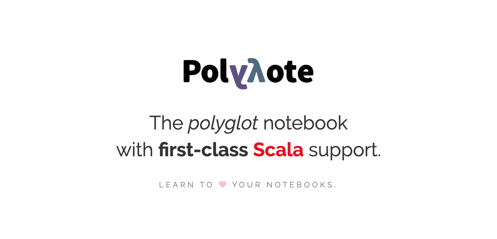

We are pleased to announce the open-source launch of [Polynote](http://www.polynote.org/): a new, polyglot notebook with first-class Scala support, [Apache Spark](https://spark.apache.org/) integration, multi-language interoperability including Scala, Python, and SQL, as-you-type autocomplete, and more.

Polynote provides data scientists and machine learning researchers with a notebook environment that allows them the freedom to seamlessly integrate our [JVM-based ML platform](https://www.slideshare.net/FaisalZakariaSiddiqi/ml-infra-for-netflix-recommendations-ai-nextcon-talk) — which makes heavy use of Scala — with the Python ecosystem’s popular machine learning and visualization libraries. It has seen substantial adoption among Netflix’s personalization and recommendation teams, and it is now being integrated with the rest of our research platform.

At Netflix, we have always felt strongly about sharing with the open source community, and believe that Polynote has a great potential to address similar needs outside of Netflix.

# Feature Overview

## Reproducibility

Polynote promotes notebook reproducibility by design. By taking a cell’s position in the notebook into account when executing it, Polynote helps prevent bad practices that make notebooks difficult to re-run from the top.

## Editing Improvements

Polynote provides IDE-like features such as interactive autocomplete and parameter hints, in-line error highlighting, and a rich text editor with LaTeX support.

## Visibility

The Polynote UI provides at-a-glance insights into the state of the kernel by showing kernel status, highlighting currently-running cell code, and showing currently executing tasks.

## Polyglot

Each cell in a notebook can be written in a different language with variables shared between them. Currently Scala, Python, and SQL cell types are supported.

## Dependency and Configuration Management

Polynote provides configuration and dependency setup saved within the notebook itself, and helps solve some of the dependency problems commonly experienced by Spark developers.

## Data Visualization

Native data exploration and visualization helps users learn more about their data without cluttering their notebooks. Integration with matplotlib and Vega allows power users to communicate with others through beautiful visualizations

# Reimagining the Scala notebook experience

On the Netflix Personalization Infrastructure team, our job is to accelerate machine learning innovation by building tools that can remove pain points and allow researchers to focus on research. Polynote originated from a frustration with the shortcomings of existing notebook tools, especially with respect to their support of Scala.

For example, while Python developers are used to working inside an environment constructed using a package manager with a relatively small number of dependencies, Scala developers typically work in a project-based environment with a build tool managing hundreds of (often) conflicting dependencies. With Spark, developers are working in a cluster computing environment where it is imperative that their distributed code runs in a consistent environment no matter which node is being used. Finally, we found that our users were also frustrated with the code editing experience within notebooks, especially those accustomed to using IntelliJ IDEA or Eclipse.

Some problems are unique to the notebook experience. A notebook execution is a record of a particular piece of code, run at a particular point in time, in a particular environment. This combination of code, data and execution results into a single document makes notebooks powerful, but also difficult to reproduce. Indeed, the scientific computing community has documented some notebook [reproducibility concerns](https://markwoodbridge.com/2017/03/05/jupyter-reproducible-science.html) as well as some [best practices](https://arxiv.org/pdf/1810.08055.pdf) for reproducible notebooks.

Finally, another problem that might be unique to the ML space is the need for polyglot support. Machine learning researchers often work in multiple programming languages — for example, researchers might use Scala and Spark to generate training data (cleaning, subsampling, etc), while actual training might be done with popular Python ML libraries like [tensorflow](http://tensorflow.org/) or [scikit-learn](https://scikit-learn.org/).

Next, we’ll go through a deeper dive of Polynote’s features.

# Reproducible by Design

Two of Polynote’s guiding principles are **reproducibility** and **visibility**. To further these goals, one of our earliest design decisions was to build Polynote’s code interpretation from scratch, rather than relying on a [REPL](https://en.wikipedia.org/wiki/Read%E2%80%93eval%E2%80%93print_loop) like a traditional notebook.

We feel that while REPLs are great in general, they are fundamentally unfit for the notebook model. In order to understand the problems with REPLs and notebooks, let’s take a look at the design of a typical notebook environment.

A notebook is an ordered collection of cells, each of which can hold code or text. The contents of each cell can be modified and executed independently. Cells can be rearranged, inserted, and deleted. They can also depend on the output of other cells in the notebook.

Contrast this with a REPL environment. In a REPL session, a user inputs expressions into the prompt one at a time. Once evaluated, expressions and the results of their evaluation are immutable. Evaluation results are appended to the global state available to the next expression.

Unfortunately, the disconnect between these two models means that a typical notebook environment, which uses a REPL session to evaluate cell code, causes hidden state to accrue as users interact with the notebook. Cells can be executed in any order, mutating this global hidden state that in turn affects the execution of other cells. More often than not, notebooks are unable to be reliably rerun from the top, which makes them very difficult to reproduce and share with others. The hidden state also makes it difficult for users to reason about what’s going on in the notebook.

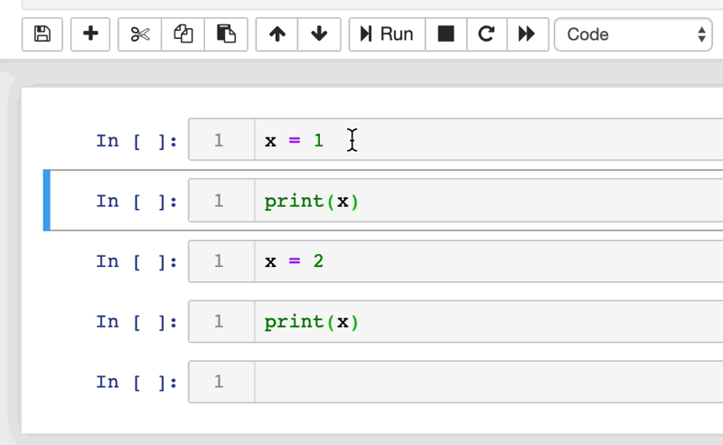

In other notebooks, hidden state means that a variable is still available after its cell is deleted.

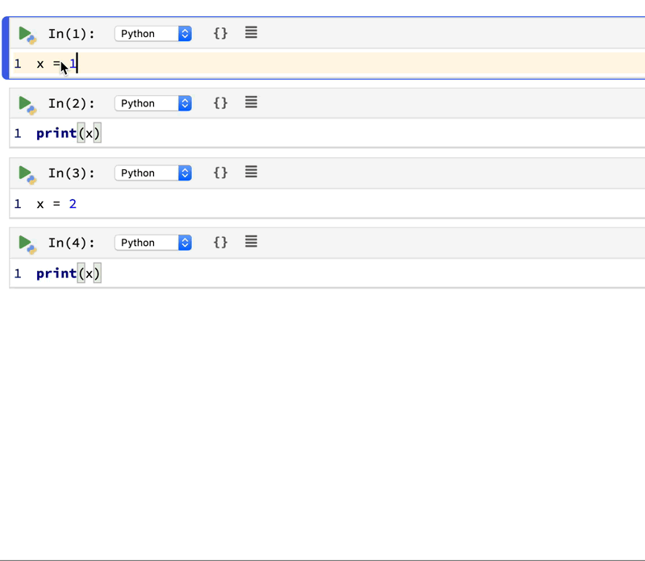

In a Polynote notebook, there is no hidden state. A deleted cell’s variables are no longer available.

Writing Polynote’s code interpretation from scratch allowed us to do away with this global, mutable state. By keeping track of the variables defined in each cell, Polynote constructs the input state for a given cell based on the cells that have run above it. Making the position of a cell important in its execution semantics enforces the principle of least surprise, allowing users to read the notebook from top to bottom. It ensures reproducibility by making it far more likely that running the notebook sequentially will work.

# Better editing

Let’s face it — for someone used to IDEs, writing a nontrivial amount of code in a notebook can feel like going back in time a few decades. We’ve seen users who prefer to write code in an IDE instead, and paste it into the notebook to run. While it’s not our goal to provide all the features of a full-fledged modern IDE, there are a few quality-of-life code editing enhancements that go a long way toward improving usability.

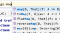
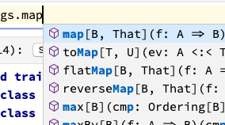

Code editing in Polynote integrates with the [Monaco editor](https://microsoft.github.io/monaco-editor/) for interactive auto-complete.

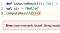
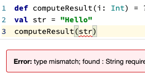

Polynote highlights errors inside the code to help users quickly figure out what’s gone wrong.

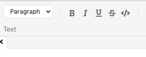
Polynote provides a rich text editor for text cells.
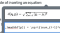
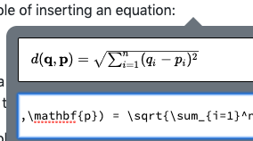
The rich text editor allows users to easily insert LaTeX equations.

# Visibility

As we mentioned earlier, visibility is one of Polynote’s guiding principles. We want it to be easy to see what the kernel is doing at any given time, without needing to dive into logs. To that end, Polynote provides a variety of UI treatments that let users know what’s going on.

Here’s a snapshot of Polynote in the midst of some code execution.
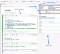
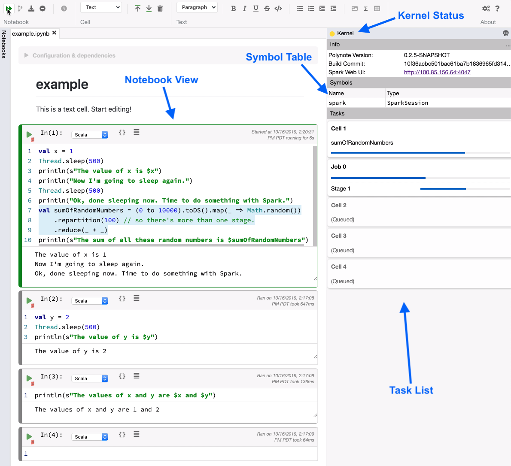

There’s quite a bit of information available to the user from a single glance at this UI. First, it is clear from both the notebook view and task list that Cell 1 is currently running. We can also see that Cells 2 through 4 are queued to be run, in that order.

We can also see the exact statement currently being run is highlighted in blue — the line defining the value `sumOfRandomNumbers`. Finally, since evaluating that statement launches a Spark job, we can also see job- and stage-level Spark progress information in the task list..

Here’s an animation of that execution so we can see how Polynote makes it easy to follow along with the state of the kernel.

Executing a Polynote notebook

The symbol table provides insight into the notebook internal state. When a cell is selected, the symbol table shows any values that resulted from the current cell’s execution above a black line, and any values available to the cell (from previous cells) below the line. At the end of the animation, we show the symbol table updating as we click on each cell in turn.

Finally, the kernel status area provides information about the execution status of the kernel. Below, we show a closeup view of how the kernel status changes from idle and connected, in green, to busy, in yellow. Other states include disconnected, in gray, and dead or not started, in red.

Kernel status changing from green (idle and connected) to yellow (busy)

# Polyglot

You may have noticed in the screenshots shown earlier that each cell has a language dropdown in its toolbar. That’s because Polynote supports truly polyglot notebooks, where each cell can be written in a different language!

When a cell is run, the kernel provides the available typed input values to the cell’s language interpreter. In turn, the interpreter provides the resulting typed output values back to the kernel. This allows cells in Polynote notebooks to operate within the same context, and use the same shared state, regardless of which language they are defined in — so users can pick the best tool for the job at hand.

Here’s an example using scikit-learn, a Python library, to compute an isotonic regression of a dataset generated with Scala. This code is adapted from the [Isotonic Regression example](https://scikit-learn.org/stable/auto_examples/plot_isotonic_regression.html#sphx-glr-auto-examples-plot-isotonic-regression-py) on the scikit-learn website.

A polyglot example showing data generation in Scala and data analysis in Python

As this example shows, Polynote enables users to fluently move from one language to another within the same notebook.

# Dependency and Configuration Management

In order to better facilitate reproducibility, Polynote stores configuration and dependency information directly in the notebook itself, rather than relying on external files or a [cluster/server level configuration](https://zeppelin.apache.org/docs/latest/usage/interpreter/dependency_management.html). We found that managing dependencies directly in the [notebook](https://toree.incubator.apache.org/docs/current/user/faq/)  [code](https://zeppelin.apache.org/docs/latest/interpreter/spark.html#3-dynamic-dependency-loading-via-sparkdep-interpreter) was clunky and could be confusing to users. Instead, Polynote provides a user-friendly Configuration section where users can set dependencies for each notebook.

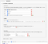
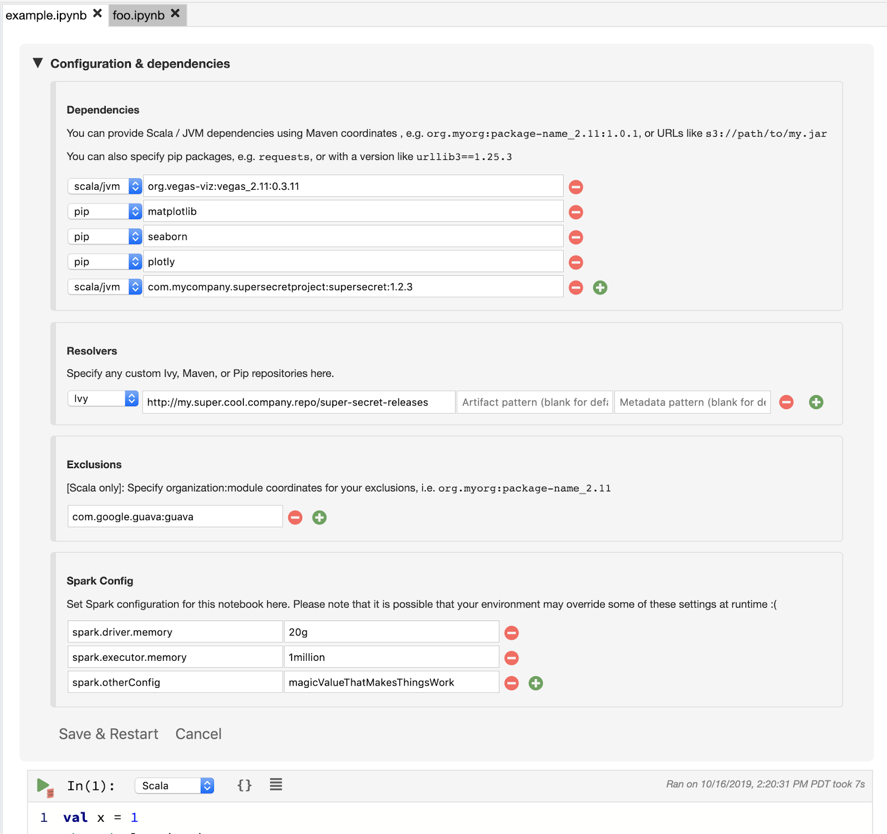

Polynote’s Configuration UI, providing user-friendly, notebook-level configuration and dependency management

With this configuration, Polynote constructs an environment for the notebook. It fetches the dependencies locally (using [Coursier](https://github.com/coursier/coursier) or [pip](https://pypi.org/project/pip/) to fetch them from a repository) and loads the Scala dependencies into an isolated ClassLoader to reduce the chances of a class conflict with Spark libraries. Python dependencies are loaded into an isolated [virtualenv](https://virtualenv.pypa.io/en/latest/). When Polynote is used in Spark mode, it creates a Spark Session for the notebook which uses the provided configuration. The Python and Scala dependencies are automatically added to the Spark Session.

# Data Visualization

One of the most important use cases of notebooks is the ability to explore and visualize data. Polynote integrates with two of the most popular open source visualization libraries, [Vega](https://github.com/vega/) and [Matplotlib](https://matplotlib.org/).

While matplotlib integration is quite standard among notebooks, Polynote also has native support for data exploration — including a data schema view, table inspector, plot constructor and Vega support.

We’ll walk through a quick example of some data analysis and exploration using the tools mentioned above, using the [Wine Reviews dataset from Kaggle](https://www.kaggle.com/zynicide/wine-reviews). First, here’s a quick example of just loading the data in Spark, seeing the Schema, plotting it and saving that plot in the notebook.

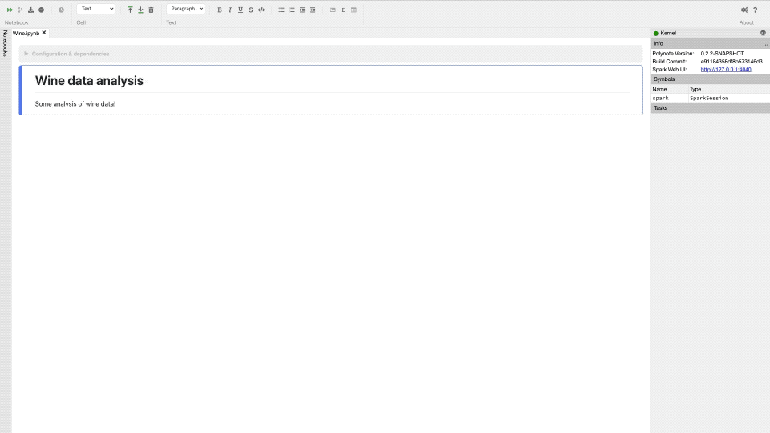

Example of data exploration using the plot constructor
Let’s focus on some of what we’re seeing here.
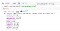
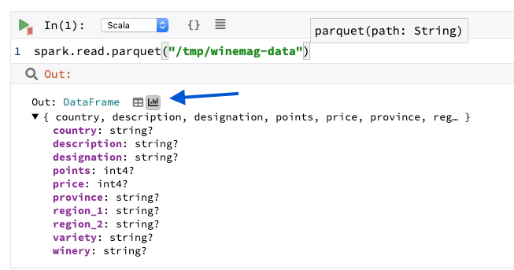

View of the quick inspector, showing the DataFrame’s schema. The blue arrow points to the quick access buttons to the table view (left) and plot view (right)

If the last statement of a cell is an expression, it gets assigned to the cell’s Out variable. Polynote will display a representation of the result in a fashion determined by its data type. If it’s a table-like data type, such as a DataFrame or collection of case classes, Polynote shows the quick inspector, allowing users to see schema and type information at a glance.

The quick inspector also provides two buttons that bring up the full data inspector — the button on the left brings up the table view, while the button on the right brings up the plot constructor. The animation also shows the plot constructor and how users can drag and drop measures and dimensions to create different plots.

We also show how to save a plot to the notebook as its own cell. Because Polynote natively supports Vega specs, saving the plot simply inserts a new Vega cell with a generated spec. As with any other language, Vega specs can leverage polyglot support to refer to values from previous cells. In this case, we’re using the Out value (a DataFrame) and performing additional aggregations on it. This enables efficient plotting without having to bring millions of data points to the client. Polynote’s Vega spec language provides an API for aggregating and otherwise modifying table-like data streams.

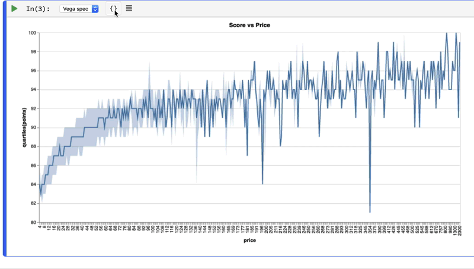

A Vega cell generated by the plot constructor, showing its spec

Vega cells don’t need to be authored using the plot constructor — any Vega spec can be put into a Vega cell and plotted directly, as seen below.

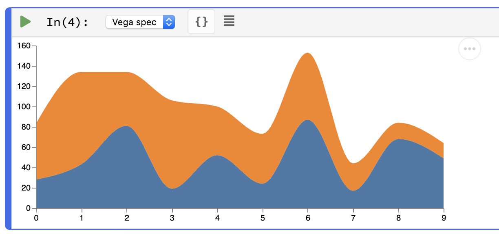

[Vega’s Stacked Area Chart Example](https://vega.github.io/vega/examples/stacked-area-chart/) displayed in Polynote

In addition to the cell result value, any variable in the symbol table can be inspected with a click.

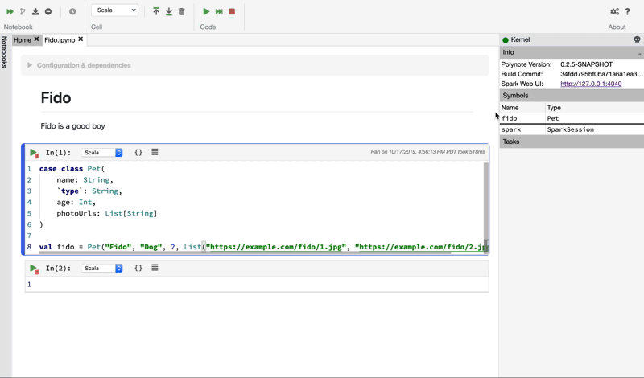

Inspecting a variable in the symbol table

# The road ahead

We have described some of the key features of Polynote here. We’re proud to share Polynote widely by open sourcing it, and we’d love to hear your feedback. Take it for a spin today by heading over to [our website](http://polynote.org/) or [directly to the code](https://github.com/polynote/polynote) and let us know what you think! Take a look at our currently [open issues](https://github.com/polynote/polynote/issues) and to see what we’re planning, and, of course, PRs are always welcome! Polynote is still very much in its infancy, so you may encounter some rough edges. It is also a powerful tool that enables arbitrary code execution (“with great power, comes great responsibility”), so please be cognizant of this when you use it in your environment.

Plenty of exciting work lies ahead. We are very optimistic about the potential of Polynote and we hope to learn from the community just as much as we hope they will find value from Polynote. If you are interested in working on Polynote or other Machine Learning research, engineering and infrastructure problems, check out the [Netflix Research site](https://research.netflix.com/) as well as some of the current [openings](https://jobs.netflix.com/).

# Acknowledgements

Many colleagues at Netflix helped us in the early stages of Polynote’s development. We would like to express our tremendous gratitude to Aish Fenton, Hua Jiang, Kedar Sadekar, Devesh Parekh, Christopher Alvino, and many others who provided thoughtful feedback along their journey as early adopters of Polynote.