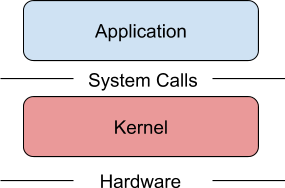

Open-sourcing gVisor, a sandboxed container runtime

Open-sourcing gVisor, a sandboxed container runtime

https://cloudplatform.googleblog.com/2018/05/Open-sourcing-gVisor-a-sandboxed-container-runtime.html

By Nicolas Lacasse, Software Engineer Containers have revolutionized how we develop, package, and deploy applications. However, the system...