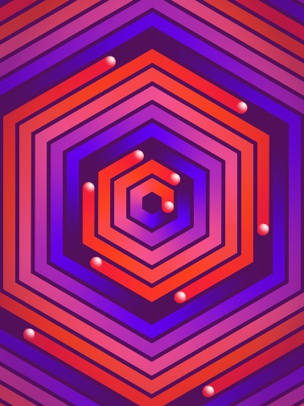
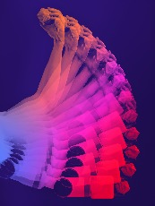
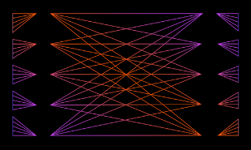
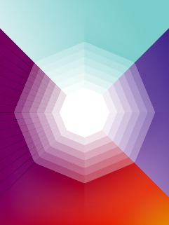

OpenAI Blog

 

- [Research](https://openai.com/research)

- [Systems](https://openai.com/systems)

- [About](https://openai.com/about)

- [Blog](https://blog.openai.com/)

#  Blog [Latest post](https://blog.openai.com/learning-to-cooperate-compete-and-communicate/)

 [Twitter](https://twitter.com/openai)  [Facebook](https://www.facebook.com/openai.research)

 [        ## OpenAIBaselines      No. 5   May 24  2017         ](https://blog.openai.com/openai-baselines-dqn/)

 [          ## Learning to Cooperate, Compete, and Communicate       Research  Jun 8, 2017](https://blog.openai.com/learning-to-cooperate-compete-and-communicate/)

 [        ## Robotsthat Learn      No. 4   May 16  2017         ](https://blog.openai.com/robots-that-learn/)

 [          ## Roboschool       Research  May 15, 2017](https://blog.openai.com/roboschool/)

 [        ## Unsupervised Sentiment Neuron             No. 3   Apr 6  2017         ](https://blog.openai.com/unsupervised-sentiment-neuron/)

 [          ## Spam Detection in the Physical World       Research  Apr 1, 2017](https://blog.openai.com/spam-detection-in-the-physical-world/)

 [        ## Evolution Strategies             No. 2   Mar 24  2017         ](https://blog.openai.com/evolution-strategies/)

 [          ## Distill       Research  Mar 20, 2017](https://blog.openai.com/distill/)

 Sign up for newsletter:

 [          ## Learning to Communicate       Research  Mar 16, 2017](https://blog.openai.com/learning-to-communicate/)

 [          ## Attacking Machine Learning with Adversarial Examples       Research  Feb 24, 2017](https://blog.openai.com/adversarial-example-research/)

 [          ## Team Update       Updates  Jan 30, 2017](https://blog.openai.com/team-update-january/)

 [          ## Faulty Reward Functions in the Wild       Research  Dec 21, 2016](https://blog.openai.com/faulty-reward-functions/)

 [          ## Universe             Technology    Dec 5, 2016](https://blog.openai.com/universe/)

 [Newsletter](https://blog.openai.com/subscribe)  [@openai](https://twitter.com/openai)  [/openai](https://www.facebook.com/openai.research)

 [          ## OpenAI and Microsoft       Updates  Nov 15, 2016](https://blog.openai.com/openai-and-microsoft/)

 [          ## Report from the Self-Organizing Conference       Events  Oct 13, 2016](https://blog.openai.com/report-from-the-self-organizing-conference/)

 [          ## Infrastructure for Deep Learning             Technology    Aug 29, 2016](https://blog.openai.com/infrastructure-for-deep-learning/)

 [          ## Machine Learning Unconference       Events  Aug 18, 2016](https://blog.openai.com/machine-learning-unconference/)

 [          ## Team Update       Updates  Aug 16, 2016](https://blog.openai.com/team-update-august/)

 [          ## Special Projects       Research  Jul 28, 2016](https://blog.openai.com/special-projects/)

 [          ## Concrete AI Safety Problems       Research  Jun 21, 2016](https://blog.openai.com/concrete-ai-safety-problems/)

 [          ## OpenAI Technical Goals             Technology    Jun 20, 2016](https://blog.openai.com/openai-technical-goals/)

 [        ## GenerativeModels      No. 1   Jun 16  2016         ](https://blog.openai.com/generative-models/)

 [          ## Team Update       Updates  May 25, 2016](https://blog.openai.com/team-update/)

 [          ## OpenAI Gym Beta       Technology  Apr 27, 2016](https://blog.openai.com/openai-gym-beta/)

 [          ## Welcome, Pieter and Shivon!       Updates  Apr 26, 2016](https://blog.openai.com/welcome-pieter-and-shivon/)

 [          ## Team++       Updates  Mar 31, 2016](https://blog.openai.com/team-plus-plus/)

 [          ## Introducing OpenAI       Updates  Dec 11, 2015](https://blog.openai.com/introducing-openai/)

- [Research](https://openai.com/research/)

- [Systems](https://openai.com/systems/)

- [About](https://openai.com/about/)

- [Blog](https://blog.openai.com/)

- [Jobs](https://openai.com/jobs/)

 [Twitter](https://twitter.com/openai)  [Facebook](https://www.facebook.com/openai.research)

[(L)](https://blog.openai.com/#)Window size:  x
Viewport size:  x