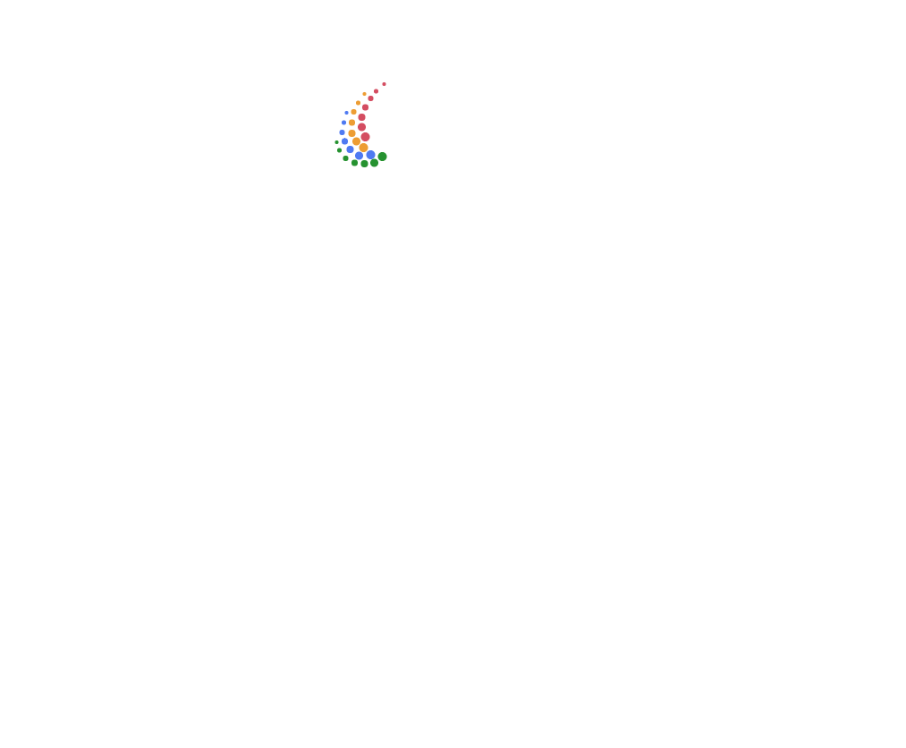
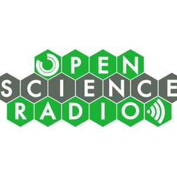
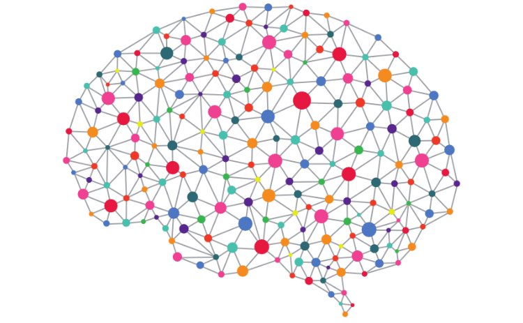
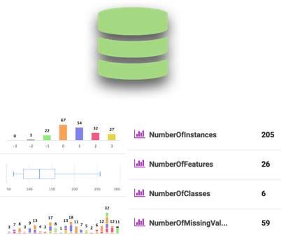
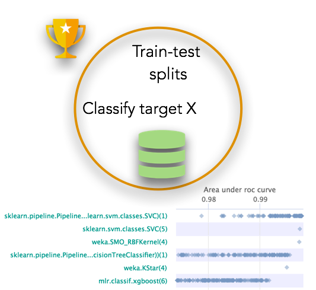
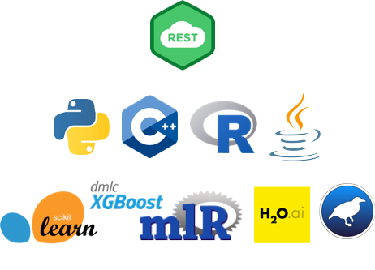
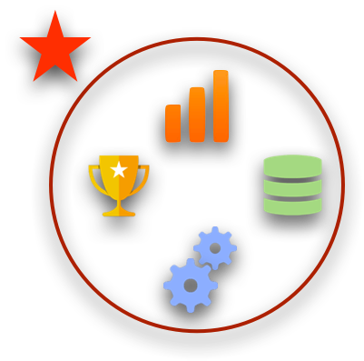

OpenML

OpenML
beta_2
Machine learning, better, together

[ 20252data sets](https://www.openml.org/search?type=data)

Find or add [data](https://www.openml.org/search?type=data) to analyse

[ 68314tasks](https://www.openml.org/search?type=task)
Download or create scientific [tasks](https://www.openml.org/search?type=task)

[ 6588flows](https://www.openml.org/search?type=flow)
Find or add data analysis [flows](https://www.openml.org/search?type=flow)

[ 9743738runs](https://www.openml.org/search?type=run)

Upload and explore all [results](https://www.openml.org/search?type=run) online.

 

#### OpenML on Open Science Radio

[Check out the podcast.](http://www.openscienceradio.de/2016/10/28/osr059-openml-en/)

1.

2.

3.

# Democratizing Machine Learning

As machine learning is enhancing our ability to understand nature and build a better future, it is crucial that we make it transparent and easily accessible to everyone in research, education and industry. The Open Machine Learning project is an inclusive movement to build an open, organized, online ecosystem for machine learning. We build [open source tools](https://docs.openml.org/APIs/) to discover (and share) [open data from any domain](https://www.openml.org/search?type=data), easily draw them into your [favourite machine learning environments](https://docs.openml.org/sklearn/), quickly build models alongside (and together with) thousands of other data scientists, analyse your results against the state of the art, and even get automatic advice on how to build better models. Stand on the shoulders of giants and make the world a better place.

 [** Watch the 1-minute introduction.](https://www.youtube.com/embed/1N3qATxXrpE)

 [Sign me up!](https://www.openml.org/register)

Signing up is free and brings you lots of powerful features.
All public data is always openly available.

## Machine learning ** Open science

Identifying the most appropriate machine learning techniques and using them optimally can be challenging for the best of us. OpenML is a place where you can share interesting datasets with the people who love to analyse data, and build the best solutions together, saving you valuable time, increasing your visibility, and speeding up discovery. OpenML links data to algorithms and people, so you can build on the state of the art and learn to teach machines to learn better.

 [Learn more](https://docs.openml.org/)

 

 

## It starts with data

Upload your datasets, or link them from existing repositories. OpenML automatically versions and analyses each dataset and annotates it with rich meta-data to streamline analysis. Easily search thousands of datasets and import them directly into your code or toolboxes, or quickly find similar datasets together with the best machine learning approaches.

 [Learn more](https://docs.openml.org/)

## ... and **why** you want to analyze it

Tell people which learning problem you want to solve (e.g., classify observations) by creating *tasks* describing your goals. This allows meaningful collaboration, easy benchmarking or different methods, and direct comparison to the state of the art. OpenML tasks are machine-readable, allowing tools to automatically get the data and train and evaluate models, so that you can focus on the science.

 [Learn more](https://docs.openml.org/)

 

 

## Code Integrations

OpenML integrates seamlessly into existing data science environments, so you can readily use it. With a few lines of code or a few clicks, you can import datasets, build algorithms locally, upload models, and (at any time) download your and other people's workflows, models and evaluations for reuse and further analysis.

OpenML is directly integrated into the most popular machine learning tools, but you can also build your own integrations with the Python, R, Java, and C++ APIs, or program against the REST API.

 [OpenML APIs >](https://docs.openml.org/APIs/)
 [OpenML integrations >](https://docs.openml.org/sklearn/)

## Reproducible, reusable, transparent research

The OpenML integrations make sure that all uploaded results are linked to the exact (versions) of datasets, workflows, software, and the people involved. We generate predictions locally using exact procedures, and evaluate them server-side so that results are directly comparable and reusable in further work. Wherever possible, we extract clear descriptions of machine learning workflows and models.

 [Learn more](https://docs.openml.org/)

 