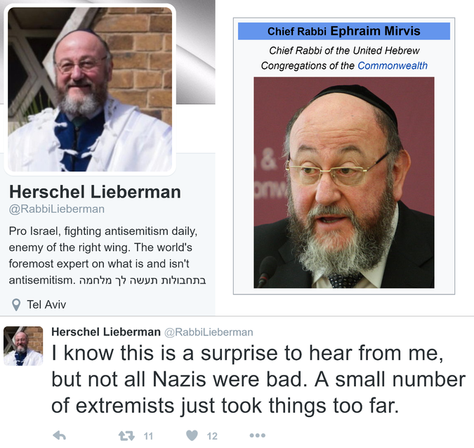
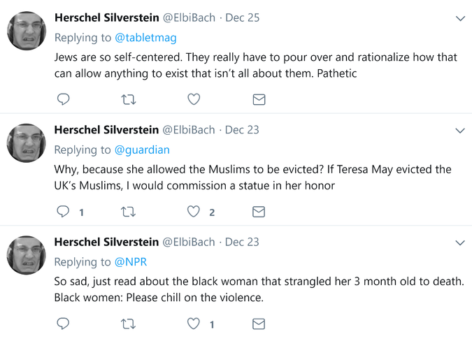

Opinion | Confessions of a Digital Nazi Hunter

###   [Opinion](https://www.nytimes.com/pages/opinion/index.html)  |  Op-Ed Contributor

# Confessions of a Digital Nazi Hunter

By YAIR ROSENBERGDEC. 27, 2017

[Continue reading the main story](https://www.nytimes.com/2017/12/27/opinion/digital-nazi-hunter-trump.html#story-continues-1)Share This Page

- [**Share](#)
- [**Tweet](#)
- [**Email](#)
- [**More](#)
- [**Save](#)

 Photo
 
**

   Credit Bryan Thomas for The New York Times

Like many Jewish journalists who reported on Donald Trump’s presidential campaign, I spent the 2016 election being harassed by a motley crew of internet racists who coalesced around the future president. They sent me threats, photoshopped me into gas chambers and hurled an uncreative array of anti-Semitic slurs my way. A study by the Anti-Defamation League found that I’d received the second-most abuse of any Jewish journalist on Twitter during the campaign cycle. My parents didn’t raise me to be No. 2; fortunately, there’s always 2020.

As a result, I’ve become something of an unintentional expert on alt-right trolls and their tactics. For the most part, these characters are largely laughable — sad, angry men hiding behind images of cartoon frogs, deathly afraid that their employers will uncover their online antics. But there are also more insidious individuals, whose digital skulduggery can be more consequential than the occasional bigoted bromide.

And so last November, in the wake of Trump’s victory, I decided to turn the tables on them. My target? Impersonator trolls.

You probably haven’t heard of these trolls, but that is precisely why they are so pernicious. These bigots are not content to harass Jews and other minorities on Twitter; they seek to assume their identities and then defame them.

The con goes like this: The impersonator lifts an online photo of a Jew, Muslim, African-American or other minority — typically one with clear identifying markers, like a yarmulke-clad Hasid or a woman in hijab. Using that picture as a Twitter avatar, the bigot then adds ethnic and progressive descriptors to the bio: “Jewish,” “Zionist,” “Muslim,” “enemy of the alt-right.”

 Photo
 
**

 An impersonator troll creates a fake account (left, bottom) appropriating the image of Ephraim Mirvis (right), Chief Rabbi of the United Kingdom.

False identity forged, the trolls then insert themselves into conversations with high-profile Twitter users — conversations that are often seen by tens of thousands of followers — and proceed to say horrifically racist things.

 [Continue reading the main story](https://www.nytimes.com/2017/12/27/opinion/digital-nazi-hunter-trump.html#story-continues-2)

## **Recent Comments

## Daniel12

15 minutes ago

The policing of language on the internet and what is the proper use of language for a human being in modern society, what is right speech...

## John Brews✅✅

35 minutes ago

This tale is most illuminating. The Impostor Buster is busted by Twitter, not because they have great awareness of what is happening, but...

## badman

35 minutes ago

In the early days of my career in engineering I remember students using ARPANET to exchange information with local universities and beyond....

- See All Comments
- Write a comment

Advertisement

[Continue reading the main story](https://www.nytimes.com/2017/12/27/opinion/digital-nazi-hunter-trump.html#story-continues-3)

In this manner, unsuspecting readers glancing through their feed are given the impression that someone who looks like, say, a religious Jew or Muslim is outlandishly bigoted. Thus, an entire community is defamed.

 Photo
 
**

 An impersonator troll offers racist responses to stories tweeted by several major publications.

This deception is relatively simple, but it is disturbingly effective. Most casual users aren’t likely to reverse image-search a troll’s avatar to see if it was stolen from someone else or peruse the account’s other tweets and realize that it only shares racist material. Twitter lacks the cultural competency to police such impersonators, even if it were interested in doing so.

So I set out to unmask them.

I asked my own Twitter followers whether it might be possible to create a bot that would reply to these impostors and expose their true nature to any users they tried to fool. Neal Chandra, a talented developer in San Francisco whom I’ve never met, replied, “I can try to throw something together this evening.” And so, after a week of testing, Impostor Buster was born.

## Newsletter Sign Up

 [Continue reading the main story](https://www.nytimes.com/2017/12/27/opinion/digital-nazi-hunter-trump.html#continues-post-newsletter)

### Sign Up for the Opinion Today Newsletter

Every weekday, get thought-provoking commentary from Op-Ed columnists, the Times editorial board and contributing writers from around the world.

 You agree to receive occasional updates and special offers for The New York Times's products and services.

I'm not a robot

reCAPTCHA

[Privacy](https://www.google.com/intl/en/policies/privacy/) - [Terms](https://www.google.com/intl/en/policies/terms/)

- [See Sample](http://www.nytimes.com/newsletters/sample/opinion-today?pgtype=subscriptionspage&version=new&contentId=TY&eventName=sample&module=newsletter-sign-up)

- [Manage Email Preferences](https://www.nytimes.com/mem/email.html)

- [Privacy Policy](https://www.nytimes.com/privacy)

- Opt out or [contact us](https://www.nytimes.com/help/index.html) anytime

Using a crowdsourced database of impersonator accounts, carefully curated by us to avoid any false positives, the bot patrolled Twitter and interjected whenever impostors tried to insinuate themselves into a discussion. Within days, our golem for the digital age had become a runaway success, garnering thousands of followers and numerous press write-ups. Most important, we received countless thank-yous from alerted would-be victims.

The impersonator trolls seethed. Some tried changing their user names to evade the bot (it didn’t work). Others simply reverted to their openly neo-Nazi personas. A few even tried to impersonate the bot, which was vastly preferable from our perspective and rather amusing.

Then the problems began — but not from where you might expect. The Nazis realized they couldn’t beat the bot, so they started mass-reporting it to Twitter for “harassment.” Just as they duplicitously cast themselves as minorities, they disingenuously recast our response to their ongoing abuse as harassment.

Twitter sided with the Nazis.

In April, the service suspended Impostor Buster without explanation and reinstated it only after being contacted by the ADL’s cyber-hate team. Over the next few months, we fine-tuned the bot to reduce its tweets and avoid tripping any of Twitter’s alarms. As the trolls continued to report the bot to no avail, we thought the problem was resolved. But we were wrong.

This month, Twitter suspended the bot again, and this time refused to revive it. The company’s justifications were both entirely accurate and utterly absurd. “A large number of people have blocked you in response to high volumes of untargeted, unsolicited, or duplicative content or engagements from your account,” we were informed. This was true; Impostor Buster had been blocked by many neo-Nazis. “A large number of spam complaints have been filed against you.” Yes, by neo-Nazis. “You send large numbers of unsolicited replies or mentions.” Yes, to neo-Nazis.

The real threat, apparently, was not these trolls — who today continue to roam the platform unchallenged — but our effort to combat them.

The great irony of this whole affair is that Impostor Buster was doing Twitter’s job for it. The platform has been notoriously prone to abuse since its inception and has struggled to curb it. Rather than asking Twitter to provide a top-down solution, however, we created a bottom-up one. We used Twitter’s tools to police itself — until Twitter fired the sheriff. If the platform is going to rescue itself from the trolls, it will need to foster these efforts, not fight them.

Given the terabytes of data uploaded daily to platforms like Facebook, YouTube, Twitter and Instagram, it is simply unfeasible to expect them to effectively regulate their content. It is also unwise, because we should not trust giant corporations governed by profit motives rather than the public interest to decide what we can and cannot say on the internet.

But perhaps more important, the top-down approach is wrong because it assumes that the problem of bigotry and abuse is something we can simply sweep under the rug through better censorship, rather than by building a better online community that actively sidelines bigots and abusers through self-policing and collective norms. Ultimately, the only way to fix social media is through nurturing a healthier culture below, not imposing diktats from above. The vast majority of users are not racists and can be mobilized through communal projects like Impostor Buster — a bot built by two people on different coasts using a database compiled by users around the world — to marginalize those who are.

The problem with Twitter, in other words, wasn’t too much Impostor Buster. It was too little. The sooner companies like Twitter understand this, the better off we’ll be.

Yair Rosenberg ([@Yair_Rosenberg](https://twitter.com/Yair_Rosenberg)) is a senior writer at Tablet Magazine.

*Follow The New York Times Opinion section on [Facebook](https://www.facebook.com/nytopinion) and [Twitter (@NYTopinion)](http://twitter.com/NYTOpinion), and sign up for the [Opinion Today newsletter](http://www.nytimes.com/newsletters/opiniontoday/).

*

 [Continue reading the main story](https://www.nytimes.com/2017/12/27/opinion/digital-nazi-hunter-trump.html#whats-next)