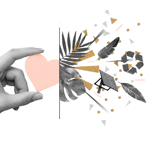
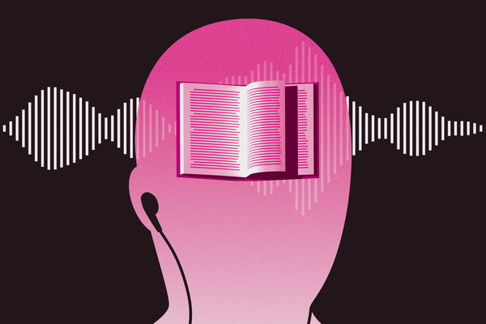
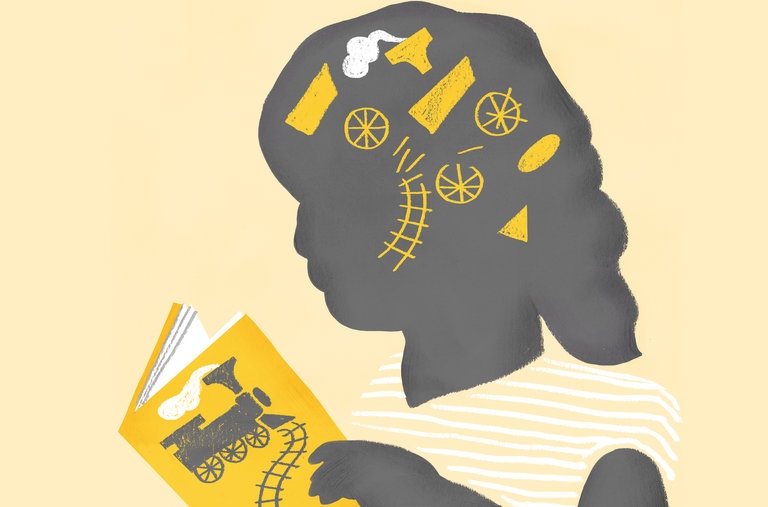

Opinion | The High Price of Multitasking

[Opinion](https://www.nytimes.com/pages/opinion/index.html)

# The High Price of MultitaskingThe High Price of Multitasking

We all do it. The question is how.
By Daniel T. Willingham
Mr. Willingham is a psychologist at the University of Virginia.

- July 14, 2019

-

    - 
    - 
    - 

    -
    -
    -

Image

CreditCreditPeter Arkle

[阅读简体中文版•](https://cn.nytimes.com/opinion/20190715/multitasking-brain/)[閱讀繁體中文版](https://cn.nytimes.com/opinion/20190715/multitasking-brain/zh-hant/)

Not only do smartphones provide unprecedented access to information, they provide unprecedented opportunities to multitask. Any activity can be accompanied by music, selfies or social media updates. Of course, some people pick poor times to tweet or text, and lawmakers have stepped in. [Forty-eight states](http://www.ncsl.org/research/transportation/cellular-phone-use-and-texting-while-driving-laws.aspx) have banned texting while driving. In Honolulu, [it’s illegal](https://www.nytimes.com/2017/10/23/business/honolulu-walking-and-texting-fine.html?module=inline) to text or even look at your phone while crossing the street, and in the Netherlands they’ve [banned texting while biking](https://nltimes.nl/2019/07/01/texting-biking-illegal-nl-today).

But legislation won’t proscribe all situations in which multitasking is unwise; you need to self-regulate. Understanding how the brain multitasks and why we find multitasking so appealing will help you gauge the hazard of pulling out your phone.

Multitasking feels like doing two things simultaneously, so it seems the danger lies in asking one mental process to do two incompatible things — for texting drivers, watching the screen and the road. A lot of lawmakers must think that way, because [20 states have instituted](http://www.ncsl.org/research/transportation/cellular-phone-use-and-texting-while-driving-laws.aspx)[bans](http://www.ncsl.org/research/transportation/cellular-phone-use-and-texting-while-driving-laws.aspx) on driving using a hand-held phone while still allowing hands-free calls. Yet hands-free or hand-held makes no difference — they [impair driving equivalently](https://journals.sagepub.com/doi/10.1518/001872006776412135) as far as external hazards go. Why?

You actually manipulate your phone only briefly for voice calls. The real problem is the toggling of attention between the conversation and the road. Even simple tasks can’t be done simultaneously; you switch between them, and that affects performance.

## Sign up for David Leonhardt's newsletter

David Leonhardt helps you make sense of the news — and offers reading suggestions from around the web — with commentary every weekday morning.

In a [classic experiment](https://psycnet.apa.org/fulltext/1995-31890-001.html), subjects viewed a digit-letter pair: for example, “C7.” A signal instructed people to classify the letter as a vowel or nonvowel or the digit as odd or even. After the response, a new stimulus and a new signal appeared. When the classification task switched, people responded about 20 percent slower than when it was repeated, because switching requires extra steps: resetting your goal (“ignore digit, attend to letter”) and reloading the mental rule (“judge it as vowel or consonant.”)

The cost of shuffling goals and mental rules is harmless if there’s predictable downtime during one or both tasks. As a conference call turns to an agenda item irrelevant to you, go ahead and answer email. Multitasking while driving is so dangerous because driving requires all of your attention at unpredictable times. People sense this, and when on the phone they [drive slower](https://www.sciencedirect.com/science/article/pii/S0001457517300453) and [increase their following distance](https://www.sciencedirect.com/science/article/pii/S0001457515001773), but they are far too confident that these measures mitigate risk. [Fifty-nine percent of adults](https://reader.elsevier.com/reader/sd/pii/S0001457519301617?token=6D63A4B89D18BDFC568874FDD14AEF17B0ACBCA935F6DCE8C1F843EED93D0B419E271492C128A2DCE53DBDE208FC5C7D), young and old, admit to using their phones while driving.

This overconfidence extends to other activities. A [2015 survey](https://www.commonsensemedia.org/sites/default/files/uploads/research/census_researchreport.pdf) showed that a majority of students who use social media, text or watch TV while studying think that they can still comprehend the material they’re studying.

This confidence is especially understandable for very simple tasks. Everyone knows texting behind the wheel is dangerous, but [listening to music](https://www.taylorfrancis.com/books/9781315578170) or [chatting with a passenger](https://www.ncbi.nlm.nih.gov/pubmed/29351023) seems so undemanding as to be innocuous. Yet both measurably compromise driving. If that’s surprising, consider whether you’ve ever turned down the radio or shushed passengers when the road turned icy or when you were looking for an address.

Even walking, which feels like something we do on autopilot, is not immune. Experiments in virtual environments show that pedestrians are [more likely to be hit by a vehicle](https://www.ncbi.nlm.nih.gov/pubmed/22269509) when crossing the street if they are listening to music.

## Editors’ Picks

[  ### Triceratops Skull, 65 Million Years Old, Unearthed by College Student, 23](https://www.nytimes.com/2019/07/26/science/triceratops-skull-65-million-years-old.html?fallback=0&recId=1OsnakSKiOQQMenZgG6uPGTOWZA&locked=0&geoContinent=EU&geoRegion=CMD&recAlloc=story&geoCountry=GB&blockId=home-featured&imp_id=973264363&action=click&module=editorContent&pgtype=Article&region=CompanionColumn&contentCollection=Trending)

[  ### The Bralette Is Back. This Time Blouses Are Optional.](https://www.nytimes.com/2019/07/31/fashion/bralettes-bras-no-underwire.html?fallback=0&recId=1OsnakSKiOQQMenZgG6uPGTOWZA&locked=0&geoContinent=EU&geoRegion=CMD&recAlloc=story&geoCountry=GB&blockId=home-featured&imp_id=405584682&action=click&module=editorContent&pgtype=Article&region=CompanionColumn&contentCollection=Trending)

[  ### Are You Rich? This Income-Rank Quiz Might Change How You See Yourself](https://www.nytimes.com/interactive/2019/08/01/upshot/are-you-rich.html?fallback=0&recId=1OsnakSKiOQQMenZgG6uPGTOWZA&locked=0&geoContinent=EU&geoRegion=CMD&recAlloc=story&geoCountry=GB&blockId=home-featured&imp_id=840865407&action=click&module=editorContent&pgtype=Article&region=CompanionColumn&contentCollection=Trending)

 [](https://adclick.g.doubleclick.net/pcs/click?xai=AKAOjstmFATH1ugDV5zhhb6DZD32OuXdjOuxGUF3umjE1dzUQXcemDOEOBHn3x8nVQ2DwrxYCJkwm-YxEhjh2qeQJQs7qRQBngLikcVehlYkF20pn3yFq8VRIj8Z9ONUYer8AM9b9CHcuEv51s4y3GAo68KnaGrc671u0Up7L55iEUR40kihYrYhoPYKxeGJaxu4RGZfer1HnUVQfedoh3DTwm8T_pxmeU19n1Cmd4zce5axlQOao1Q7DvN90ZDI2z7WwpJMtw&sig=Cg0ArKJSzFyGW2szO8y2EAE&urlfix=1&adurl=https://www.nytimes.com/paidpost/ubs/are-you-investing-in-what-matters-to-you.html%3Fcpv_ap_id%3D50021977%26sr_source%3Dlift_ed%26tbs_nyt%3D2019-june-nytnative_ed)

 [ PAID POST: UBS](https://adclick.g.doubleclick.net/pcs/click?xai=AKAOjstmFATH1ugDV5zhhb6DZD32OuXdjOuxGUF3umjE1dzUQXcemDOEOBHn3x8nVQ2DwrxYCJkwm-YxEhjh2qeQJQs7qRQBngLikcVehlYkF20pn3yFq8VRIj8Z9ONUYer8AM9b9CHcuEv51s4y3GAo68KnaGrc671u0Up7L55iEUR40kihYrYhoPYKxeGJaxu4RGZfer1HnUVQfedoh3DTwm8T_pxmeU19n1Cmd4zce5axlQOao1Q7DvN90ZDI2z7WwpJMtw&sig=Cg0ArKJSzFyGW2szO8y2EAE&urlfix=1&adurl=https://www.nytimes.com/paidpost/ubs/are-you-investing-in-what-matters-to-you.html%3Fcpv_ap_id%3D50021977%26sr_source%3Dlift_ed%26tbs_nyt%3D2019-june-nytnative_ed)[ Take Our Quiz to Unpack Sustainable Investing](https://adclick.g.doubleclick.net/pcs/click?xai=AKAOjstmFATH1ugDV5zhhb6DZD32OuXdjOuxGUF3umjE1dzUQXcemDOEOBHn3x8nVQ2DwrxYCJkwm-YxEhjh2qeQJQs7qRQBngLikcVehlYkF20pn3yFq8VRIj8Z9ONUYer8AM9b9CHcuEv51s4y3GAo68KnaGrc671u0Up7L55iEUR40kihYrYhoPYKxeGJaxu4RGZfer1HnUVQfedoh3DTwm8T_pxmeU19n1Cmd4zce5axlQOao1Q7DvN90ZDI2z7WwpJMtw&sig=Cg0ArKJSzFyGW2szO8y2EAE&urlfix=1&adurl=https://www.nytimes.com/paidpost/ubs/are-you-investing-in-what-matters-to-you.html%3Fcpv_ap_id%3D50021977%26sr_source%3Dlift_ed%26tbs_nyt%3D2019-june-nytnative_ed)

But people don’t multitask solely because they see no harm in it; they perceive benefits. They [say](https://onlinelibrary.wiley.com/doi/abs/10.1111/j.1460-2466.2012.01641.x) they multitask for efficiency, to fight boredom or to keep up with social media.

Music, likely the most common variety of multitasking, is added to tasks because it [heightens arousal](https://www.sciencedirect.com/science/article/pii/S136984781300079X) (for example, your heart rate increases), making it easier to stick with a long drive or a tedious textbook. Music was once common on factory assembly lines; the British Broadcasting Corporation offered a radio program for this purpose, “[Music While You Work](https://www.bbc.co.uk/programmes/p02sp2jn),” from 1940 until 1967.

Thus, even if you fully appreciate the cognitive cost, you might tolerate it in exchange for the emotional lift. Parents disapprove when their child studies with deadmau5 blasting because they compare that with studying in silence. But the child calculates that without the music, he wouldn’t study.

This trade-off of cognition and emotion suggests a few principles to better manage your multitasking.

First, hoping for efficiency by combining two pure productivity tasks — say, composing a letter while following a presentation — is folly. That’s all cognitive cost and no emotional benefit.

Second, be realistic about what poor task performance (when driving, for example, or operating machinery) might mean, given that you’re not as good at multitasking as you believe. If you’re not ready to eliminate secondary tasks, at least be ready to ditch them in the moment. I don’t expect music to disappear from cars, but consider hitting mute if traffic gets dense or road conditions worsen.

Third, see if you can get the emotional lift without the cognitive cost. Instead of multitasking, take more rest breaks, and get your social media fix during a break.

People will choose to multitask. But we should, at the very least, be fully aware of how that choice affects us and the potential consequences for ourselves and others. We need to pay attention to how much — or how little — we are paying attention.

More From Daniel Willingham on the Cognitive Science Behind Everyday Life

[ Opinion | Daniel T. Willingham  Is Listening to a Book the Same Thing as Reading It? Dec. 8, 2018  ](https://www.nytimes.com/2018/12/08/opinion/sunday/audiobooks-reading-cheating-listening.html?action=click&module=RelatedLinks&pgtype=Article)

[ Opinion | Daniel T. Willingham  Are You a Visual or an Auditory Learner? It Doesn’t Matter Oct. 4, 2018  ](https://www.nytimes.com/2018/10/04/opinion/sunday/visual-learner-auditory-school-education.html?action=click&module=RelatedLinks&pgtype=Article)

[ Opinion | Daniel T. Willingham  How to Get Your Mind to Read Nov. 25, 2017  ](https://www.nytimes.com/2017/11/25/opinion/sunday/how-to-get-your-mind-to-read.html?action=click&module=RelatedLinks&pgtype=Article)

[ Opinion | Daniel T. Willingham  You Still Need Your Brain May 19, 2017  ](https://www.nytimes.com/2017/05/19/opinion/sunday/you-still-need-your-brain.html?action=click&module=RelatedLinks&pgtype=Article)

Daniel T. Willingham ([@DTWillingham](https://twitter.com/DTWillingham?ref_src=twsrc%5Egoogle%7Ctwcamp%5Eserp%7Ctwgr%5Eauthor)) is a professor of psychology at the University of Virginia and the author, most recently, of “The Reading Mind: A Cognitive Approach to Understanding How the Mind Reads.”

*The Times is committed to publishing *[*a diversity of letters*](https://www.nytimes.com/2019/01/31/opinion/letters/letters-to-editor-new-york-times-women.html)* to the editor. We’d like to hear what you think about this or any of our articles. Here are some *[*tips*](https://help.nytimes.com/hc/en-us/articles/115014925288-How-to-submit-a-letter-to-the-editor)*. And here’s our email: *[*letters@nytimes.com*](https://www.nytimes.com/2019/07/14/opinion/multitasking-brain.htmlmailto:letters@nytimes.com)*.*

*Follow The New York Times Opinion section on *[*Facebook*](https://www.facebook.com/nytopinion)*, *[*Twitter (@NYTopinion)*](http://twitter.com/NYTOpinion)* and *[*Instagram*](https://www.instagram.com/nytopinion/)*.*

A version of this article appears in print on July 15, 2019, Section A, Page 21 of the New York edition with the headline: The High Price of Multitasking. [Order Reprints](http://www.nytreprints.com/) | [Today’s Paper](http://www.nytimes.com/pages/todayspaper/index.html) | [Subscribe](https://www.nytimes.com/subscriptions/Multiproduct/lp8HYKU.html?campaignId=48JQY)

- 
- 
- 

-

## [More in Opinion](https://www.nytimes.com/section/opinion?action=click&module=MoreInSection&pgtype=Article&region=Footer&contentCollection=Opinion)

[   Illustration by Katrien De Blauwer, photographs by C.M. Bell and Joseph John Kirkbride, via Library of Congress Prints and Photographs Division Washington, D.C.](https://www.nytimes.com/2019/08/02/opinion/sunday/nuns-slavery.html?action=click&module=MoreInSection&pgtype=Article&region=Footer&contentCollection=Opinion)

[## Rachel L. Swarns](https://www.nytimes.com/2019/08/02/opinion/sunday/nuns-slavery.html?action=click&module=MoreInSection&pgtype=Article&region=Footer&contentCollection=Opinion)[## The Nuns Who Bought and Sold Human Beings](https://www.nytimes.com/2019/08/02/opinion/sunday/nuns-slavery.html?action=click&module=MoreInSection&pgtype=Article&region=Footer&contentCollection=Opinion)9h ago

[## Alexandra Horowitz](https://www.nytimes.com/2019/08/02/opinion/sunday/talking-dog.html?action=click&module=MoreInSection&pgtype=Article&region=Footer&contentCollection=Opinion)[## Things People Say to Their Dogs](https://www.nytimes.com/2019/08/02/opinion/sunday/talking-dog.html?action=click&module=MoreInSection&pgtype=Article&region=Footer&contentCollection=Opinion)1h ago

[   Maddie McGarvey for The New York Times](https://www.nytimes.com/2019/08/01/opinion/debate-marianne-williamson.html?action=click&module=MoreInSection&pgtype=Article&region=Footer&contentCollection=Opinion)

[## David Brooks](https://www.nytimes.com/2019/08/01/opinion/debate-marianne-williamson.html?action=click&module=MoreInSection&pgtype=Article&region=Footer&contentCollection=Opinion)[## Marianne Williamson Knows How to Beat Trump](https://www.nytimes.com/2019/08/01/opinion/debate-marianne-williamson.html?action=click&module=MoreInSection&pgtype=Article&region=Footer&contentCollection=Opinion)Aug. 1

[   Christopher Lee for The New York Times](https://www.nytimes.com/2019/08/01/opinion/trump-economy.html?action=click&module=MoreInSection&pgtype=Article&region=Footer&contentCollection=Opinion)

[## Paul Krugman](https://www.nytimes.com/2019/08/01/opinion/trump-economy.html?action=click&module=MoreInSection&pgtype=Article&region=Footer&contentCollection=Opinion)[## Why Was Trumponomics a Flop?](https://www.nytimes.com/2019/08/01/opinion/trump-economy.html?action=click&module=MoreInSection&pgtype=Article&region=Footer&contentCollection=Opinion)Aug. 1

[   Erin Schaff/The New York Times](https://www.nytimes.com/2019/08/02/opinion/democrats-health-care.html?action=click&module=MoreInSection&pgtype=Article&region=Footer&contentCollection=Opinion)

[## Ezekiel J. Emanuel](https://www.nytimes.com/2019/08/02/opinion/democrats-health-care.html?action=click&module=MoreInSection&pgtype=Article&region=Footer&contentCollection=Opinion)[## Democrats Are Having the Wrong Health Care Debate](https://www.nytimes.com/2019/08/02/opinion/democrats-health-care.html?action=click&module=MoreInSection&pgtype=Article&region=Footer&contentCollection=Opinion)9h ago

## Editors’ Picks

[   George Etheredge for The New York Times](https://www.nytimes.com/2019/07/31/business/elizabeth-taylor-rolls-royce-auction.html?fallback=0&recId=1OsnpxUvWtNndD9b3Zu2mL3bIl0&locked=0&geoContinent=EU&geoRegion=CMD&recAlloc=story&geoCountry=GB&blockId=home-featured&imp_id=904268885&action=click&module=editorsPicks&pgtype=Article&region=Footer)

[## Elizabeth Taylor’s ‘Green Goddess’ Rolls-Royce on the Auction Block](https://www.nytimes.com/2019/07/31/business/elizabeth-taylor-rolls-royce-auction.html?fallback=0&recId=1OsnpxUvWtNndD9b3Zu2mL3bIl0&locked=0&geoContinent=EU&geoRegion=CMD&recAlloc=story&geoCountry=GB&blockId=home-featured&imp_id=904268885&action=click&module=editorsPicks&pgtype=Article&region=Footer)July 31

[   Chang W. Lee/The New York Times](https://www.nytimes.com/2019/08/01/nyregion/helicopter-nyc-airports-hamptons.html?fallback=0&recId=1OsnpxUvWtNndD9b3Zu2mL3bIl0&locked=0&geoContinent=EU&geoRegion=CMD&recAlloc=story&geoCountry=GB&blockId=home-featured&imp_id=243084280&action=click&module=editorsPicks&pgtype=Article&region=Footer)

[## That Noise? It’s the 1%, Helicoptering Over Your Traffic Jam](https://www.nytimes.com/2019/08/01/nyregion/helicopter-nyc-airports-hamptons.html?fallback=0&recId=1OsnpxUvWtNndD9b3Zu2mL3bIl0&locked=0&geoContinent=EU&geoRegion=CMD&recAlloc=story&geoCountry=GB&blockId=home-featured&imp_id=243084280&action=click&module=editorsPicks&pgtype=Article&region=Footer)Aug. 1

[   Ellen Weinstein](https://www.nytimes.com/2019/07/31/fashion/weddings/is-it-time-for-a-sleep-divorce.html?fallback=0&recId=1OsnpxUvWtNndD9b3Zu2mL3bIl0&locked=0&geoContinent=EU&geoRegion=CMD&recAlloc=story&geoCountry=GB&blockId=home-featured&imp_id=454500875&action=click&module=editorsPicks&pgtype=Article&region=Footer)

[## Is It Time for a Sleep Divorce?](https://www.nytimes.com/2019/07/31/fashion/weddings/is-it-time-for-a-sleep-divorce.html?fallback=0&recId=1OsnpxUvWtNndD9b3Zu2mL3bIl0&locked=0&geoContinent=EU&geoRegion=CMD&recAlloc=story&geoCountry=GB&blockId=home-featured&imp_id=454500875&action=click&module=editorsPicks&pgtype=Article&region=Footer)July 31

Most Popular

- [I Had to Know if He Was Seeing Someone Else](https://www.nytimes.com/2019/08/02/style/modern-love-breakup-obsession.html?fallback=0&recId=1Osnq2gn89uPbcpMEjcIHva63nz&locked=0&geoContinent=EU&geoRegion=CMD&recAlloc=top_conversion&geoCountry=GB&blockId=most-popular&imp_id=79812669&action=click&module=trending&pgtype=Article&region=Footer)
- [That Noise? It’s the 1%, Helicoptering Over Your Traffic Jam](https://www.nytimes.com/2019/08/01/nyregion/helicopter-nyc-airports-hamptons.html?fallback=0&recId=1Osnq2gn89uPbcpMEjcIHva63nz&locked=0&geoContinent=EU&geoRegion=CMD&recAlloc=top_conversion&geoCountry=GB&blockId=most-popular&imp_id=771361422&action=click&module=trending&pgtype=Article&region=Footer)
- [Will the Millennials Save Playboy?](https://www.nytimes.com/2019/08/02/business/woke-playboy-millennials.html?fallback=0&recId=1Osnq2gn89uPbcpMEjcIHva63nz&locked=0&geoContinent=EU&geoRegion=CMD&recAlloc=top_conversion&geoCountry=GB&blockId=most-popular&imp_id=417368261&action=click&module=trending&pgtype=Article&region=Footer)
- [Trump Drops Plans to Nominate John Ratcliffe as Director of National Intelligence](https://www.nytimes.com/2019/08/02/us/politics/trump-ratcliffe-dni.html?fallback=0&recId=1Osnq2gn89uPbcpMEjcIHva63nz&locked=0&geoContinent=EU&geoRegion=CMD&recAlloc=top_conversion&geoCountry=GB&blockId=most-popular&imp_id=873181395&action=click&module=trending&pgtype=Article&region=Footer)
- [Opinion: Marianne Williamson Knows How to Beat Trump](https://www.nytimes.com/2019/08/01/opinion/debate-marianne-williamson.html?fallback=0&recId=1Osnq2gn89uPbcpMEjcIHva63nz&locked=0&geoContinent=EU&geoRegion=CMD&recAlloc=top_conversion&geoCountry=GB&blockId=most-popular&imp_id=757637197&action=click&module=trending&pgtype=Article&region=Footer)
- [Only 8 Candidates Have Qualified for the Next Democratic Debate](https://www.nytimes.com/2019/08/01/us/politics/next-democratic-debate.html?fallback=0&recId=1Osnq2gn89uPbcpMEjcIHva63nz&locked=0&geoContinent=EU&geoRegion=CMD&recAlloc=top_conversion&geoCountry=GB&blockId=most-popular&imp_id=118502736&action=click&module=trending&pgtype=Article&region=Footer)
- [Opinion: Winners and Losers of the Democratic Debate, Night 2](https://www.nytimes.com/interactive/2019/08/01/opinion/debate-winners-losers.html?fallback=0&recId=1Osnq2gn89uPbcpMEjcIHva63nz&locked=0&geoContinent=EU&geoRegion=CMD&recAlloc=top_conversion&geoCountry=GB&blockId=most-popular&imp_id=936009667&action=click&module=trending&pgtype=Article&region=Footer)
- [Colorectal Cancer Rises Among Younger Adults](https://www.nytimes.com/2019/07/31/health/colon-cancer-young.html?fallback=0&recId=1Osnq2gn89uPbcpMEjcIHva63nz&locked=0&geoContinent=EU&geoRegion=CMD&recAlloc=top_conversion&geoCountry=GB&blockId=most-popular&imp_id=237348532&action=click&module=trending&pgtype=Article&region=Footer)
- [All of Those Products Are Making Your Skin Worse](https://www.nytimes.com/2019/07/30/style/all-of-those-products-are-making-your-skin-worse.html?fallback=0&recId=1Osnq2gn89uPbcpMEjcIHva63nz&locked=0&geoContinent=EU&geoRegion=CMD&recAlloc=top_conversion&geoCountry=GB&blockId=most-popular&imp_id=374723738&action=click&module=trending&pgtype=Article&region=Footer)
- [Are You Rich? This Income-Rank Quiz Might Change How You See Yourself](https://www.nytimes.com/interactive/2019/08/01/upshot/are-you-rich.html?fallback=0&recId=1Osnq2gn89uPbcpMEjcIHva63nz&locked=0&geoContinent=EU&geoRegion=CMD&recAlloc=top_conversion&geoCountry=GB&blockId=most-popular&imp_id=882277549&action=click&module=trending&pgtype=Article&region=Footer)

Advertisement