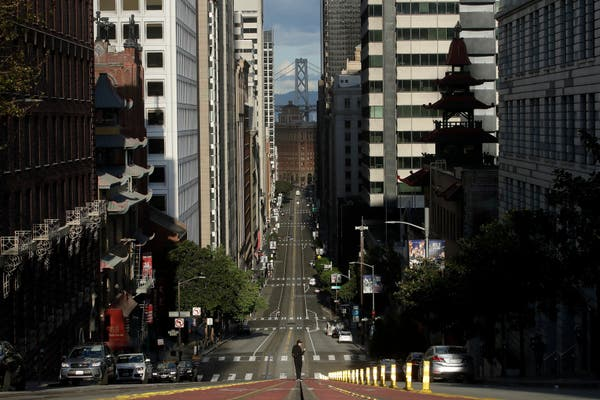
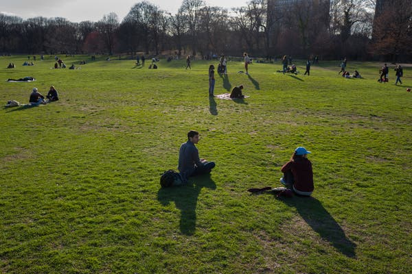
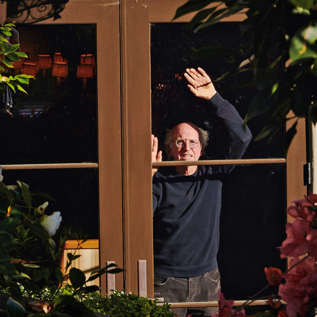
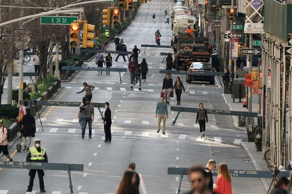
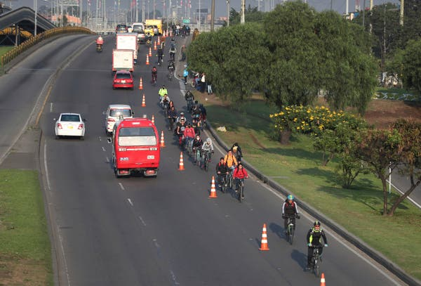
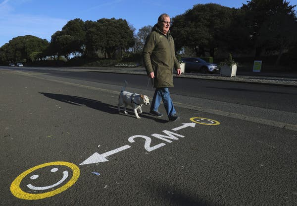
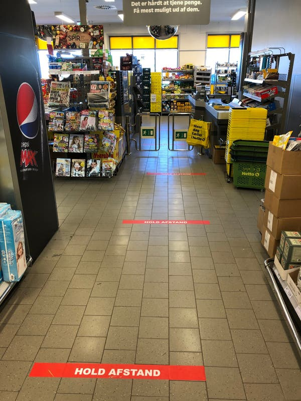
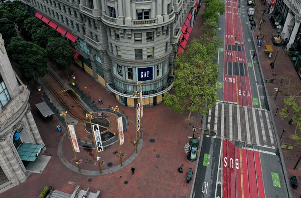
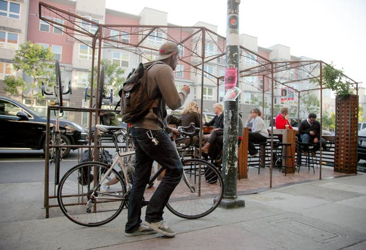
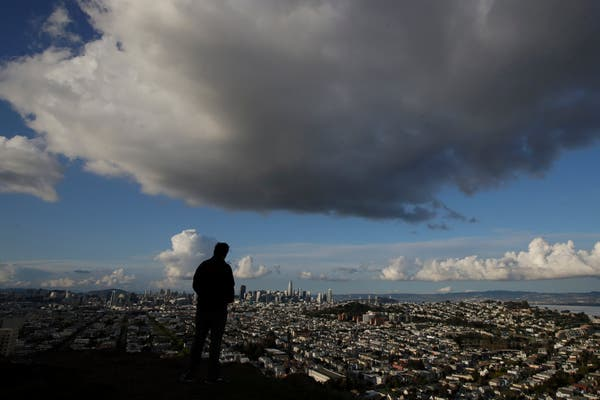

Opinion | The Magic of Empty Streets - The New York Times

Some 40 million Californians were under statewide stay-at-home order to help curb the spread of the coronavirus.Credit...Jeff Chiu/Associated Press

[Skip to content](https://www.nytimes.com/2020/04/08/opinion/coronavirus-tips-new-york-san-francisco.html#site-content)[Skip to site index](https://www.nytimes.com/2020/04/08/opinion/coronavirus-tips-new-york-san-francisco.html#site-index)

[![](data:image/svg+xml,%3csvg xmlns='http://www.w3.org/2000/svg' class='' viewBox='0 0 184 25' fill='%23000'%3e%3cpath d='M13.8 2.9c0-2-1.9-2.5-3.4-2.5v.3c.9 0 1.6.3 1.6 1 0 .4-.3 1-1.2 1-.7 0-2.2-.4-3.3-.8C6.2 1.4 5 1 4 1 2 1 .6 2.5.6 4.2c0 1.5 1.1 2 1.5 2.2l.1-.2c-.2-.2-.5-.4-.5-1 0-.4.4-1.1 1.4-1.1.9 0 2.1.4 3.7.9 1.4.4 2.9.7 3.7.8v3.1L9 10.2v.1l1.5 1.3v4.3c-.8.5-1.7.6-2.5.6-1.5 0-2.8-.4-3.9-1.6l4.1-2V6l-5 2.2C3.6 6.9 4.7 6 5.8 5.4l-.1-.3c-3 .8-5.7 3.6-5.7 7 0 4 3.3 7 7 7 4 0 6.6-3.2 6.6-6.5h-.2c-.6 1.3-1.5 2.5-2.6 3.1v-4.1l1.6-1.3v-.1l-1.6-1.3V5.8c1.5 0 3-1 3-2.9zm-8.7 11l-1.2.6c-.7-.9-1.1-2.1-1.1-3.8 0-.7 0-1.5.2-2.1l2.1-.9v6.2zm10.6 2.3l-1.3 1 .2.2.6-.5 2.2 2 3-2-.1-.2-.8.5-1-1V9.4l.8-.6 1.7 1.4v6.1c0 3.8-.8 4.4-2.5 5v.3c2.8.1 5.4-.8 5.4-5.7V9.3l.9-.7-.2-.2-.8.6-2.5-2.1L18.5 9V.8h-.2l-3.5 2.4v.2c.4.2 1 .4 1 1.5l-.1 11.3zM34 15.1L31.5 17 29 15v-1.2l4.7-3.2v-.1l-2.4-3.6-5.2 2.8v6.6l-1 .8.2.2.9-.7 3.4 2.5 4.5-3.6-.1-.4zm-5-1.7V8.5l.2-.1 2.2 3.5-2.4 1.5zM53.1 2c0-.3-.1-.6-.2-.9h-.2c-.3.8-.7 1.2-1.7 1.2-.9 0-1.5-.5-1.9-.9l-2.9 3.3.2.2 1-.9c.6.5 1.1.9 2.5 1v8.3L44 3.2c-.5-.8-1.2-1.9-2.6-1.9-1.6 0-3 1.4-2.8 3.6h.3c.1-.6.4-1.3 1.1-1.3.5 0 1 .5 1.3 1v3.3c-1.8 0-3 .8-3 2.3 0 .8.4 2 1.6 2.3v-.2c-.2-.2-.3-.4-.3-.7 0-.5.4-.9 1.1-.9h.5v4.2c-2.1 0-3.8 1.2-3.8 3.2 0 1.9 1.6 2.8 3.4 2.7v-.2c-1.1-.1-1.6-.6-1.6-1.3 0-.9.6-1.3 1.4-1.3.8 0 1.5.5 2 1.1l2.9-3.2-.2-.2-.7.8c-1.1-1-1.7-1.3-3-1.5V5l8 14h.6V5c1.5-.1 2.9-1.3 2.9-3zm7.3 13.1L57.9 17l-2.5-2v-1.2l4.7-3.2v-.1l-2.4-3.6-5.2 2.8v6.6l-1 .8.2.2.9-.7 3.4 2.5 4.5-3.6-.1-.4zm-5-1.7V8.5l.2-.1 2.2 3.5-2.4 1.5zM76.7 8l-.7.5-1.9-1.6-2.2 2 .9.9v7.5l-2.4-1.5V9.6l.8-.5-2.3-2.2-2.2 2 .9.9V17l-.3.2-2.1-1.5v-6c0-1.4-.7-1.8-1.5-2.3-.7-.5-1.1-.8-1.1-1.5 0-.6.6-.9.9-1.1v-.2c-.8 0-2.9.8-2.9 2.7 0 1 .5 1.4 1 1.9s1 .9 1 1.8v5.8l-1.1.8.2.2 1-.8 2.3 2 2.5-1.7 2.8 1.7 5.3-3.1V9.2l1.3-1-.2-.2zm18.6-5.5l-1 .9-2.2-2-3.3 2.4V1.6h-.3l.1 16.2c-.3 0-1.2-.2-1.9-.4l-.2-13.5c0-1-.7-2.4-2.5-2.4s-3 1.4-3 2.8h.3c.1-.6.4-1.1 1-1.1s1.1.4 1.1 1.7v3.9c-1.8.1-2.9 1.1-2.9 2.4 0 .8.4 2 1.6 2V13c-.4-.2-.5-.5-.5-.7 0-.6.5-.8 1.3-.8h.4v6.2c-1.5.5-2.1 1.6-2.1 2.8 0 1.7 1.3 2.9 3.3 2.9 1.4 0 2.6-.2 3.8-.5 1-.2 2.3-.5 2.9-.5.8 0 1.1.4 1.1.9 0 .7-.3 1-.7 1.1v.2c1.6-.3 2.6-1.3 2.6-2.8s-1.5-2.4-3.1-2.4c-.8 0-2.5.3-3.7.5-1.4.3-2.8.5-3.2.5-.7 0-1.5-.3-1.5-1.3 0-.8.7-1.5 2.4-1.5.9 0 2 .1 3.1.4 1.2.3 2.3.6 3.3.6 1.5 0 2.8-.5 2.8-2.6V3.7l1.2-1-.2-.2zm-4.1 6.1c-.3.3-.7.6-1.2.6s-1-.3-1.2-.6V4.2l1-.7 1.4 1.3v3.8zm0 3c-.2-.2-.7-.5-1.2-.5s-1 .3-1.2.5V9c.2.2.7.5 1.2.5s1-.3 1.2-.5v2.6zm0 4.7c0 .8-.5 1.6-1.6 1.6h-.8V12c.2-.2.7-.5 1.2-.5s.9.3 1.2.5v4.3zm13.7-7.1l-3.2-2.3-4.9 2.8v6.5l-1 .8.1.2.8-.6 3.2 2.4 5-3V9.2zm-5.4 6.3V8.3l2.5 1.8v7.1l-2.5-1.7zm14.9-8.4h-.2c-.3.2-.6.4-.9.4-.4 0-.9-.2-1.1-.5h-.2l-1.7 1.9-1.7-1.9-3 2 .1.2.8-.5 1 1.1v6.3l-1.3 1 .2.2.6-.5 2.4 2 3.1-2.1-.1-.2-.9.5-1.2-1V9c.5.5 1.1 1 1.8 1 1.4.1 2.2-1.3 2.3-2.9zm12 9.6L123 19l-4.6-7 3.3-5.1h.2c.4.4 1 .8 1.7.8s1.2-.4 1.5-.8h.2c-.1 2-1.5 3.2-2.5 3.2s-1.5-.5-2.1-.8l-.3.5 5 7.4 1-.6v.1zm-11-.5l-1.3 1 .2.2.6-.5 2.2 2 3-2-.2-.2-.8.5-1-1V.8h-.1l-3.6 2.4v.2c.4.2 1 .3 1 1.5v11.3zM143 2.9c0-2-1.9-2.5-3.4-2.5v.3c.9 0 1.6.3 1.6 1 0 .4-.3 1-1.2 1-.7 0-2.2-.4-3.3-.8-1.3-.4-2.5-.8-3.5-.8-2 0-3.4 1.5-3.4 3.2 0 1.5 1.1 2 1.5 2.2l.1-.2c-.3-.2-.6-.4-.6-1 0-.4.4-1.1 1.4-1.1.9 0 2.1.4 3.7.9 1.4.4 2.9.7 3.7.8V9l-1.5 1.3v.1l1.5 1.3V16c-.8.5-1.7.6-2.5.6-1.5 0-2.8-.4-3.9-1.6l4.1-2V6l-5 2.2c.5-1.3 1.6-2.2 2.6-2.9l-.1-.2c-3 .8-5.7 3.5-5.7 6.9 0 4 3.3 7 7 7 4 0 6.6-3.2 6.6-6.5h-.2c-.6 1.3-1.5 2.5-2.6 3.1v-4.1l1.6-1.3v-.1L140 8.8v-3c1.5 0 3-1 3-2.9zm-8.7 11l-1.2.6c-.7-.9-1.1-2.1-1.1-3.8 0-.7.1-1.5.3-2.1l2.1-.9-.1 6.2zm12.2-12h-.1l-2 1.7v.1l1.7 1.9h.2l2-1.7v-.1l-1.8-1.9zm3 14.8l-.8.5-1-1V9.3l1-.7-.2-.2-.7.6-1.8-2.1-2.9 2 .2.3.7-.5.9 1.1v6.5l-1.3 1 .1.2.7-.5 2.2 2 3-2-.1-.3zm16.7-.1l-.7.5-1.1-1V9.3l1-.8-.2-.2-.8.7-2.3-2.1-3 2.1-2.3-2.1L154 9l-1.8-2.1-2.9 2 .1.3.7-.5 1 1.1v6.5l-.8.8 2.3 1.9 2.2-2-.9-.9V9.3l.9-.6 1.5 1.4v6l-.8.8 2.3 1.9 2.2-2-.9-.9V9.3l.8-.5 1.6 1.4v6l-.7.7 2.3 2.1 3.1-2.1v-.3zm8.7-1.5l-2.5 1.9-2.5-2v-1.2l4.7-3.2v-.1l-2.4-3.6-5.2 2.8v6.8l3.5 2.5 4.5-3.6-.1-.3zm-5-1.7V8.5l.2-.1 2.2 3.5-2.4 1.5zm14.1-.9l-1.9-1.5c1.3-1.1 1.8-2.6 1.8-3.6v-.6h-.2c-.2.5-.6 1-1.4 1-.8 0-1.3-.4-1.8-1L176 9.3v3.6l1.7 1.3c-1.7 1.5-2 2.5-2 3.3 0 1 .5 1.7 1.3 2l.1-.2c-.2-.2-.4-.3-.4-.8 0-.3.4-.8 1.2-.8 1 0 1.6.7 1.9 1l4.3-2.6v-3.6h-.1zm-1.1-3c-.7 1.2-2.2 2.4-3.1 3l-1.1-.9V8.1c.4 1 1.5 1.8 2.6 1.8.7 0 1.1-.1 1.6-.4zm-1.7 8c-.5-1.1-1.7-1.9-2.9-1.9-.3 0-1.1 0-1.9.5.5-.8 1.8-2.2 3.5-3.2l1.2 1 .1 3.6z'%3e%3c/path%3e%3c/svg%3e)](https://www.nytimes.com/)

[Opinion](https://www.nytimes.com/section/opinion)

# The Magic of Empty Streets

Social distancing gives us a rare chance to fix cities.

Some 40 million Californians were under statewide stay-at-home order to help curb the spread of the coronavirus.Credit...Jeff Chiu/Associated Press

By Allison Arieff
Contributing Opinion Writer

- April 8, 2020

-

    - 
    - 
    - 

    -
    -
    -

SAN FRANCISCO — We’re in week four of sheltering in place here (it feels like week 40). It’s a completely unfamiliar situation in so many ways. As someone who has lived in cities her whole adult life, for me it’s especially strange to experience a time when all the things I love are no longer available. Nearly everything is closed — restaurants and shops, libraries and museums, and of course all schools. All nonessential workers are under a mandatory work-from-home order.

But these efforts to stem the spread of the coronavirus have also offered us a rare experiment: We can see our cities for the first time without the choking traffic, dirty air and honking horns that have so often made them intolerable.

Throughout the world, the coronavirus has forced extreme changes in our behavior in just days. And we’re already seeing the impact of those changes: On Monday, for example, Los Angeles had the cleanest air of any major city in the world.

Image

Interstate 280, normally filled with traffic and noise, was astoundingly empty in late March.Credit...Justin Sullivan/Getty Images

As a die-hard urbanist, it’s heartening for me to see how many people are adapting, turning the city into a pedestrian paradise. Parks are populated to an extent I’ve never seen before (though some are too populated). Streets are crowded not with cars but with people — and accordingly, pedestrian fatalities (and subsequent emergency room visits) have plummeted.

Streets are also quieter. Skies are bluer than I’ve ever seen. I saw a dad in the park last week doing a Zoom meeting from a lawn chair while his kids played on the grass. People are saying hello, people are offering to help neighbors, people are rediscovering board games and puzzles, bread-baking and canning.

Image

Prospect Park in Brooklyn was dotted with groups enjoying the outdoor space and early spring weather on March 21.Credit...Jonah Markowitz for The New York Times

As bucolic as much of that sounds, it’s also laying bare the stark reality of income inequality; higher-income people are in a position to stay home while so many others are not. This is just one of the infinite truths that make Covid-19 so tragic.

Everything about Covid-19 is depressing and tragic. But it’s worth highlighting some clever MacGyvering that has been going on.

Architecture firms and other 3-D printing experts are repurposing fabrication labs, 3-D printers and other technology to make respirators, [face shields](https://www.linkedin.com/feed/update/urn:li:activity:6649476241038589952/) and masks. Countless crafts people have come together to[sew homemade masks](https://www.cnn.com/2020/03/24/us/sewing-groups-masks-coronavirus-wellness-trnd/index.html) for health care workers facing shortages.

Design is certainly not going to solve this crisis, but here are a few small interventions I’ve seen over the past few days that make a difference. Many of them are likely to become the new normal.

Staying six feet apart to meet social-distancing guidelines is nearly impossible on most sidewalks, which are typically only four feet wide. So some cities are warming up to the idea that they could temporarily close traffic lanes to accommodate pedestrians — a fix that requires only some road cones or other cheap, easily obtainable barriers.

Urban planners have long argued that more streets should close to make more livable spaces, but governments have always resisted, calling it impractical or impossible. They’ve just proved it can happen — and they should keep it going after the crisis.

If streets become so much safer, if air quality can change so much in just weeks, can we be more hopeful about our efforts to combat climate change?

## Editors’ Picks

[  ### Larry David, Master of His Quarantine](https://www.nytimes.com/2020/04/04/style/larry-david-curb-your-enthusiasm-coronavirus-psa.html?algo=als1_desk_filter&fellback=false&imp_id=710410616&imp_id=683045137&action=click&module=editorContent&pgtype=Article&region=CompanionColumn&contentCollection=Trending)

[  ### They All Retired Before They Hit 40. Then This Happened.](https://www.nytimes.com/2020/04/02/style/fire-movement-stock-market-coronavirus.html?algo=als1_desk_filter&fellback=false&imp_id=322796086&imp_id=371729766&action=click&module=editorContent&pgtype=Article&region=CompanionColumn&contentCollection=Trending)

[  ### A Renter Realizes He Can Do Better Than Manhattan. Which of These Homes Did He Choose?](https://www.nytimes.com/interactive/2020/04/02/realestate/02hunt-cullen.html?algo=als1_desk_filter&fellback=false&imp_id=165121531&imp_id=661064904&action=click&module=editorContent&pgtype=Article&region=CompanionColumn&contentCollection=Trending)

Image

Part of Park Avenue in Manhattan was closed to vehicle traffic on March 27 to give pedestrians more outdoor space — and spacing.Credit...Carlo Allegri/Reuters

Pedestrian advocates have suggested converting traffic signals to four-way stops so that people aren’t bunched up in groups waiting to cross. There’s also a move to deactivate “beg buttons,” that thing you push when you’re trying to get a “walk” signal to cross the street. We shouldn’t be touching them now, obviously, but more broadly, they’re designed not so much for pedestrian safety but to serve drivers. Anything that puts pedestrians first and cars second will have a significant impact on the quality of city life and, ultimately, the climate.

Emergency bike lanes are being painted in cities including Mexico City and Bogotá, Colombia; they’re being widened in places like Berlin. Many cities are making transit or bike shares free. The impact of Covid-19 on public transit is already devastating, with ridership dropping by 80 percent or more nationally. But it in the short term, and hopefully longer term, people are beginning to see that walking, biking and taking public transit can be an alternative to the car.

Image

Officials in Bogotá, Colombia, have expanded bike routes, encouraging people to abandon crowded public transportation and the risk of exposure to the coronavirus.Credit...Fernando Vergara/Associated Press

Clear information design is key: In [Dublin](https://www.breakingnews.ie/ireland/phoenix-park-paints-new-signs-to-show-2m-social-distance-989384.html), parks are painting temporary (and cute) markings on public park pathways to remind people of social-distancing parameters. Improved street signage can show people that distances they may once have driven are in fact walkable — and post-Covid-19, more may opt to walk that quarter mile to school or to the store instead of getting in a car.

Image

Markings on pathways in a Dublin park encourage people to keep their distance.Credit...Brian Lawless/Press Association, via Associated Press

Supermarkets are using simple markings like painted red circles or duct tape X’s on the floor to indicate the appropriate distance shoppers should stand from one another in line (if only airports and subway stations would follow suit).

Image

A store in Logstor, Denmark, indicates where people should stand to maintain social distancing.Credit...Maria Clement Hagstrup/Vesthimmerlands Museum

An outdoor market in Hamburg, Germany, has installed rows of shopping crates to create distancing, as has my local farmer’s market. Many stores are establishing seniors-only shopping hours or letting only one shopper in at a time. As deliveries spike, loading and passenger zones are being delineated as priority pickup zones.

In cities around the world, [mobile hand-washing stations](https://www.standardmedia.co.ke/article/2001363667/rwanda-installs-hand-washing-facilities-at-bus-station) are being installed.

Some [Little Free Libraries](https://www.oakpark.com/News/Articles/3-25-2020/Little-Free-Library-becomes-depository/) are transforming from book dispensaries to food and supply depositories, offering hand sanitizer, toilet paper and canned goods.

Image

A Little Free Library has been turned into a small pantry with household items like toilet paper and canned foods near Franklin High School in Seattle, Washington.Credit...Lindsey Wasson/Reuters

Though these are all relatively low-cost and low-tech, they are guiding us toward new behaviors.

What will things look like in the future? How will we navigate our cities? Will we be able to wander in and out of stores and cafes as we do now? That remains to be seen: In China, information design has crossed over into surveillance, requiring citizens to use software on their smartphones that dictates whether they should be quarantined or allowed to go out in the world. Each individual is assigned a QR code based on a health assessment: A red QR code confines you to two weeks of self-quarantine, a yellow one indicates one week, and a green code means that you can move around as you desire.

Germany plans to introduce coronavirus [“immunity certificates”](https://www.newsweek.com/germany-antibodies-tests-general-public-immunity-certificates-1494934) to indicate who has recovered from the virus and is ready to re-enter society. It is likely that similar ID’ing mechanisms will emerge here in the United States and elsewhere. Working to ensure that this sort of visual marking of health status doesn’t devolve into profiling, discrimination or worse is essential.

Image

Credit...Justin Sullivan/Getty Images
Image

Credit...Justin Sullivan/Getty Images

The 2009 recession gave birth to “tactical urbanism,” where out-of-work architects and designers were allowed to find temporary new uses for empty lots, which would otherwise sit empty after capital dried up. From this came things like [PARKing Day](https://www.asla.org/uploadedFiles/CMS/Events/Parking_Day_Manual_Consecutive.pdf), where parking spots were repurposed as small, temporary parks; parklets, which are essentially permanent versions of PARKing Day; urban farms; and projects like [PROXY](http://proxysf.net/) in San Francisco and London’s [Boxpark](https://www.boxpark.co.uk/), which designed temporary retail structures from shipping containers, utilizing vacant land and encouraging community interaction.

Image

In 2011, San Francisco began renting out curbside parking spaces on the condition they be turned into parklets.Credit...Jim Wilson/The New York Times

Image

Proxy is a two-block project in San Francisco that uses renovated shipping containers as flexible buildings for food, art, culture and retail.Credit...Jim Wilson/The New York Times

These interventions gave more space to people and have become permanent features of the urban landscape. Covid-19 presents a wholly different challenge — how to think about bringing people together while also needing to keep them apart.

The realities of the coronavirus crisis demand different solutions. We are going to have to figure out how to reopen our cities — schools, offices, stores, restaurants, public space and public transit. Any space where large (or even small) numbers of people gather will require health interventions from hand-sanitizing stations to mask distribution to reduced seating capacities.

Indeed, health and safety concerns may supersede all others for a long time to come. What [MASS Design Group](https://massdesigngroup.org/covidresponse) is doing in response is a great model. It is making design criteria for the construction of temporary treatment facilities and emergency shelter available to the public. And it is developing a series of guides that will include tips for homeowners, builders and designers on how to retrofit spaces for airborne-infection control, including strategies for emergency shelters.

Ultimately, what we really need to figure out is how the world gets put back together. Our new Covid-19 reality shows that behavior can change. It is also, however, making it glaringly apparent how poorly existing systems (and places) have been working for most. Time and tragedy create opportunity — in this case an opportunity to make them work for all.

Image

Atop Bernal Heights Hill in San Francisco.Credit...Jeff Chiu/Associated Press

Allison Arieff is a contributing Opinion writer focusing on design and architecture.

*The Times is committed to publishing *[*a diversity of letters*](https://www.nytimes.com/2019/01/31/opinion/letters/letters-to-editor-new-york-times-women.html)* to the editor. We’d like to hear what you think about this or any of our articles. Here are some *[*tips*](https://help.nytimes.com/hc/en-us/articles/115014925288-How-to-submit-a-letter-to-the-editor)*. And here’s our email: *[*letters@nytimes.com*](https://www.nytimes.com/2020/04/08/opinion/coronavirus-tips-new-york-san-francisco.htmlmailto:letters@nytimes.com)*.*

*Follow The New York Times Opinion section on *[*Facebook*](https://www.facebook.com/nytopinion)*, *[*Twitter (@NYTopinion)*](http://twitter.com/NYTOpinion)* and *[*Instagram*](https://www.instagram.com/nytopinion/)*.*

- 
- 
- 

-

## [More in Opinion](https://www.nytimes.com/section/opinion?action=click&module=MoreInSection&pgtype=Article&region=Footer&contentCollection=Opinion)

[   Damon Winter/The New York Times](https://www.nytimes.com/2020/04/08/opinion/bernie-sanders-campaign.html?algo=identity&fellback=false&imp_id=324831868&action=click&module=moreIn&pgtype=Article&region=Footer)

[### Elizabeth Bruenig](https://www.nytimes.com/2020/04/08/opinion/bernie-sanders-campaign.html?algo=identity&fellback=false&imp_id=324831868&action=click&module=moreIn&pgtype=Article&region=Footer)[### Bernie Sanders Was Right](https://www.nytimes.com/2020/04/08/opinion/bernie-sanders-campaign.html?algo=identity&fellback=false&imp_id=324831868&action=click&module=moreIn&pgtype=Article&region=Footer)3h ago

[   Mikey Burton](https://www.nytimes.com/2020/04/08/opinion/coronavirus-parties-herd-immunity.html?algo=identity&fellback=false&imp_id=239525360&action=click&module=moreIn&pgtype=Article&region=Footer)

[### Greta Bauer](https://www.nytimes.com/2020/04/08/opinion/coronavirus-parties-herd-immunity.html?algo=identity&fellback=false&imp_id=239525360&action=click&module=moreIn&pgtype=Article&region=Footer)[### Seven Reasons Your ‘Coronavirus Party’ Is a Bad Idea](https://www.nytimes.com/2020/04/08/opinion/coronavirus-parties-herd-immunity.html?algo=identity&fellback=false&imp_id=239525360&action=click&module=moreIn&pgtype=Article&region=Footer)46m ago

[   via Sony Pictures Television](https://www.nytimes.com/2020/04/08/opinion/coronavirus-trump-dr-oz.html?algo=identity&fellback=false&imp_id=523140310&action=click&module=moreIn&pgtype=Article&region=Footer)

[### Frank Bruni](https://www.nytimes.com/2020/04/08/opinion/coronavirus-trump-dr-oz.html?algo=identity&fellback=false&imp_id=523140310&action=click&module=moreIn&pgtype=Article&region=Footer)[### The Unholy Alliance of Trump and Dr. Oz](https://www.nytimes.com/2020/04/08/opinion/coronavirus-trump-dr-oz.html?algo=identity&fellback=false&imp_id=523140310&action=click&module=moreIn&pgtype=Article&region=Footer)4h ago

[   Jordan Gale for The New York Times](https://www.nytimes.com/2020/04/08/opinion/coronavirus-congress-warren.html?algo=identity&fellback=false&imp_id=389507494&action=click&module=moreIn&pgtype=Article&region=Footer)

[### Elizabeth Warren](https://www.nytimes.com/2020/04/08/opinion/coronavirus-congress-warren.html?algo=identity&fellback=false&imp_id=389507494&action=click&module=moreIn&pgtype=Article&region=Footer)[### What Congress Must Do Now to Confront the Coronavirus](https://www.nytimes.com/2020/04/08/opinion/coronavirus-congress-warren.html?algo=identity&fellback=false&imp_id=389507494&action=click&module=moreIn&pgtype=Article&region=Footer)47m ago

[   via Sony Pictures Television](https://www.nytimes.com/2020/04/08/opinion/coronavirus-trump-dr-oz.html?algo=identity&fellback=false&imp_id=442304704&action=click&module=moreIn&pgtype=Article&region=Footer)

[### Frank Bruni](https://www.nytimes.com/2020/04/08/opinion/coronavirus-trump-dr-oz.html?algo=identity&fellback=false&imp_id=442304704&action=click&module=moreIn&pgtype=Article&region=Footer)[### The Unholy Alliance of Trump and Dr. Oz](https://www.nytimes.com/2020/04/08/opinion/coronavirus-trump-dr-oz.html?algo=identity&fellback=false&imp_id=442304704&action=click&module=moreIn&pgtype=Article&region=Footer)4h ago

[   Erin Schaff/The New York Times](https://www.nytimes.com/2020/04/08/opinion/trump-inspector-general-coronavirus.html?algo=identity&fellback=false&imp_id=494468406&action=click&module=moreIn&pgtype=Article&region=Footer)

[### David Leonhardt](https://www.nytimes.com/2020/04/08/opinion/trump-inspector-general-coronavirus.html?algo=identity&fellback=false&imp_id=494468406&action=click&module=moreIn&pgtype=Article&region=Footer)[### Trump’s Power Play](https://www.nytimes.com/2020/04/08/opinion/trump-inspector-general-coronavirus.html?algo=identity&fellback=false&imp_id=494468406&action=click&module=moreIn&pgtype=Article&region=Footer)7h ago

## Editors’ Picks

[### The Virus Changed the Way We Internet](https://www.nytimes.com/interactive/2020/04/07/technology/coronavirus-internet-use.html?algo=als1_desk_filter&fellback=false&imp_id=917856042&imp_id=487025483&action=click&module=editorsPicks&pgtype=Article&region=Footer)April 7

[### Cities That Went All In on Social Distancing in 1918 Emerged Stronger for It](https://www.nytimes.com/interactive/2020/04/03/upshot/coronavirus-cities-social-distancing-better-employment.html?algo=als1_desk_filter&fellback=false&imp_id=320263489&imp_id=966346455&action=click&module=editorsPicks&pgtype=Article&region=Footer)April 3

[   Illustration by Chi Birmingham](https://www.nytimes.com/interactive/2020/04/02/burst/coronavirus-how-to-run-safely.html?algo=als1_desk_filter&fellback=false&imp_id=244288584&imp_id=186775999&action=click&module=editorsPicks&pgtype=Article&region=Footer)

[### Five Swipes on Exercising Outdoors](https://www.nytimes.com/interactive/2020/04/02/burst/coronavirus-how-to-run-safely.html?algo=als1_desk_filter&fellback=false&imp_id=244288584&imp_id=186775999&action=click&module=editorsPicks&pgtype=Article&region=Footer)April 2

## Most Popular

### [Opinion: Italy Is Sending Another Warning](https://www.nytimes.com/2020/04/07/opinion/italy-coronavirus-naples.html?algo=top_conversion&fellback=false&imp_id=355442229&imp_id=312237406&action=click&module=trending&pgtype=Article&region=Footer)

### [Opinion: The Unholy Alliance of Trump and Dr. Oz](https://www.nytimes.com/2020/04/08/opinion/coronavirus-trump-dr-oz.html?algo=top_conversion&fellback=false&imp_id=107055126&imp_id=672005075&action=click&module=trending&pgtype=Article&region=Footer)

### [How to Look Good on Camera, According to Tom Ford](https://www.nytimes.com/2020/04/07/style/tom-ford-video-chat-tips.html?algo=top_conversion&fellback=false&imp_id=53318164&imp_id=918098692&action=click&module=trending&pgtype=Article&region=Footer)

### [Opinion: Nikki Haley: Focus on Your Governor, Not Trump](https://www.nytimes.com/2020/04/08/opinion/nikki-haley-governor-coronavirus-trump.html?algo=top_conversion&fellback=false&imp_id=517352822&imp_id=302356724&action=click&module=trending&pgtype=Article&region=Footer)

### [Turning Your Home Into Your Main Food Producer](https://www.nytimes.com/2020/04/07/realestate/home-farming-tips-coronavirus.html?algo=top_conversion&fellback=false&imp_id=46567346&imp_id=36181412&action=click&module=trending&pgtype=Article&region=Footer)

### [Coronavirus Was Slow to Spread to Rural America. Not Anymore.](https://www.nytimes.com/interactive/2020/04/08/us/coronavirus-rural-america-cases.html?algo=top_conversion&fellback=false&imp_id=971249834&imp_id=529051275&action=click&module=trending&pgtype=Article&region=Footer)

### [Where Have All the Heart Attacks Gone?](https://www.nytimes.com/2020/04/06/well/live/coronavirus-doctors-hospitals-emergency-care-heart-attack-stroke.html?algo=top_conversion&fellback=false&imp_id=88458120&imp_id=728494310&action=click&module=trending&pgtype=Article&region=Footer)

### [Opinion: Drop the Curtain on the Trump Follies](https://www.nytimes.com/2020/04/07/opinion/trump-coronavirus-press-conference.html?algo=top_conversion&fellback=false&imp_id=77176568&imp_id=570226511&action=click&module=trending&pgtype=Article&region=Footer)

### [U.S. Is Nowhere Close to Reopening the Economy, Experts Say](https://www.nytimes.com/2020/04/06/business/economy/coronavirus-economy.html?algo=top_conversion&fellback=false&imp_id=674389622&imp_id=695320558&action=click&module=trending&pgtype=Article&region=Footer)

### [Is My Takeout Risking Lives or Saving Restaurants?](https://www.nytimes.com/2020/04/08/dining/takeout-restaurant-ethics-coronavirus.html?algo=top_conversion&fellback=false&imp_id=149646438&imp_id=65942668&action=click&module=trending&pgtype=Article&region=Footer)