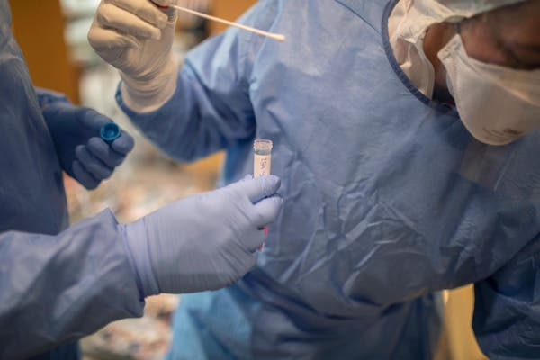
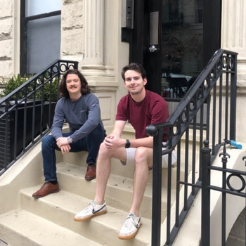

Opinion | Who Is Immune to the Coronavirus? - The New York Times

[Opinion](https://www.nytimes.com/section/opinion)

# Who Is Immune to the Coronavirus?

Important decisions about this question are being made, as they must be, based on only glimmers of data.

By Marc Lipsitch
Mr. Lipsitch is an epidemiologist and infectious disease specialist.

- April 13, 2020

-

    - 
    - 
    - 

    -
    -

Credit...Santi Palacios/Associated Press

Among the many uncertainties that remain about Covid-19 is how the human immune system responds to infection and what that means for the spread of the disease. Immunity after any infection can range from lifelong and complete to nearly nonexistent. So far, however, only the first glimmers of data are available about immunity to SARS-CoV-2, the coronavirus that causes Covid-19.

What can scientists, and the decision makers who rely on science to inform policies, do in such a situation? The best approach is to construct a conceptual model — a set of assumptions about how immunity might work — based on current knowledge of the immune system and information about related viruses, and then identify how each aspect of that model might be wrong, how one would know and what the implications would be. Next, scientists should set out to work to improve this understanding with observation and experiment.

The ideal scenario — once infected, a person is completely immune for life — is correct for a number of infections. The Danish physician Peter Panum famously [figured this out](https://www.worldcat.org/title/observations-made-during-the-epidemic-of-measles-on-the-faroe-islands-in-the-year-1846/oclc/5972974) for measles when he [visited the Faroe Islands](https://ajph.aphapublications.org/doi/pdf/10.2105/AJPH.36.7.795) (between Scotland and Iceland) during an outbreak in 1846 and found that residents over 65 who had been alive during a previous outbreak in 1781 were protected. This striking observation helped launch the fields of immunology and epidemiology — and ever since, as in many other disciplines, the scientific community has learned that often things are more complicated.

One example of “more complicated” is immunity to [coronaviruses](https://www.niaid.nih.gov/diseases-conditions/coronaviruses), a large group of viruses that sometimes jump from animal hosts to humans: SARS-CoV-2 is the third major coronavirus epidemic to affect humans in recent times, after the SARS outbreak of 2002-3 and the [MERS outbreak that started in 2012](https://www.cdc.gov/coronavirus/mers/index.html).

Much of our understanding of coronavirus immunity comes not from SARS or MERS, which have infected comparatively small numbers of people, but from the coronaviruses that spread every year causing respiratory infections ranging from a common cold to pneumonia. In two separate studies, researchers infected human volunteers with a seasonal coronavirus and about a year later inoculated them with the same or a similar virus to observe whether they had acquired immunity.

[In the first study](https://onlinelibrary.wiley.com/doi/epdf/10.1002/jmv.1890130208), researchers selected 18 volunteers who developed colds after they were inoculated — or “challenged,” as the term goes — with one strain of coronavirus in 1977 or 1978. Six of the subjects were re-challenged a year later with the same strain, and none was infected, presumably thanks to protection acquired with their immune response to the first infection. The other 12 volunteers were exposed to a slightly different strain of coronavirus a year later, and their protection to that was only partial.

In [another study](https://www.ncbi.nlm.nih.gov/pmc/articles/PMC2271881/)published in 1990, 15 volunteers were inoculated with a coronavirus; 10 were infected. Fourteen returned for another inoculation with the same strain a year later: They displayed less severe symptoms and their bodies produced less of the virus than after the initial challenge, especially those who had shown a strong immune response the first time around.

No such human-challenge experiments have been conducted to study immunity to SARS and MERS. But measurements of antibodies in the blood of people who have survived those infections suggest that these defenses persist for some time: two years for SARS, [according to one study](https://onlinelibrary.wiley.com/doi/full/10.1111/j.1440-1843.2006.00783.x), and almost three years for MERS, [according to another one.](https://wwwnc.cdc.gov/eid/article/22/10/16-0706_article) However, the neutralizing ability of these antibodies — a measure of how well they inhibit virus replication — was already declining during the study periods.

These studies form the basis for an educated guess at what might happen with Covid-19 patients. After being infected with SARS-CoV-2, most individuals will have an immune response, some better than others. That response, it may be assumed, will offer some protection over the medium term — at least a year — and then its effectiveness might decline.

## Editors’ Picks

[  ### Inside the Strip Clubs of Instagram](https://www.nytimes.com/2020/04/10/style/justin-laboy-instagram-strip-clubs-live.html?algo=bandit-story_desk_filter&fellback=false&imp_id=704621996&imp_id=565341939)

[  ### These Young Renters Wanted a Starter Apartment in Manhattan for a Reasonable Price. Here’s What They Found.](https://www.nytimes.com/interactive/2020/04/09/realestate/09hunt-tribble.html?algo=bandit-story_desk_filter&fellback=false&imp_id=492296292&imp_id=37916074)

[  ### What Were the Origins of the Holocaust?](https://www.nytimes.com/2020/04/07/books/review/europe-against-the-jews-gotz-aly.html?algo=bandit-story_desk_filter&fellback=false&imp_id=321480003&imp_id=662765644)

Other evidence supports this model. A recent peer-reviewed study led by a team from Erasmus University, in the Netherlands, published data from 12 patients showing that they had developed [antibodies after infection with SARS-CoV-2](https://urldefense.proofpoint.com/v2/url?u=https-3A__wwwnc.cdc.gov_eid_article_26_7_20-2D0841-5Farticle&d=DwMFaQ&c=WO-RGvefibhHBZq3fL85hQ&r=RUuvXGICKsCiQAw8JiV8444FOltB1RzNukyTq1OB4MI&m=Y4cQq7apg6FyO-z3xAKs01pQC_rxb1_U2YoyHSTGFRI&s=4JRiPkyMJPd-7vS3K1cV-LzNq7E52617PBE4vrLY2f8&e=). Several of my colleagues and students and I [have statistically analyzed](https://science.sciencemag.org/content/early/2020/04/14/science.abb5793) thousands of seasonal coronavirus cases in the United States and used a mathematical model to infer that immunity over a year or so is likely for the two seasonal coronaviruses most closely related to SARS-CoV-2 — an indication perhaps of how immunity to SARS-CoV-2 itself might also behave.

If it is true that infection creates immunity in most or all individuals and that the protection lasts a year or more, then the infection of increasing numbers of people in any given population will lead to the buildup of so-called [herd immunity](https://apic.org/monthly_alerts/herd-immunity/). As more and more people become immune to the virus, an infected individual has [less and less chance](https://www.washingtonpost.com/graphics/2020/world/corona-simulator/) of coming into contact with a person susceptible to infection. Eventually, herd immunity becomes pervasive enough that an infected person on average infects less than one other person; at that point, the number of cases starts to go down. If herd immunity is widespread enough, then even in the absence of measures designed to slow transmission, the virus will be contained — at least until immunity wanes or enough new people susceptible to infection are born.

At the moment, cases of Covid-19 have been undercounted because of limited testing — perhaps by [a factor of 10](https://www.cnbc.com/2020/03/24/italian-coronavirus-cases-seen-10-times-higher-than-official-tally.html) in some places, like Italy as of late last month. If the undercounting is around this level in other countries as well, then a majority of the population in much (if not all) of the world still is susceptible to infection, and herd immunity is a minor phenomenon right now. The long-term control of the virus depends on getting a majority of people to become immune, through infection and recovery or through vaccination — how large a majority depends on yet other parameters of the infection that remain unknown.

One concern has to do with [the possibility of reinfection](https://www.nytimes.com/2020/02/29/health/coronavirus-reinfection.html?searchResultPosition=3). South Korea’s Centers for Disease Control and Prevention recently reported that 91 patients who had been infected with SARS-CoV-2 and then tested negative for the virus [later tested positive again](https://uk.reuters.com/article/us-health-coronavirus-southkorea/south-korea-reports-recovered-coronavirus-patients-testing-positive-again-idUKKCN21S15X). If some of these cases were indeed reinfections, they would cast doubt on the strength of the immunity the patients had developed.

An [alternative possibility](https://www.nytimes.com/2020/02/29/health/coronavirus-reinfection.html?searchResultPosition=3), which many scientists [think is more likely](https://www.nytimes.com/2020/02/29/health/coronavirus-reinfection.html?searchResultPosition=3), is that these patients had a false negative test in the middle of an ongoing infection, or that the infection had temporarily subsided and then re-emerged. South Korea’s C.D.C. is now working to assess the merit of all these explanations. As with other diseases for which it can be difficult to distinguish a new infection from a new flare-up of an old infection — like [tuberculosis](https://www.ncbi.nlm.nih.gov/pmc/articles/PMC3320369/) — the issue might be resolved by comparing the viral genome sequence from the first and the second periods of infection.

For now, it is reasonable to assume that only a minority of the world’s population is immune to SARS-CoV-2, even in hard-hit areas. How could this tentative picture evolve as better data come in? Early hints suggest that it could change in either direction.

It is possible that many more cases of Covid-19 have occurred than have been reported, even after accounting for limited testing. One [recent study](https://www.medrxiv.org/content/10.1101/2020.04.01.20050542v1) (not yet peer-reviewed) suggests that rather than, say, 10 times the number of detected cases, the United States may really have more like 100, or even 1,000, times the official number. This estimate is an indirect inference from statistical correlations. In emergencies, such indirect assessments can be early evidence of an important finding — or statistical flukes. But if this one is correct, then herd immunity to SARS-CoV-2 could be building faster than the commonly reported figures suggest.

Then again, another [recent study](https://urldefense.proofpoint.com/v2/url?u=https-3A__www.medrxiv.org_content_10.1101_2020.03.30.20047365v1&d=DwMFaQ&c=WO-RGvefibhHBZq3fL85hQ&r=RUuvXGICKsCiQAw8JiV8444FOltB1RzNukyTq1OB4MI&m=nuBBeGqQ2HiQq2qJQb-yHkxq51LVDC9Hh9gIkfIcrfY&s=jrP9PBR6CZ2676erzfgeNSTbVdPhjOIxo8X1m26E_qk&e=) (also not yet peer-reviewed) suggests that not every case of infection may be contributing to herd immunity. Of 175 Chinese patients with mild symptoms of Covid-19, 70 percent developed strong antibody responses, but about 25 percent developed a low response and about 5 percent developed no detectable response at all. Mild illness, in other words, might not always build up protection. Similarly, it will be important to study the immune responses of people with asymptomatic cases of SARS-CoV-2 infection to determine whether symptoms, and their severity, predict whether a person becomes immune.

The balance between these uncertainties will become clearer when more serologic surveys, or blood tests for antibodies, are conducted on large numbers of people. Such studies [are beginning](https://www.statnews.com/2020/04/04/cdc-launches-studies-to-get-more-precise-count-of-undetected-covid-19-cases/) and should show results soon. Of course, much will depend on how sensitive and specific the various tests are: how well they spot SARS-CoV-2 antibodies when those are present and if they can avoid spurious signals from antibodies to related viruses.

Even more challenging will be understanding what an immune response means for an individual’s risk of getting reinfected and their contagiousness to others. Based on the volunteer experiments with seasonal coronaviruses and the antibody-persistence studies for SARS and MERS, one might expect a strong immune response to SARS-CoV-2 to protect completely against reinfection and a weaker one to protect against severe infection and so still slow the virus’s spread.

But designing valid epidemiologic studies to figure all of this out is not easy — many scientists, including several teams of which I’m a part — are working on the issue right now. One difficulty is that people with a prior infection might differ from people who haven’t yet been infected in many other ways that could alter their future risk of infection. Parsing the role of prior exposure from other risk factors is an example of the classic problem epidemiologists call “[confounding](https://www.ncbi.nlm.nih.gov/pmc/articles/PMC2652882/)” — and it is made maddeningly harder today by the fast-changing conditions of the still-spreading SARS-CoV-2 pandemic.

And yet getting a handle on this fast is extremely important: not only to estimate the extent of herd immunity, but also to figure out whether some people can re-enter society safely, without becoming infected again or serving as a vector, and spreading the virus to others. Central to this effort will be figuring out how long protection lasts.

With time, other aspects of immunity will become clearer as well. [Experimental](https://www.ncbi.nlm.nih.gov/pmc/articles/PMC2095096/) and [statistical](https://www.medrxiv.org/content/10.1101/2020.03.04.20031112v1) evidence suggests that infection with one coronavirus can offer some degree of immunity against distinct but related coronaviruses. Whether some people are at greater or lesser risk of infection with SARS-CoV-2 because of a prior history of exposure to coronaviruses is an open question.

And then there is the question of [immune enhancement](https://www.pnas.org/content/early/2020/03/27/2005456117): Through a variety of mechanisms, immunity to a coronavirus can in some instances exacerbate an infection rather than prevent or mitigate it. This troublesome phenomenon is best known in another group of viruses, the flaviviruses, and may explain why administering a vaccine against dengue fever, a flavivirus infection, can sometimes [make the disease worse](https://www.statnews.com/2016/09/01/dengue-vaccine-can-harm/).

Such mechanisms are still being studied for coronaviruses, but concern that they might be at play is one of the obstacles that have slowed the development of experimental vaccines against [SARS](https://insight.jci.org/articles/view/123158) and [MERS](https://jvi.asm.org/content/94/5/e02015-19.long). Guarding against enhancement will also be one of the biggest challenges facing scientists trying to develop vaccines for Covid-19. The good news is that research on SARS and MERS has [begun to clarify how enhancement works](https://www.pnas.org/content/early/2020/03/27/2005456117), suggesting ways around it, and [an extraordinary range of efforts](https://www.nejm.org/doi/full/10.1056/NEJMp2005630) is underway to find a vaccine for Covid-19, using multiple approaches.

More science on almost every aspect of this new virus is needed, but in this pandemic, as with [previous ones](https://www.nejm.org/doi/full/10.1056/NEJMp0904380), decisions with great consequences must be made before definitive data are in. Given this urgency, the traditional scientific method — formulating informed hypotheses and testing them by experiments and careful epidemiology — is hyper-accelerated. Given the public’s attention, that work is unusually on display. In these difficult circumstances, I can only hope that this article will seem out of date very shortly — as much more is soon discovered about the coronavirus than is known right now.

Marc Lipsitch ([@mlipsitch](https://twitter.com/mlipsitch?ref_src=twsrc%5Egoogle%7Ctwcamp%5Eserp%7Ctwgr%5Eauthor)) is a professor in the Departments of Epidemiology and Immunology and Infectious Diseases at Harvard T.H. Chan School of Public Health, where he also directs the Center for Communicable Disease Dynamics.

Related
More views on immunity and its implications

[ Opinion | Kathryn Olivarius  The Dangerous History of Immunoprivilege April 12, 2020  ](https://www.nytimes.com/2020/04/12/opinion/coronavirus-immunity-passports.html?action=click&module=RelatedLinks&pgtype=Article)

[ Opinion | Greta Bauer  Please, Don’t Intentionally Infect Yourself. Signed, an Epidemiologist. April 8, 2020  ](https://www.nytimes.com/2020/04/08/opinion/coronavirus-parties-herd-immunity.html?action=click&module=RelatedLinks&pgtype=Article)

[ Opinion | Gabriel Leung  Lockdown Can’t Last Forever. Here’s How to Lift It. April 6, 2020  ](https://www.nytimes.com/2020/04/06/opinion/coronavirus-end-social-distancing.html?action=click&module=RelatedLinks&pgtype=Article)

[ Opinion | David L. Katz  Is Our Fight Against Coronavirus Worse Than the Disease? March 20, 2020  ](https://www.nytimes.com/2020/03/20/opinion/coronavirus-pandemic-social-distancing.html?action=click&module=RelatedLinks&pgtype=Article)

*The Times is committed to publishing *[*a diversity of letters*](https://www.nytimes.com/2019/01/31/opinion/letters/letters-to-editor-new-york-times-women.html)* to the editor. We’d like to hear what you think about this or any of our articles. Here are some *[*tips*](https://help.nytimes.com/hc/en-us/articles/115014925288-How-to-submit-a-letter-to-the-editor)*. And here’s our email: *[*letters@nytimes.com*](https://www.nytimes.com/2020/04/13/opinion/coronavirus-immunity.htmlmailto:letters@nytimes.com)*.*

*Follow The New York Times Opinion section on *[*Facebook*](https://www.facebook.com/nytopinion)*, *[*Twitter (@NYTopinion)*](http://twitter.com/NYTOpinion)* and *[*Instagram*](https://www.instagram.com/nytopinion/)*.*

Advertisement

[Continue reading the main story](https://www.nytimes.com/2020/04/13/opinion/coronavirus-immunity.html#after-bottom)