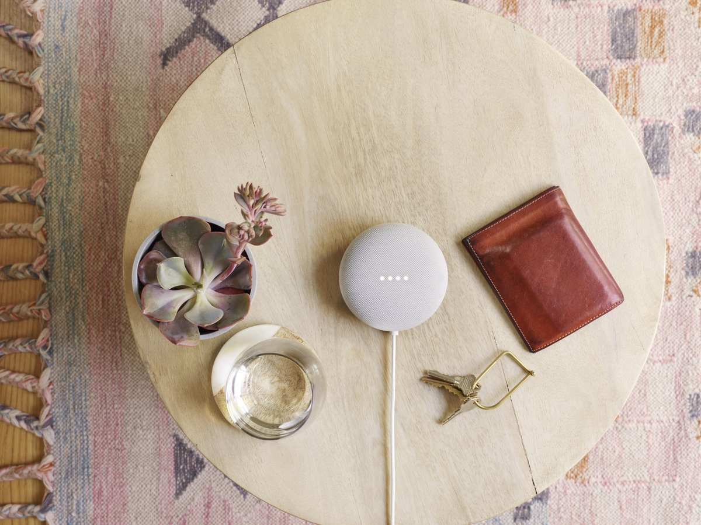
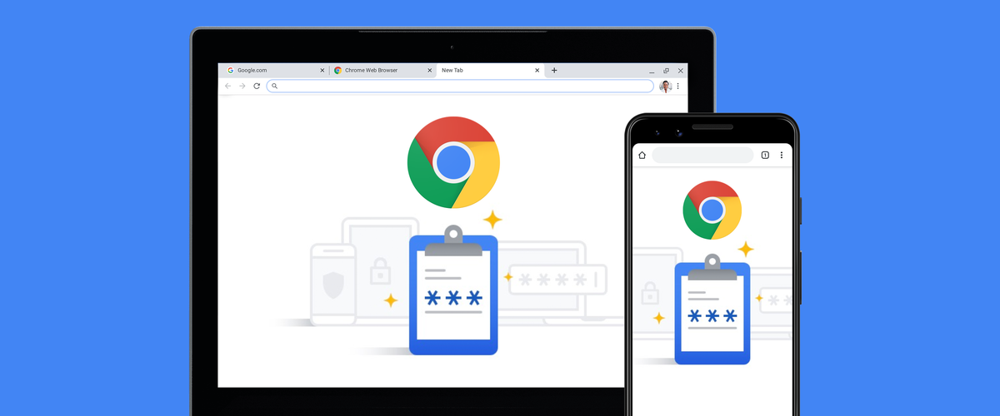

Organize your tabs with tab groups in Google Chrome

 [Chrome](https://www.blog.google/products/chrome/)

# Keep tabs on your tabs in Google Chrome

 

 

 Chrome_BlogHeader_TabGroups_May.png

Edward Jung

UX Engineer, Chrome

 Published May 13, 2020

### Coming to Chrome: a new way to use tabs

There are two types of people in the world: *tab minimalists* who have just a few tabs open at a time and *tab collectors* who have...significantly more. For minimalists and collectors alike, we’re bringing a new way to organize your tabs to Chrome: tab groups. This feature is available now in Chrome Beta.

 

Tab groups in Chrome help you organize your tabs.

Now, with a simple right click, you can group your tabs together and label them with a custom name and color. Once the tabs are grouped together, you can move and reorder them on the tab strip.

We’ve been testing out tab groups for several months now (as have some of you), and we’re finding new ways to stay organized. Through our own usage and early user research, we’ve found that some people like to group their Chrome tabs by topic. For instance, it helps if you're working on several projects, or looking through multiple shopping and review sites.

Others have been grouping their tabs by how urgent they are-- “ASAP,” “this week” and “later.” Similarly, tab groups can help keep track of your progress on certain tasks: “haven’t started,” “in progress,” “need to follow up” and “completed.” My pro tip is that you can use an emoji as a group name such as ❤️ for inspiration or for articles to read. Tab groups are customizable so you can decide how to use them. And just like regular tabs, your groups are saved when you close and reopen Chrome.

 

Group tabs by topic, urgency, progress, etc. It’s up to you how to group them.

Chrome’s stability and performance are important to us, so we’re releasing tab groups slowly in our upcoming version of Chrome, which begins rolling out next week. Tab groups will be available for Chrome on desktop across Chrome OS, Windows, Mac and Linux. If you want to preview tab groups today, it’s available in the latest version of [Google Chrome Beta](https://www.google.com/chrome/beta/). (Note: if you don’t see tab groups in Chrome Beta, try restarting your browser.)

 Posted in:

- [Chrome](https://www.blog.google/products/chrome/)  —

### Related stories

- [  ##### Android    #### New malware protections for Advanced Protection users    Android is launching new features for Advanced Protection Program users to automatically protect them from malware.           By  Roman Kirillov   -    Mar 18, 2020     ](https://www.blog.google/products/android/new-malware-protections-advanced-protection-users/)

- [                  ##### Safety and Security    #### Data Privacy Day: seven ways we protect your privacy           By  Rahul Roy-Chowdhury   -    Jan 28, 2020     ](https://www.blog.google/technology/safety-security/data-privacy-day-seven-ways-we-protect-your-privacy/)

- [  ##### Chrome    #### Manage audio and video in Chrome with one click    With Chrome’s latest update, it’s now easier to control audio and video in your browser. Just click the icon in the top right corner of C...           By  Deniz Ozkaraoglu   -    Jan 16, 2020     ](https://www.blog.google/products/chrome/manage-audio-and-video-in-chrome/)

- [                  ##### Google Nest    #### Made by Google's 20 tips for 2020           By  Evan Barbour Grippi   -    Jan 9, 2020     ](https://www.blog.google/products/google-nest/made-googles-20-tips-2020/)

- [                  ##### Chrome    #### Better password protections in Chrome           By  AbdelKarim Mardini   -    Dec 10, 2019     ](https://www.blog.google/products/chrome/better-password-protections/)

- [                  ##### Developers    #### Using the web to help young people find work           By  Paul Kinlan   -    Dec 9, 2019     ](https://www.blog.google/technology/developers/using-web-help-young-people-find-work/)

- .