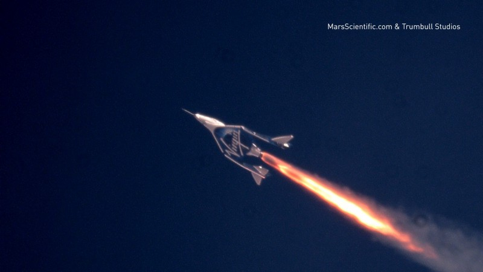
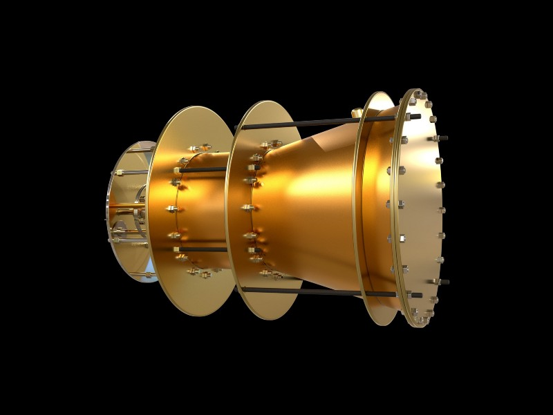
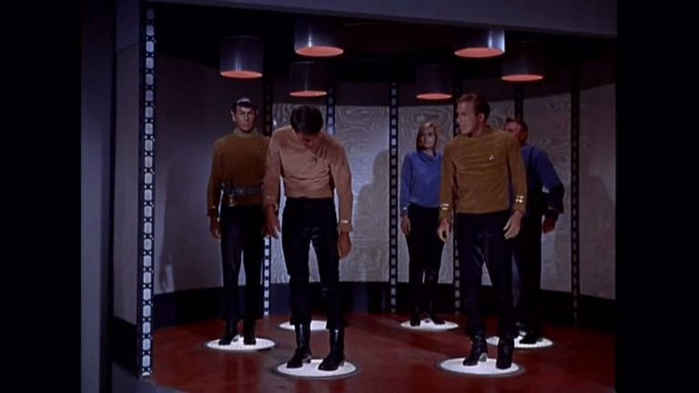
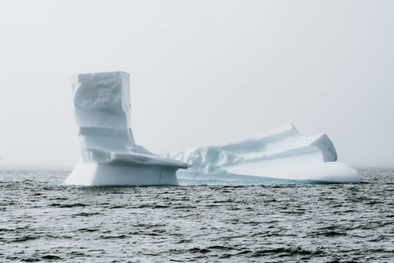
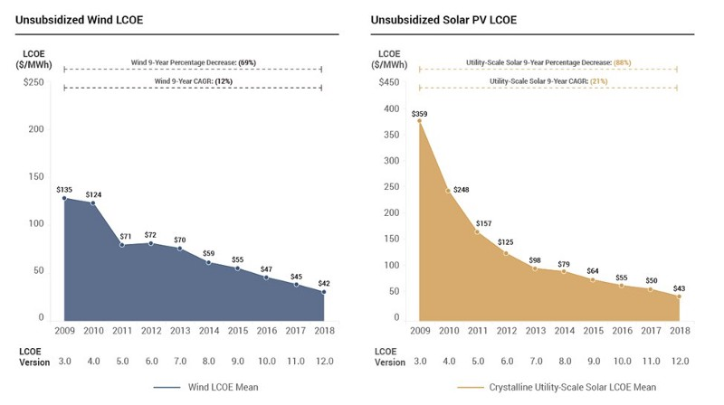
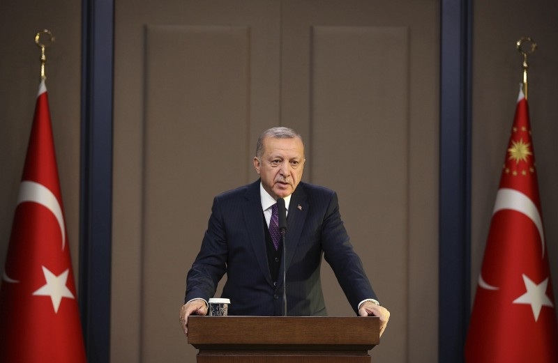

Our Long Bets and Predictions about 02020 — Blog of the Long Now

#   [Our Long Bets and Predictions about 02020](https://blog.longnow.org/02020/02/26/12-long-bets-and-predictions-about-02020/)

by **Ahmed Kabil** on February 26th, 02020

- [Share](https://www.facebook.com/sharer/sharer.php?app_id=107141916002819&kid_directed_site=0&u=https://blog.longnow.org/02020/02/26/12-long-bets-and-predictions-about-02020/&display=popup&ref=plugin&src=share_button)

- [Tweet](https://twitter.com/intent/tweet?original_referer=https://blog.longnow.org/02020/02/26/12-long-bets-and-predictions-about-02020/&url=https://blog.longnow.org/02020/02/26/12-long-bets-and-predictions-about-02020/&text=@longnow)

-  Copy Link

The year 02020, like 02000 before it and 02050 after it, has long captivated the popular imagination as a kind of shorthand for “the future.” Some predictions about life in 02020 are remarkably prescient: In 02004, the National Intelligence Council [predicted](https://www.dni.gov/files/documents/Global%20Trends_Mapping%20the%20Global%20Future%202020%20Project.pdf) that [an “America first” movement would rise in the United States](https://www.dni.gov/files/documents/Global%20Trends_Mapping%20the%20Global%20Future%202020%20Project.pdf); In Ray Bradbury’s 01953 dystopian novel Fahrenheit 451, he [predicts](https://www.goodreads.com/quotes/1101335-and-in-her-ears-the-little-seashells-the-thimble-radios) that people would listen to “little seashells” filling their ears with “an electronic ocean of sound, of music and talk”; In 01997, the Independent predicted that Boris Johnson, who was a 32-year-old columnist at the *Daily Telegraph* at the time, [would lead Britain’s exit from the European Union.](https://www.independent.co.uk/arts-entertainment/the-cabinet-of-tomorrow-1277684.html)

Other predictions about 02020 have not aged so well: In 01964, the RAND Corporation predicted that by 02020, humans [would breed apes and cetaceans for the express purpose of performing daily chores.](https://www.rand.org/content/dam/rand/pubs/papers/2005/P2982.pdf) In 02004, futurist Ray Kurzweil predicted that [food consumption would be on the wane](https://edition.cnn.com/2020/01/01/tech/2020-predictions-we-got-wrong-scli-intl/index.html), as “billions of tiny nanobots in the digestive tract and bloodstream could intelligently extract the precise nutrients we require.”

Much of our work at [The Long Now Foundation](http://longnow.org/) focuses on broadening our time horizons beyond these arbitrary dates, which can act as mental barriers to thinking long-term. Our Long Bets project is an exception. [Long Bets](http://longbets.org/) was founded in 02002 as a way of fostering more accountable predictions about the future. The forum asks all predictors to put their name, a solid argument, and a financial pledge down in support of their statement about the future (the winnings go to charity). Long Now, in turn, provides a long-term record where any prediction can be revisited, reviewed, and discussed at any time.

A Long Bet always starts with a prediction. All predictions should come with an argument in support, a financial pledge, and an end-date. The minimum term for a prediction is two years; there is no maximum term. A prediction becomes a bet when a challenger comes forward with a counterargument. The predictor may then choose to make a bet with the challenger. The predictor and challenger will agree on a wager, and each will choose a charitable cause to receive the winnings. When the end-date for the bet passes, The Long Now Foundation adjudicates the bet and donates the proceeds to the winner’s charity of choice.

We had a number of Long Bets and predictions about 02020. Below, we take a look at what some people bet — and others, predicted — would happen this year.

### The Horgan-Kaku Wager

The CERN Particle Accelerator.

#### [LONG BET #12:](http://longbets.org/12/) By 02020, no one will have won a Nobel Prize for work on superstring theory, membrane theory, or some other unified theory describing all the forces of nature.

**Predictor: **John Horgan, a science writer.
**Challenger: **Michio Kaku, theoretical physicist.
**Bet Duration: **18 years (02002–02020)
**Stakes: **$2,000

Last October, the Royal Swedish Academy of Sciences [announced](https://www.nobelprize.org/prizes/physics/2019/press-release/) that it was awarding the 02019 Nobel Prize in Physics to James Peebles, Michel Mayor, and Didier Queloz “for contributions to our understanding of the evolution of the universe and Earth’s place in the cosmos.”

But there was another winner the Academy did not recognize: science writer John Horgan. 18 years have come and gone without a Nobel Prize for superstring theory or any other unified theory of physics, meaning he is the winner of this Long Bet.

Many theoretical physicists, like Horgan’s challenger, Michio Kaku, believe string theory offers a path towards the long-sought after “Theory of Everything.” Such a theory might answer the most fundamental questions humans have pondered about the universe. Horgan, knowing that the Academy is a stickler for empirical evidence when it comes to awarding its Nobel for Physics, bet that such evidence would not be found by 02020. He was right.

“Physicists have yet to produce any empirical evidence for either string theory, which was invented more than 40 years ago, loop-space theory or any other unified theory,” Horgan [wrote](https://blogs.scientificamerican.com/cross-check/string-theory-does-not-win-a-nobel-and-i-win-a-bet/) in a blog post about his winning bet for *Scientific American*. Kaku is still optimistic about the chances of discovering evidence for a Theory of Everything through the Large Hadron Collider particle accelerator. But so far, that hasn’t happened. (Fortunately, the Large Hadron Collider also [didn’t destroy Earth](https://blog.longnow.org/02018/08/03/nick-damiano-wins-10-year-long-bet-that-the-large-hadron-collider-wouldnt-destroy-earth/), which was the subject of [another Long Bet](http://longbets.org/382/) that recently came to term).

* * *

### Other Long Bets about 02020 Coming to Term in the Year After 02020

While the Horgan-Kaku wager was the only Long Bet that came to term this year, we do have two bets on record about 02020 that will end within the next year. Circumstances can certainly change before these bets’ end dates (December 31st, 02020, and June 1st, 02021, respectively), but we are at a point where we can take stock of where things stand. These bets will be officially adjudicated at a later date.

Soccer star Carli Lloyd kicked a 55-yard field goal at a practice between two NFL teams. That’s on the high end of what most professional football kickers can accomplish.

#### [LONG BET #367:](http://longbets.org/367/) By the end of the year 02020, a professional sports team that is part of either the National Football League, the National Basketball Association, Major League Baseball, the National Hockey League, or Major League Soccer will integrate and have a woman as a team member/player.

**Predictor: **Thomas R. Leavens, a Chicago-based attorney.

**Challenger: **Nils Gilman, VP of Programs at the Berggruen Institute (Gilman [spoke at Long Now](http://longnow.org/seminars/02010/may/03/deviant-globalization/) in 02010)

**Bet Duration: **13 years (02008–02020)
**Stakes: **$500

While there’s still time for this to happen, it’s not looking likely by the end of the year. Nevertheless, there are signs that the major sports are getting close. Goaltender Manon Rhéaume played in preseason games for the National Hockey League in the 01992 and 01993 seasons, but was not included as part of the regular season roster (a stipulation of the bet’s terms).

Women have been kickers in college football for years, but have not broken through at the professional level…yet. In 2013, Lauren Silberman became the first woman to try out for an NFL team ([it didn’t go so well](http://www.nfl.com/news/story/0ap1000000146837/article/lauren-silberman-stages-pointless-sideshow-at-regional-combine)). In 02019, World Cup hero Carli Lloyd received offers to play in preseason games from several NFL teams [after footage of her kicking field goals went viral.](https://www.theguardian.com/sport/2019/aug/26/carli-lloyd-nfl-female-kicker)  *The Guardian*  [suggested](https://www.theguardian.com/sport/2019/aug/26/carli-lloyd-nfl-female-kicker) that the rise of women’s rugby in Australia might be the most promising conduit for women to break into the NFL.

Days before his untimely passing in a helicopter crash, former NBA basketball player Kobe Bryant [told CNN](https://edition.cnn.com/2020/01/22/sport/kobe-bryant-women-nba-spt-intl/index.html) that he believed there were a number of women in the WNBA who “could play in the NBA right now.” The NBA is leading the major sports in terms of integrating women on coaching staffs and as referees. Perhaps the court will be next.

Workers disinfecting a residential neighborhood in China following the coronavirus outbreak. © Reuters

#### [LONG BET #9:](http://longbets.org/9) A bioterror or bioerror will lead to one million casualties in a single event within a six month period starting no later than Dec 31 02020.

**Bet Duration: **4 years (02017–02020)

**Predictor: **Martin Rees, Astronomer Royal (Rees spoke at Long Now in [02010](http://longnow.org/seminars/02010/aug/02/lifes-future-cosmos/) and [02019](http://longnow.org/seminars/02019/jan/14/prospects-humanity/))

**Challenger: **Steven Pinker, cognitive psychologist at Harvard (Pinker spoke at Long Now in [02012](http://longnow.org/seminars/02012/oct/08/decline-violence/) and [02018](http://longnow.org/seminars/02018/mar/13/new-enlightenment/))

**Stakes: **$400

So far, this hasn’t happened. In [a 02017 Long Now talk](http://longnow.org/seminars/02017/oct/30/engineering-gene-safety/), Renee Wegrzyn of DARPA outlined how CRISPR-Cas 9 technology *could* be used for a bioterror attack, and what the U.S. Government was doing to prepare for that possibility through innovations in biosafety and biosecurity.

More recently, in the aftermath of the coronavirus outbreak, [misinformation proliferated](https://www.npr.org/2020/02/15/806365997/troll-watch-misinformation-around-the-coronavirus), including conspiracy theories that the disease was actually a bioterror attack on China. This is not true. Nevertheless, the spread of the coronavirus does underscore global unpreparedness to deal with such outbreaks, including ones due to a bioterror attack — something Bill Gates [warned about](https://www.cnbc.com/2020/01/27/bill-gates-in-2018-world-needs-to-prepare-for-pandemics-just-like-war.html) in 02018: “We can’t predict when, but given the continual emergence of new pathogens, the increasing risk of a bioterror attack, and the ever-increasing connectedness of our world, there is a significant probability that a large and lethal modern-day pandemic will occur in our lifetime,” Gates said.

### Long Predictions

A number of people made predictions about 02020 that were never challenged (i.e., they remained predictions, not official Long Bets). A selection of some of those predictions, and our assessments, follow.

Virgin Galactic

#### [By the year 02020, the tickets to space travel — at the least to Moon, will be available over the counter.](http://longbets.org/27/)

**Predictor:** Hemant Sharma
**Prediction Duration:** 18 years (02002–02020)

**Did the Prediction Come True?** Yes and no (not over the counter, currently sold out).

Virgin Galactic [offered seat reservations into space](https://www.virgingalactic.com/join-us/) for $250,000, all of which are currently sold out. Space X also aims to offer [space tourism experiences later in 02020](https://www.space.com/spacex-crew-dragon-space-tourists.html), with tickets planned to be priced at $35,000 per day. SpaceX has been developing Crew Dragon under a $2.6 billion commercial-crew contract with NASA.

The EmDrive. Via Getty.

#### [A completely propellantless (no material particles expelled for propulsion) or “field propulsion-type” aerospace vehicle will land on the Moon.](http://longbets.org/92/)

**Predictor: **Jay C. Dillon
**Prediction Duration: **18 years (02002–02020)

**Did the Prediction Come True? **No, but there are attempts to develop this technology.

In 02018, NASA developed the EmDrive, an engine that generates thrust without the need for propellants (rather than fuel) by utilizing electromagnetic fields. Thrust is created by [“bouncing microwaves around inside a closed, cone-shaped cavity.”](https://www.nationalgeographic.com/news/2018/05/nasa-emdrive-impossible-physics-independent-tests-magnetic-space-science/#close) But the assertion that the EmDrive technology works [has been questioned and refuted by researchers in Germany](https://www.space.com/40682-em-drive-impossible-space-thruster-test.html). EmDrive goes against Newton’s Third Law of Motion — or every action there is an equal and opposite reaction. Propellantless aerospace vehicles seem impossible due to this reason.

#### [75% of all incremental new generation will come from renewable/sustainable energy in the U.S.](http://longbets.org/141/)

**Predictor: **Jigar Shah
**Prediction Duration: **16 years (02004–02020)
**Did the Prediction Come True? **Yes — 76%, in fact.

In January, the U.S. Energy Information Administration (EIA) said it [expected](https://www.eia.gov/todayinenergy/detail.php?id=42495) 76% of new electric generating capacity to come from wind and solar in 02020.

Alas, teleportation is still science fiction.

#### [The technology will exist that will allow for the “faxing” (teleportation- sending/receiving) of actual inanimate objects, such as text books, clothing, jewelry and the like.](http://longbets.org/143/)

**Predictor: **Rob Schnitzer
**Prediction Duration: **16 years (02004–02020)
**Did the Prediction Come True? **No.

Teleportation of inanimate household items is [currently still impossible](https://www.theguardian.com/technology/2018/jun/12/teleportation-will-it-ever-be-a-possibility). However, quantum teleportation was achieved through a process called quantum entanglement by a team of researchers in China. In 02017 they [sent a photon from the ground to an orbiting satellite more than 300 miles above](https://www.technologyreview.com/s/608252/first-object-teleported-from-earth-to-orbit/).

China’s HL2M Project. Via Xinhua.

#### [By December 31, 02020, synthetic solar energy (fusion) will have been shown to be a technically feasible, by an experiment demonstrating a controlled fusion reaction producing more harnessable energy than was used to ignite it.](http://longbets.org/605/)

**Predictor: **Danny Hillis, [Co-Founder of Long Now](http://longnow.org/people/board/danny0/), Inventor of the [10,000 Year Clock](http://longnow.org/clock). (Hillis has spoken at Long Now in [02004](http://longnow.org/seminars/02004/sep/10/progress-on-the-10000-year-clock/) and [02014](http://longnow.org/seminars/02014/jan/21/long-now-now/)).

**Prediction Duration: **10 years (02011–02020)
**Did the Prediction Come True? **Not yet, but there’s still time.

This has yet to occur, but it just might by year’s end. In China an [‘artificial sun’ project](https://www.sciencealert.com/china-s-promising-artificial-sun-fusion-reactor-could-be-operation-next-year) is set to be finished by the end of year, which is [designed to replicate nuclear fusion](https://www.scmp.com/tech/big-tech/article/3039493/chinas-completed-artificial-sun-start-operation-2020).

Icebergs in the Arctic. Via Unsplash.

#### [The first ice-free Arctic day (as defined by NSIDC) will occur by the end of 2020.](http://longbets.org/653/)

**Predictor: **Ramez Naam (Naam [spoke at Long Now](http://longnow.org/seminars/02015/jul/22/enhancing-humans-advancing-humanity/) in 02015).

**Prediction Duration: **8 years (02013–02020)

**Did the Prediction Come True? **We haven’t reached the end of 02020 yet, but this prediction will almost certainly not come true.

The first ice-free Arctic day is [estimated to happen around 02030–02050](https://www.sciencedaily.com/releases/2019/02/190227111128.htm). [See here](http://nsidc.org/arcticseaicenews/faq/#north_pole) for more on how the NSIDC defines an ice-free Arctic day.

The average cost of electricity from wind and solar plants has continued to drop.

#### [Across at least 25% of the continental US, the cost of new solar or wind will be lower than the cost of either new coal or new natural gas.](http://longbets.org/655/)

**Predictor: **Ramez Naam
**Prediction Duration: **7 years (02013–02020)
**Did the Prediction Come True? **Yes.

Renewable energy, including solar and wind, is reported to be [cheaper than coal](https://energyinnovation.org/wp-content/uploads/2019/03/Coal-Cost-Crossover_Energy-Innovation_VCE_FINAL.pdf) and [natural gas](https://thinkprogress.org/forget-coal-both-solar-and-wind-are-now-cheaper-than-new-natural-gas-plants-e281f5485e5f/).

Anti-government protests in Iran in 02019. Via Getty.

#### [Iranian women will become the dominant force in Iranian politics and kick out the concept of a Supreme Leader.](http://longbets.org/659/)

**Predictor: **Michael Sales
**Prediction Duration: **7 years (02013–02020)
**Did the Prediction Come True? **No.

Ali Khamenei is [still Supreme Leader of Iran](http://news.bbc.co.uk/2/shared/spl/hi/middle_east/03/iran_power/html/supreme_leader.stm). Women have [made gains in parliament](https://www.aljazeera.com/news/2016/03/iran-election-women-parliament-160301121014801.html) but are by no means a dominant force.

Turkey’s president Recep Tayyip Erdogan. Via AP.

#### [Turkish president Recep Tayyip Erdogan will be found guilty at a court of law or will flee from the country.](http://longbets.org/685/)

**Predictor:** Ibrahim Okuyucu
**Prediction Duration: **5 years (02015–02020)
**Did the Prediction Come True? **No.

Erdogan is [still in power](https://www.foreignaffairs.com/articles/turkey/2019-08-12/erdogans-way), although a failed coup against him in 02016 and recent defeats in elections are signs [his position is weakening](https://ahvalnews.com/istanbul-rerun/still-power-turkeys-erdogan-has-time-recover-analysis).

* * *

*Additional research and analysis provided by *[*Alice Riddell*](https://medium.com/u/7082a886f2a8)*. *

### Learn More

- Do you have strong opinions about the future? Put your money where your mouth is. Make a bet with Long Bets [here](http://longbets.org/).
- Ahmed Kabil, [“How Warren Buffett Won His Multi-Million Dollar Long Bet”](https://medium.com/the-long-now-foundation/how-warren-buffett-won-his-multi-million-dollar-long-bet-3af05cf4a42d) in *Long Now*.
- Grace Hauck, [“20 Predictions About 2020: Here’s What People Said Would Happen This Year”](https://eu.usatoday.com/story/news/nation/2019/12/22/2020-predictions-decades-ago-self-driving-cars-mars-voting/2594825001/) in *USA Today*.
- Rob Picheta, [“Nanobots, ape chauffeurs and flights to Pluto. The predictions for 2020 we got horribly wrong”](https://edition.cnn.com/2020/01/01/tech/2020-predictions-we-got-wrong-scli-intl/index.html) in *CNN Business*.

- [Long Bets](https://blog.longnow.org/category/long-bets/)

- [Share](https://www.facebook.com/sharer/sharer.php?app_id=107141916002819&kid_directed_site=0&u=https://blog.longnow.org/02020/02/26/12-long-bets-and-predictions-about-02020/&display=popup&ref=plugin&src=share_button)

- [Tweet](https://twitter.com/intent/tweet?original_referer=https://blog.longnow.org/02020/02/26/12-long-bets-and-predictions-about-02020/&url=https://blog.longnow.org/02020/02/26/12-long-bets-and-predictions-about-02020/&text=@longnow)

-  Copy Link