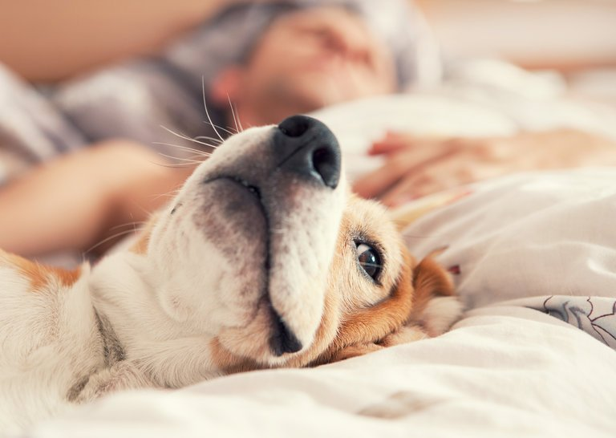

Out of the Doghouse, Into the Bed

# Out of the Doghouse, Into the Bed

Photo

Credit iStock

For most Americans, dogs are no longer relegated to the doghouse. According to the American Pet Products Association, an industry trade group, almost 60 percent of dog owners say they regard their pet as a child or member of the family. And many let their dogs snuggle up to sleep right in their human owners’ beds, often alongside their owners.

But is sleeping in the same bed with your dog a good idea? Wouldn’t they be disruptive to our sleep?

According to a [recent study](http://www.mayoclinicproceedings.org/article/S0025-6196(17)30486-X/fulltext), not really. Researchers at the Mayo Clinic in Phoenix studied 40 dogs (none were puppies) who slept in the bedroom with their owners. The humans were all generally good sleepers, with no known sleep disorders.

The dogs wore a device called a [Fitbark](https://www.fitbark.com/), an activity tracker that attaches to the collar and records whether an animal is at rest and sleeping or active and at play. The people wore an [Actiwatch 2](http://www.actigraphy.com/solutions/actiwatch/actiwatch2.html), an activity monitor that records people’s movements and whether they are sleeping soundly or not. Both monitors were set to sample movement every minute, while the humans also kept a sleep diary.

Over seven days of testing, the researchers found that with a dog in the bedroom, both the humans and the dogs slept reasonably well. Humans had a mean sleep efficiency, or the percentage of time spent asleep while in bed, of 81 percent, while dogs had a sleep efficiency of 85 percent. Levels over 80 percent are generally considered satisfactory. People slept slightly better when the dog was off the bed; dogs slept the same whether they were on the bed or in another location in the bedroom.

 [Continue reading the main story](https://www.nytimes.com/2018/03/13/well/family/dog-cat-pets-sleep-bed-insomnia.html?smid=tw-nytimes&smtyp=cur#story-continues-2)

Advertisement

[Continue reading the main story](https://www.nytimes.com/2018/03/13/well/family/dog-cat-pets-sleep-bed-insomnia.html?smid=tw-nytimes&smtyp=cur#story-continues-3)

“This goes against the lore that you should have the dog sleep elsewhere,” and not in the bedroom, said Dr. Lois E. Krahn, the study’s senior author and a psychiatrist and sleep medicine specialist at the Center for Sleep Medicine at the Mayo Clinic. Her 6-year-old golden retriever, Phoebe, routinely sleeps on the floor in the bedroom — and in the colder months joins her and her husband on their bed. Both the dog and the people, she said, sleep fine.

In an [earlier study from 2015](http://www.mayoclinicproceedings.org/article/S0025-6196(15)00674-6/abstract), Dr. Krahn and her colleagues asked patients who had visited the Mayo Clinic’s sleep clinic whether they owned dogs, cats or other pets. About half did, with many owning more than one. Forty-one percent said they perceived their pet as unobtrusive or beneficial to their sleep, compared to 20 percent who said their pet was disruptive. That study was self-reported, and “we can’t quite trust people to have an accurate report or even be able to accurately observe their feelings for their pets,” Dr. Krahn said. “It’s sort of like a parent’s feelings for their child. I wanted to have objective data.” Hence the recent follow-up report that used activity monitors to get objective data.

Photo

Where the pet sleeps “depends on the animal’s temperament,” said Dr. Carlo Siracusa, a veterinarian and the director of animal behavioral science at [Penn Vet](http://www.vet.upenn.edu/) in Philadelphia. “There are dogs that tend to be more reactive to stimuli. So, for example, if the dog is on the bed and the owner turns and inadvertently hits the dog with the leg, some dogs will get startled and react out of fear,” growling or barking and waking the sleeper, he said. Other dogs aren’t bothered at all. “If there are no problems and the owner is happy with letting the pet in the bedroom, or on the bed, it’s fine with me.”

He added that a dog sleeping in the same room or bed with humans won’t make Sparky think he’s top dog. “Dogs can distinguish between the relationship with its human fellows and other dogs, and the way in which they regulate their interactions with humans in the house is not trying to establish a hierarchy,” he said.

Some dogs may not belong in the bedroom, such as very young or old pets who may not sleep through the night, a sick pet or a reactive pet who might become aggressive when startled or woken up suddenly. Also, if a new baby is entering the family and will sleep [in the same bedroom as the parents](https://www.nytimes.com/2016/11/06/upshot/should-your-baby-really-sleep-in-the-same-room-as-you.html), Dr. Siracusa said, that might no longer be a good place for the pet to sleep – not because of concerns of a pet smothering a baby, he said, but because space may be an issue with that many human and furry bodies in one room.

If a pet is already sleeping in your bed or in the bedroom and interfering with your sleep, you can take steps to transition a pet out of the bedroom. Dr. Siracusa said it is best to make the transition a gradual one rather than abruptly kicking the pet out of the bed or bedroom. That may mean first moving a dog from the human bed to a comfortable spot elsewhere in the bedroom, and then moving the pet just outside the door.

The key is to create a similar sleeping experience for the pet. Dogs may be attracted to humans’ beds, especially if they’re elevated, “because they are comfortable and strategically in a good position,” letting dogs keep watch over their surroundings, Dr. Siracusa said. Creating an equally strategic place might mean that it’s also elevated, or that it has coverings that the dog can burrow under, or that it is near a heater that can simulate the warmth of the people in the humans’ bed.

Photo

Some dogs will never want to sleep with their owners, especially if the owner snores or moves around a lot at night. “When dogs sleep, they want a safe space and don’t want to be bothered,” just like people, he said.

Figuring out where a new dog should sleep can take some time. When Natalie Hastings and her husband adopted Mikey, a 70-pound boxer bulldog mix, they tried letting him sleep in the bed at first, but he shifted around so much they moved him onto a couch. But as Mikey became more settled in their home and he slept more soundly through the night, that changed. He started sleeping in the bed with Mrs. Hastings when her husband traveled for work. Now he’s there all the time and, Mrs. Hastings says, helps her fall asleep faster.

“I have trouble settling down, and he’s got very rhythmic breathing,” she said of Mikey. “It’s almost like white noise. And he’s really warm.”

##  More Reporting on Dogs

Dr. Krahn said the next step in her research is to study a larger group of dogs and their owners, and also to see whether having one or two humans in the bed makes a difference.

She’d also like to do a similar study on cats, though they, of course, are entirely different animals. In addition to Phoebe, she has a 4-year-old cat, Oliver, who is allowed anywhere in the house except the bedroom because “the cat wanders, scratches, meows,” she said. While most dogs can be trained, “I think cats do what they want. If that cat is hungry in the middle of the night, that cat does not care” about waking you up, she said.

Oliver the cat declined to comment.

*Jen A. Miller is the author of “[Running: A Love Story](http://runningalovestory.com/).”*

 [Continue reading the main story](https://www.nytimes.com/2018/03/13/well/family/dog-cat-pets-sleep-bed-insomnia.html?smid=tw-nytimes&smtyp=cur#whats-next)