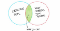
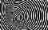
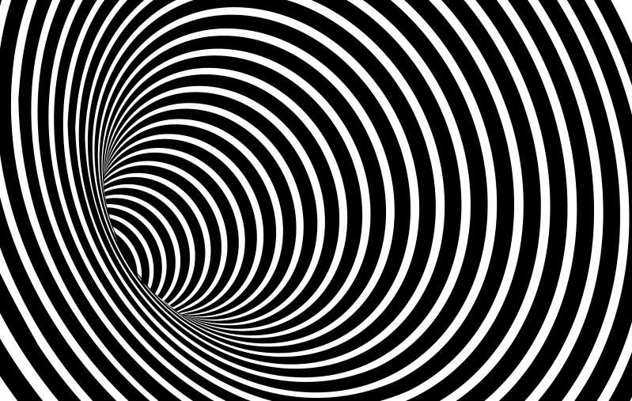
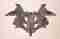
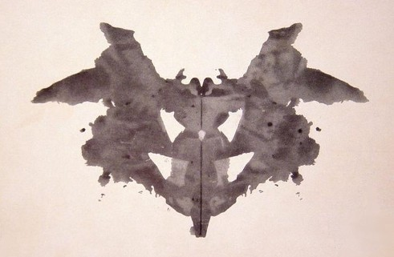
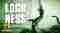
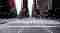
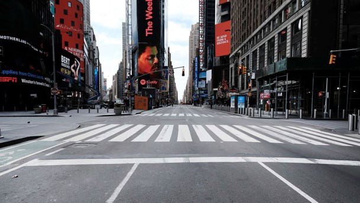

Overcoming confirmation bias during COVID-19 - Towards Data Science

# Overcoming confirmation bias during COVID-19

## Why confirmation bias is the archnemesis of data science and how you can fight it

[Cassie Kozyrkov](https://towardsdatascience.com/@kozyrkov?source=post_page-----51a64205eceb----------------------)

[Mar 24](https://towardsdatascience.com/overcoming-confirmation-bias-during-covid-19-51a64205eceb?source=post_page-----51a64205eceb----------------------) · 8 min read

Two weeks ago, I published a [decision-making guide](http://bit.ly/quaesita_covid) to help you navigate the choices you’re grappling with during the COVID-19 pandemic.

This week, let’s talk about a nasty psychological effect which might be ruining your ability to cope effectively with the information you’re being flooded with daily: **confirmation bias.**

## What is it?

*“****Confirmation bias**** is the tendency to search for, interpret, favor, and recall information in a way that confirms or strengthens one’s prior personal beliefs.” — Wikipedia*

## Yeah, but what is it?

This:

Illustration by [Paul J.](https://twitter.com/pivotservices/status/1062234390493884416?s=19)

If you’re keen to nerd out on psychology, let’s separate confirmation bias from some other phenomena:

- [***Confirmation bias***](https://en.wikipedia.org/wiki/Confirmation_bias)***:*** your **existing opinion** changes how you perceive information.
- [***Wishful blindness***](https://fs.blog/2015/12/dan-ariely-on-why-and-how-we-cheat/)***:*** your **self-interest** changes how you perceive information, especially in the context of ethical decision-making. (Not to be confused with [*willful blindness*](https://en.wikipedia.org/wiki/Willful_blindness), which is a term from law.)
- ***“***[***Filter bubble***](https://en.wikipedia.org/wiki/Filter_bubble)***”*** refers to intellectual isolation in online echo chambers. If an algorithm is designed to prioritize content you’ll like, and you tend to like content from people who already agree with you, then you’re less likely to be exposed to content that might change your mind.

I won’t bore you with advice on how to crawl out of an echo chamber — you’ve heard it all already. “*Something something …intellectual discipline to seek… something something… people who disagree with you.” *Right? Right.

Image: [SOURCE](https://fabiosa.com/lbmmb-dvgfmb-ctlf-rsnsz-aumkib-pblgn-optical-illusion-to-test-eyesight-a-cute-animal-is-hidden-in-the-picture-but-it-might-be-difficult-to-spot-it/).

Wishful blindness is a tricky one, since it’s a relatively new theory without much research on how to overcome it. Confirmation bias, though, has been on the dissection table since the 1960s, so let’s focus on that.

> Filter bubbles are about skewed information, while confirmation bias is about skewed perception.

**Confirmation bias** is not the situation where your social media feed agrees with itself too much. It’s far more subtle: even if you’re exposed to information that disagrees with your opinion, you might not take it in. You might misremember it. You might find a reason to ignore it. You’ll keep digging until the numbers you see are the ones you wanted to see. The mind is funny like that.

> Confirmation bias means we can all look at the same number and perceive it differently. A fact is no longer just a fact.

In other words, [confirmation bias](http://bit.ly/quaesita_inspired) is the archnemesis of [data science](http://bit.ly/quaesita_datasci) since it means that a fact is no longer just a fact, no matter how much math and science you throw into getting it. You and I can look at the same number and [perceive it differently](http://bit.ly/quaesita_inkblot). Diligently exposing yourself to better information sources is not enough to overcome a problem that starts behind your eyes.

> Confirmation bias is the archnemesis of data science.

You should be careful when it comes to trusting your own brain. (That traitor!) If you start with a strong uninformed opinion and go foraging for information, you’re likely to end up with the same opinion after you’re finished. Why bother? Unless you [fight confirmation bias up front](http://bit.ly/quaesita_inspired) and [do things in the right order](http://bit.ly/quaesita_default), your foray into data is destined to be a gooey waste of time.

Interested in learning more about skewed perception of data? See my article on [apophenia](http://bit.ly/quaesita_inkblot).

# Confirmation bias and COVID-19

**In a nutshell: **If you have strong opinions about COVID-19 and then you go looking for evidence that supports them, you’ll think you see it… no matter how outlandish those opinions are. You’ll also have a harder time absorbing evidence that points in the opposite direction.

> If you’re feeling scared and you go looking for information to make you feel better, confirmation bias can make you end up feeling worse instead.

To make matters worse, whenever you’re panicking and you try to soothe yourself with a nice relaxing internet session, you’re likely to find more reasons to panic.

> Being quick to panic is not a virtue — it’s generally counterproductive.

While panic can give you an adrenaline surge — *“confirmation bias: one weird trick to boost your at-home fitness routine” — *it doesn’t help you make better decisions. It’s generally counterproductive, impairs your ability to think clearly, and does nothing good for your mood or your ability to cope with stress. No matter how bad your situation, level-headed realism will serve you better than panic.

# How to fight confirmation bias

The upshot is that a strong starting opinion can mess up both your decision-making and your mood. Luckily, there are four easy ways you can fight confirmation bias:

- **Hold your opinions loosely.**
- **Emphasize decisions, not opinions.**
- **Focus on the things you have control over.**
- **Change the order in which you approach information.**

Image: [SOURCE](https://giphy.com/gifs/wonder-woman-gal-gadot-VbDm4pTuIEQAviEBQX).

## **Hold your opinions loosely**

This one is perhaps easier said than done, especially if you’ve been stewing in headlines for a while, but it’s good intellectual practice to keep an open mind and not to take your opinions too seriously, even if they’re based on plenty of data (hi, [Bayesians](https://en.wikipedia.org/wiki/Bayesian_statistics)).

Here’s another bias worth knowing about: [overconfidence bias](https://en.wikipedia.org/wiki/Overconfidence_effect). *(“A well-established *[*bias*](https://en.wikipedia.org/wiki/Cognitive_bias)* in which a person’s subjective confidence in his or her judgements is reliably greater than the objective accuracy of those judgements, especially when confidence is relatively high.” — Wikipedia) *Yeah, but what is it? Something you can reduce by developing the habit of holding your opinions loosely.

> Holding your opinions loosely reduces their ability to skew your perception.

The best [decision-makers](http://bit.ly/quaesita_di) I know are adaptable. They have the skills to take in new information and admit they were wrong. Before you run off to admire leaders who are unwavering in their judgments (steadfast and loyal, right?), take a moment to see them the way a psychologist seem them: they’re so hampered by confirmation bias that they’re unable to process new information appropriately (or they’re superb actors).

If you’re keen to curb your own tendencies towards hubris, take a page out of the scientist’s book. Ever noticed how research papers in applied science are filled with caveats, humbly reminding the reader about unknowns that could invalidate their conclusions? That’s not a bad standard to aim for.

## **Emphasize decisions, not opinions**

In my, er, opinion, the best way to loosen the grip your opinions have on both your emotions and your decisions is to get into the habit of taking a decision-first perspective. If an opinion falls in the forest and no action is affected by it, did the opinion matter?

> It’s through our decisions — our actions — that we affect the world around us.

Imagine that I believe that the [Loch Ness monster](https://en.wikipedia.org/wiki/Loch_Ness_Monster) is real. If my belief does not influence my decisions — interactions with the world — in any way, what harm is there in it? On the other hand, if my belief does influence my actions (consciously or subconsciously), then perhaps I should evaluate my opinion *in context *of the actions that it stands to influence. That involves thinking about the actions (in order of importance) *before* the opinion and then forming hypotheses for testing as a second step. My article on that is [here](http://bit.ly/quaesita_damnedlies).

Image: [SOURCE](https://i.ytimg.com/vi/1ZxgTZnLCOw/maxresdefault.jpg).
*> “Will this information make me act differently?”*

Whenever you find yourself receiving new information, remember to ask yourself: *“is this actionable?”* If yes, which of your decisions does it affect?

## **Focus on the things you have control over**

When it comes to COVID-19, many of us already find our decision-making constrained by new rules. If we don’t take a moment to recognize that some decisions we’ve been worrying about are no longer on the table, we’ll waste unnecessary energy on opinions without a function.

Wouldn’t you prefer to focus on making decisions and plans about things that are under your control? (Or to use that time on activities that bring you joy?)

For example, here in NYC (*yup, I know*) I no longer have the option to go to the theatre this month. Whatever my opinion about how being in a crowded space might affect my health — I have such an opinion, loosely held, from reading [WHO](https://www.who.int/) publications — there’s no decision that I can make which takes that information as input.

> I no longer have the option to be in a crowd this month even if I wanted to. That decision is not on the table.

Perhaps I’d be better served by shifting my cognitive efforts elsewhere, towards decisions that *are* on the table for me, such as whether to help out remotely (yes), whether to order toilet paper online (no, that’s what all my textbooks are for), and whether to invest mountains of effort into filming an at-home video series about [data science](http://bit.ly/quaesita_datasci) (perhaps not, unless the [videos](http://bit.ly/quaesita_stc001) I already put on YouTube get more traffic).

Broadway is dark and Times Square is eerily empty these days. Source: [Spencer Platt/Getty Images/AFP.](https://www.haaretz.com/us-news/coronavirus-crisis-u-s-global-spread-1.8701701)

Stepping away from agonizing over things you can’t influence isn’t a call for ignorance. Compare the following ways to use your mental energy:

1. *Worrying about a decision your mayor is grappling with while trying to think about how you would make it in their place.*

2. *Examining your mayor’s decision skills from the perspective of a decision you’re making about them (e.g. to vote for/against the mayor’s reelection).*

3. *Considering which actions you should take— if any — in response to (or in preparation for) each of the possible options your mayor is choosing between.*

4. *Deciding whether you should try to exert your own influence/effort to affect the mayor’s decision or its potential consequences.*

Of these, (2)-(4) are the more useful perspectives (unless your interest is academic), while (1) is good practice for students of decision-making (*“How would I make this decision if I were in charge and what skills can I learn here?”*) but not an efficient use of headspace for the emotionally overwhelmed.

> The difference is not what information you seek. It’s how you seek it. As a bonus, you may find that you have control over more than you realize.

Notice that the difference isn’t a matter of being more or less informed. The difference is whether you’re explicitly focusing your energy on decisions that are yours to make (or influence). Obsessing over someone else’s decisions is likely to leave you feeling powerless and inundated with [ambiguity](http://bit.ly/quaesita_uncertainty) (especially if the person responsible for the decision has more information than you). If you find yourself taking perspectives like (1) during a high-stress time, shifting to (2), (3), or (4) might bring you some relief. As a bonus, you may find that you have control over more than you realize.

## **Change the order in which you approach information**

Now that you’re focused on actions and decisions, it’s time to reveal the big punchline: **the strongest antidote to confirmation bias is planning your decision-making *before* you seek information.**

> Frame your decision-making in a way that prevents you from moving the goalposts after you’ve seen where the ball landed.

In other words, it’s important to frame your decision-making in a way that prevents you from moving the goalposts after you’ve seen where the ball landed. Curious to learn more? I have a general [article](http://bit.ly/quaesita_inspired) plus a [step-by-step COVID-19 decision-making guide](http://bit.ly/quaesita_covid) to help you out.