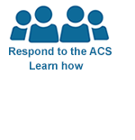

PUMS Data

[Skip Header](https://www.census.gov/programs-surveys/acs/data/pums.html#uscb-nav-skip-local)

 

* * *

**

* * *

[Browse by Topic]()
[Explore Data]()
[Library]()
[Surveys/ Programs]()
[Information for…]()
[Find a Code]()
[About Us]()

.

//

- [Census.gov](https://www.census.gov/en.html)  >

- [Our Surveys & Programs](https://www.census.gov/programs-surveys.html)  >

- [American Community Survey (ACS)](https://www.census.gov/programs-surveys/acs)  >

- [American Community Survey Data](https://www.census.gov/programs-surveys/acs/data.html)  >

- PUMS Data

[Skip Navigation](https://www.census.gov/programs-surveys/acs/data/pums.html#content)

 [American Community Survey (ACS)](https://www.census.gov/programs-surveys/acs)

    - [Data Tables & Tools](https://www.census.gov/programs-surveys/acs/data/data-tables-and-tools.html)

    - [Data via FTP](https://www.census.gov/programs-surveys/acs/data/data-via-ftp.html)

    - [Summary File Data](https://www.census.gov/programs-surveys/acs/data/summary-file.html)

    - [ PUMS Data](https://www.census.gov/programs-surveys/acs/data/pums.html)

    - [Variance Replicate Tables](https://www.census.gov/programs-surveys/acs/data/variance-tables.html)

    - [Race/Ethnicity and American Indian & Alaska Native Data](https://www.census.gov/programs-surveys/acs/data/race-aian.html)

    - [Custom Tables](https://www.census.gov/programs-surveys/acs/data/custom-tables.html)

 ** [ Back to American Community Survey Data](https://www.census.gov/programs-surveys/acs/data.html)

[**](https://www.facebook.com/sharer/sharer.php?u=https://www.census.gov/programs-surveys/acs/data/pums.html&quote=)[**](https://twitter.com/intent/tweet?url=https://www.census.gov/programs-surveys/acs/data/pums.html&text=)[**](https://www.linkedin.com/sharing/share-offsite/?url=https://www.census.gov/programs-surveys/acs/data/pums.html&title=PUMS+Data&text=&source=U.S.+Census+Bureau)

#  PUMS Data

Supporting documentation for the data below is available on the [PUMS Documentation](https://www.census.gov/programs-surveys/acs/technical-documentation/pums.html) page.

### Available on the FTP site

PUMS files back to 2005 are available in CSV and SAS formats

* * *

[   2018 ACS PUMS  * * *](https://www2.census.gov/programs-surveys/acs/data/pums/2018/?#)

[   2017 ACS PUMS  * * *](https://www2.census.gov/programs-surveys/acs/data/pums/2017/?#)

[   2016 ACS PUMS  * * *](https://www2.census.gov/programs-surveys/acs/data/pums/2016/?#)

[   2015 ACS PUMS  * * *](https://www2.census.gov/programs-surveys/acs/data/pums/2015/?#)

[   2014 ACS PUMS  * * *](https://www2.census.gov/programs-surveys/acs/data/pums/2014/?#)

[   2013 ACS PUMS  * * *](https://www2.census.gov/programs-surveys/acs/data/pums/2013/?#)

[   2012 ACS PUMS  * * *](https://www2.census.gov/programs-surveys/acs/data/pums/2012/?#)

[   2011 ACS PUMS  * * *](https://www2.census.gov/programs-surveys/acs/data/pums/2011/?#)

[   2010 ACS PUMS  * * *](https://www2.census.gov/programs-surveys/acs/data/pums/2010/?#)

[   2009 ACS PUMS  * * *](https://www2.census.gov/programs-surveys/acs/data/pums/2009/?#)

[   2008 ACS PUMS  * * *](https://www2.census.gov/programs-surveys/acs/data/pums/2008/?#)

[   2007 ACS PUMS  * * *](https://www2.census.gov/programs-surveys/acs/data/pums/2007/?#)

[   2006 ACS PUMS  * * *](https://www2.census.gov/programs-surveys/acs/data/pums/2006/?#)

[   2005 ACS PUMS  * * *](https://www2.census.gov/programs-surveys/acs/data/pums/2005/?#)

PUMS data prior to 2005 can also be found on our [FTP site](https://www2.census.gov/programs-surveys/acs/data/pums/).

### PUMS on data.census.gov

Microdata access from 2005-current is now available on data.census.gov in beta.

* * *

[   2014-2018 ACS 5-year PUMS  * * *](https://data.census.gov/mdat/?#/search?ds=ACSPUMS5Y2018)

[   2018 ACS 1-year PUMS  * * *](https://data.census.gov/mdat/?#/search?ds=ACSPUMS1Y2018)

[   2013-2017 ACS 5-year PUMS  * * *](https://data.census.gov/mdat/?#/search?ds=ACSPUMS5Y2017)

[   2017 ACS 1-year PUMS  * * *](https://data.census.gov/mdat/?#/search?ds=ACSPUMS1Y2017)

[   2012-2016 ACS 5-year PUMS  * * *](https://data.census.gov/mdat/?#/search?ds=ACSPUMS5Y2016)

[   2016 ACS 1-year PUMS  * * *](https://data.census.gov/mdat/?#/search?ds=ACSPUMS1Y2016)

[   2011-2015 ACS 5-year PUMS  * * *](https://data.census.gov/mdat/?#/search?ds=ACSPUMS5Y2015)

[   2015 ACS 1-year PUMS  * * *](https://data.census.gov/mdat/?#/search?ds=ACSPUMS1Y2015)

[   2010-2014 ACS 5-year PUMS  * * *](https://data.census.gov/mdat/?#/search?ds=ACSPUMS5Y2014)

[   2014 ACS 1-year PUMS  * * *](https://data.census.gov/mdat/?#/search?ds=ACSPUMS1Y2014)

[   2009-2013 ACS 5-year PUMS  * * *](https://data.census.gov/mdat/?#/search?ds=ACSPUMS5Y2013)

[   2013 ACS 1-year PUMS  * * *](https://data.census.gov/mdat/?#/search?ds=ACSPUMS1Y2013)

[   2008-2012 ACS 5-year PUMS  * * *](https://data.census.gov/mdat/?#/search?ds=ACSPUMS5Y2012)

[   2012 ACS 1-year PUMS  * * *](https://data.census.gov/mdat/?#/search?ds=ACSPUMS1Y2012)

[   2007-2011 ACS 5-year PUMS  * * *](https://data.census.gov/mdat/?#/search?ds=ACSPUMS5Y2011)

[   2011 ACS 1-year PUMS  * * *](https://data.census.gov/mdat/?#/search?ds=ACSPUMS1Y2011)

[   2006-2010 ACS 5-year PUMS  * * *](https://data.census.gov/mdat/?#/search?ds=ACSPUMS5Y2010)

[   2010 ACS 1-year PUMS  * * *](https://data.census.gov/mdat/?#/search?ds=ACSPUMS1Y2010)

[   2005-2009 ACS 5-year PUMS  * * *](https://data.census.gov/mdat/?#/search?ds=ACSPUMS5Y2009)

[   2009 ACS 1-year PUMS  * * *](https://data.census.gov/mdat/?#/search?ds=ACSPUMS1Y2009)

Related Information

* * *

[Share Your ACS Data Story](https://www.census.gov/programs-surveys/acs/share-your-acs-data-story.html)

[Contact Us](https://www.census.gov/programs-surveys/acs/contact.html)

[Introduction to the Public Use Microdata Sample (PUMS) File](https://www.census.gov/programs-surveys/acs/guidance/training-presentations/acs-intro-pums.html)

You May Be Interested In

* * *

Related Topics

 [Contact Us](https://www.census.gov/programs-surveys/acs/contact.html) [(L)](https://www.census.gov/programs-surveys/acs/guidance/training-presentations/acs-intro-pums.html)

Around the Bureau

 [Email Updates](https://www.census.gov/programs-surveys/acs/news/email-updates.html) [(L)](https://ask.census.gov/)

Most Popular

 [Share Your ACS Data Story](https://www.census.gov/programs-surveys/acs/share-your-acs-data-story.html) [(L)](https://www.census.gov/library/publications/2009/acs/pums.html)

*Last Revised: January 21, 2020*

.

[Back to Header](https://www.census.gov/programs-surveys/acs/data/pums.html#uscb-nav-skip-header)

Sign Up for Email Updates

To sign up for updates please enter your contact information below.

Stay Current

 [ Newsroom](https://www.census.gov/newsroom.html) [ America Counts](https://www.census.gov/AmericaCounts) [ Blogs](https://www.census.gov/newsroom/blogs.html) [ Stats for Stories](https://www.census.gov/newsroom/stories.html)

Stay Connected

 [ **](https://www.facebook.com/uscensusbureau) [ **](https://twitter.com/uscensusbureau) [ **](https://www.linkedin.com/company/us-census-bureau)

[ **](https://www.youtube.com/user/uscensusbureau) [ **](https://www.instagram.com/uscensusbureau/)

 [Census Jobs](https://www.census.gov/careers)

| [Information Quality](https://www.census.gov/quality/)

| [Data Linkage Infrastructure](https://www.census.gov/datalinkage)

| [Data Protection and Privacy Policy](https://www.census.gov/privacy)

| [Accessibility](https://www.census.gov/about/policies/privacy/privacy-policy.html#accessibility)

| [FOIA](https://www.census.gov/foia)

| [U.S. Department of Commerce](https://www.commerce.gov/)

| [USA.gov](https://www.usa.gov/)

* * *

Measuring America's People, Places, and Economy