Page transitions with Vue.js – Alexis Gaillard – Medium

# Vue transitions with Vue.js

[Alexis Gaillard](https://medium.com/@alexis.gaillard)

Apr 21·4 min read

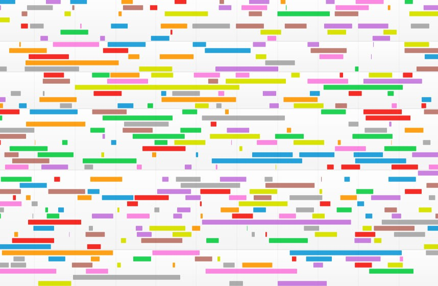

*I’ve been recently working on Vue.js SPA with interesting animations scenarios and ended up with some examples which seemed worth sharing.

In this example I will use the G*[*SAP animation’s library *](https://greensock.com/gsap)*wich is the fullest option out there but the same logic could rely on a lighter library — or even simple CSS’s based animations. I’ve been working with the great V*[*ue CLI 3 *](https://cli.vuejs.org/)*development tooling, with base presets including R*[*outer *](https://router.vuejs.org/)*and V*[*uex.*](https://vuex.vuejs.org/)

* * *

*...*

### Concept

We need to understand when the component’s hooks triggers in combination with the router navigation guards as this will become the reference points to keep our animations synchronized with the routing.

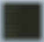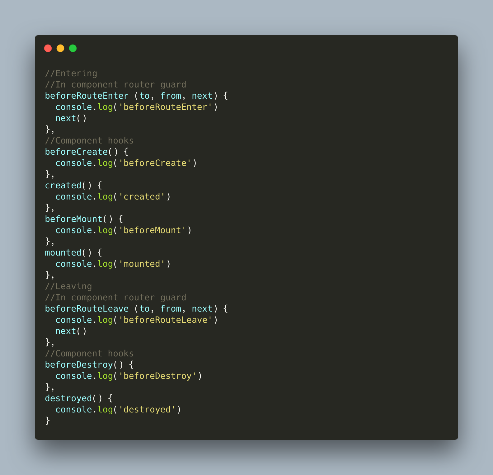

[Component lifecycle](https://vuejs.org/v2/guide/instance.html#Lifecycle-Diagram) + [in component router guards](https://router.vuejs.org/guide/advanced/navigation-guards.html#in-component-guards)

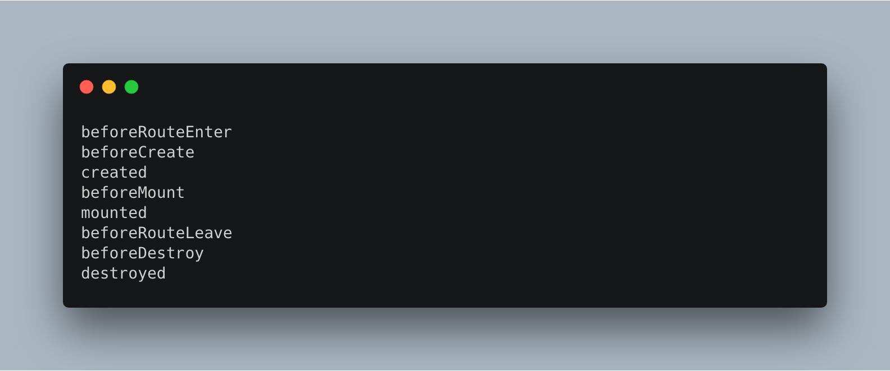

Console outputs

Also keep in mind that we can use [named view](https://router.vuejs.org/guide/essentials/named-views.html#nested-named-views), and keep some components rendered while navigating to defined vues, leading to more creative transition scenarios such as follow:

 

 [a.l.e.x.i.s.g.a.i.l.l.a.r.d](https://www.instagram.com/a.l.e.x.i.s.g.a.i.l.l.a.r.d/?utm_source=ig_embed)

  102 followers

 [View Profile](https://www.instagram.com/a.l.e.x.i.s.g.a.i.l.l.a.r.d/?utm_source=ig_embed)

 

Click video for sound

[(L)](https://www.instagram.com/p/BwZ1K7Jodf2/?utm_source=ig_embed&utm_campaign=embed_video_watch_again)[Watch Again on Instagram](https://www.instagram.com/p/BwZ1K7Jodf2/?utm_source=ig_embed&utm_campaign=embed_video_watch_again)

[(L)](https://www.instagram.com/p/BwZ1K7Jodf2/?utm_source=ig_embed&utm_campaign=embed_video_watch_again)

 [         a.l.e.x.i.s.g.a.i.l.l.a.r.d         12 posts · 102 followers                 ](https://www.instagram.com/a.l.e.x.i.s.g.a.i.l.l.a.r.d/?utm_source=ig_embed)

 [View More on Instagram](https://www.instagram.com/a.l.e.x.i.s.g.a.i.l.l.a.r.d/?utm_source=ig_embed)

 [  Like](https://www.instagram.com/p/BwZ1K7Jodf2/?utm_source=ig_embed)  [ Comment](https://www.instagram.com/p/BwZ1K7Jodf2/?utm_source=ig_embed)  [ Share]()  [ Save](https://www.instagram.com/p/BwZ1K7Jodf2/?utm_source=ig_embed)

 [29 likes](https://www.instagram.com/p/BwZ1K7Jodf2/?utm_source=ig_embed)

 [Add a comment...](https://www.instagram.com/p/BwZ1K7Jodf2/?utm_source=ig_embed)  [Instagram](https://www.instagram.com/p/BwZ1K7Jodf2/?utm_source=ig_embed)

Animations scenario for [@akira.studio](https://www.instagram.com/akira.studio/). Design by [@damienharmand](https://www.instagram.com/damienharmand/)

### Getting started

You need to make the required GSAP plugins available globally like so:

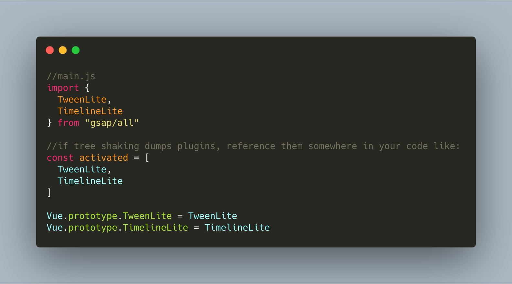

### Animating on enter

On enter we describe our animation scenario in the “mounted” hook of the component, we need our template rendered in order to targets our nodes with the “$refs” object:

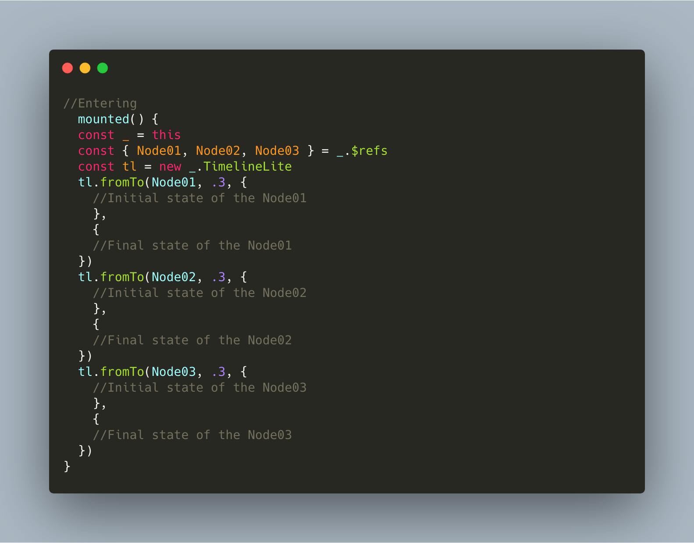

Note that “mounted” does not guarantee that all child components have also been mounted. If you want to wait until the entire view has been rendered, you can use [vm.$nextTick](https://vuejs.org/v2/api/#vm-nextTick) inside of “mounted”.

### Animating on leaving

Here we need to trigger the navigation to the next vue when the exit animation ends. The “beforeRouteLeave” [in-component guard](https://router.vuejs.org/guide/advanced/navigation-guards.html#in-component-guards) can be used for that:

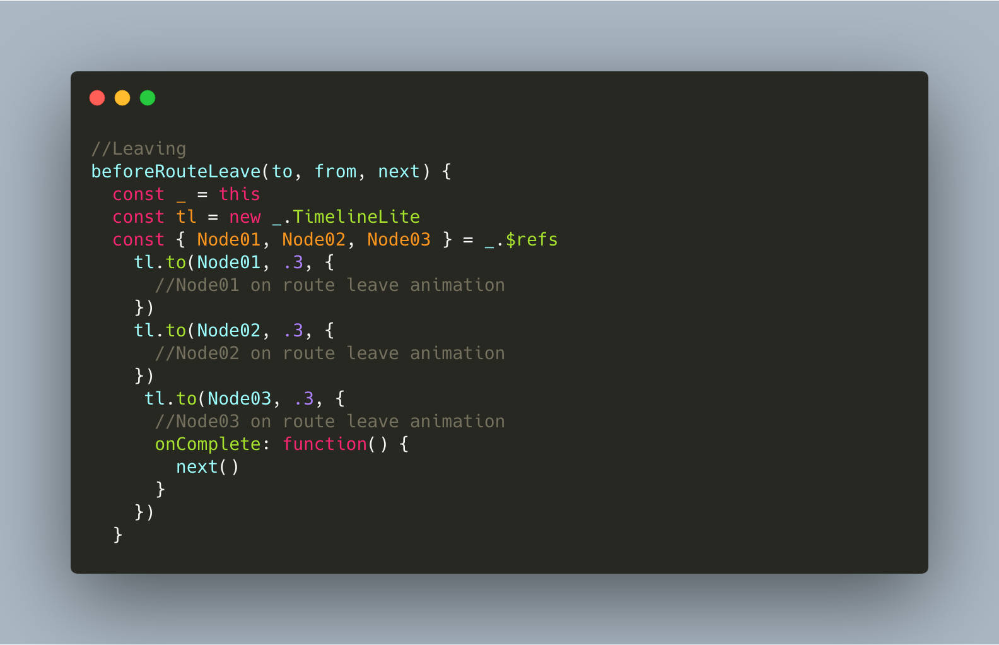

### Manage origins and destinations

The opening animation scenario of a vue might be different depending of the exit animation scenario of the previous vue for ex.

To manage origins and destinations a solution could be to save the previous vue name in our store, then use conditional statements like so:

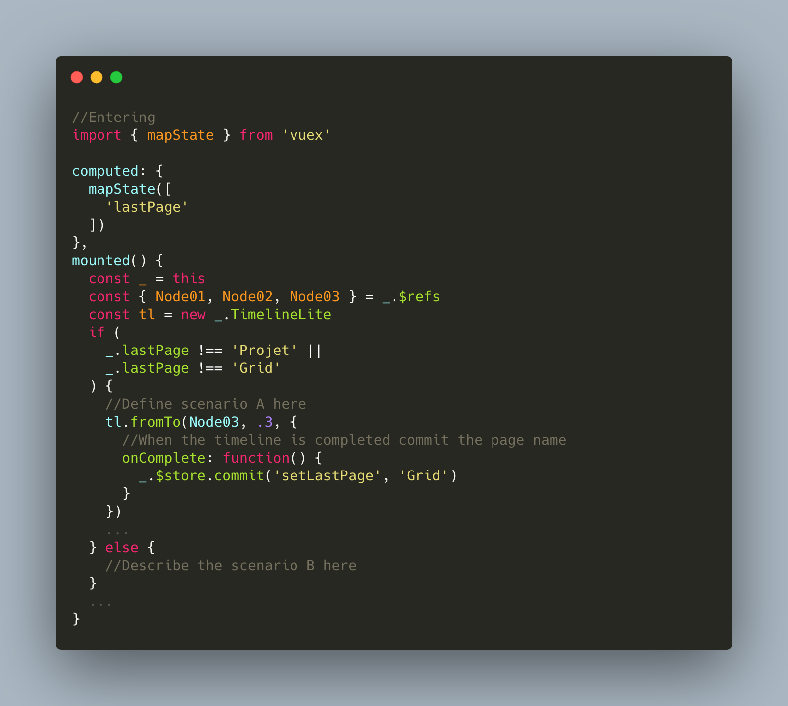

We could use the beforeRouteEnter router guard to push the name of the previous route in the store depending of your needs.

When leaving, you might need to know the destination in order to chain meaningfully the leaving animation scenario with the entering scenario of the next vue. We can rely on the beforeRouteLeave in-component guard for that:

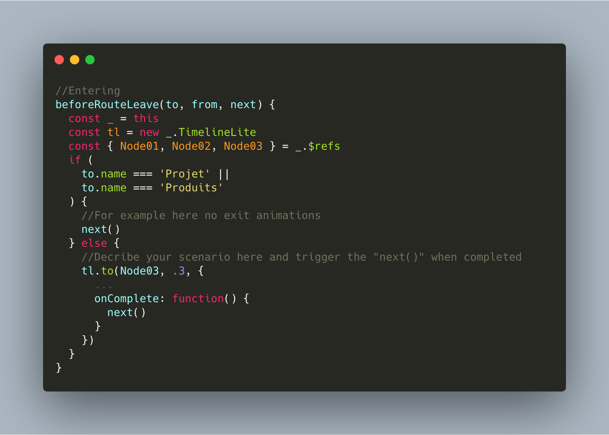

This kind of logic should be tightly coupled with your data fetching, images caching and components preloading, to give transitions a perfect rendering.

### Keep your files tidy

Animations’ timelines syntax are verbose and your component’s files will quickly look bloated. Break down your animations in mixins:

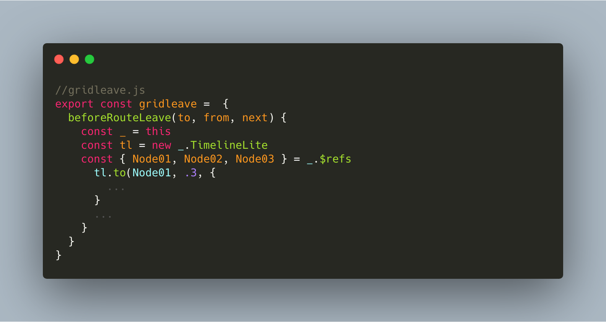

An animation mixin file.

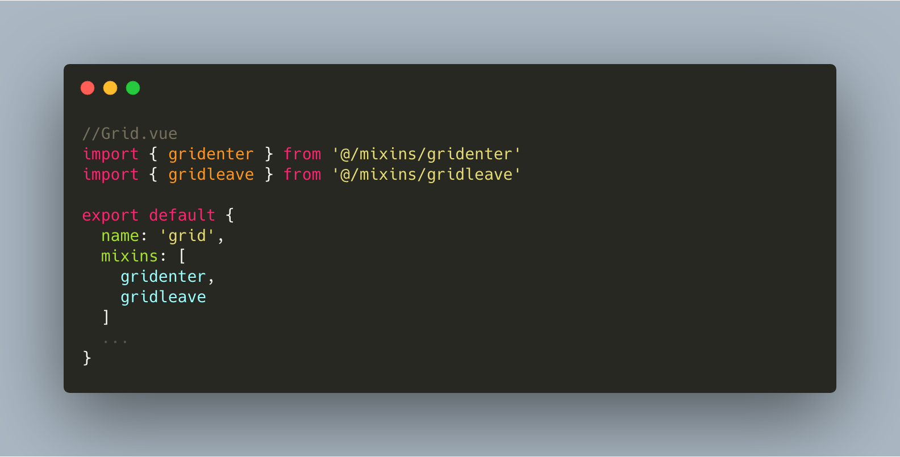

Import the animations mixins in you component.

### Conclusion

After some tries I found the same creative freedom than during my old Flash/ActionScript days while developing a fully accessible/indexable HTML5 app, wich is great. Working this type of transitions can be a great added value in many contexts, however the level of complexity and the amongst of code can increase quickly, that’s why this type of architecture is better suited to projects who doesn’t own too many pages types.

* * *

*...*

### Notes

— We make extensive use of the “$.refs” object wich is considered as an edge case by the official Vue documentation. Of course it’s not optimal to select nodes of markups right after they have been mounted in the DOM and I hope to find a cleaner solution in the future.

— Navigation guards in deeply nested components can be buggy, keep your animation’s description at the top level of your app.

— Avoid the “keep-alive” option on your GSAP animated components for obvious reasons.

— Transitions system on single elements/components is already really comprehensive with [Vue.js](https://fr.vuejs.org/v2/guide/transitions.html#hooks-JavaScript); make sure that what you’re writing is not redundant with what is already available.

— Either your animations underline functional logics -and shouldn’t exceed 400ms- or participate to a more immersive storytelling, they should always be meaningful.

Thank you for your attention!