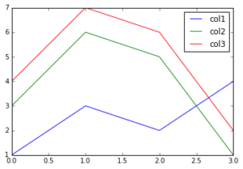
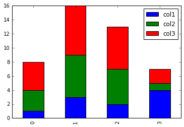
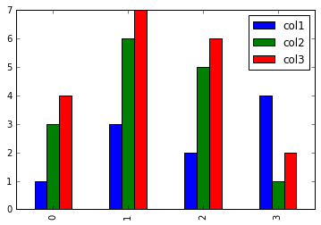
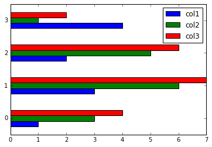

Pandas in Jupyter - Quickstart and Useful Snippets

# Introduction

This article overviews how to quickly set up and get started with the [pandas data analysis library](http://pandas.pydata.org/). It also lists common code snippets for parsing, loading, and transforming data. For more detailed documentation on pandas’ more advanced features (e.g. plot styling and combining data frames) you’ll need to refer to other sources.

# Installing and Importing

First we need to install python and the [pip](https://pip.pypa.io/en/stable/) package manager. If you don’t already have them, you can use [pyenv](https://github.com/yyuu/pyenv) to easily install them (tested on Ubuntu and OS X). On Ubuntu, you can follow [these instructions](http://opencafe.readthedocs.org/en/latest/getting_started/pyenv/) to get pyenv. On OS X you can just use brew:

`[object Object]`

Once you have pyenv, you can install and configure the desired python version as follows:

`[object Object]`

Now we can use *pip* to install pandas, the [ipython](http://ipython.org/) shell, and [jupyter](http://jupyter.org/).

`[object Object]`

The last two libraries will allow us to create web base notebooks in which we can play with python and pandas. If you don’t know what jupyter notebooks are you can see [this tutorial](https://www.youtube.com/watch?v=Rc4JQWowG5I).

Next, we need to start jupyter. I find it useful to store all notebooks on a cloud storage or a folder under version control, so I can share between multiple machines. This can be achieved with an additional parameter as follows:

`[object Object]`
Next, we need to import pandas in the first cell of the jupyter notebook.:
`[object Object]`

# Table Of Contents

When we have a long notebook, it is useful to have an automatically generated table of contents (TOC). The following code (Borrowed from this [post on StackOverflow](http://stackoverflow.com/questions/21188698/what-happend-to-the-toc-extension-for-ipython-notebook/33051798#33051798)) installs the TOC jupyter plugin, i.e.:

Then we need to restart the kernel and make the first cell “Markdown” type and add the following:

`[object Object]`
When you save the TOC should appear.

# Creating Data Frames

[Data frames](http://pandas.pydata.org/pandas-docs/stable/generated/pandas.DataFrame.html) are the central concept in pandas. In essence, a data frame is table with labeled rows and columns. Data frames can be created from multiple sources - e.g. CSV files, excel files, and JSON.

## Loading CSV files

Loading a CSV file as a data frame is pretty easy:
`[object Object]`

Sometimes the CSV file contains padding spaces in front of the values. To ignore them use the *skipinitialspaces* parameter:

`[object Object]`

If the padding white spaces occur on both sides of the cell values we need to use a regular expression separator. In this case, we need to use the ‘python’ processing engine, instead of the underlying native one, in order to avoid warnings. This will degrade the performance a bit:

`[object Object]`

Sometimes we need to sample the data before loading it, as it is too big to fit in memory. This can be achieved following [this approach](http://nikgrozev.com/2015/06/16/fast-and-simple-sampling-in-pandas-when-loading-data-from-files/).

## Hardcoded Dataframes

Hardcoded data frames can be constructed by providing a hash of columns and their values.

`[object Object]`
We will reuse this data frame in some subsequent examples.

# Previewing Data

To preview the data and the metadata of a dataframe you can use the following functions:

`[object Object]`

# Sorting

The *sort_index* method is used to sort the frame by one of its axis indices. The axis is either 0 or 1 - row/column axis respectively:

`[object Object]`
We can also sort by one or multiple columns:
`[object Object]`

# Selecting/Querying

Individual columns can be selected with the [] operator or directly as attributes:

`[object Object]`

You can also select by absolute coordinates/position in the frame. Indices are zero based:

`[object Object]`

Most often, we need to select by a condition on the cell values. To do so, we provide a boolean array denoting which rows will be selected. The trick is that *pandas* predefines many boolean operators for its data frames and series. For example the following expression produces a boolean array:

`[object Object]`
This allows us to write queries like these:
`[object Object]`

# Modifying Data Frames

Pandas’ operations tend to produce new data frames instead of modifying the provided ones. Many operations have the optional boolean *inplace* parameter which we can use to force pandas to apply the changes to subject data frame.

It is also possible to directly assign manipulate the values in cells, columns, and selections as follows:

`[object Object]`

It is often useful to create new columns based on existing ones by using a function. The new columns are often called *Derived Characteristics*:

`[object Object]`

# Dates and Time

When loading data from a CSV, we can tell pandas to look for and parse dates. The [parse_dates](http://pandas.pydata.org/pandas-docs/stable/generated/pandas.read_csv.html) parameters can be used for that. In the most typical case, you would pass a list of column names as *parse_dates*:

`[object Object]`

This will work for most typical date formats. If it does not (i.e. we have a non-standard date format) we need to supply our own date parser:

`[object Object]`

Alternatively, if we’ve already loaded the data frame we can change a column from string to a date:

`[object Object]`

For more on date-time formats look at the [documentation](https://docs.python.org/2/library/datetime.html#strftime-and-strptime-behavior).

Often we need to work with [Unix/Posix timestamps](https://en.wikipedia.org/wiki/Unix_time). Converting numeric timestamps to pandas timestamps is easy with the *unit* parameter:

`[object Object]`

If we need to parse Posix timestamps while reading CSVs, we can once again resort to converter functions. In the converter function we can use the [pandas.to_datetime](http://pandas.pydata.org/pandas-docs/stable/generated/pandas.to_datetime.html) utility which accepts a *unit* parameter:

`[object Object]`
We can also convert time/timestamp data to Unix epoch numbers:
`[object Object]`

# Plotting

## Set Up

Pandas uses [matplotlib](http://matplotlib.org/) to render graphs, so you need to install it:

`[object Object]`

Before we continue we need to test if matplotlib was set up properly. Open a terminal, start the python interpreter, and type:

`[object Object]`

If the import works without problems you’re good to go. However, sometimes in OS X you may get the following error:

>

*> “RuntimeError: Python is not installed as a framework. The Mac OS X backend will not be able to function correctly if Python is not installed as a framework. See the Python documentation for more information on installing Python as a framework on Mac OS X. Please either reinstall Python as a framework, or try one of the other backends. If you are Working with Matplotlib in a virtual enviroment, see ‘Working with Matplotlib in Virtual environments’ in the Matplotlib FAQ”*

If that error occurs, you need to execute the following from terminal:
`[object Object]`

This will set the proper matplotlib backend, as discussed [here](http://stackoverflow.com/questions/21784641/installation-issue-with-matplotlib-python).

Now we can import the matplot library in one of the jupyter notebook cells:
`[object Object]`

There is one last configuration to complete before we can display plots in the web notebook. We need to tell jupyter to display the matplotlib plots as images in the notebook itself. To do so, type the following command in one of the notbook cells:

`[object Object]`

## Basic Plotting

In the rest of this section we’ll use the following data frame:
`[object Object]`

Data frames have a method called *plot*. By default, it plots a line chart with al numerical columns. The x-axis is the row index of the data frame. In other words, you’re plotting :

`[object Object]`

Line chart.
We can also specify a column for the x-axis:
`[object Object]`

The *plot* has an optional parameter *kind* which can be used to plot the data in different type of visualisation - e.g. bar harts, pie chart, or histograms.

Using *kind=’bar’* produces multiple plots - one for each row. In each plot, there’s a bar for each cell.

`[object Object]`

Boxplots are displayed with the *kind=’box’* options. Each box represents a numeric column.

`[object Object]`

     

Various plots.