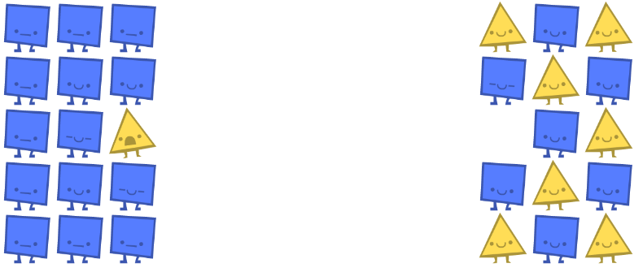
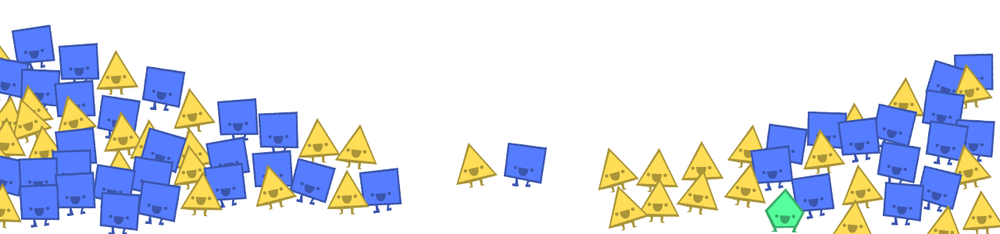

Parable of the Polygons - a playable post on the shape of society

by [vi hart](http://vihart.com/) + [nicky case](http://www.patreon.com/ncase)

[español](http://ncase.me/polygons-es)|[deutsch](http://ncase.me/polygons-de)|[français](http://ncase.me/polygons-fr)|[português](http://ncase.me/polygons-pt-br)|[日本語](http://ncase.me/polygons-ja)|[中文](http://ncase.me/polygons-zh)|[polski](http://booschie.github.io/polygons-pl)

[italiano](http://ncase.me/polygons-it)|[magyar](http://ncase.me/polygons-hu)|[nederlands](http://ncase.me/polygons-nl)|[हिन्दी](http://ncase.me/polygons-hi)|[čeština](http://www.bajkaotvarech.cz/)|[Русский](https://nogoegst.github.io/polygons-ru/)|[العربيّة](https://www.aularon.com/playables/polygons-ar/)|[Українська](http://zlira.github.io/polygons/)

**This is a story of how harmless choices can make a harmful world.**

These little cuties are 50% Triangles, 50% Squares, and 100% slightly shapist. But only slightly! In fact, every polygon *prefers* being in a diverse crowd:

reset

You can only move them if they're unhappy with their immediate neighborhood. Once they're OK where they are, *you can't move them until they're unhappy with their neighbors again*. They've got one, simple rule:

**“I wanna move if less than 1/3 of my neighbors are like me.”**

unhappy:only 1 out of 6 neighbors are like me. less than 1/3.

happy:2 out of 6 neighbors are like me. exactly 1/3.

meh:all neighbors are like me. (also meh if i've got no neighbors)

Harmless, right? Every polygon would be happy with a mixed neighborhood. Surely their small bias can't affect the larger shape society that much? Well...

drag & drop unhappy polygons until nobody is unhappy:
(just move them to random empty spots. don't think too much about it.)

And... our shape society becomes super segregated. Daaaaang.

Sometimes a neighborhood just becomes square, and it's not their fault if no triangles wanna stick around. And a triangular neighborhood would welcome a square, but they can't help it if squares ain't interested.

reset

In this next bit, unhappy shapes automatically move to random empty spots. There's also a graph that tracks how much segregation there is over time.

run this simulation a few times. what happens?

0%

What's up with that? These are good shapes, nice shapes. And yet, though every individual only has a slight bias, the entire shape society cracks and splits.

reset
**Small individual bias can lead to large collective bias.**

Equality is an unstable equilibrium. The smallest of bias can push a whole society past the tipping point. Well, what if we taught these shapes to have zero bias? (Or if you're feeling particularly nasty today, more bias?)

use the slider to adjust the shapes' individual bias:

1%
i'll move if less than 33% of my neighbors are like me

Notice how much more segregated things become, when you increase the bias beyond 33%. What if the threshold was at 50%? Seems reasonable for a shape to prefer not being in the minority...

wants to move if less than 33% of
their neighbors are like them
reset

wants to move if less than 50% of
their neighbors are like them
reset

So yeah, just turn everyone's bias down to zero, right? Haha, NOPE. The real world doesn't start anew with a random shuffling of citizens every day. Everyday, you're not shuffling.

world starts segregated. what happens when you lower the bias?

53%
i'll move if less than 33% of my neighbors are like me

See what *doesn't* happen? No change. No mixing back together. In a world where bias ever existed, being unbiased isn't enough! We're gonna need active measures. What if shapes wanted to seek out just a lil' more variety?

wants to move if more than 90% of
their neighbors are like them
reset

Woah. Even though each polygon would be okay with having up to 90% of their neighbors that are like them, they all mix together! Let's see this play out on a larger scale, when we change the amount of bias and anti-bias for all shapes.

world starts segregated. what happens when shapes demand even the smallest bit of diversity?

53%
i'll move if <10% or >80% of my neighbors are like me

All it takes is a change in the perception of what an acceptable environment looks like. So, fellow shapes, remember it's not about triangles vs squares, it's about deciding what we want the world to look like, and settling for no less.

**GET THEM ALL IN THE BOX OFFRIENDSHIP
(hint: don't move them straight to the box; keep the pairs close together)**

reset

At first, going out on your own can be isolating... but by working together, step by step, we'll get there.

finally, a big ol' sandbox to play around in.

0%
i'll move if <20% or >80% of my neighbors are like me

the triangle:square ratio is50:50, board is20% empty

WRAPPING UP:
**1. Small individual bias → Large collective bias.**

When someone says a culture is shapist, they're not saying the *individuals* in it are shapist. They're not attacking you personally.

**2. The past haunts the present.**

Your bedroom floor doesn't stop being dirty just coz you stopped dropping food all over the carpet. Creating equality is like staying clean: it takes work. And it's always a work in progress.

**3. Demand diversity near you.**

If small biases created the mess we're in, small anti-biases might fix it. Look around you. Your friends, your colleagues, that conference you're attending. If you're all triangles, you're missing out on some amazing squares in your life - that's unfair to everyone. Reach out, beyond your immediate neighbors.

Thank you for playing this blog post!

Our cute segregation sim is based off the work of Nobel Prize-winning game theorist, Thomas Schelling. Specifically, his 1971 paper,[Dynamic Models of Segregation.](http://www.stat.berkeley.edu/~aldous/157/Papers/Schelling_Seg_Models.pdf)We built on top of this, and showed how a small demand for diversity can desegregate a neighborhood. In other words, we gave his model a happy ending.

Schelling's model gets the general gist of it, but of course, real life is more nuanced. You might enjoy looking at real-world data, such as W.A.V. Clark's 1991 paper,[A Test of the Schelling Segregation Model](http://smg.media.mit.edu/library/Clark.ResidentialSegregation.pdf).

There are other mathematical models of institutionalized bias out thereshows how a small gender bias compounds as you move up the corporate ladder.[The Petrie Multiplier](http://iangent.blogspot.com/2013/10/the-petrie-multiplier-why-attack-on.html)shows why an attack on sexism in tech is *not* an attack on men.

Today's Big Moral Message™ is that demanding a bit of diversity in your spaces makes a huge difference overall. Look at[Plz Diversify Your Panel](http://plzdiversifyyourpanel.tumblr.com/), an initiative where overrepresented speakers pledge not to speak on panels without diverse representation.

Our "playable post" was inspired by Bret Victor's[Explorable Explanations](http://worrydream.com/ExplorableExplanations/) and Ian Bogost's[procedural rhetoric](http://bogost.com/books/persuasive_games/).

**Donate to Diversity!**

[Black Girls Code](http://www.blackgirlscode.com/)- gives coding lessons to girls of color

[Girls Who Code](http://girlswhocode.com/)- teaches high school girls to code
[Code 2040](http://code2040.org/)- helps blacks & latina/os get into tech

[Code Liberation](http://codeliberation.org/)- free workshops to help women make videogames

[Nicky's Patreon](http://www.patreon.com/ncase)- makes public domain playables (such as this one!)

**Thank you to our beta-readers:**
Andrea, Astrid, Catherine, Chris, Emily, Glen, Jocelyn, Laura, Marc, Marko, Zak

**Also Seen On:**

[WIRED](http://www.wired.com/2014/12/empzeal-parable-polygons/),[Washington Post](http://www.washingtonpost.com/blogs/wonkblog/wp/2014/12/09/how-tiny-individual-biases-have-huge-cumulative-effects-on-racial-segregation/),[BoingBoing](http://boingboing.net/2014/12/08/parable-of-the-polygons-segre.html),[Creative Commons](http://ccthing.tumblr.com/post/104764760336/parable-of-the-polygons-vi-hart-and-nicky-case),[KillScreen](http://killscreendaily.com/articles/parable-polygons-teaches-us-danger-and-power-individual-bias/),[JayIsGames](http://jayisgames.com/archives/2014/12/parable_of_the_polygons.php),[Hacker News](https://news.ycombinator.com/item?id=8716538),[MetaFilter](http://www.metafilter.com/145147/Parable-of-the-Polygons),[New York Magazine](http://nymag.com/scienceofus/2014/12/these-cartoon-shapes-are-adorable-but-racist.html),[The Atlantic's CityLab](http://www.citylab.com/design/2014/12/an-immersive-game-shows-how-easily-segregation-arisesand-how-we-might-fix-it/383586/),[Salon](http://www.salon.com/2014/12/10/sweet_little_shapes_teach_an_important_lesson_about_segregation/),[Polygon](http://www.polygon.com/2014/12/11/7361201/parable-of-the-polygons-bias),[Gamasutra](http://www.gamasutra.com/view/news/232873/Using_systems_to_explain_systemic_problems_in_Parable_of_the_Polygons.php)

**Translations:**

[Spanish](http://ncase.me/polygons-es),[French](http://ncase.me/polygons-fr),[German](http://ncase.me/polygons-de),[Portuguese (Brazilian)](http://ncase.me/polygons-pt-br),[Japanese](http://ncase.me/polygons-ja),[Chinese (Simplified)](http://ncase.me/polygons-zh),[Chinese (Traditional)](https://audreyt.github.io/polygons/),[Polish](http://booschie.github.io/polygons-pl),[Italian](http://ncase.me/polygons-it),[Hungarian](http://ncase.me/polygons-hu),[Dutch](http://ncase.me/polygons-nl),[Hindi](http://ncase.me/polygons-hi),[Czech](http://www.bajkaotvarech.cz/),[Russian](https://nogoegst.github.io/polygons-ru/),[Arabic](https://www.aularon.com/playables/polygons-ar/),[Persian](https://hamed.github.io/polygons/),[Ukrainian](https://zlira.github.io/polygons/)

**Things Based Off This Thing:**

[Polygons with Pentagons](http://ncase.me/polygons-pentagons/play/automatic/automatic_sandbox_frame.html),[Polygons in Snap!](http://snap.berkeley.edu/snapsource/snap.html#present:Username=jens&ProjectName=Parable),[Playthrough Video](https://youtu.be/v02DTSSTc5k)

SHARE:

this playable post is[public domain](http://creativecommons.org/publicdomain/zero/1.0/).

please feel free to use this in your classrooms, make video/picture/text adaptations, or modify the [source code](https://github.com/ncase/polygons)! attribution is not mandatory, but super appreciated. we are [vi hart](http://vihart.com/) and [nicky case](http://www.patreon.com/ncase).

show us how you're using and remixing Parable of the Polygons!

tweet us at[@vihartvihart](https://twitter.com/vihartvihart) and[@ncasenmare](https://twitter.com/ncasenmare).