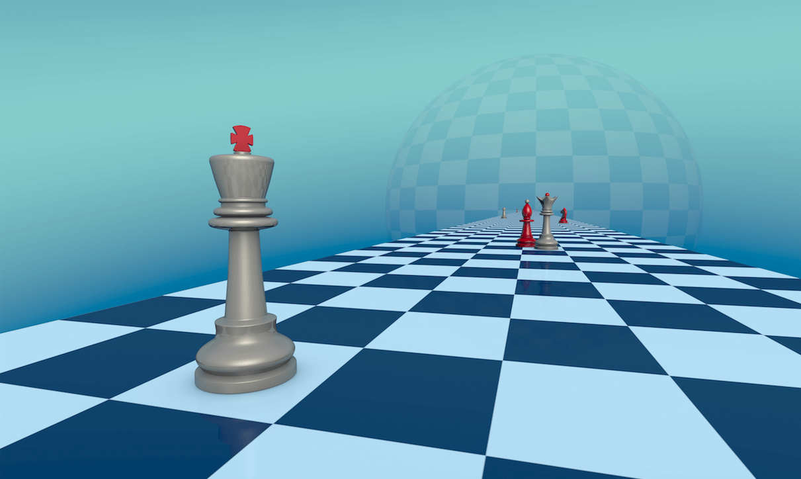
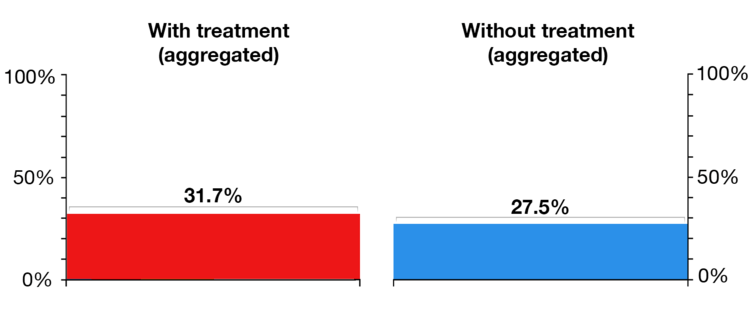
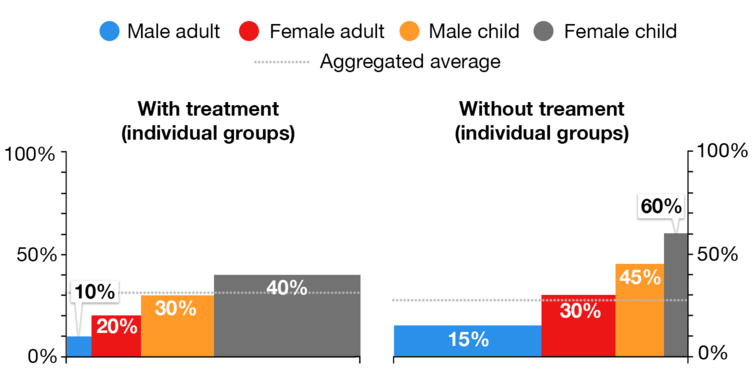
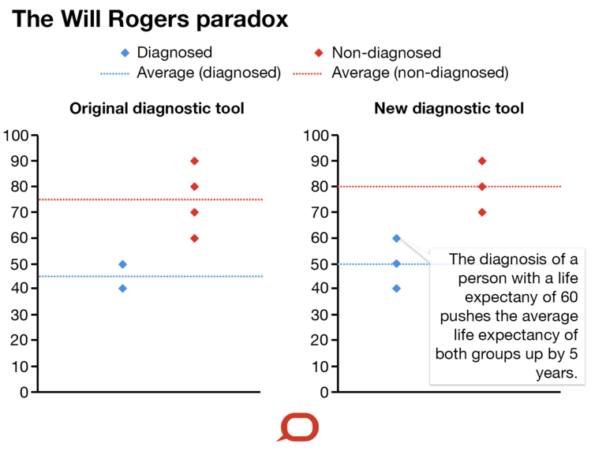
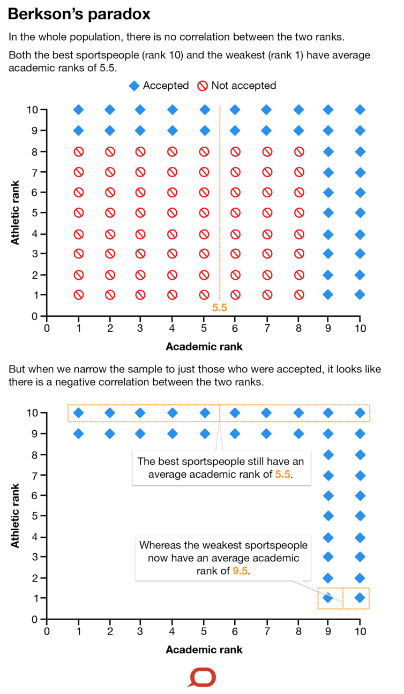
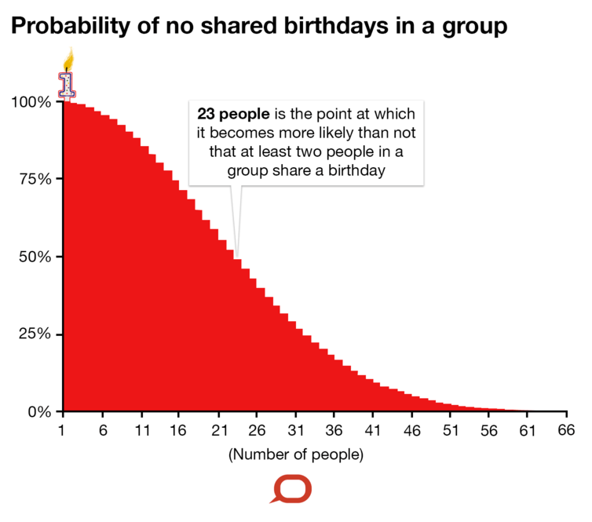
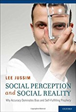
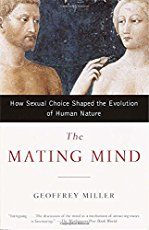
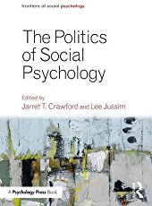

Paradoxes of Probability and Other Statistical Strangeness - Quillette

[Science / Tech](http://quillette.com/category/science-tech/)

Published on [May 26, 2017](http://quillette.com/2017/05/26/paradoxes-probability-statistical-strangeness/)

# Paradoxes of Probability and Other Statistical Strangeness

written by [Stephen Woodcock](http://quillette.com/author/stephen-woodcock/)

You don’t have to wait long to see a headline proclaiming that some food or behaviour is associated with either an increased or a decreased health risk, or [often both](http://fivethirtyeight.com/features/you-cant-trust-what-you-read-about-nutrition/). How can it be that seemingly rigorous scientific studies can produce opposite conclusions?

Nowadays, researchers can access a wealth of software packages that can readily analyse data and output the results of complex statistical tests. While these are powerful resources, they also open the door to people without a full statistical understanding to misunderstand some of the subtleties within a dataset and to draw wildly incorrect conclusions.

Here are a few common statistical fallacies and paradoxes and how they can lead to results that are counterintuitive and, in many cases, simply wrong.

**Simpson’s paradox**

This is where trends that appear within different groups disappear when data for those groups are combined. When this happens, the overall trend might even appear to be the opposite of the trends in each group.

One example of this paradox is where a treatment can be detrimental in all groups of patients, yet can appear beneficial overall once the groups are combined.

This can happen when the sizes of the groups are uneven. A trial with careless (or unscrupulous) selection of the numbers of patients could conclude that a harmful treatment appears beneficial.

Consider the following [double blind trial](https://en.wikipedia.org/wiki/Blinded_experiment#Double-blind_trials) of a proposed medical treatment. A group of 120 patients (split into subgroups of sizes 10, 20, 30 and 60) receive the treatment, and 120 patients (split into subgroups of corresponding sizes 60, 30, 20 and 10) receive no treatment.

The overall results make it look like the treatment was beneficial to patients, with a higher recovery rate for patients with the treatment than for those without it.

The Conversation, CC BY-ND

However, when you drill down into the various groups that made up the cohort in the study, you see in all groups of patients, the recovery rate was 50% higher for patients who had *no* treatment.

The Conversation, CC BY-ND

But note that the size and age distribution of each group is different between those who took the treatment and those who didn’t. This is what distorts the numbers. In this case, the treatment group is disproportionately stacked with children, whose recovery rates are typically higher, with or without treatment.

**Base rate fallacy**

This fallacy occurs when we disregard important information when making a judgement on how likely something is.

If, for example, we hear that someone loves music, we might think it’s more likely they’re a professional musician than an accountant. However, there are many more accountants than there are professional musicians. Here we have neglected that the *base rate* for the number of accountants is far higher than the number of musicians, so we were unduly swayed by the information that the person likes music.

The base rate fallacy occurs when the base rate for one option is substantially higher than for another.

Consider testing for a rare medical condition, such as one that affects only 4% (1 in 25) of a population.

Let’s say there is a test for the condition, but it’s not perfect. If someone has the condition, the test will correctly identify them as being ill around 92% of the time. If someone *doesn’t* have the condition, the test will correctly identify them as being healthy 75% of the time.

So if we test a group of people, and find that over a quarter of them are diagnosed as being ill, we might expect that most of these people really do have the condition. But we’d be wrong.

* * *

In a typical sample of 300 patients, for every 11 people correctly identified as unwell, a further 72 are incorrectly identified as unwell. The Conversation, CC BY-ND

According to our numbers above, of the 4% of patients who are ill, almost 92% will be correctly diagnosed as ill (that is, about 3.67% of the overall population). But of the 96% of patients who are not ill, 25% will be *incorrectly* diagnosed as ill (that’s 24% of the overall population).

What this means is that of the approximately 27.67% of the population who are diagnosed as ill, only around 3.67% actually are. So of the people who were diagnosed as ill, only around 13% (that is, 3.67%/27.67%) actually are unwell.

Worryingly, when [a famous study](http://www.archwoodside.com/wp-content/uploads/2015/09/Gigerenzer-Hoffrage-How-to-improve-Bayesian-reasoning-without-instruction.pdf) asked general practitioners to perform a similar calculation to inform patients of the correct risks associated with mammogram results, just 15% of them did so correctly.

**Will Rogers paradox**

This occurs when moving something from one group to another raises the average of both groups, even though no values actually increase.

The name comes from the [American comedian Will Rogers](https://en.wikipedia.org/wiki/Will_Rogers), who joked that “when the Okies left Oklahoma and moved to California, they raised the average intelligence in both states”.

Former New Zealand Prime Minister Rob Muldoon provided a [local variant on the joke](http://www.independent.co.uk/news/world/australasia/more-people-moving-from-australia-to-new-zealand-than-in-the-other-direction-for-first-time-in-24-10268060.html) in the 1980s, regarding migration from his nation into Australia.

When a datapoint is reclassified from one group to another, if the point is below the average of the group it is leaving, but above the average of the one it is joining, both groups’ averages will increase.

Consider the case of six patients whose life expectancies (in years) have been assessed as being 40, 50, 60, 70, 80 and 90.

The patients who have life expectancies of 40 and 50 have been diagnosed with a medical condition; the other four have not. This gives an average life expectancy within diagnosed patients of 45 years and within non-diagnosed patients of 75 years.

If an improved diagnostic tool is developed that detects the condition in the patient with the 60-year life expectancy, then the average within both groups rises by 5 years.

The Conversation, CC BY-ND
**Berkson’s paradox**

Berkson’s paradox can make it look like there’s an association between two independent variables when there isn’t one.

This happens when we have a set with two independent variables, which means they should be entirely unrelated. But if we only look at a subset of the whole population, it can look like there is a negative trend between the two variables.

This can occur when the subset is not an unbiased sample of the whole population. It has been [frequently cited in medical statistics](https://www.ncbi.nlm.nih.gov/pmc/articles/PMC3237868/). For example, if patients only present at a clinic with disease A, disease B or both, then even if the two diseases are independent, a negative association between them may be observed.

Consider the case of a school that recruits students based on both academic and sporting ability. Assume that these two skills are totally independent of each other. That is, in the whole population, an excellent sportsperson is just as likely to be strong or weak academically as is someone who’s poor at sport.

If the school admits only students who are excellent academically, excellent at sport or excellent at both, then within this group it would appear that sporting ability is negatively correlated with academic ability.

To illustrate, assume that every potential student is ranked on both academic and sporting ability from 1 to 10. There are an equal proportion of people in each band for each skill. Knowing a person’s band in either skill does not tell you anything about their likely band in the other.

Assume now that the school only admits students who are at band 9 or 10 in at least one of the skills.

If we look at the whole population, the average academic rank of the weakest sportsperson and the best sportsperson are both equal (5.5).

However, within the set of admitted students, the average academic rank of the elite sportsperson is still that of the whole population (5.5), but the average academic rank of the weakest sportsperson is 9.5, wrongly implying a negative correlation between the two abilities.

The Conversation, CC BY-ND

**Multiple comparisons fallacy**

This is where unexpected trends can occur through random chance alone in a data set with a large number of variables.

When looking at many variables and mining for trends, it is easy to overlook how many possible trends you are testing. For example, with 1,000 variables, there are almost half a million (1,000×999/2) potential pairs of variables that might appear correlated by pure chance alone.

While each pair is extremely unlikely to look dependent, the chances are that from the half million pairs, quite a few will look dependent.

The Birthday paradox is a classic example of the multiple comparisons fallacy.

In a group of 23 people (assuming each of their birthdays is an independently chosen day of the year with all days equally likely), it is more likely than not that at least two of the group have the same birthday.

People often disbelieve this, recalling that it is rare that they meet someone who shares their own birthday. If you just pick two people, the chance they share a birthday is, of course, low (roughly 1 in 365, which is less than 0.3%).

However, with 23 people there are 253 (23×22/2) pairs of people who might have a common birthday. So by looking across the whole group you are testing to see if any one of these 253 pairings, each of which independently has a 0.3% chance of coinciding, does indeed match. These many possibilities of a pair actually make it statistically very likely for coincidental matches to arise.

For a group of as few as 40 people, it is almost nine times as likely that there is a shared birthday than not.

The probability of no shared birthdays drops as the number of people in a group increases. The Conversation, CC BY-ND

**[Stephen Woodcock](https://theconversation.com/profiles/stephen-woodcock-139816) is a Senior Lecturer in Mathematics at the [University of Technology Sydney.](http://theconversation.com/institutions/university-of-technology-sydney-936)**

*This [article](https://theconversation.com/paradoxes-of-probability-and-other-statistical-strangeness-74440) was originally published on [The Conversation](http://theconversation.com/). *

### Share this:

- [**Tweet](https://twitter.com/intent/tweet?original_referer=http%3A%2F%2Fquillette.com%2F2017%2F05%2F26%2Fparadoxes-probability-statistical-strangeness%2F&ref_src=twsrc%5Etfw&text=Paradoxes%20of%20Probability%20and%20Other%20Statistical%20Strangeness&tw_p=tweetbutton&url=http%3A%2F%2Fquillette.com%2F2017%2F05%2F26%2Fparadoxes-probability-statistical-strangeness%2F&via=QuilletteM)

-

[(L)](https://www.facebook.com/sharer/sharer.php?app_id=249643311490&kid_directed_site=0&sdk=joey&u=http%3A%2F%2Fquillette.com%2F2017%2F05%2F26%2Fparadoxes-probability-statistical-strangeness%2F&display=popup&ref=plugin&src=share_button)

- [reddit](https://www.reddit.com/r/Foodforthought/comments/6h1zh3/paradoxes_of_probability_and_other_statistical/)

[Upvote](https://www.reddit.com/r/Foodforthought/comments/6h1zh3/paradoxes_of_probability_and_other_statistical/)[Downvote](https://www.reddit.com/r/Foodforthought/comments/6h1zh3/paradoxes_of_probability_and_other_statistical/)[10 points](https://www.reddit.com/r/Foodforthought/comments/6h1zh3/paradoxes_of_probability_and_other_statistical/)

- [(L)](https://plus.google.com/share?app=110&url=http%3A%2F%2Fquillette.com%2F2017%2F05%2F26%2Fparadoxes-probability-statistical-strangeness%2F)
- [inShare.](#)448
- [Email](http://quillette.com/2017/05/26/paradoxes-probability-statistical-strangeness/?share=email&nb=1)
- [Print](http://quillette.com/2017/05/26/paradoxes-probability-statistical-strangeness/#print)

-
.

 Recommended

 

 [  Social Perception and Social Reality: Why Ac…](http://aax-us-east.amazon-adsystem.com/x/c/Ql0tANhUYBDTrxm7ranTbVUAAAFd9aib3gEAAAFKAbiXlc0/https://www.amazon.com/Social-Perception-Reality-Dominates-Self-Fulfilling/dp/0195366603/ref=sm_n_ma_dka_GB_pr_pub_0_0?sigts=1503065054205&sig=90895e85120e669757ec16b81e3912eb3b389fde&adId=0195366603&creativeASIN=0195366603&linkId=1596e3f5204ed49a059651d65674785b&tag=quillette-20&linkCode=w43&ref-refURL=http%3A%2F%2Fquillette.com%2F2017%2F05%2F26%2Fparadoxes-probability-statistical-strangeness%2F&slotNum=0&imprToken=RZPdmmGmZ6FsSOUtexZLUw)

 $84.60$94.00

       (5)

 

 [  The Mating Mind: How Sexual Choice Shaped…](http://aax-us-east.amazon-adsystem.com/x/c/Ql0tANhUYBDTrxm7ranTbVUAAAFd9aib3gEAAAFKAbiXlc0/https://www.amazon.com/Mating-Mind-Sexual-Choice-Evolution/dp/038549517X/ref=sm_n_ma_dka_GB_pr_pub_0_1?sigts=1503065054205&sig=dcba11f8ae96da16720b016cbd84f1a75dc9bd94&adId=038549517X&creativeASIN=038549517X&linkId=1596e3f5204ed49a059651d65674785b&tag=quillette-20&linkCode=w43&ref-refURL=http%3A%2F%2Fquillette.com%2F2017%2F05%2F26%2Fparadoxes-probability-statistical-strangeness%2F&slotNum=0&imprToken=RZPdmmGmZ6FsSOUtexZLUw)

 $8.44$17.95

       (71)

 

 [  Steven Pinker: The Blank Slate : The Moder…](http://aax-us-east.amazon-adsystem.com/x/c/Ql0tANhUYBDTrxm7ranTbVUAAAFd9aib3gEAAAFKAbiXlc0/https://www.amazon.com/Steven-Pinker-Modern-Denial-Paperback/dp/B01FOD5GOC/ref=sm_n_ma_dka_GB_pr_pub_0_2?sigts=1503065054205&sig=519922bba92000a480889347e961487f4ed5d3e8&adId=B01FOD5GOC&creativeASIN=B01FOD5GOC&linkId=1596e3f5204ed49a059651d65674785b&tag=quillette-20&linkCode=w43&ref-refURL=http%3A%2F%2Fquillette.com%2F2017%2F05%2F26%2Fparadoxes-probability-statistical-strangeness%2F&slotNum=0&imprToken=RZPdmmGmZ6FsSOUtexZLUw)

 $35.75

       (372)

 

 [  Politics of Social Psychology (Frontiers of Social Psychology)](http://aax-us-east.amazon-adsystem.com/x/c/Ql0tANhUYBDTrxm7ranTbVUAAAFd9aib3gEAAAFKAbiXlc0/https://www.amazon.com/Politics-Social-Psychology-Frontiers/dp/1138930601/ref=sm_n_ma_dka_GB_pr_pub_0_3?sigts=1503065054205&sig=98dcc3a36e515ad459fd3b3f12240c743797f65e&adId=1138930601&creativeASIN=1138930601&linkId=1596e3f5204ed49a059651d65674785b&tag=quillette-20&linkCode=w43&ref-refURL=http%3A%2F%2Fquillette.com%2F2017%2F05%2F26%2Fparadoxes-probability-statistical-strangeness%2F&slotNum=0&imprToken=RZPdmmGmZ6FsSOUtexZLUw)

 $54.95

All

     [Ads by Amazon](https://affiliate-program.amazon.com/home/ads/ref=sm_n_ma_dka_GB_logo?sigts=1503065054205&sig=83ce199fe61c29df4df22830442b90dad2cd5ce8&adId=logo&creativeASIN=logo&linkId=1596e3f5204ed49a059651d65674785b&tag=quillette-20&linkCode=w43&ref-refURL=http%3A%2F%2Fquillette.com%2F2017%2F05%2F26%2Fparadoxes-probability-statistical-strangeness%2F&slotNum=0&imprToken=RZPdmmGmZ6FsSOUtexZLUw&ac-ms-src=nsa-ads&cid=nsa-ads)  [(L)](https://www.amazon.com/adprefs)

Filed under: [Science / Tech](http://quillette.com/category/science-tech/)