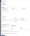
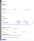
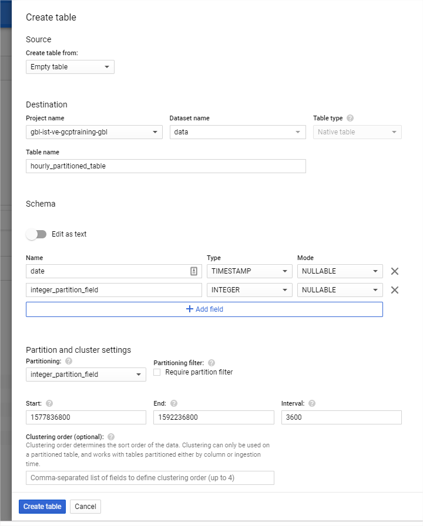

Partition on any field with BigQuery - Google Cloud Platform - Community - Medium

# Partition on any field with BigQuery

[guillaume blaquiere](https://medium.com/@guillaume.blaquiere?source=post_page-----840f8aa1aaab----------------------)

[Dec 16](https://medium.com/google-cloud/partition-on-any-field-with-bigquery-840f8aa1aaab?source=post_page-----840f8aa1aaab----------------------) · 6 min read

Data are critical for companies. Many of them have more data than the capability to process them. And, sadly, a** lot of values sleep in databases.**

BigQuery is a Google Cloud Platform product which address this topic. **BigQuery is a petabyte scale data warehouse** and you can query terabytes of data in seconds and you can **unlock the power of your sleeping data**.

# Pricing model and partitioning concern

BigQuery comes with 2 pricing model: **on-demand** and **flat-rate**

With the **flat-rate model**, you commit a number of “[slots](https://cloud.google.com/bigquery/docs/slots)” (unit of computational capacity) and you know in advance the bill that you will pay. The first flat-rate commitment is quite high ($10k per month), **it’s recommended for big data companies.**

With the **on-demand model**, you are charged on the volume of data that you scan. This model is well **adapted for startup, medium and small companies.** Because of “*more data you scan, more you pay*”, for limiting the costs, the data have to be optimized for reducing the read data. For this, BigQuery **allows to partition the data for narrowing the volume of data **scanned.

*Note: it’s important to differentiate the volume of data scanned and the volume of data returned. A *`*limit*`* at the end of a query limit the result not the volume scanned.*

# Partition and clustering

The** partition and clustering are 2 features that allow you to narrow the volume of data** that you scan in your database.

Until now, partitioning was only possible of date: [**either on a timestamp field**](https://cloud.google.com/bigquery/docs/creating-column-partitions)** or **[**by ingestion time**](https://cloud.google.com/bigquery/docs/creating-partitioned-tables)**; both with a day granularity**. Like this, a partition like a “*sub-table”, *was created for each day. When you looked for a data, simply specify the date (or the date range) **for query only the interesting partition and scan only the relevant data**.

Clustering is a finer grain optimization inside the partition, l**ike composite indexes in relational database**. [Felipe Hoffa](https://medium.com/u/279fe54c149a?source=post_page-----840f8aa1aaab----------------------) (Google Cloud Developer Advocate) has released a great articles on this

# Integer Range Partitioning

In December 2019, Google has released a **new partition capability: **[**Integer range partitioning**](https://cloud.google.com/bigquery/docs/creating-integer-range-partitions). This feature allow you to store all the values of a same range in the same partition

You have to define the min and max values, and the range size. That’s all, the sharding is made for you! **You have user ID, zip code, geo coordinates, (…) the partitioning works for you**!

> But, what about if I don’t have numeric or date values?

* * *

*...*

# Create your customized partition

By allowing the integer partitioning,** BigQuery allows you to partition on any fields**: Float, String, Date,… For achieving this you** have to transform your partition field into an integer** value when you storing and you querying your data.

## Partition on string field

> If I don’t have numeric user ID in my database, only emails as ID, how can you partition this table?

For this, **BigQuery has a lot of built-in functions** and one of them is [Farm-Fingerprint](https://cloud.google.com/bigquery/docs/reference/standard-sql/hash_functions#farm_fingerprint) hash function. This function transform your input into a signed INT64 value. Don’t hope to have 1e+19 partitions for fine tuning your billing. According with** BigQuery limits and quotas, **[**you are limited to 4000 partitions per table**](https://cloud.google.com/bigquery/quotas#partitioned_tables)**.**

So, according with this limit, you can create the most optimized table partitioning like this

Now, you have up to 4000 partitions on this table. Fill it with the right values in the partition fields

INSERT INTO `data.string_partitioned_table`
VALUES ("string_example",
ABS(MOD(FARM_FINGERPRINT("string_example"),4000)))

For retrieving the data according with the correct partition, by using the same partition values processing

SELECT *
FROM `data.string_partitioned_table`
WHERE integer_partition_field =
ABS(MOD(FARM_FINGERPRINT("string_example"),4000))

## Need a partition per hour?

**BigQuery timestamp partitioning is today limited to the day granularity **and you can’t have a finer grain, for example, for having hour partitioning granularity.

For this, the integer partitioning can easily address this topic. **We simply have to transform the timestamp** thanks to a built-in BigQuery function `UNIX_SECONDS `that converts timestamp in Seconds, an integer!

*Note: this also works milliseconds and microseconds.*
Start by defining your first partition. Here `2020-01-01 12am`.
select UNIX_SECONDS(TIMESTAMP("2020-01-01 00:00:00"))#Result
1577836800

Then, add 4000 hours to it for getting your max upper bound *(about 166 days). *Remember, BigQuery is limited to 4000 partitions

select UNIX_SECONDS(TIMESTAMP_ADD(
TIMESTAMP("2020-01-01 00:00:00"), INTERVAL 4000 HOUR)
)#Result
1592236800

Now create your table with your lower and upper bounds in Seconds, and 1 hour of interval -> 3600 seconds

Now, you have up to 4000 partitions on this table. Fill it with the right values in the partition fields

INSERT INTO `data.hourly_partitioned_table`
VALUES (TIMESTAMP("2020-03-28 08:00:00"),
UNIX_SECONDS(TIMESTAMP("2020-03-28 08:00:00")))

For retrieving the data according with the correct partition, by using the same partition values processing

SELECT *
FROM `data.hourly_partitioned_table`
WHERE integer_partition_field =
UNIX_SECONDS(TIMESTAMP("2020-03-28 08:00:00"))

In addition, the partition are sequential and **you can search for a range of hours** like this

SELECT *
FROM `data.hourly_partitioned_table`
WHERE integer_partition_field >
UNIX_SECONDS(TIMESTAMP("2020-03-28 08:00:00"))
AND integer_partition_field <=
UNIX_SECONDS(TIMESTAMP("2020-03-28 18:00:00"))

* * *

*...*

# Limitations and constraints

In addition of the **limitation of 4000 partitions **possibles in BigQuery, the s**olution implies to add an extra partitioning field and to store it in your table**. This partition field has to be set correctly for activating the partitioning. By the way, when you perform ingestion, you have 2 solutions

- Fill in the partition field either before the the load job, or into your code before the stream insert
- Load the data into BigQuery, and perform an *INSERT SELECT* of these data.

## Fill in partition field before the load

The **solution requires a pre-processing** either the files before the load jobs, or in additional step before a streaming insert in your code.

- For the string field type, `FARM_FINGERPRINT` is an open source hash function and you can reuse it easily.
- For the date field type, the transformation of timestamp in seconds is a standard transformation in all Time libraries.

If** you use a**  **custom transformation or hash**, keep in mind that the value of the partition field, made before the insert into BigQuery, must be reusable in your BigQuery queries. [*User Defined Function (UDF)*](https://cloud.google.com/bigquery/docs/reference/standard-sql/user-defined-functions)* can help for this.*

## Perform INSERT-SELECT

If **you don’t want to perform a pre-processing**, you can load the data *as-is* into BigQuery temporary table and then **perform a request INSERT-SELECT into the final destination table**.

# For string partitioning

INSERT INTO `data.string_partitioned_table`
SELECT string_field,
ABS(MOD(FARM_FINGERPRINT(string_field),4000))
FROM `data.string_partitioned_table_temp`# For hourly partitioning
INSERT INTO `data.hourly_partitioned_table`
SELECT date, UNIX_SECONDS(date)
FROM `data.hourly_partitioned_table_temp`
This solution has several constraint

- You have to query the data in the temporary table, and thereby **you have to pay for this query**.
- You are limited, today, a**t **[**1000 **](https://cloud.google.com/bigquery/quotas#standard_tables)`[**INSERTs**](https://cloud.google.com/bigquery/quotas#standard_tables)`[** per day and per table**](https://cloud.google.com/bigquery/quotas#standard_tables), same limit as load jobs per day and per table.
- You have to manage the temporary table, thereby you **have to delete them after the insert select**.

* * *

*...*

# Partition any fields

However, the new** BigQuery feature opens new use cases and push furthers the current limits**.

Now, you can **optimize the cost of your queries in the most relevant way according with your data types and structures**. The partitioning is no longer limited to days or integers!