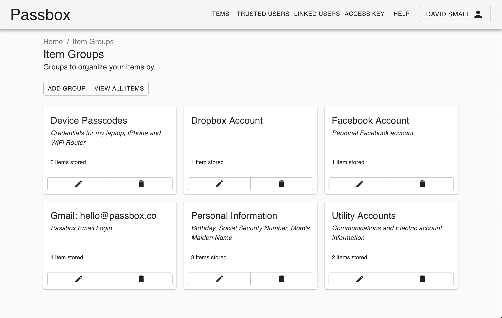

Passbox - Your Digital Safety Deposit Box

## Your Digital Safety Deposit Box

###### Give your loved ones access to your data if something happens to you.

Try Passbox for free with your email below:
Email
​

Store important, sensitive data your loved ones should have in your absence and no time before.

With Passbox you can store data your loved ones can have access to in your absence, incapacitation, or unexpected death and no time before then.

## How does Passbox work?

Easily.

- 

###### Create Notes and Account Logins or import existing ones from password managers like 1Password, LastPass or Bitwarden.

- 

###### Put your Notes and Account Logins in Groups assignable to your Trusted Users.

- 

###### Invite Trusted Users to your account and assign them to relevant Groups.

- 

###### Relax knowing that your data is secure and accessible if needed.

Once invited your Trusted Users can request to view your Passbox. When that happens you will be notified. If their request is not denied within your specified Access Wait Period they will be allowed to see the Passbox groups that you added them to and nothing more.

## Pricing

Freemium PlanGet familiar with Passbox

## Free

- Store up to 3 Items
- Add 1 Trusted User
- Fixed 1-Day Access Wait Period

* * *

- Import Data from LastPass, 1Password & Bitwarden
- Bank-Level Security
- Update Your Data Any Time
- Cancel Any Time
- Personal Email Support

[Get Your Passbox](https://passbox.co/signup/)
Standard Plan

## $30

###### /year

Payment Plan:

Monthly

Yearly

- Includes a 14-Day Trial
- Create Unlimited Notes
- Store Unlimited Account Logins
- Add Unlimited Trusted Users
- Set Your Own Access Wait Period

* * *

- Import Data from LastPass, 1Password & Bitwarden
- Bank-Level Security
- Update Your Data Any Time
- Cancel Any Time
- Personal Email Support

[Get Your Passbox](https://passbox.co/signup/?plan=plan_G3cAMk8H2zqwcs)

## Passbox Security

In an increasingly digital world Passbox is no different from leading providers in taking security seriously. Your sensitive data is safely managed with the bank-level [Advanced Encryption Standard](https://en.wikipedia.org/wiki/Advanced_Encryption_Standard) using a passcode of your choosing. Your data is also always safely communicated via [HTTPS](https://en.wikipedia.org/wiki/HTTPS) for maximum privacy. This combination locks your data up tight so that *only* you and your Trusted Users can ever have access to it.

## What About Password Managers?

Existing password managers do a great job of storing and conveniently allowing you to use and share your everyday passwords. What about passwords or other sensitive data that are not ideal for everyday access by a friend, family member or business partner? Passbox is designed to share this kind of data but only when you're not around to manage it yourself.

You can even import your existing password manager data from 1Password, LastPass or Bitwarden to get started with Passbox faster!

## Passbox: The Company

Passbox is a private organization proudly built in and operated out of Miami, Florida, USA.

Contact us at [hello@passbox.co](https://passbox.co/mailto:hello@passbox.co?Subject=Contact%20Us).

* * *

* * *

###### Subscribe for Passbox Updates

Email *

Copyright © [Passbox LLC](https://passbox.co/) 2019