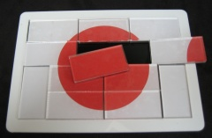

Pavel's Puzzle Blog: Hinomaru: The Japanese Flag Puzzle

Pavel's Puzzle Blog: Hinomaru: The Japanese Flag Puzzle

http://www.pavelspuzzles.com/2007/08/hinomaru_the_japanese_flag_puz_1.html

« Pavel's Pipe Dream | Main | The Grand Vizier: A Penrose tiling puzzle » Hinomaru: The Japanese Flag Puzzle In 2001, the 21st annual International Puzzle Party was held in Tokyo, and I decided to honor the hosts with a puzzle based on the simple, elegant design of the Japanese flag, also known as Hinomaru (literally, "the circle of the sun"). To start, I drew the flag's design on a 6-by-4 rectangle and then broke it up into twelve 1-by-2 dominoes. Then, to make things tricky, I also colored the backs of all of the dominoes in ways that make them look like potential fronts. Thus, all of the dominoes are double-sided, and it's not at all obvious which side is the front! Add to this the high degree of symmetry in the flag design, which makes the piece placements even more ambiguous, and you have a very difficult puzzle.