Performance Analysis Reference  |  Web       |  Google Developers

star_border
star_border
star_border
star_border
star_border

#  Performance Analysis Reference

- [Contents](https://developers.google.com/web/tools/chrome-devtools/evaluate-performance/reference#top_of_page)
- [Record performance](https://developers.google.com/web/tools/chrome-devtools/evaluate-performance/reference#record)
    - [Record runtime performance](https://developers.google.com/web/tools/chrome-devtools/evaluate-performance/reference#record-runtime)
    - [Record load performance](https://developers.google.com/web/tools/chrome-devtools/evaluate-performance/reference#record-load)
    - [Capture screenshots while recording](https://developers.google.com/web/tools/chrome-devtools/evaluate-performance/reference#screenshots)

    -
    -
    -
    -
    -
    -
-
-
-
-
    -
    -
    -
    -
    -
    -
    -
    -
    -
    -
    -
    -
    -
    -
-
    -
    -
    -
    -
-

 

 **By**    [KayceBasques](https://developers.google.com/web/resources/contributors#kaycebasques)

Technical Writer at Google

This page is a comprehensive reference of Chrome DevTools features related to analyzing performance.

See [Get Started With Analyzing Runtime Performance](https://developers.google.com/web/tools/chrome-devtools/evaluate-performance/) for a guided tutorial on how to analyze a page's performance using Chrome DevTools.

## [arrow_upward](https://developers.google.com/web/tools/chrome-devtools/evaluate-performance/reference#top_of_page)Record performance

### Record runtime performance

Record runtime performance when you want to analyze the performance of a page as it's running, as opposed to loading.

1. Go to the page that you want to analyze.
2. Click the **Performance** tab in DevTools.
3. Click **Record**  .

 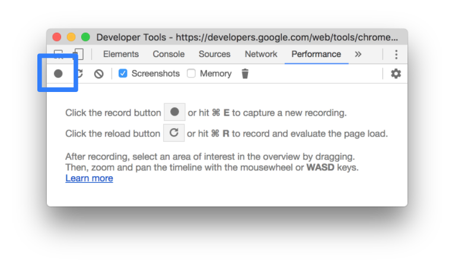
 **Figure 1**. **Record**, outlined in blue

4. Interact with the page. DevTools records all page activity that occurs as a result of your interactions.

5. Click **Record** again or click **Stop** to stop recording.

### Record load performance

Record load performance when you want to analyze the performance of a page as it's loading, as opposed to running.

1. Go to the page that you want to analyze.
2. Open the **Performance** panel of DevTools.

3. Click **Reload page**  . DevTools records performance metrics while the page reloads and then automatically stops the recording a couple seconds after the load finishes.

 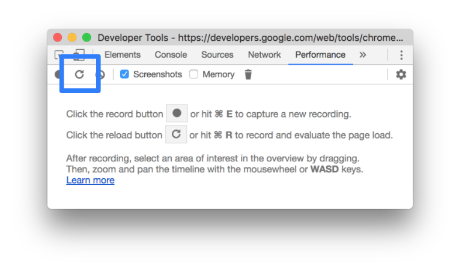
 **Figure 2**. **Reload page**, outlined in blue

DevTools automatically zooms in on the portion of the recording where most of the activity occurred.

 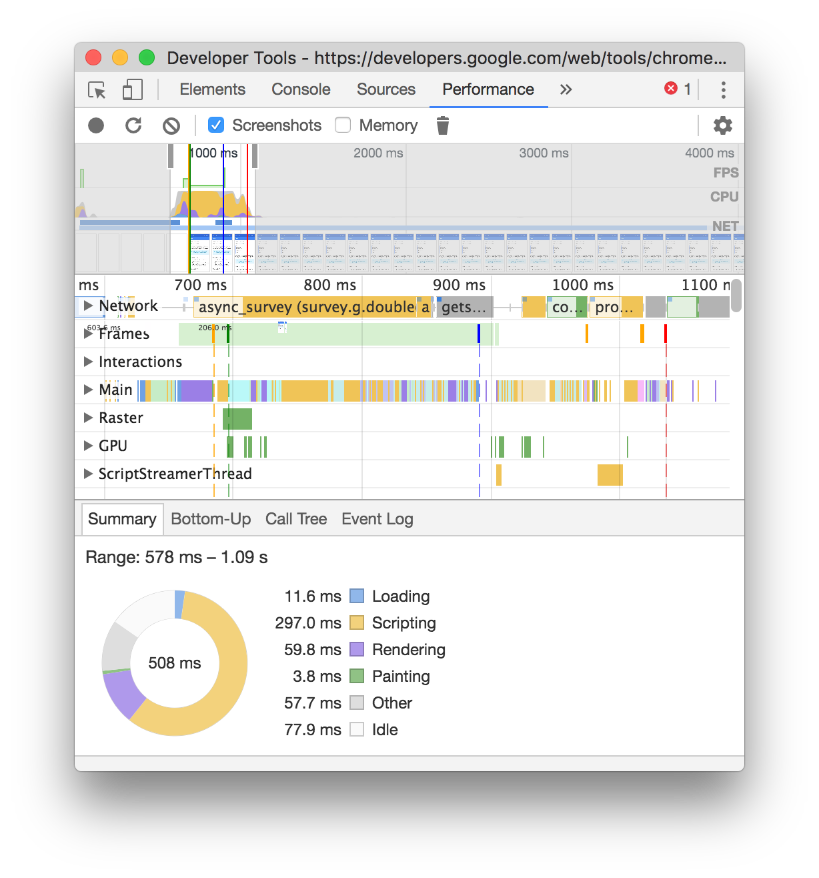
 **Figure 3**. A page-load recording

### Capture screenshots while recording

Enable the **Screenshots** checkbox to capture a screenshot of every frame while recording.

 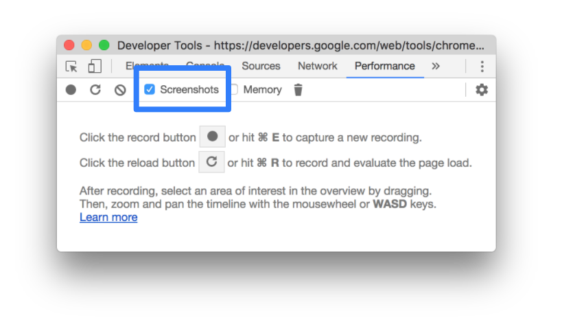
 **Figure 4**. The **Screenshots** checkbox

See [View a screenshot](https://developers.google.com/web/tools/chrome-devtools/evaluate-performance/reference#view-screenshot) to learn how to interact with screenshots.

### Force garbage collection while recording

While you are recording a page, click **Collect garbage** to force garbage collection.

 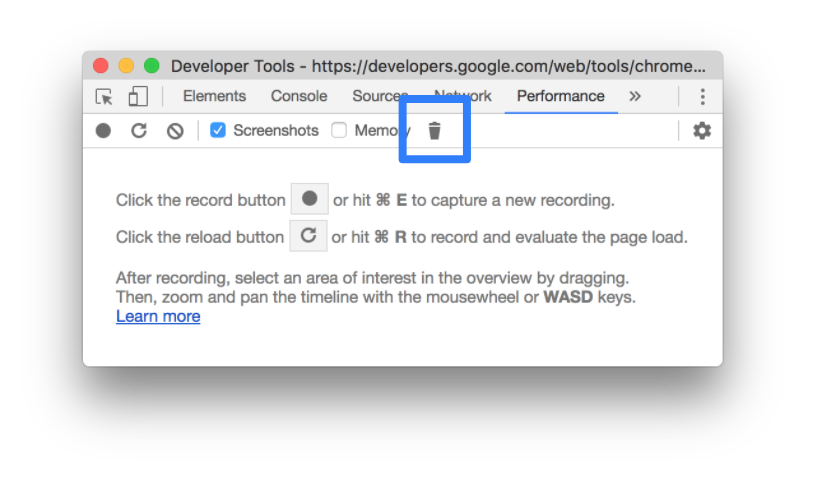
 **Figure 5**. Collect garbage, outlined in blue

### Show recording settings

Click **Capture settings**   to expose more settings related to how DevTools captures performance recordings.

 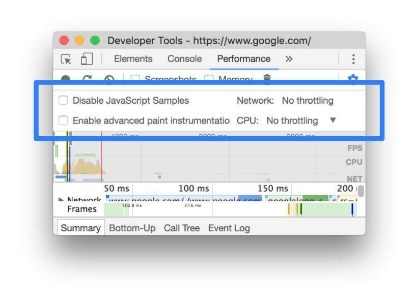
 **Figure 6**. The **Capture settings** section, outlined in blue

### Disable JavaScript samples

By default, the **Main** section of a recording displays detailed call stacks of JavaScript functions that were called during the recording. To disable these call stacks:

1. Open the **Capture settings** menu. See [Show recording settings](https://developers.google.com/web/tools/chrome-devtools/evaluate-performance/reference#settings).

2. Enable the **Disable JavaScript Samples** checkbox.
3. Take a recording of the page.

Figure 7 and Figure 8 show the difference between disabling and enabling JavaScript samples. The **Main** section of the recording is much shorter when sampling is disabled, because it omits all of the JavaScript call stacks.

 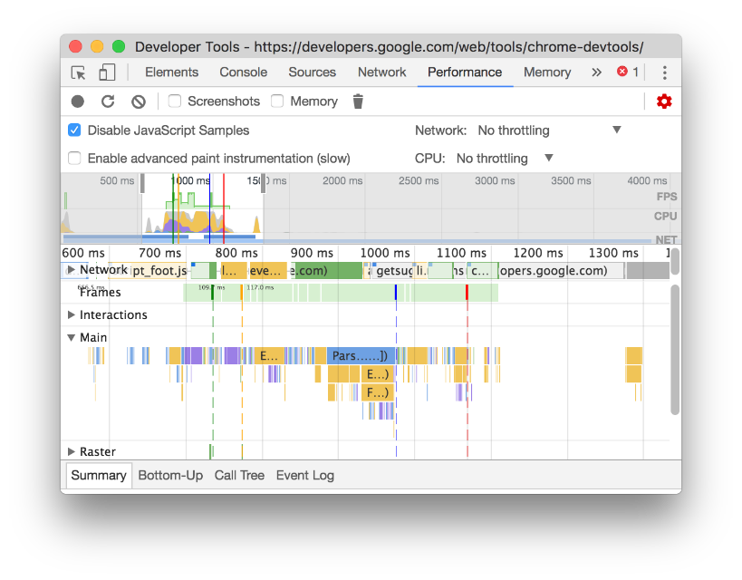

 **Figure 7**. An example of a recording when JS samples are disabled

 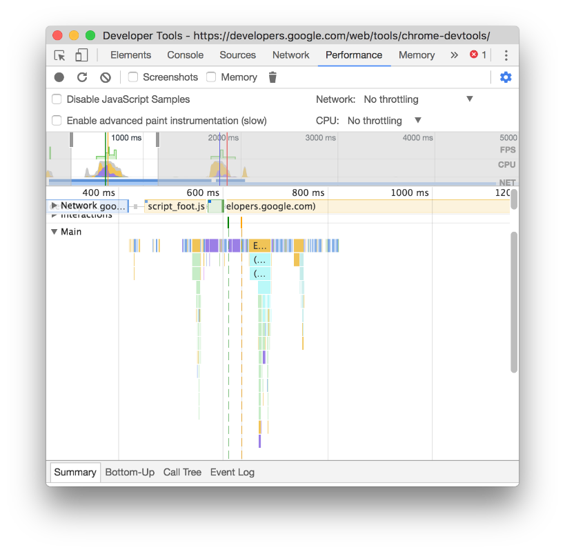

 **Figure 8**. An example of a recording when JS samples are enabled

### Throttle the network while recording

To throttle the network while recording:

1. Open the **Capture settings** menu. See [Show recording settings](https://developers.google.com/web/tools/chrome-devtools/evaluate-performance/reference#settings).

2. Set **Network** to the desired level of throttling.

### Throttle the CPU while recording

To throttle the CPU while recording:

1. Open the **Capture settings** menu. See [Show recording settings](https://developers.google.com/web/tools/chrome-devtools/evaluate-performance/reference#settings).

2. Set **CPU** to the desired level of throttling.

Throttling is relative to your computer's capabilities. For example, the**2x slowdown** option makes your CPU operate 2 times slower than its usual ability. DevTools can't truly simulate the CPUs of mobile devices, because the architecture of mobile devices is very different from that of desktops and laptops.

### Enable advanced paint instrumentation

To view detailed paint instrumentation:

1. Open the **Capture settings** menu. See [Show recording settings](https://developers.google.com/web/tools/chrome-devtools/evaluate-performance/reference#settings).

2. Check the **Enable advanced paint instrumentation** checkbox.

To learn how to interact with the paint information, see [View layers](https://developers.google.com/web/tools/chrome-devtools/evaluate-performance/reference#layers)and [View paint profiler](https://developers.google.com/web/tools/chrome-devtools/evaluate-performance/reference#paint-profiler).

## [arrow_upward](https://developers.google.com/web/tools/chrome-devtools/evaluate-performance/reference#top_of_page)Save a recording

To save a recording, right-click and select **Save Profile**.
 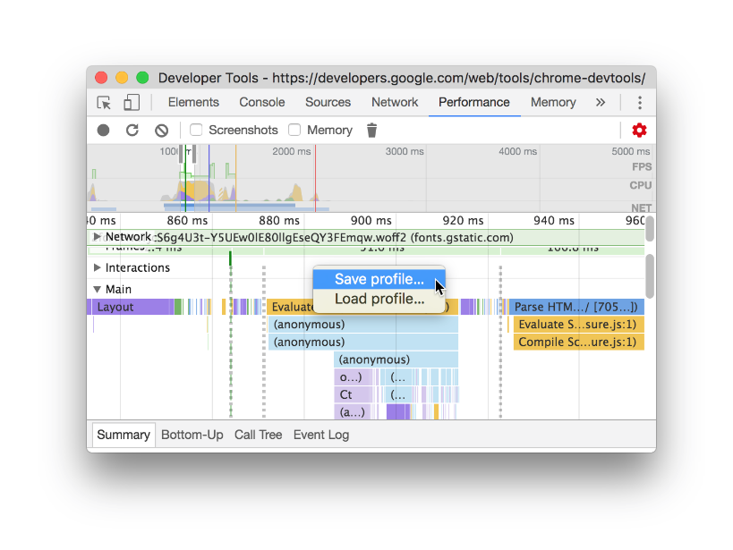
 **Figure 9**. **Save Profile**

## [arrow_upward](https://developers.google.com/web/tools/chrome-devtools/evaluate-performance/reference#top_of_page)Load a recording

To load a recording, right-click and select **Load Profile**.
 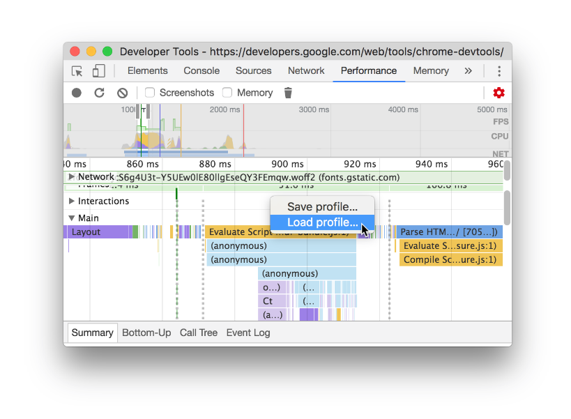
 **Figure 10**. **Load Profile**

## [arrow_upward](https://developers.google.com/web/tools/chrome-devtools/evaluate-performance/reference#top_of_page)Clear the previous recording

After making a recording, press **Clear recording**   to clear that recording from the **Performance**panel.

 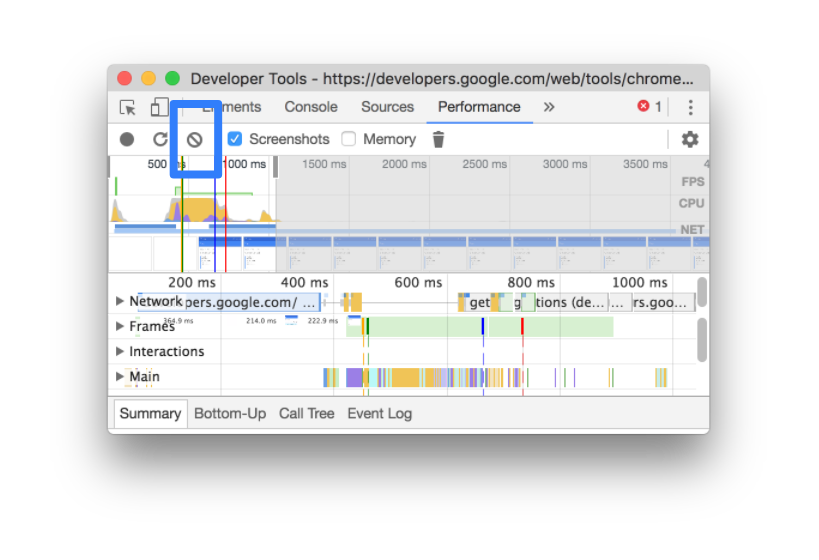
 **Figure 11**. Clear recording, outlined in blue

## [arrow_upward](https://developers.google.com/web/tools/chrome-devtools/evaluate-performance/reference#top_of_page)Analyze a performance recording

After you [record runtime performance](https://developers.google.com/web/tools/chrome-devtools/evaluate-performance/reference#record-runtime) or [record load performance](https://developers.google.com/web/tools/chrome-devtools/evaluate-performance/reference#record-load), the **Performance** panel provides a lot of data for analyzing the performance of what just happened.

### Select a portion of a recording

Drag your mouse left or right across the **Overview** to select a portion of a recording. The **Overview** is the section that contains the **FPS**,**CPU**, and **NET** charts.

 

 **Figure 12**. Dragging the mouse across the Overview to zoom
To select a portion using the keyboard:

1. Click on the background of the **Main** section, or any of the sections next to it, such as **Interactions**, **Network**, or **GPU**. This keyboard workflow only works when one of these sections is in focus.

2. Use the `W`, `A`, `S`, `D` keys to zoom in, move left, zoom out, and move right, respectively.

To select a portion using a trackpad:

1. Hover your mouse over the **Overview** section or the **Details** section. The **Overview** section is the area containing the **FPS**, **CPU**, and **NET** charts. The **Details** section is the area containing the **Main** section, the **Interactions** section, and so on.

2. Using two fingers, swipe up to zoom out, swipe left to move left, swipe down to zoom in, and swipe right to move right.

To scroll a long flame chart in the **Main** section or any of its neighbors, click and hold while dragging up and down. Drag left and right to move what portion of the recording is selected.

### Search activities

Press `Command`+`F` (Mac) or`Control`+`F` (Windows, Linux) to open the search box at the bottom of the **Performance** panel.

 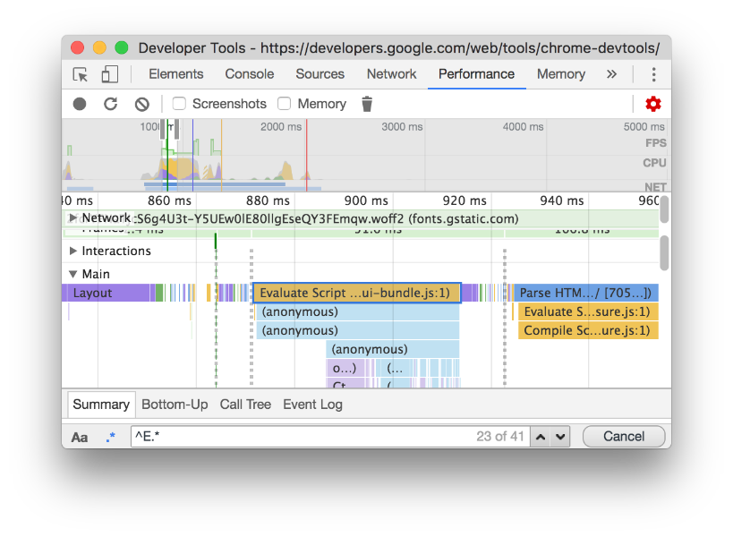

 **Figure 13**. Using regex in the search box at the bottom of the window to find any activity that begins with `E`

To navigate activities that match your query:

- Use the **Previous**   and **Next**   buttons.
- Press `Shift`+`Enter` to select the previous or `Enter` to select the next.

To modify query settings:

- Press **Case sensitive**   to make the query case sensitive.
- Press **Regex**  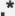 to use a regular expression in your query.

To hide the search box, press **Cancel**.

### View main thread activity

Use the **Main** section to view activity that occurred on the page's main thread.

 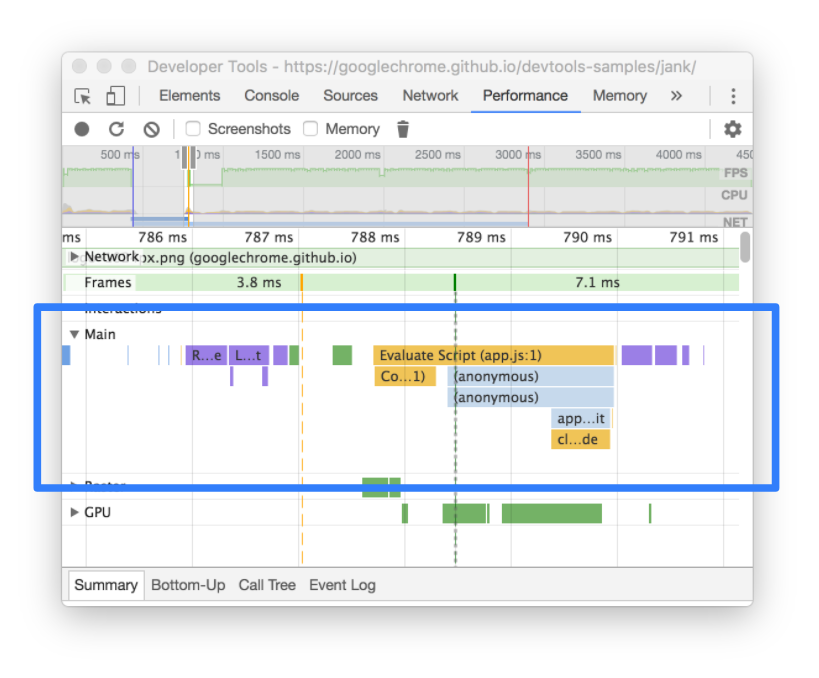
 **Figure 14**. The **Main** section, outlined in blue

Click on an event to view more information about it in the **Summary** tab. DevTools outlines the selected event in blue.

 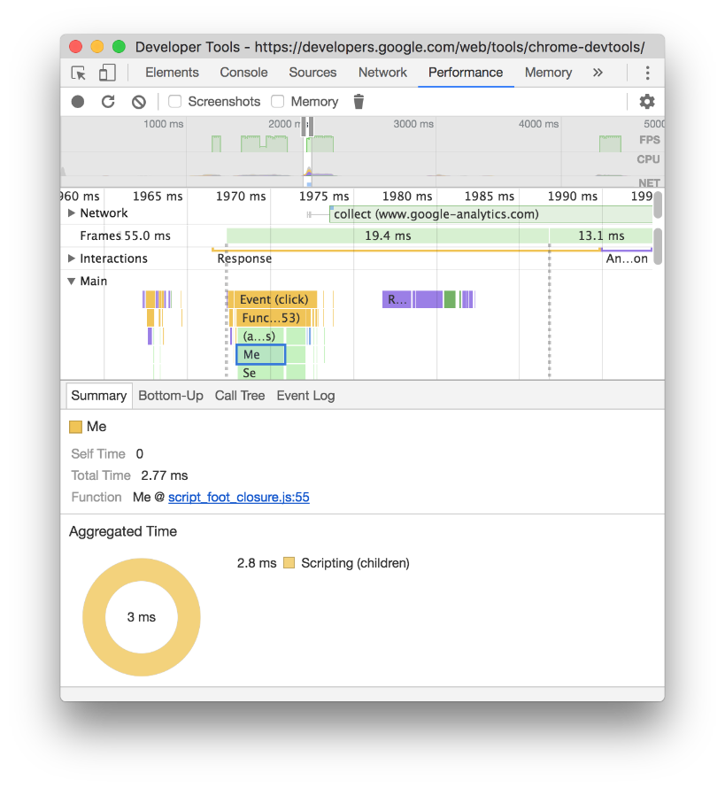

 **Figure 15**. More information about the `Me` function call event in the **Summary** tab

DevTools represents main thread activity with a flame chart. The x-axis represents the recording over time. The y-axis represents the call stack. The events on top cause the events below it.

 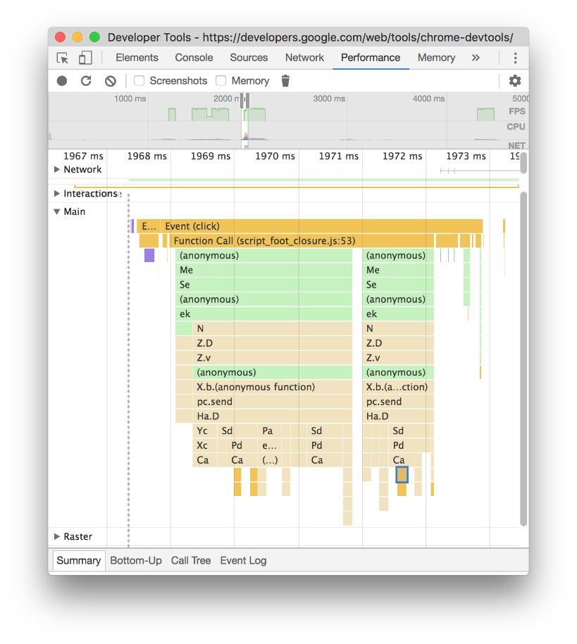
 **Figure 16**. A flame chart in the **Main** section

In Figure 16, a `click` event caused a function call in `script_foot_closure.js`on line 53. Below `Function Call` you see that an anonymous function was called. That anonymous function then called `Me()`, which then called `Se()`, and so on.

DevTools assigns scripts random colors. In Figure 16, function calls from one script are colored light green. Calls from another script are colored beige. The darker yellow represents scripting activity, and the purple event represents rendering activity. These darker yellow and purple events are consistent across all recordings.

See [Disable JavaScript samples](https://developers.google.com/web/tools/chrome-devtools/evaluate-performance/reference#disable-js-samples) if you want to hide the detailed flame chart of JavaScript calls. When JS samples are disabled, you only see high-level events such as `Event (click)` and `Function Call (script_foot_closure.js:53)` from Figure 16.

### View activities in a table

After recording a page, you don't need to rely solely on the **Main** section to analyze activities. DevTools also provides three tabular views for analyzing activities. Each view gives you a different perspective on the activities:

- When you want to view the root activities that cause the most work, use [the **Call Tree** tab](https://developers.google.com/web/tools/chrome-devtools/evaluate-performance/reference#call-tree).
- When you want to view the activities where the most time was directly spent, use [the **Bottom-Up** tab](https://developers.google.com/web/tools/chrome-devtools/evaluate-performance/reference#bottom-up).
- When you want to view the activities in the order in which they occurred during the recording, use [the **Event Log** tab](https://developers.google.com/web/tools/chrome-devtools/evaluate-performance/reference#event-log).

star**Note:** The next three sections all refer to the same demo. You can run the demo yourself at [Activity Tabs Demo](https://googlechrome.github.io/devtools-samples/perf/activitytabs) and see the source at[GoogleChrome/devtools-samples/perf/activitytabs.html](https://github.com/GoogleChrome/devtools-samples/blob/master/perf/activitytabs.html).

#### Root activities

Here's an explanation of the *root activities* concept that's mentioned in the **Call Tree** tab, **Bottom-Up** tab, and **Event Log** sections.

Root activities are those which cause the browser to do some work. For example, when you click a page, the browser fires an `Event` activity as the root activity. That `Event` might cause a handler to execute, and so on.

In the **Main** section's flame chart, root activities are at the top of the chart. In the **Call Tree** and **Event Log** tabs, root activities are the top-level items.

See [The Call Tree tab](https://developers.google.com/web/tools/chrome-devtools/evaluate-performance/reference#call-tree) for an example of root activities.

#### The Call Tree tab

Use the **Call Tree** tab to view which [root activities](https://developers.google.com/web/tools/chrome-devtools/evaluate-performance/reference#root-activities)cause the most work.

The **Call Tree** tab only displays activities during the selected portion of the recording. See [Select a portion of a recording](https://developers.google.com/web/tools/chrome-devtools/evaluate-performance/reference#select) to learn how to select portions.

 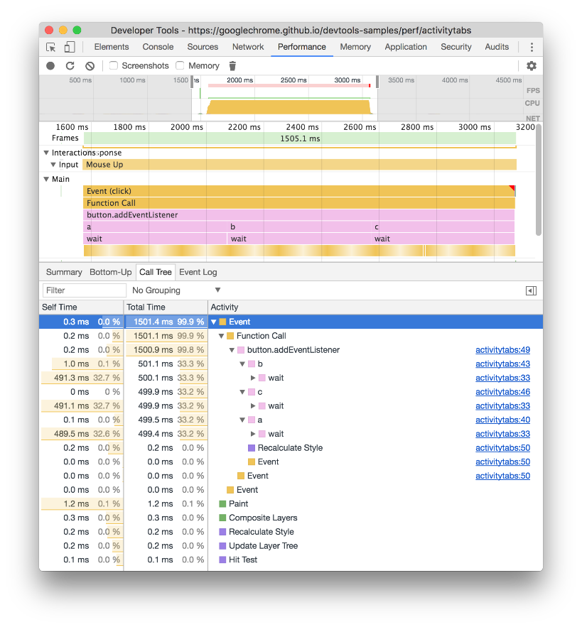
 **Figure 17**. The **Call Tree** tab

In Figure 17, the top-level of items in the **Activity** column, such as`Event`, `Paint`, and `Composite Layers` are root activities. The nesting represents the call stack. For example, in Figure 17, `Event` caused`Function Call`, which caused `button.addEventListener`, which caused `b`, and so on.

**Self Time** represents the time directly spent in that activity.**Total Time** represents the time spent in that activity or any of its children.

Click **Self Time**, **Total Time**, or **Activity** to sort the table by that column.

Use the **Filter** text box to filter events by activity name.

By default the **Grouping** menu is set to **No Grouping**. Use the**Grouping** menu to sort the activity table based on various criteria.

Click **Show Heaviest Stack**   to reveal another table to the right of the **Activity** table. Click on an activity to populate the **Heaviest Stack** table. The **Heaviest Stack** table shows you which children of the selected activity took the longest time to execute.

#### The Bottom-Up tab

Use the **Bottom-Up** tab to view which activities directly took up the most time in aggregate.

The **Bottom-Up** tab only displays activities during the selected portion of the recording. See [Select a portion of a recording](https://developers.google.com/web/tools/chrome-devtools/evaluate-performance/reference#select) to learn how to select portions.

 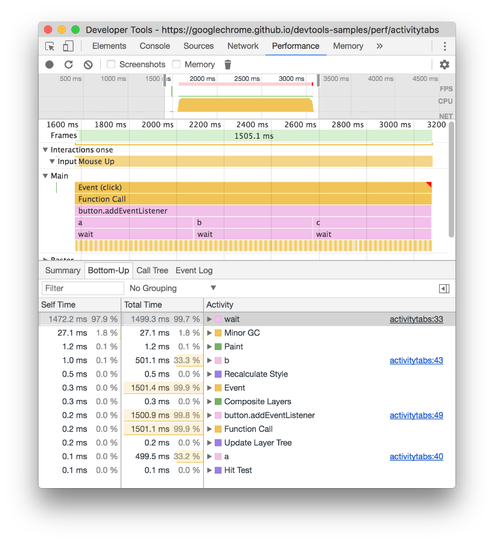
 **Figure 18**. The **Bottom-Up** tab

In the **Main** section flame chart of Figure 18, you can see that almost practically all of the time was spent executing the three calls to `wait()`. Accordingly, the top activity in the **Bottom-Up** tab of Figure 18 is`wait`. In the flame chart of Figure 18, the yellow below the calls to `wait`are actually thousands of `Minor GC` calls. Accordingly, you can see that in the **Bottom-Up** tab, the next most expensive activity is `Minor GC`.

The **Self Time** column represents the aggregated time spent directly in that activity, across all of its occurrences.

The **Total Time** column represents aggregated time spent in that activity or any of its children.

#### The Event Log tab

Use the **Event Log** tab to view activities in the order in which they occurred during the recording.

The **Event Log** tab only displays activities during the selected portion of the recording. See [Select a portion of a recording](https://developers.google.com/web/tools/chrome-devtools/evaluate-performance/reference#select) to learn how to select portions.

 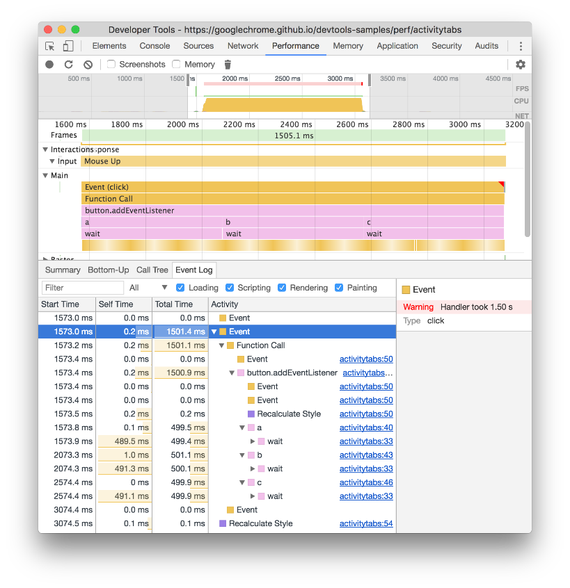
 **Figure 19**. The **Event Log** tab

The **Start Time** column represents the point at which that activity started, relative to the start of the recording. For example, the start time of`1573.0 ms` for the selected item in Figure 19 means that activity started 1573 ms after the recording started.

The **Self Time** column represents the time spent directly in that activity.

The **Total Time** columns represents time spent directly in that activity or in any of its children.

Click **Start Time**, **Self Time**, or **Total Time** to sort the table by that column.

Use the **Filter** text box to filter activities by name.

Use the **Duration** menu to filter out any activities that took less than 1 ms or 15 ms. By default the **Duration** menu is set to **All**, meaning all activities are shown.

Disable the **Loading**, **Scripting**, **Rendering**, or **Painting**checkboxes to filter out all activities from those categories.

### View GPU activity

View GPU activity in the **GPU** section.
 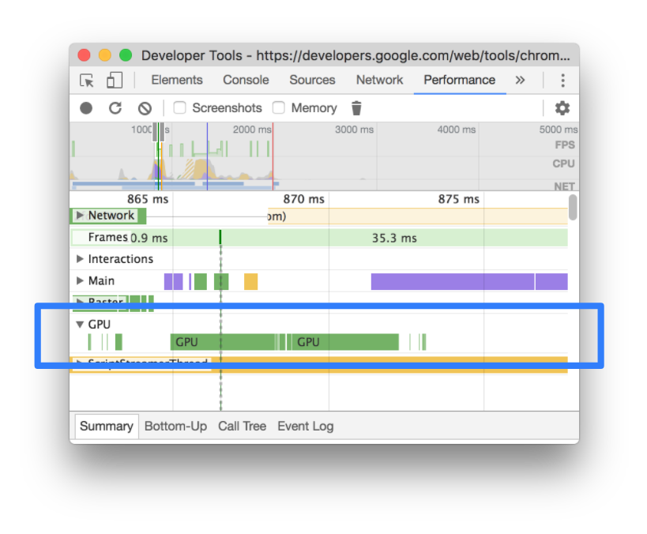
 **Figure 20**. The **GPU** section, outlined in blue

### View raster activity

View raster activity in the **Raster** section.
 
 **Figure 21**. The **Raster** section, outlined in blue

### View interactions

Use the **Interactions** section to find and analyze user interactions that happened during the recording.

 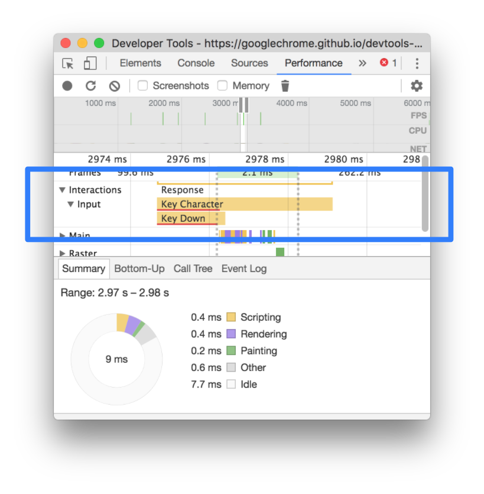
 **Figure 22**. The **Interactions** section, outlined in blue

A red line at the bottom of an interaction represents time spent waiting for the main thread.

Click an interaction to view more information about it in the **Summary**tab.

### Analyze frames per second (FPS)

DevTools provides numerous ways to analyze frames per second:

- Use [the **FPS** chart](https://developers.google.com/web/tools/chrome-devtools/evaluate-performance/reference#fps-chart) to get an overview of FPS over the duration of the recording.
- Use [the **Frames** section](https://developers.google.com/web/tools/chrome-devtools/evaluate-performance/reference#frames) to view how long a particular frame took.
- Use the **FPS meter** for a realtime estimate of FPS as the page runs. See [View frames per second in realtime with the FPS meter](https://developers.google.com/web/tools/chrome-devtools/evaluate-performance/reference#fps-meter).

#### The FPS chart

The **FPS** chart provides an overview of the frame rate across the duration of a recording. In general, the higher the green bar, the better the frame rate.

A red bar above the **FPS** chart is a warning that the frame rate dropped so low that it probably harmed the user's experience.

 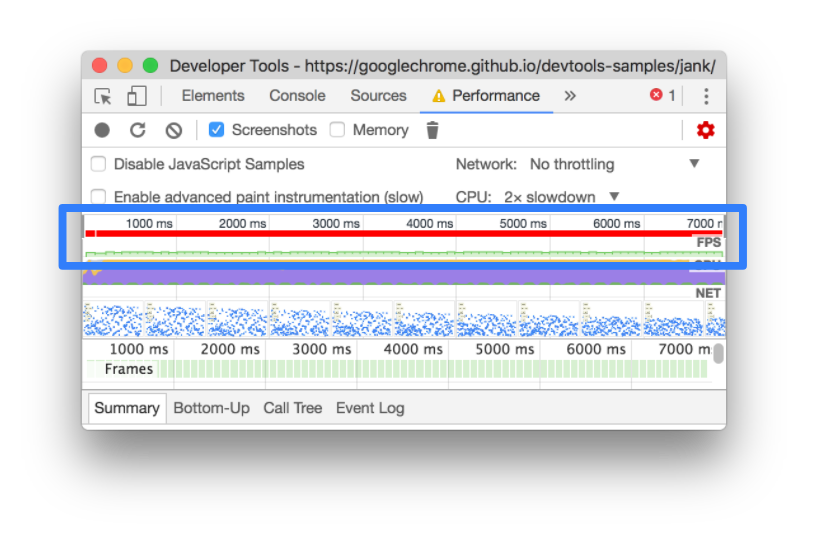
 **Figure 20**. The FPS chart, outlined in blue

#### The Frames section

The **Frames** section tells you exactly how long a particular frame took.
Hover over a frame to view a tooltip with more information about it.
 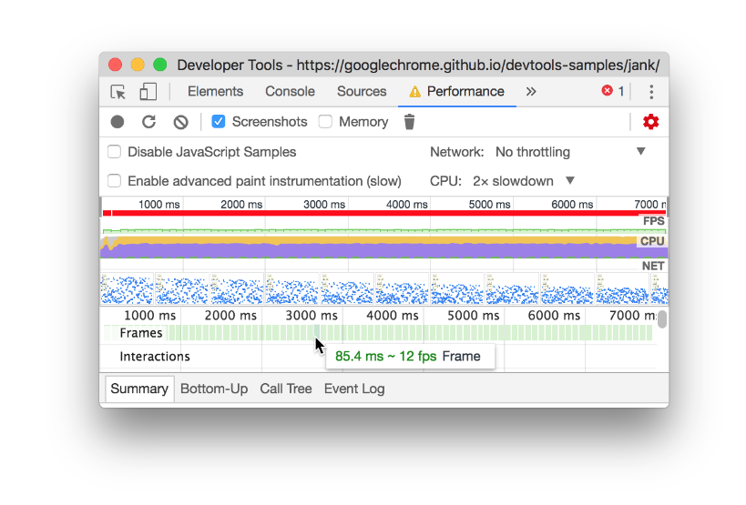
 **Figure 21**. Hovering over a frame

Click on a frame to view even more information about the frame in the**Summary** tab. DevTools outlines the selected frame in blue.

 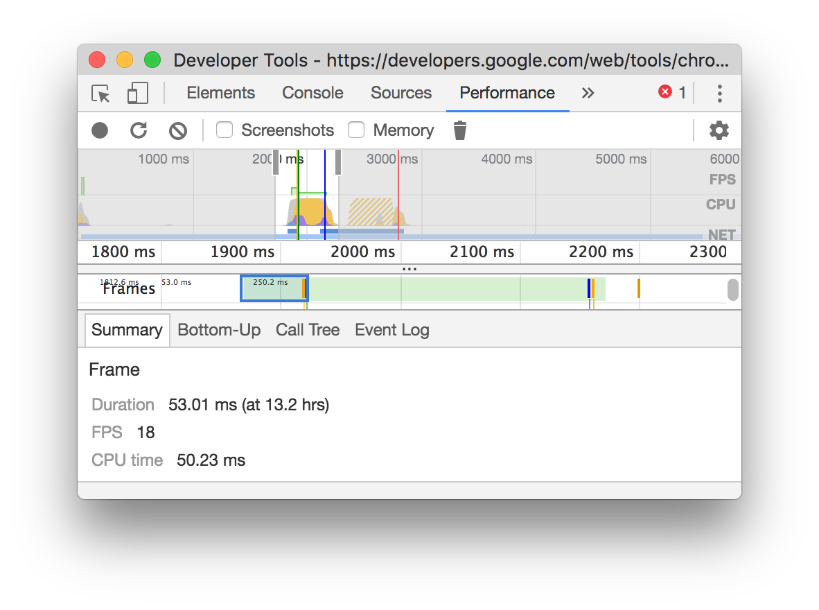
 **Figure 22**. Viewing a frame in the **Summary** tab

### View network requests

Expand the **Network** section to view a waterfall of network requests that occurred during the recording.

 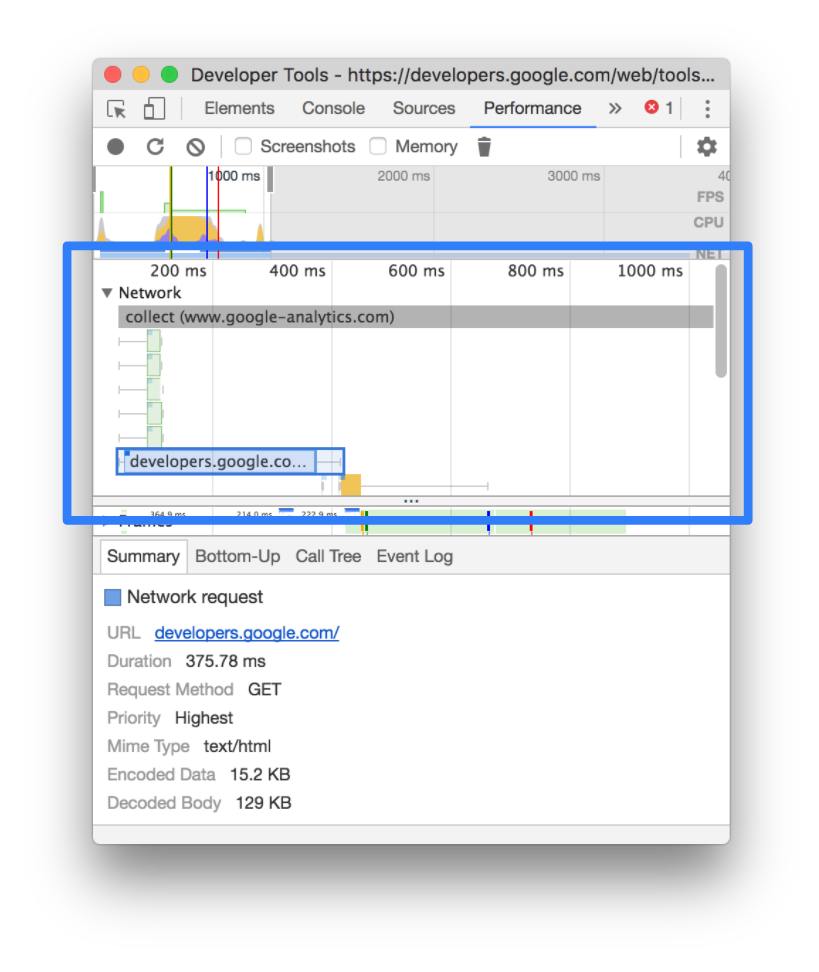
 **Figure 23**. The **Network** section, outlined in blue
Requests are color-coded as follows:

- HTML: Blue
- CSS: Purple
- JS: Yellow
- Images: Green

Click on a request to view more information about it in the **Summary** tab. For example, in Figure 23 the **Summary** tab is displaying more information about the blue request that's selected in the **Network** section.

A darker-blue square in the top-left of a request means it's a higher-priority request. A lighter-blue square means lower-priority. For example, in Figure 23 the blue, selected request is higher-priority, and the green one above it is lower-priority.

In Figure 24, the request for `www.google.com` is represented by a line on the left, a bar in the middle with a dark portion and a light portion, and a line on the right. Figure 25 shows the corresponding representation of the same request in the **Timing** tab of the **Network** panel. Here's how these two representations map to each other:

- The left line is everything up to the `Connection Start` group of events, inclusive. In other words, it's everything before `Request Sent`, exclusive.
- The light portion of the bar is `Request Sent` and `Waiting (TTFB)`.
- The dark portion of the bar is `Content Download`.
- The right line is essentially time spent waiting for the main thread. This is not represented in the **Timing** tab.

 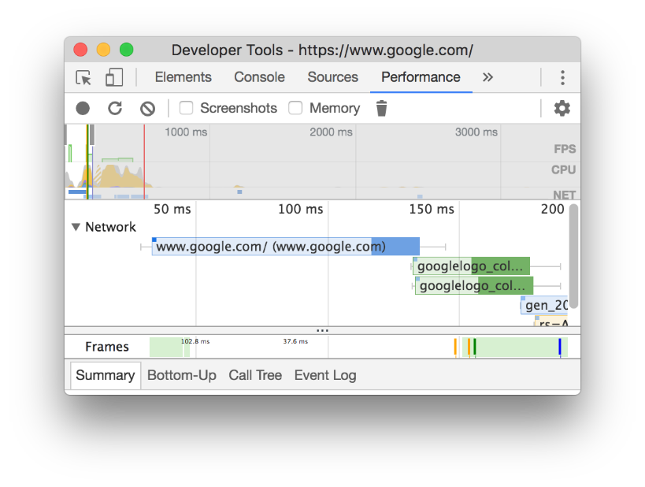

 **Figure 24**. The line-bar representation of the `www.google.com` request
 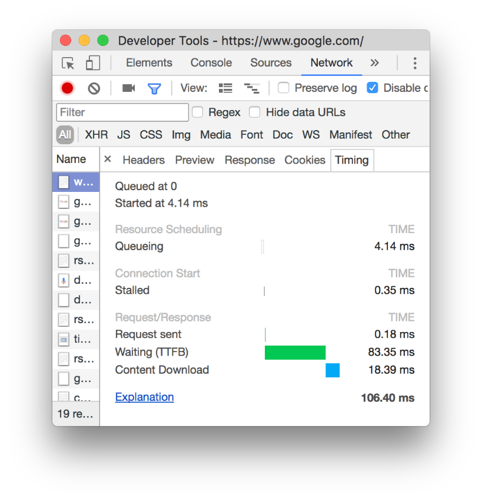

 **Figure 25**. The **Timing** tab representation of the `www.google.com` request

### View memory metrics

Enable the **Memory** checkbox to view memory metrics from the last recording.
 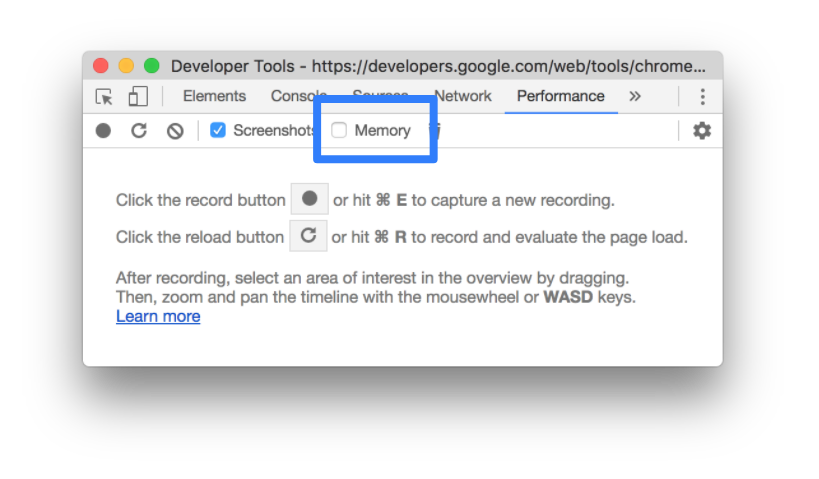
 **Figure 26**. The **Memory** checkbox, outlined in blue

DevTools displays a new **Memory** chart, above the **Summary** tab. There's also a new chart below the **NET** chart, called **HEAP**. The **HEAP** chart provides the same information as the **JS Heap** line in the **Memory** chart.

 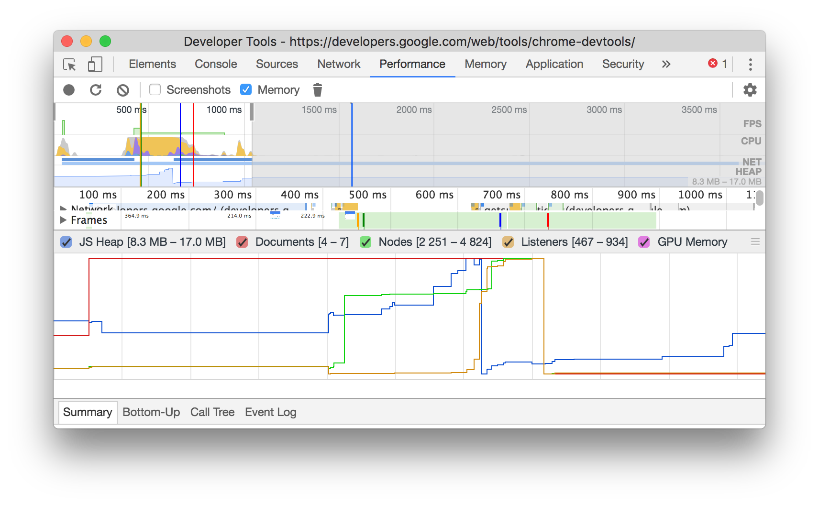
 **Figure 27**. Memory metrics, above the **Summary** tab

The colored lines on the chart map to the colored checkboxes above the chart. Disable a checkbox to hide that category from the chart.

The chart only displays the region of the recording that is currently selected. For example, in Figure 27, the **Memory** chart is only showing memory usage for the start of the recording, up to around the 1000ms mark.

### View the duration of a portion of a recording

When analyzing a section like **Network** or **Main**, sometimes you need a more precise estimate of how long certain events took. Hold `Shift`, click and hold, and drag left or right to select a portion of the recording. At the bottom of your selection, DevTools shows how long that portion took.

 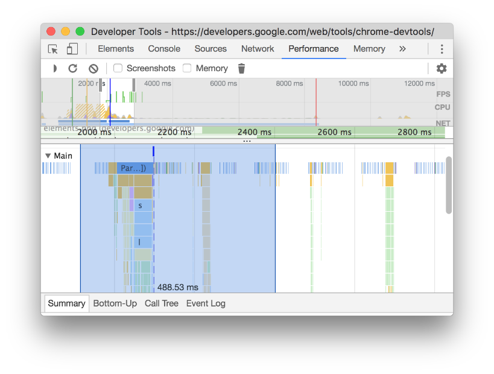

 **Figure 28**. The `488.53ms` timestamp at the bottom of the selected portion indicates how long that portion took

### View a screenshot

See [Capture screenshots while recording](https://developers.google.com/web/tools/chrome-devtools/evaluate-performance/reference#screenshots) to learn how to enable screenshots.

Hover over the **Overview** to view a screenshot of how the page looked during that moment of the recording. The **Overview** is the section that contains the **CPU**, **FPS**, and **NET** charts.

 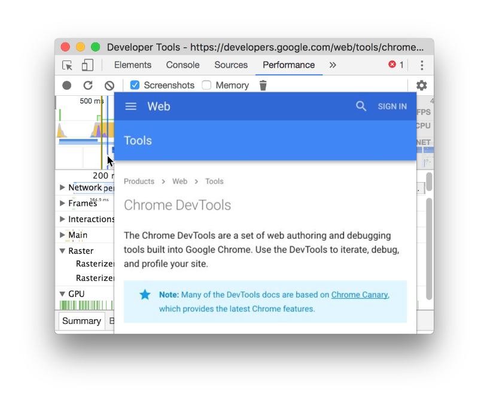
 **Figure 29**. Viewing a screenshot

You can also view screenshots by clicking a frame in the **Frames**section. DevTools displays a small version of the screenshot in the **Summary**tab.

 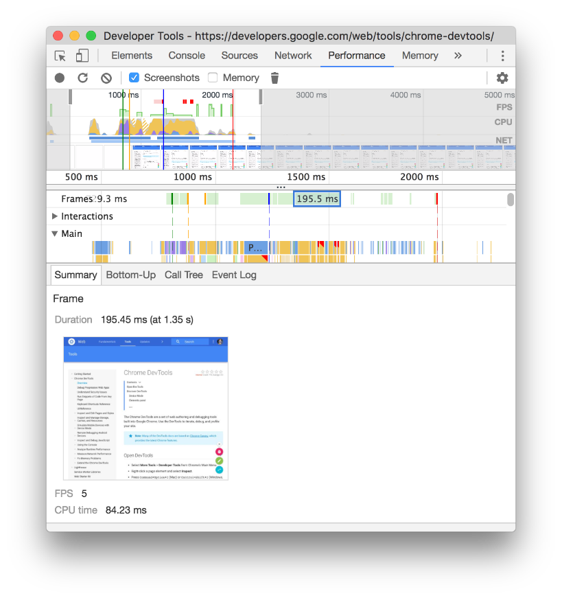

 **Figure 30**. After clicking the `195.5ms` frame in the **Frames** section, the screenshot for that frame is displayed in the **Summary** tab

Click the thumbnail in the **Summary** tab to zoom in on the screenshot.

 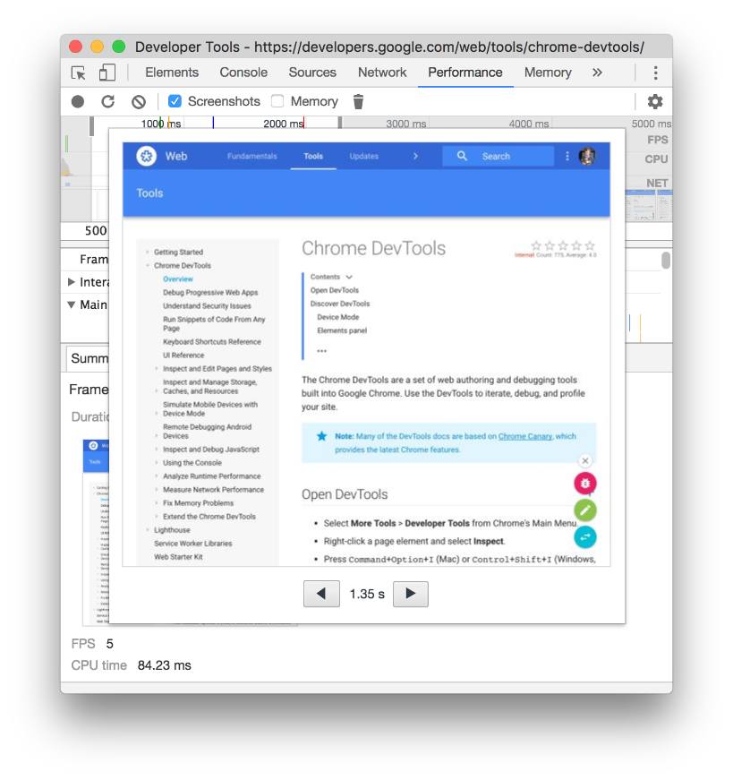

 **Figure 31**. After clicking the thumbnail in the **Summary** tab, DevTools zooms in on the screenshot

### View layers information

To view advanced layers information about a frame:

1. [Enable advanced paint instrumentation](https://developers.google.com/web/tools/chrome-devtools/evaluate-performance/reference#paint).

2. Select a frame in the **Frames** section. DevTools displays information about its layers in the new **Layers** tab, next to the **Event Log** tab.

 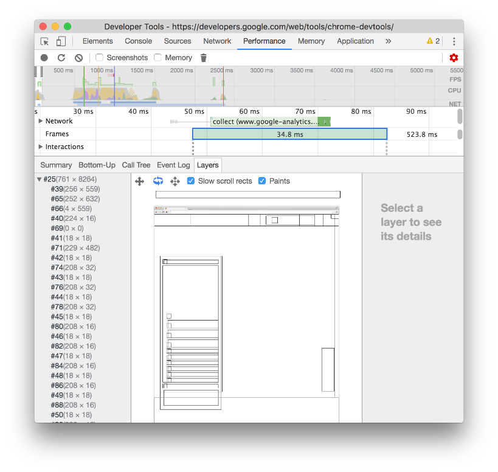
 **Figure 32**. The **Layers** tab
Hover over a layer to highlight it in the diagram.
 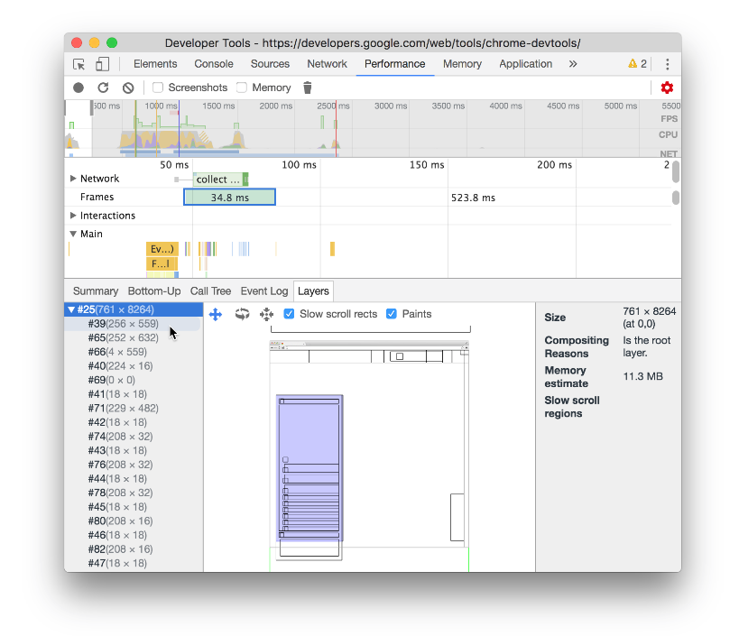
 **Figure 33**. Highlighting layer **#39**
To move the diagram:

- Click **Pan Mode**   to move along the X and Y axes.
- Click **Rotate Mode**   to rotate along the Z axis.
- Click **Reset Transform**   to reset the diagram to its original position.

### View paint profiler

To view advanced information about a paint event:

1. [Enable advanced paint instrumentation](https://developers.google.com/web/tools/chrome-devtools/evaluate-performance/reference#paint).

2. Select a **Paint** event in the **Main** section.
 
 **Figure 34**. The **Paint Profiler** tab

## [arrow_upward](https://developers.google.com/web/tools/chrome-devtools/evaluate-performance/reference#top_of_page)Analyze rendering performance with the Rendering tab

Use the **Rendering** tab's features to help visualize your page's rendering performance.

To open the **Rendering** tab:

1. Open the [Command Menu](https://developers.google.com/web/tools/chrome-devtools/ui#command-menu).

2. Start typing `Rendering` and select `Show Rendering`. DevTools displays the **Rendering** tab at the bottom of your DevTools window.

 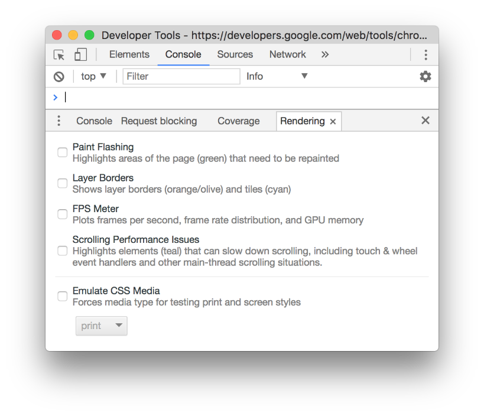
 **Figure 35**. The **Rendering** tab

### View frames per second in realtime with the FPS meter

The **FPS meter** is an overlay that appears in the top-right corner of your viewport. It provides a realtime estimate of FPS as the page runs. To open the **FPS meter**:

1. Open the **Rendering** tab. See [Analyze rendering performance with the Rendering tab](https://developers.google.com/web/tools/chrome-devtools/evaluate-performance/reference#rendering).

2. Enable the **FPS Meter** checkbox.
 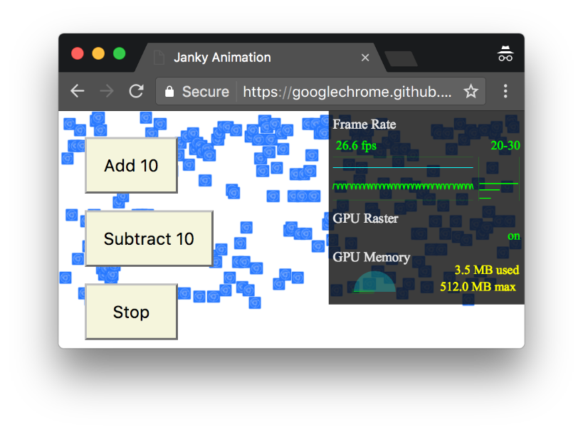
 **Figure 36**. The FPS meter

### View painting events in realtime with Paint Flashing

Use Paint Flashing to get a realtime view of all paint events on the page. Whenever a part of the page gets re-painted, DevTools outlines that section in green.

To enable Paint Flashing:

1. Open the **Rendering** tab. See [Analyze rendering performance with the Rendering tab](https://developers.google.com/web/tools/chrome-devtools/evaluate-performance/reference#rendering).

2. Enable the **Paint Flashing** checkbox.
 
 **Figure 37**. **Paint Flashing**

### View an overlay of layers with Layer Borders

Use **Layer Borders** to view an overlay of layer borders and tiles on top of the page.

To enable Layer Borders:

1. Open the **Rendering** tab. See [Analyze rendering performance with the Rendering tab](https://developers.google.com/web/tools/chrome-devtools/evaluate-performance/reference#rendering).

2. Enable the **Layer Borders** checkbox.
 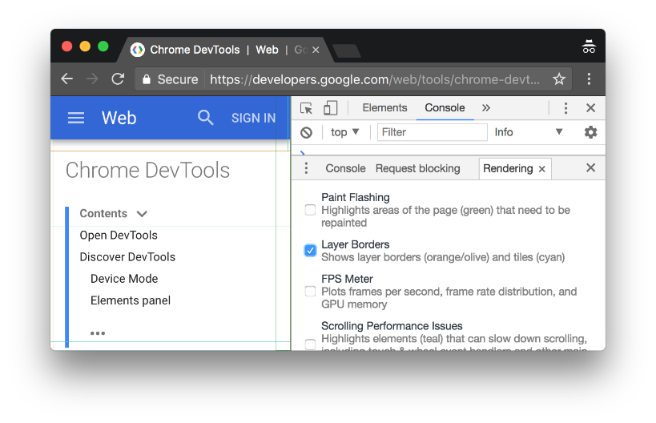
 **Figure 38**. **Layer Borders**

### Find scroll performance issues in realtime

Use Scrolling Performance Issues to identify elements of the page that have event listeners related to scrolling that may harm the performance of the page. DevTools outlines the potentially-problematic elements in teal.

To view scroll performance issues:

1. Open the **Rendering** tab. See [Analyze rendering performance with the Rendering tab](https://developers.google.com/web/tools/chrome-devtools/evaluate-performance/reference#rendering).

2. Enable the **Scrolling Performance Issues** checkbox.

 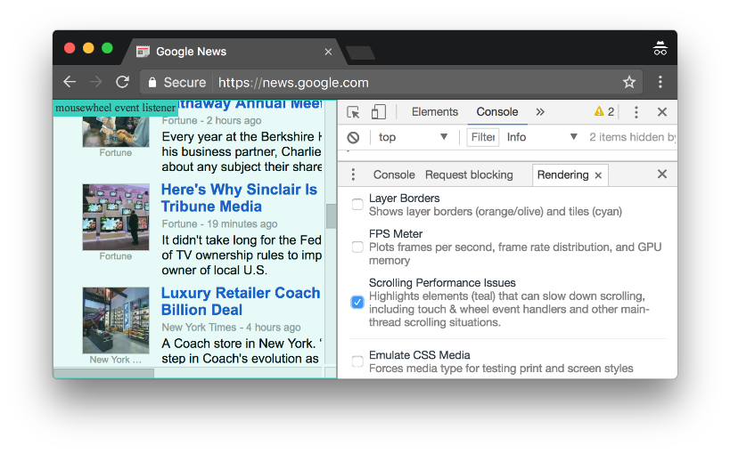

 **Figure 39**. **Scrolling Performance Issues** is indicating that there's a `mousewheel` event listener encompassing the entire viewport that may harm scroll performance

Except as otherwise noted, the content of this page is licensed under the [Creative Commons Attribution 3.0 License](http://creativecommons.org/licenses/by/3.0/), and code samples are licensed under the [Apache 2.0 License](http://www.apache.org/licenses/LICENSE-2.0). For details, see our [Site Policies](https://developers.google.com/terms/site-policies). Java is a registered trademark of Oracle and/or its affiliates.

Last updated May 17, 2017.