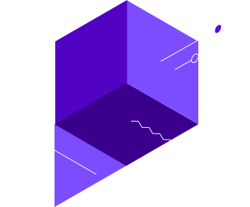

Perspective

- [Perspective](https://www.perspectiveapi.com/#description)

- [Experiments](https://www.perspectiveapi.com/#experiments)

- [Partners](https://www.perspectiveapi.com/#partners)

- [Developers](https://www.perspectiveapi.com/#developers)

- [Perspective](https://www.perspectiveapi.com/#description)

- [Experiments](https://www.perspectiveapi.com/#experiments)

- [Partners](https://www.perspectiveapi.com/#partners)

- [Developers](https://www.perspectiveapi.com/#developers)

# Perspective

## What if technology could help improve conversations online?

Discussing things you care about can be difficult. The threat of abuse and harassment online means that many people stop expressing themselves and give up on seeking different opinions.

 

### Introducing Perspective

Perspective is an API that makes it easier to host better conversations. The API uses machine learning models to score the perceived impact a comment might have on a conversation. Developers and publishers can use this score to give realtime feedback to commenters or help moderators do their job, or allow readers to more easily find relevant information, as illustrated in two experiments below. We’ll be releasing more machine learning models later in the year, but our first model identifies whether a comment could be perceived as “toxic" to a discussion.

 What's toxic?

This model was trained by asking people to rate internet comments on a scale from "Very toxic" to "Very healthy" contribution. Toxic is defined as... "a rude, disrespectful, or unreasonable comment that is likely to make you leave a discussion."

 Got it

### Reading Experiment

### What if it were easier to find new perspectives?

Here we’ve used Perspective to organize comments on three topics that are often difficult to discuss online. Use the slider to explore.

* Data was collected using online [Survata surveys](https://www.survata.com/methodology/) and scored with the “toxicity" model.

## We asked the internet what they thought about:

 tolerance

Showing 24 comments of 49 total comments based on toxicity*

Showing 24 of 49 total comments based on toxicity*

They have their heads up their ass.

They are liberal idiots who are uneducated.

Climate change is happening and it's not changing in our favor. If you think differently you're an idiot.

They're allowed to do that. But if they act like assholes about, I will block them.

uneducated bumpkins or willfully ignorant with vested interests

My thoughts are that people should stop being stupid and ignorant. Climate change is scientifically proven. It isn't a debate.

You either trust in God or think you are smarter than him.

Over-hyped nonsense.

It's real, scary, obvious. Humans need to focus and stop destroying habitats, stop developing erosion because they want to live on a mountain/hill, stop disposing of trash in ways unsafe for the environment. Stop the greed, honor other forms of life.

The climate is always changing. I think the modern concept of climate change is ridiculous. The world when end when God deems it.

It's OK to have a different opinion, however, ignoring factual scientific data is not. People who deny such data are being foolish.

They are intolerant so I try to avoid the subject I don't want to get screamed at

They are blatantly ignoring a fact that 98% of scientists agree are real. It is okay to have your own opinion about how we should deal with climate change, but no action at all is selfish because we are destroying the world for future generations.

Doesn't bother me at all. They can believe what they want.

They need to do more research before they jump to any conclusions

I think it's a divisive topic. The degree to which we can fix any change is debatable as well as how much is natural vs. man made.

I think the earth goes through cycles and we're in a warmer cycle

I think it exists. But, I am not big on regulations regarding climate change. The EPA regulates way too much.

Clearly man made, but unsure of its extent and whether anything substantial can be done about it

Haven't seen unbiased data

It's a natural phenomenon.

Climate changes naturally.

Everyone can form opinions as they wish. I wish we all received the same information.

Climate change is real. The reasons for certain phenomena are not well understood. There is plenty of research yet to be done, and a great deal more to be understood.

I think that climate change is real and has happened for millions of years. Whether or not humans are altering it is another matter entirely, but I strongly suspect that we are.

How can you be so stupid?

They're stupid, it's getting warmer, we should enjoy it while it lasts.

I think those people are stupid and short-sighted

I think its a farce and stinks like a bathroom after 26 beers

Fools

They are uninformed or ignorant

Their opinion, just don't force it down my throat

I respect them but I believe they think I am stupid and only thinking short-term. I believe we don't know what will happen long-term regardless of supporting regulation regarding climate change. Regulation impedes industry and job creation.

I don't care. They are usually democrats.

Crooked science. There is no consensus.

They are ill informed or misinformed. Or...UNINFORMED.

Poorly educated, ultimately not their fault. I blame the American educational system

I think there is a man-made component to climate change, but am afraid the government remedies are potentially far-worse than the disease.

If we have data to back it up then its definitely going to hurt us if we don't change our ways!

I listen to their opinions, but do not understand how they can disagree with irrefutable, scientific facts.

I believe that we are contributing to an already existing 'condition' that occurs, naturally, over the millennium.

I think that there is not much that we can do and that we play a very small role in the overall changing of our planets climate

Climate change is occurring but humans have little impact if any for its cause.

It's the best it makes me warm when it should be cold. Thanks, global warming.

I do not have a good understanding of climate change to have any serious thoughts, however, I try to minimize my own carbon footprint in hopes to help this earth even if it is slight.

Our government needs to do everything it can to combat the causes and effects of climate change. In addition, it is our responsibility as citizens of the world to reduce our use of resources and preserve our environment.

I recognize there is changes in our climate and feel that we need to do what we can to prevent any further decline. I try to do all that is in my power to change my effect on the climate change. I support what I can to encourage companies to change their effects on our environment.

Climate change is real and happening...I think humans have definitely helped it happen faster, but I do believe it would have started to make a change in some way.

We're in a 500+ year trend

 What's toxic?

This model was trained by asking people to rate internet comments on a scale from "Very toxic" to "Very healthy" contribution. Toxic is defined as... "a rude, disrespectful, or unreasonable comment that is likely to make you leave a discussion."

 Got it

 Add a comment to check your tone.

### Writing Experiment

### What if you could see the potential impact of your writing?

We created an experiment using Perspective to illustrate when comments might be perceived as “toxic" by others. Disagree with the result? Please let us know! It’s still early days and we will get a lot of things wrong.

### Partner Experiments

The Wikimedia Foundation is researching ways to detect personal attacks against volunteer editors on Wikipedia. [Read more](https://meta.wikimedia.org/wiki/Research:Detox)

New York Times is building an open source moderation tool to expand community discussion. [Read more](http://www.nytco.com/the-times-is-partnering-with-jigsaw-to-expand-comment-capabilities/)

The Economist is reshaping its comments platform to foster thought-provoking, high-quality debate among its readers. [Read more](https://medium.com/the-economist/help-us-shape-the-future-of-comments-on-economist-com-fa86eeafb0ce#.hzhk3h38j)

The Guardian is researching how best to moderate comment forums and host better discussions with readers and journalists online. [Read more](https://www.theguardian.com/technology/series/the-web-we-want)

### Hello developers

Perspective is in the early days of research and development. You can request an API key (rolling out through 2017) or [sign up](https://groups.google.com/forum/#!forum/perspective-announce/join) to get more information.

Perspective was created by Jigsaw and Google’s Counter Abuse Technology team in a collaborative research project called Conversation-AI. We are also open sourcing experiments, models, and research data to explore the strengths and weaknesses (e.g. potential unintended biases) of using machine learning as a tool for online discussion. You can learn more about our values, goals, and emerging experiments on our [Github page](https://conversationai.github.io/). For more Google machine learning tools, check out [TensorFlow](https://www.tensorflow.org/) and the [Cloud ML Platform](https://cloud.google.com/products/machine-learning/).

 [(L)](https://jigsaw.google.com/)

-

- [Privacy](https://www.google.com/intl/en/policies/privacy/)

- [Terms](https://www.google.com/intl/en/policies/terms/)