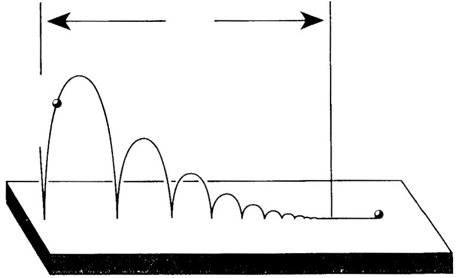
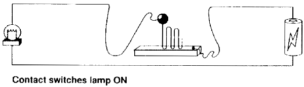
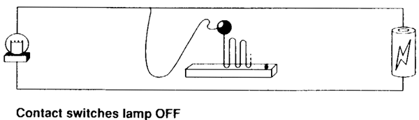
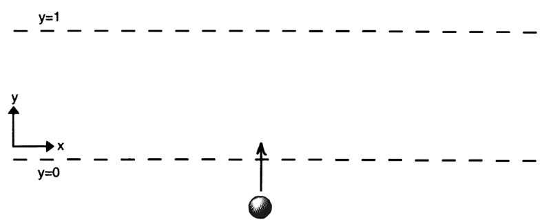
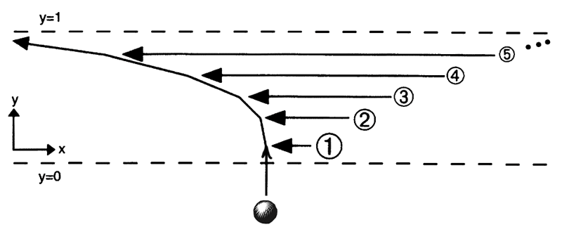
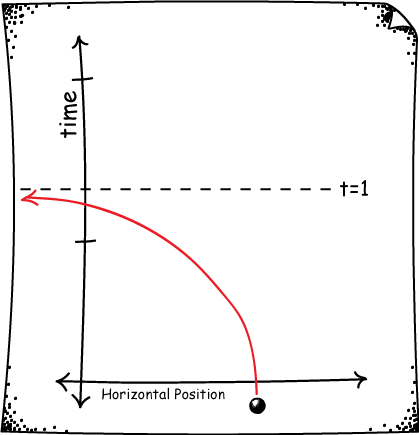
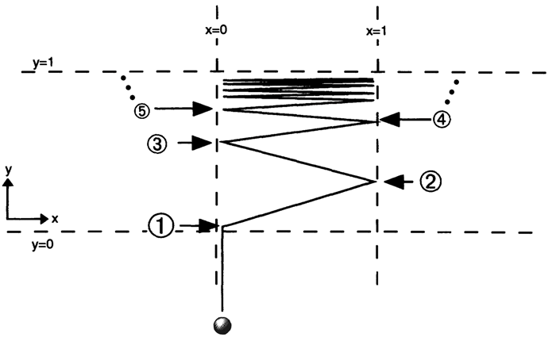

Philosophico-Scientific Adventures | by Bryan W. Roberts

# Introducing Supertasks

Among the strangest concepts we will study in this course is infinity. There's just no end to its strangeness.

For example, suppose you're working at a hotel with infinitely many rooms in it, numbered 1, 2, 3, 4, 5, ... all the way up forever and ever. (This is known as a Hilbert Hotel.) One evening when every single room is occupied, a traveler arrives and requests to be accomodated too. You're the manager. What do you do to help the traveler?

Simple. You just ask each occupant to one room forward. 1 goes to 2, and 2 goes to 3, and so on. Every previous occupant gets a new room. And the first room is now open for the traveler.

The procedure above is characterized by an infinite number of actions or tasks to be carried out in a finite amount of time. Procedures with this character are known as supertasks.

We have already seen one kind of supertask in our discussion of [Zeno's Paradoxes](http://personal.lse.ac.uk/ROBERT49/teaching/ph103/2013-2014/lecture/lecture3.html). This was a supertask that occurs in the context of perfectly ordinary motion. Today we will investigate some supertasks that are less ordinary. And the questions that I would like you to ask yourself as you go are: Is it possible to complete a supertask? In what sense of possible? And why or why not?

# The missing last action

Supertasks very often lack a final action to indicate that the task is complete. For example, recall Zeno's Dichotomy.

If we consider running each interval to be an action, then the race in its entirety is a supertask. But since there is no last interval, there is no last action.

This is strange, but is it really a problem? The philosopher Max Black thought so. He suggested that if there is no last action, then there is still a sense in which the task cannot really be completed. Think about how you would respond to this.

One thing to notice is that Black is really equivocating on two different meanings for the word "complete."

On the one hand, "complete" can mean to execute the final action. This sense of completion obviously does not occur in Zeno's Dichotomy.

On the other hand, "complete" can mean to carry out in a finite amount of time. As we saw last time, the concept of a limit makes clear that Achilles' race can certainly be completed in this sense.

Black's argument only establishes incompleteness in the first sense, but not the second. The two happen to be equivalent for finite tasks, where most of our intuitions are developed. But they are certainly not equivalent when it comes to supertasks.

# Thomson's Lamp: a non-existent limit

Thomson proposed the following supertask using a lamp.

Suppose that we switch the lamp off after 1/2 a minute, then on after 1/4 a minute, then off after 1/8 a minute, on after 1/16, and so on ad infinitum. By the same limiting argument used to solve Zeno's paradoxes of Achilles and Dichotomy, we know that this procedure will be complete after a single minute has passed (since 1 is the limit of the infinite sum, 1/2+1/4+1/8+1/16+...).

At the end of the process, is the lamp on or off?

Thomson claimed it could be neither. For each moment at which the lamp is on is followed by an action that turns the lamp off. And each moment at which the lamp is off is followed by an action that turns the lamp on. So, Thomson argued, it can neither be on nor off!

If we write "1" for "turn on" and "0" for "turn off," then the actions applied to Thomson's lamp are described by the sequence,

1, 0, 1, 0, 1, 0, 1, ...

This sequence has no limit, on our official definition. This means that, on the basis of the information that has been given, we simply haven't defined what the state of the lamp will be at the end of 1 minute.

This provides us with a resolution of Thomson's proposed paradox. If the task has no limit, then the statement, "the state of the lamp in the limit" has no meaning. No more than "the state of the lamp in Narnia." It's not a paradox, but simply a meaningless statement.

Ok, so the limit is meaningless. But what is the state of the lamp after 1 minute?

# Supertasks and "Complete" Descriptions

Another way to put the above solution to Thomson's paradox is: Thomson's description of the lamp is an incomplete description. He has said what the lamp is doing before 1 minute. But this activity has no limit, and nobody said specifically what the state of the lamp is when it reaches 1 minute.

If that's right, then we ought to be able to "complete" the description of Thomson's lamp in a way that leads it to be either on after 1 minute or off after 1 minute, whatever we like. Is this possible?

Sure it is. We can even come up with good descriptions using simple physical systems that implement the behavior.

First, we'll design a Thomson lamp that is in the "on" state after 1 minute. To do it, we'll make use of a bouncing ball.

For an ideal, perfectly elastic ball, there are an infinite number of bounces before the ball comes to a rest. Each bounce happens in less time than the previous. And, like Zeno's Dichotomy, the total amount of time required for all the bounces converges to a finite number. So, the bouncing ball completes a supertask, in which each task is a bounce.

Now suppose that instead of hitting the ground, the ball hits a metal plate that completes a circuit, and switches on a lamp. Then we have a system that implements Thomson's lamp procedure. In particular, it switches a lamp on and off infinitely many times over the course of a finite duration, and it can be arranged in a way so that all the bounces happen in less than 1 minute.

What state is the lamp in after 1 minute is up? Because of how we've set things up, the lamp will be on! There is no mystery once we have a complete enough description.

And we can set things up the other way too. Suppose that each time the ball makes contact with the plate it breaks the circuit and turns the lamp off.

Then we have another supertask that implements Thomson's lamp. But after 1 minute is up, the lamp will be off.

Thus, it is possible to fill in the details of Thomson's lamp in a way that either renders it definitely on after 1 minute, or definitely off after one minute. But does this mean Thomson's original description was incomplete? What does it mean to have a "complete" description of a task, anyway?

If Thomson's description of the lamp is incomplete, then perhaps it would seem that it is not a paradox after all. But to guarantee this verdict, we would need to know what a complete description is. For if, on the other hand, Thomson's description *is* complete, then perhaps it still a paradox that provides evidence against a certain kind of supertask. I leave you to think about which is the correct way to go.

# Ross' Paradox: A limit that doesn't obtain

Here is another supertask that involves a different kind of strange limit. Suppose we have a jar, which is a very large jar, with the capacity to hold infinitely many balls. And, as it happens, we also have an infinite pile of balls, numbered 1, 2, 3, ..., and so on ad infinitum.

Consider the following procedure. First, we drop balls 1-10 in the jar, then remove ball 1. (This adds a total of nine balls to the jar.) Second, we drop balls 11-20 in the jar, and remove ball 2. (This adds a total of nine more balls to the jar.) Suppose that we continue in this way ad infinitum. And suppose that we do it with ever-increasing speed, so we will have used up our entire infinite pile of balls in finite time.

How many balls will be in the jar when this procedure is over? According to Ross, there are two different answers to this question, which leads to a paradox.

The first answer is that, since we add 9 balls at each stage, and since there are infinitely many stages, there must be infinitely many balls in the jar at the end.

The second answer is that, since the balls are numbered 1, 2, 3, ... n, ..., and since each number n is removed at the nth stage, there can be only be zero balls left in the jar at the end. All of them were removed at some finite stage.

But this is a contradiction. There cannot be both zero and infinity balls in a jar. So, Ross argued, we have a paradox. The conclusion he then suggests is that such a supertask is impossible.

# Completing Ross' description

Let's describe the situation with Ross' paradox with a little more precision. First, for each stage s, let's write N(s) to refer to the number of balls in the jar at that stage (call this the "number function"). Thus, N(1)=9, N(2)=18, and so on.

Next, lets think of putting in and removing a ball as following a worldline, which describes the path of the ball through space over time. Now, there are two questions that we can ask about the description of Ross' supertask.

- Question 1. Is the worldline of each ball continuous, with no breaks?
- Question 2. Is the number of balls equal to the limit of the number function N(s) as s goes to infinity?

The original description of the problem does not answer either of these questions. But we only get a paradox if we answer "yes" to both. So, in a sense, the problem is still incomplete. What if we complete the description by answering "yes" to one and "no" to the other?

Let's start by answering "no" to Question 1. If the worldline of each ball is not necessarily continuous, then the following is possible. Suppose that as soon as Ross' supertask is complete, each ball that was removed is instantaneously teleported back into the jar. This happens all at once in the final moment, so the worldlines of the balls are discontinuous. But at the end of the procedure, there are definitely infinitely many balls in the jar.

This matches the limit of the function N(s), so that we can answer "yes" to Question 2. For this function is given by the sequence,

9, 18, 27, 36, ... .

By our definition of a limit, that sequence is increasing to infinity in the limit. That's a mathematical fact. So, since we've said that the balls all teleport back into the urn when the task is complete, we find that the limit that N(s) approaches and the final number of balls in the jar are both infinity.

But you can go the other way as well, and answer "no" to Question 2, and "yes" to Question 1. This is in a sense more physically plausible. For, our experience (and our best physical theories) tend to suggest that worldlines are continuous over time. But if worldlines are continuous, then no instantaneous teleporting is allowed. On the contrary, it follows that there can only be zero balls inside the jar at the end of the procedure.

This means that the number of balls in the jar is discontinuous over time. It increases without bound at each finite stage, always adding 9 to the total number. But in the infinite limit, the number of balls in the jar suddenly jumps to zero.

In other words, although the number function N(s) approaches infinity in the limit, this limit does not obtain in the physical system of the balls and urns.

Thus, we have two different ways to complete the description, each provides a way to escape Ross' paradox. However, further questions remain. Is either completion plausible? And can we really say that Ross' original description was incomplete?

# Laraudogoita's Disappearing Bodies

Here is another kind of supertask in which the limit is not as you would expect. It's due to the Spanish philosopher Laraudogoita. First, consider a black ball sliding upward along a smooth surface.

Suppose that an infinitude of white balls coming in from the right and, one after the other, bumping into the black ball. Each one is faster than the sum of all the previous speeds, and each one is a smaller than the ball just prior to it.

Everything is arranged so that the first collision happens after 1/2 a second, the second collision after 1/4 a second, the third after 1/8, and so on. As you well know by now, this means that the entire infinite collision process will occur in 1 second. So, this procedure is a supertask.

Think about what happens to the velocity of the black ball. It is increasing without bound, getting ever closer to infinity as the time approaches 1 second. So, where will the black ball be after 1 second? Well, there is no point in space where this ball can exist. For every position that it can occupy before one second, there is a position to the left of that which it also occupies before one second. Its worldline, showing the horizontal position comparied to the time passed, looks like this.

Although the black ball exists for all times before 1 second, it does not exist after 1 second. This is called a space evader trajectory, and it is a well-known difficulty in Newtonian physics. For it seems the theory allows a particle can simply "escape" to infinity in finite time!

There are other ways in which this can happen. For example, suppose that instead of balls, we had beads on a string, but that otherwise began with the same velocities as above. A black bead in the middle begins at rest, and is struck on the right by a white ball, which is struck on the right by another white ball traveling faster than the previous one. This then recollides with the black ball, and so on.

If you think about it a little, you'll see that this has exactly the same end effect on the black ball, just with more collisions. It will escape to infinity after 1 second. Not only that, but since every ball in the chain is being hit with greater and greater speed, all the white balls will escape to infinity in finite time as well!

It's tempting to think of infinity as a "place" where these particles go. But infinity is not a place. All that we can say in these cases is that the particles do not exist in any finite place. They exist for a time, and then cease do exist thereafter.

To make this clear, let's set up the same problem when the white ball is confined to a finite space. Imagine now that the black balls are coming in from both the left and right, arranged just so as to increase the speed of the ball without bound, bringing it ever closer to the top ceiling of the space T.

The position of the white ball does not approach any limit as it approaches the ceiling. For any position it might be, there is a position to the right at which it is later, and a position to the left at which it is later. So, if all worldlines are continuous, then the white ball cannot be anywhere at all after time t. It disappears from space, even though it was previously confined to a finite region.

# Logical vs. Physical Possibility

Can't anyone save the world from this insanity? There is one particularly unrealistic feature of most of these examples. That is that in many of them, the speed increases without bound.

For example, it looks as if with Thomson's lamp, the speed at which you must flip the switch must increase without bound. However, this problem is fixed with the bouncing ball, which only ever travels with finite speed. (Similarly for Zeno's Dichotomy, in which Achilles obviously always travels with finite speed.)

But in Ross' paradox, the speed at which we add and remove balls from the jar increases without bound. Same thing for all the versions of Laradogoita's supertask, in which the speeds of the balls increase without bound.

This is a problem because we know from Einstein's relativity theory that no object in a vacuum can be accelerated to any speed faster than the speed of light. In this sense, many of these supertasks might already be said to be impossible.

There are two reasons to be careful about jumping too quickly to such a conclusion. First, it turns out that versions of most of these supertasks can be regained in general relativity, our best theory of gravity. A discussion of supertasks in the presence of gravity is outside the scope of this course, but you can [read about it here](http://www.pitt.edu/~jdnorton/papers/Forever.pdf). This is a classic topic in the philosophy of physics.

Second, it is worth considering different senses of the word impossible. Here we are saying that some of these supertasks violate a law of physics. In that sense, they are physically impossible.

But Newtonian physics has no upper speed limit. And one can certainly imagine a world in which the natural world obeys the physics of Newton instead of the physics of Einstein. So, we can still ask whether supertasks are logically impossible, regardless of what the laws of nature happen to be. And we can discuss the logical possibility of, say, Ross' paradox, whether or not it is physically possible.

# Some Morals

Here are a few key morals to remember and think about from our discussion of supertasks.

First, a limit doesn't always exist. Just because you can describe an infinite sequence of terms doesn't mean that the sequence has a well-defined limit.

Second, when a limit does exist, that limit doesn't always obtain. Whether we are talking about the length of a line, or the position of a ball in a jar, the mathematical limit doesn't necessarily correspond to the outcome of a physical supertask.

Third, what we can say about a limit depends on difficult questions about what counts as a complete description of a supertask, and it is important to think carefully about when descriptions like Thomson's are complete.

Finally, whether or not supertasks are possible depends in part on which sense of possibility we have in mind, and whether we wish to constrain ourselves to the rules of logic, Newtonian mechanics, Special Relativity, or General Relativity.