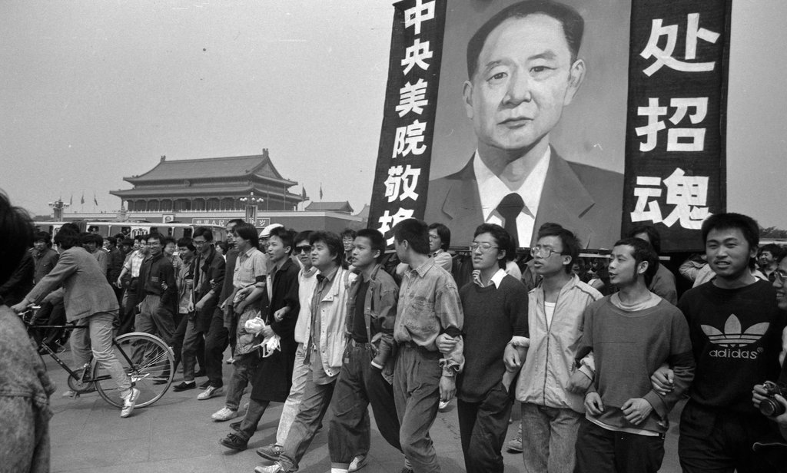
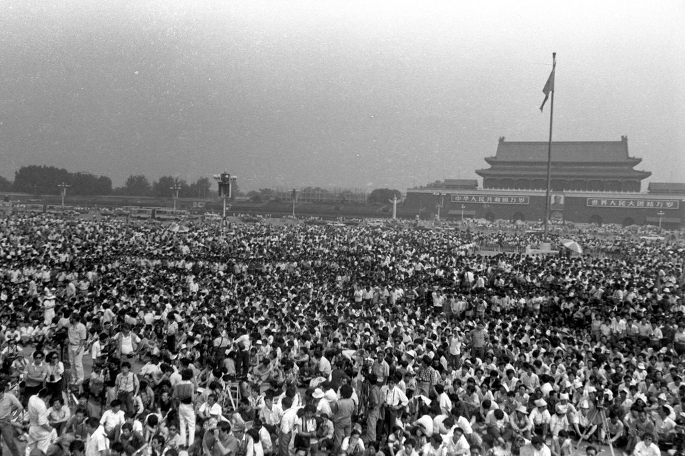
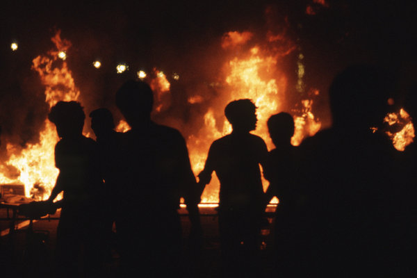
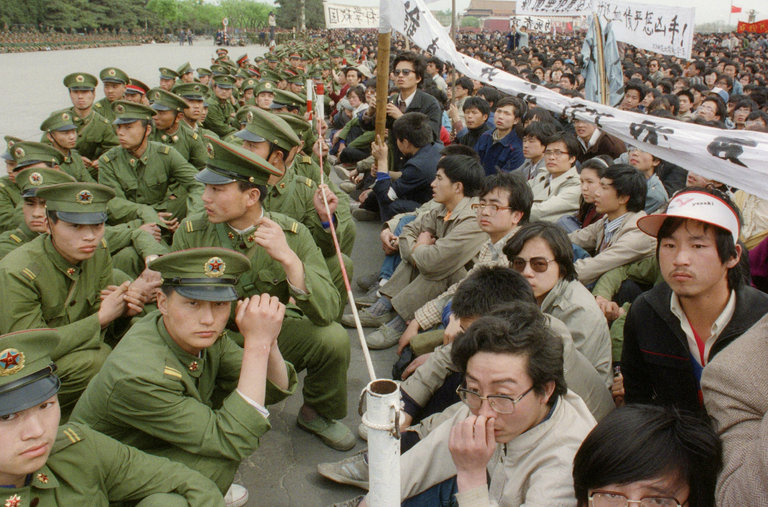
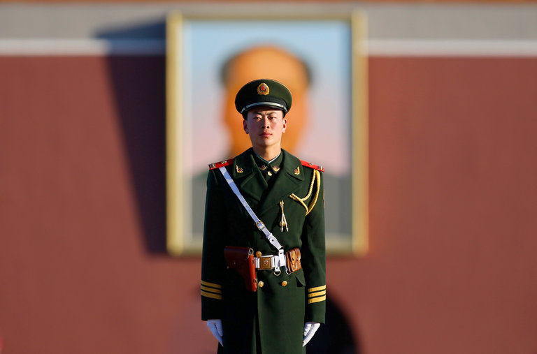

Photos of the Tiananmen Square Protests Through the Lens of a Student Witness

# Photos of the Tiananmen Square Protests Through the Lens of a Student Witness Photos of the Tiananmen Square Protests Through the Lens of a Student Witness

After three decades, Jian Liu decided to reveal images he took of the hopeful 1989 student movement and its bloody aftermath.

In April 1989, students at top universities in Beijing commemorated the death of the Communist Party chief and political reformer Hu Yaobang at Tiananmen Square, marking the beginning of the pro-democracy protests.CreditJian Liu

Image

In April 1989, students at top universities in Beijing commemorated the death of the Communist Party chief and political reformer Hu Yaobang at Tiananmen Square, marking the beginning of the pro-democracy protests.CreditCreditJian Liu

By [Tiffany May](https://www.nytimes.com/by/tiffany-may)

- May 30, 2019

-

    - 
    - 
    - [](https://www.nytimes.com/2019/05/30/world/asia/tiananmen-square-protest-photos.htmlmailto:?subject=NYTimes.com%3A%20Photos%20of%20the%20Tiananmen%20Square%20Protests%20Through%20the%20Lens%20of%20a%20Student%20Witness&body=From%20The%20New%20York%20Times%3A%0A%0APhotos%20of%20the%20Tiananmen%20Square%20Protests%20Through%20the%20Lens%20of%20a%20Student%20Witness%0A%0AAfter%20three%20decades%2C%20Jian%20Liu%20decided%20to%20reveal%20images%20he%20took%20of%20the%20hopeful%201989%20student%20movement%20and%20its%20bloody%20aftermath.%0A%0Ahttps%3A%2F%2Fwww.nytimes.com%2F2019%2F05%2F30%2Fworld%2Fasia%2Ftiananmen-square-protest-photos.html)

    -
    -
    -

[阅读简体中文版•](https://cn.nytimes.com/china/20190531/tiananmen-square-protest-photos/)[閱讀繁體中文版](https://cn.nytimes.com/china/20190531/tiananmen-square-protest-photos/zh-hant/)

HONG KONG — Jian Liu has kept 60 rolls of film hidden from public view for three decades.

He was a 20-year-old fashion design student in Beijing in the spring of 1989 when a student-led pro-democracy movement drew thousands of supporters to Tiananmen Square. Captivated by the spirit of the movement, he photographed the protests for about 50 days.

Mr. Liu said he had been exhilarated by the protesters’ bold demands for greater freedom and an end to corruption, and had set out to capture their enthusiasm and zeal.

“It made me think that this country would get better and better,” he said.

Then, on June 4, 1989, the People’s Liberation Army rolled into Beijing and opened fire at the activists and civilians, killing hundreds, possibly thousands.

[*Documents *[*shed new light on power games*](https://www.nytimes.com/2019/05/30/world/asia/china-tiananmen-crackdown.html?module=inline)* behind Tiananmen crackdown.*]

That morning, the smell of blood lingered in the hot summer air. He said he saw about 20 bodies riddled with bullets lying on the floor of a hospital. He took some final photographs to bear witness, and then hastily walked away.

“I couldn’t bear it,” he said in an interview.

In May, some television stations broadcast the continuing protests, which drew thousands.CreditJian Liu

Image

In May, some television stations broadcast the continuing protests, which drew thousands.CreditJian Liu

Beijing residents taking stock of the demonstrations in late April.CreditJian Liu

Image

Beijing residents taking stock of the demonstrations in late April.CreditJian Liu

A student practiced qigong, the age-old practice of cultivating energy flow, while on a hunger strike.CreditJian Liu

Image

A student practiced qigong, the age-old practice of cultivating energy flow, while on a hunger strike.CreditJian Liu

For years, he tried to forget the bloodshed he had seen and locked away his memories in the 60 rolls of film — about 2,000 photos — he had shot using an analog camera.

By releasing his images publicly, Mr. Liu joins a small group of Chinese historians, writers, photographers and artists who have tried to chronicle the chapters in Chinese history that the party wants erased from public memory.

“Reflection is only possible in a democratic and peaceful place,” he said. “Under autocratic rule, it is impossible for you to discuss this.”

Mr. Liu had run a photography studio in Beijing for years before moving to Los Angeles in 2016 to study English. He asked a friend to bring him the film negatives from China in March, and a month ago, after converting them into digital files, he revisited the images he had captured 30 years ago.

In mid-May, a motorcycle parade called the Flying Tigers rode in support of the student movement.CreditJian Liu

Image

In mid-May, a motorcycle parade called the Flying Tigers rode in support of the student movement.CreditJian Liu

In late May, civilians blocked the first wave of unarmed soldiers who had come to enforce martial law in Beijing and explained to them why students were protesting. This unit turned back.CreditJian Liu

Image

In late May, civilians blocked the first wave of unarmed soldiers who had come to enforce martial law in Beijing and explained to them why students were protesting. This unit turned back.CreditJian Liu

Armed police officers marching in mid-May. The army got orders to clear the square by any means.CreditJian Liu

Image

Armed police officers marching in mid-May. The army got orders to clear the square by any means.CreditJian Liu

Mr. Liu had photographed the youthful faces of unarmed soldiers through the windows of their trucks.

“They were panic-stricken and probably had no idea what was happening in Beijing,” he said, adding that he thought they were perhaps no older than 20.

But nothing prepared him for the carnage when soldiers shot into the crowds. At a hospital, he said, he saw people who had been shot dead, their shoulders shattered and heads smashed. He put his camera away out of a sense of respect.

“Taking those photos is too disrespectful to them,” he said, referring to people whose bodies had been mutilated. “I took photos of people whose bodies could still be considered complete.”

This vehicle served as the information hub of the Beijing Students’ Autonomous Federation, a self-governing league of university organizations.CreditJian Liu

Image

This vehicle served as the information hub of the Beijing Students’ Autonomous Federation, a self-governing league of university organizations.CreditJian Liu

In mid-May, about a week after students began a hunger strike.CreditJian Liu

Image

In mid-May, about a week after students began a hunger strike.CreditJian Liu
Helping a fellow student protester.CreditJian Liu

Image

Helping a fellow student protester.CreditJian Liu

“Whether they were students or residents, pro-democracy activists or even what the Communist Party calls thugs, these young people should not have died,” he said. “They should not have been killed by bullets. This cannot be justified in any way.”

In the days after the crackdown, Mr. Liu did not dare leave his house as armed soldiers swarmed the city. The authorities later arrested thousands of people suspected of being dissidents and sentenced many to prison.

Students built a figure they called the Goddess of Democracy in Tiananmen Square in late May.CreditJian Liu

Image

Students built a figure they called the Goddess of Democracy in Tiananmen Square in late May.CreditJian Liu

Wounded plainclothes officers on West Chang’An Avenue after Chinese forces clashed with students while enforcing martial law in May.CreditJian Liu

Image

Wounded plainclothes officers on West Chang’An Avenue after Chinese forces clashed with students while enforcing martial law in May.CreditJian Liu

Military vehicles burning in May on West Chang’An Avenue. It was unclear who set them on fire.CreditJian Liu

Image

Military vehicles burning in May on West Chang’An Avenue. It was unclear who set them on fire.CreditJian Liu

“Those days passed by in a blur,” he said. “Everyone walked with their head lowered, up till today.”

Now 50, Mr. Liu decided to publicly release the images with the help of Humanitarian China, a California-based organization that gives grants to impoverished dissidents and their families.

Bodies at the mortuary at Shuili hospital. They had all died from bullet wounds not long before the photo was taken.CreditJian Liu

Image

Bodies at the mortuary at Shuili hospital. They had all died from bullet wounds not long before the photo was taken.CreditJian Liu

Mr. Liu said he had been motivated after he realized that his teenage daughter, who had been going to school in China until 2016, [had never heard about the massacre.](https://www.nytimes.com/2009/05/22/world/asia/22tiananmen.html?module=inline)

Many young Chinese are similarly unaware, the result of the Chinese government’s largely successful [campaign to silence discussion](https://www.nytimes.com/2014/05/28/world/asia/tiananmen-square-anniversary-prompts-campaign-of-silence.html?module=inline) of the violent crackdown.

“The Chinese Communist Party is building a government based on a lie,” he said. “It’s very afraid that more people would know the truth. So I decided to put this out.”

Produced by Mikko Takkunen.
Follow Tiffany May on Twitter: [@nytmay.](https://twitter.com/nytmay)

[ 30 Years After Tiananmen, a Chinese Military Insider Warns: Never Forget May 28, 2019  ](https://www.nytimes.com/2019/05/28/world/asia/china-tiananmen-square-massacre.html?action=click&module=RelatedLinks&pgtype=Article)

[ Tales of Army Discord Show Tiananmen Square in a New Light June 2, 2014  ](https://www.nytimes.com/2014/06/03/world/asia/tiananmen-square-25-years-later-details-emerge-of-armys-chaos.html?action=click&module=RelatedLinks&pgtype=Article)

[ Tiananmen Square Anniversary Prompts Campaign of Silence May 27, 2014  ](https://www.nytimes.com/2014/05/28/world/asia/tiananmen-square-anniversary-prompts-campaign-of-silence.html?action=click&module=RelatedLinks&pgtype=Article)

A version of this article appears in print on June 2, 2019, on Page A13 of the New York edition with the headline: The Tiananmen Protests 30 Years Later, Unretouched. [Order Reprints](http://www.nytreprints.com/) | [Today’s Paper](http://www.nytimes.com/pages/todayspaper/index.html) | [Subscribe](https://www.nytimes.com/subscriptions/Multiproduct/lp8HYKU.html?campaignId=48JQY)

- 
- 
- [](https://www.nytimes.com/2019/05/30/world/asia/tiananmen-square-protest-photos.htmlmailto:?subject=NYTimes.com%3A%20Photos%20of%20the%20Tiananmen%20Square%20Protests%20Through%20the%20Lens%20of%20a%20Student%20Witness&body=From%20The%20New%20York%20Times%3A%0A%0APhotos%20of%20the%20Tiananmen%20Square%20Protests%20Through%20the%20Lens%20of%20a%20Student%20Witness%0A%0AAfter%20three%20decades%2C%20Jian%20Liu%20decided%20to%20reveal%20images%20he%20took%20of%20the%20hopeful%201989%20student%20movement%20and%20its%20bloody%20aftermath.%0A%0Ahttps%3A%2F%2Fwww.nytimes.com%2F2019%2F05%2F30%2Fworld%2Fasia%2Ftiananmen-square-protest-photos.html)

-

Advertisement