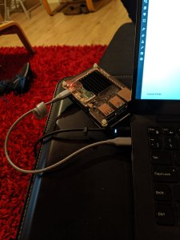

Pi4 USB-C Gadget

# Pi4 USB-C Gadget

I’ve previously [blogged](https://www.hardill.me.uk/wordpress/2017/01/23/raspberry-pi-zero-gadgets/) about using [Pi Zero](https://www.hardill.me.uk/wordpress/2017/02/12/updated-pi-zero-gadgets/) (and Zero W) devices as USB Gadgets. This allows them to be powered and accessed via one of the micro USB sockets and it shows up as both a CD-Drive and a ethernet device.

A recent update to the Raspberry Pi 4 bootloader not only enables the low power mode for the USB hardware, allows the enabling of Network boot and enables data over the USB-C port. The lower power means it should run (without any hats) with the power supplied from a laptop.

Details of how to check/update the bootloader can be found [here](https://www.raspberrypi.org/documentation/hardware/raspberrypi/booteeprom.md).

Given that the Pi4 has a Gigabit Ethernet adapter, WiFi and 4 USB sockets (need to keep the power draw low to be safe) and up to 4Gb RAM to go with it’s 4 x 1.5Ghz core processor it makes for a very attractive plugin compute device.

With this enabled all the same script from the Pi Zero’s should just work but here is the updated version for Raspbian Buster.

- Add `dtoverlay=dwc2` to the `/boot/config.txt`
- Add `modules-load=dwc2` to the end of `/boot/cmdline.txt`
- Add `libcomposite` to `/etc/modules`
- Add `denyinterfaces usb0` to `/etc/dhcpcd.conf`
- Install dnsmasq with `sudo apt-get install dnsmasq`
- Create `/etc/dnsmasq.d/usb` with following content

	interface=usb0
	dhcp-range=10.55.0.2,10.55.0.6,10.55.0.0,255.255.255.248,1h
	dhcp-option=3
	leasefile-ro

- Create `/etc/network/interfaces.d/usb0` with the following content

	auto usb0
	allow-hotplug usb0
	iface usb0 inet static
	  address 10.55.0.1
	  netmask 255.255.255.248

- Create `/root/usb.sh`

	#!/bin/bash
	cd /sys/kernel/config/usb_gadget/
	mkdir -p pi4
	cd pi4
	echo 0x1d6b > idVendor # Linux Foundation
	echo 0x0104 > idProduct # Multifunction Composite Gadget
	echo 0x0100 > bcdDevice # v1.0.0
	echo 0x0200 > bcdUSB # USB2
	echo 0xEF > bDeviceClass
	echo 0x02 > bDeviceSubClass
	echo 0x01 > bDeviceProtocol
	mkdir -p strings/0x409
	echo "fedcba9876543211" > strings/0x409/serialnumber
	echo "Ben Hardill" > strings/0x409/manufacturer
	echo "PI4 USB Device" > strings/0x409/product
	mkdir -p configs/c.1/strings/0x409
	echo "Config 1: ECM network" > configs/c.1/strings/0x409/configuration
	echo 250 > configs/c.1/MaxPower
	# Add functions here
	# see gadget configurations below
	# End functions
	mkdir -p functions/ecm.usb0
	HOST="00:dc:c8:f7:75:14" # "HostPC"
	SELF="00:dd:dc:eb:6d:a1" # "BadUSB"
	echo $HOST > functions/ecm.usb0/host_addr
	echo $SELF > functions/ecm.usb0/dev_addr
	ln -s functions/ecm.usb0 configs/c.1/
	udevadm settle -t 5 || :
	ls /sys/class/udc > UDC
	ifup usb0
	service dnsmasq restart

- Add `/root/usb.sh` to `/etc/rc.local` before `exit 0`

With this setup the Pi4 will show up as a ethernet device with an IP address of 10.55.0.1 and will assign the device you plug it into an IP address via DHCP. This means you can just ssh to pi@10.55.0.1 to start using it.

### Share this:

- [Click to share on Twitter (Opens in new window)](https://www.hardill.me.uk/wordpress/2019/11/02/pi4-usb-c-gadget/?share=twitter&nb=1)
- [Click to share on Facebook (Opens in new window)](https://www.hardill.me.uk/wordpress/2019/11/02/pi4-usb-c-gadget/?share=facebook&nb=1)

-

### *Related*

[Raspberry Pi Zero Gadgets](https://www.hardill.me.uk/wordpress/2017/01/23/raspberry-pi-zero-gadgets/)23rd January 2017In "Clock"

[Quick and Dirty Touchscreen Driver](https://www.hardill.me.uk/wordpress/2019/09/02/quick-and-dirty-touchscreen-driver/)2nd September 2019In "Hacks"

[Updated Pi Zero Gadgets](https://www.hardill.me.uk/wordpress/2017/02/12/updated-pi-zero-gadgets/)12th February 2017In "Clock"

Posted on [2nd November 2019](https://www.hardill.me.uk/wordpress/2019/11/02/pi4-usb-c-gadget/)Author [Ben Hardill](https://www.hardill.me.uk/wordpress/author/hardillb/)Categories [Hacks](https://www.hardill.me.uk/wordpress/category/hacks/), [Tech](https://www.hardill.me.uk/wordpress/category/tech/)Tags [gadget](https://www.hardill.me.uk/wordpress/tag/gadget/), [raspberry pi](https://www.hardill.me.uk/wordpress/tag/raspberry-pi/), [usb-c](https://www.hardill.me.uk/wordpress/tag/usb-c/)

### Leave a Reply

Your email address will not be published. Required fields are marked *
Comment
Name *
Email *
Website
 Notify me of follow-up comments by email.
 Notify me of new posts by email.

This site uses Akismet to reduce spam. [Learn how your comment data is processed](https://akismet.com/privacy/).

## Post navigation

[Previous  Previous post:  Updated AWS Lambda NodeJS Version checker](https://www.hardill.me.uk/wordpress/2019/10/19/updated-aws-lambda-nodejs-version-checker/)