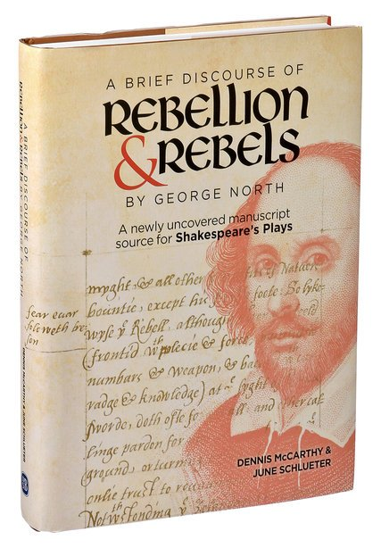
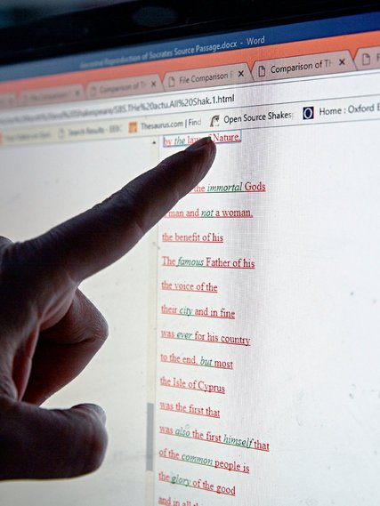
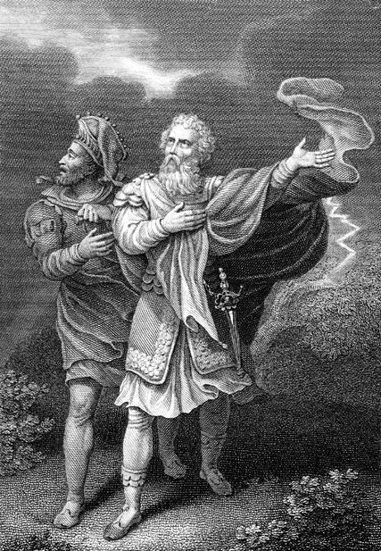
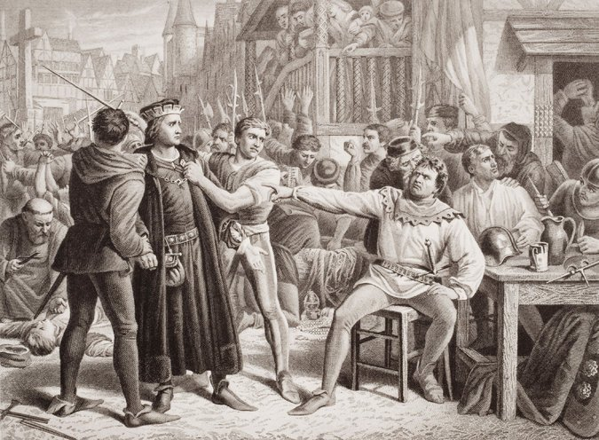
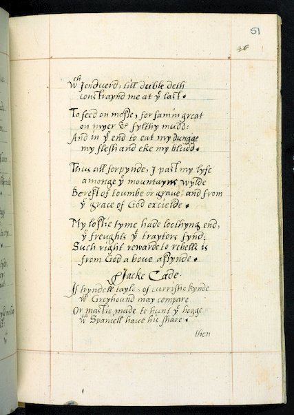

Plagiarism Software Unveils a New Source for 11 of Shakespeare’s Plays

# Plagiarism Software Unveils a New Source for 11 of Shakespeare’s Plays

 [Leer en español](https://www.nytimes.com/es/2018/02/12/shakespeare-obras-inspiracion-analisis-plagio/)

Photo

Dennis McCarthy, a self-taught Shakespeare scholar, at his home in North Hampton, N.H. Credit Cody O'Loughlin for The New York Times

For years scholars have debated what inspired William Shakespeare’s writings. Now, with the help of software typically used by professors to nab cheating students, two writers have discovered an unpublished manuscript they believe the Bard of Avon consulted to write “King Lear,” “Macbeth,” “Richard III,” “Henry V” and seven other plays.

The news has caused Shakespeareans to sit up and take notice.

“If it proves to be what they say it is, it is a once-in-a-generation — or several generations — find,” said Michael Witmore, director of the Folger Shakespeare Library in Washington.

The findings were made by Dennis McCarthy and June Schlueter, who describe them in a book to be published next week by the academic press D. S. Brewer and the British Library. The authors are not suggesting that Shakespeare plagiarized but rather that he read and was inspired by a manuscript titled “A Brief Discourse of Rebellion and Rebels,” written in the late 1500s by George North, a minor figure in the court of Queen Elizabeth, who served as an ambassador to Sweden.

Photo

The second page of the George North manuscript, showing the passage that Shakespeare used to write the opening soliloquy in “Richard III.”

“It’s a source that he keeps coming back to,” said Mr. McCarthy, a self-taught Shakespeare scholar, during a recent interview at his home in North Hampton, N.H. “It affects the language, it shapes the scenes and it, to a certain extent, really even influences the philosophy of the plays.”

Photo

Credit Patricia Wall/The New York Times

In reviewing the book before it was published, David Bevington, professor emeritus in the humanities at the University of Chicago and editor of “The Complete Works of William Shakespeare (7th Edition),” called it “a revelation” for the sheer number of correlations with the plays, eclipsed only by the chronicles of Holinshed and Hall and Plutarch’s “Lives.”

 [Continue reading the main story](https://www.nytimes.com/2018/02/07/books/plagiarism-software-unveils-a-new-source-for-11-of-shakespeares-plays.html?recb=signature-journalism.thompson_sampling&recid=12j0gqkUsitslKVD28pJih1tdEt&contentCollection=signature-journalism&mData=articles%255B%255D%3Dhttps%253A%252F%252Fwww.nytimes.com%252F2018%252F02%252F07%252Fbooks%252Fplagiarism-software-unveils-a-new-source-for-11-of-shakespeares-plays.html%253Frecb%253Dsignature-journalism.thompson_sampling%2526recid%253D12j0gqkUsitslKVD28pJih1tdEt&hp&action=click&pgtype=Homepage&clickSource=story-heading&module=signatureJournalism-promo-region&region=signatureJournalism-promo-region&WT.nav=signatureJournalism-promo-region#story-continues-1)

ADVERTISEMENT

 [Continue reading the main story](https://www.nytimes.com/2018/02/07/books/plagiarism-software-unveils-a-new-source-for-11-of-shakespeares-plays.html?recb=signature-journalism.thompson_sampling&recid=12j0gqkUsitslKVD28pJih1tdEt&contentCollection=signature-journalism&mData=articles%255B%255D%3Dhttps%253A%252F%252Fwww.nytimes.com%252F2018%252F02%252F07%252Fbooks%252Fplagiarism-software-unveils-a-new-source-for-11-of-shakespeares-plays.html%253Frecb%253Dsignature-journalism.thompson_sampling%2526recid%253D12j0gqkUsitslKVD28pJih1tdEt&hp&action=click&pgtype=Homepage&clickSource=story-heading&module=signatureJournalism-promo-region&region=signatureJournalism-promo-region&WT.nav=signatureJournalism-promo-region#story-continues-2)

Martin Meisel, professor of dramatic literature emeritus at Columbia University, said in another review that the book is “impressively argued.” He added that there is no question the manuscript “must have been somewhere in the background mix of Shakespeare’s mental landscape” while writing the plays.

Mr. McCarthy used decidedly modern techniques to marshal his evidence, employing WCopyfind, an open-source plagiarism software, which picked out common words and phrases in the manuscript and the plays.

In the dedication to his manuscript, for example, North urges those who might see themselves as ugly to strive to be inwardly beautiful, to defy nature. He uses a succession of words to make the argument, including “proportion,” “glass,” “feature,” “fair,” “deformed,” “world,” “shadow” and “nature.” In the opening soliloquy of Richard III (“Now is the winter of our discontent …”) the hunchbacked tyrant uses the same words in virtually the same order to come to the opposite conclusion: that since he is outwardly ugly, he will act the villain he appears to be.

“People don’t realize how rare these words actually are,” Mr. McCarthy said. “And he keeps hitting word after word. It’s like a lottery ticket. It’s easy to get one number out of six, but not to get every number.”

Photo

Dennis McCarthy used plagiarism software to compare Shakespeare’s works and George North’s manuscript. Credit Cody O'Loughlin for The New York Times

Scholars have used computer-assisted techniques in the humanities for several decades. Most of that scholarship, however, uses function words such as articles and prepositions to create a “digital signature” that can be used to identify a writer as author or co-author of another work, rather than using comparatively rare words to locate a source.

Mr. McCarthy was inspired to use plagiarism software by the [work of Sir Brian Vickers, who used similar techniques in 2009](http://content.time.com/time/arts/article/0,8599,1930971,00.html) to identify Shakespeare as a co-author of the play “Edward III.” While the book has been received favorably, the statistical techniques used have not yet been subjected to a rigorous review by other scholars in the digital humanities field.

Those techniques may only be the “icing on the cake,” said Mr. Witmore, who briefly examined an advance copy. “At its core, this remains a literary argument, not a statistical one.” The book contends that Shakespeare not only uses the same words as North, but often uses them in scenes about similar themes, and even the same historical characters. In another passage, North uses six terms for dogs, from the noble mastiff to the lowly cur and “trundle-tail,” to argue that just as dogs exist in a natural hierarchy, so do humans. Shakespeare uses essentially the same list of dogs to make similar points in “King Lear” and “Macbeth.”

Photo

An engraving of King Lear with the Fool. Credit Alamy

To make sure North and Shakespeare weren’t using common sources, Mr. McCarthy ran phrases through the database Early English Books Online, which contains 17 million pages from nearly every work published in English between 1473 and 1700. He found that almost no other works contained the same words in passages of the same length. Some words are especially rare; “trundle-tail” appears in only one other work before 1623.

In the past, some scholars have identified sources for Shakespeare from a few unique words. In 1977, for example, Kenneth Muir made the case that Shakespeare used a particular translation of a book of Latin stories for “The Merchant of Venice” based on the word “insculpt.” In recent years, however, it’s become rare to identify new sources for Shakespeare. “The field has been picked over so carefully,” Mr. Bevington said.

Mr. McCarthy is an unlikely literary scholar. Originally from Amherst, N.Y., he studied computer science and theater at the University at Buffalo, but never graduated. He began writing for magazines and newspapers and published a book in 2009, titled “Here Be Dragons,” about the geographical underpinnings of evolution.

That interest led him to wonder if literary ideas could propagate the same way, and starting in 2006 he began to explore the sources of Shakespeare. Mr. McCarthy focused on Thomas North, a translator of Plutarch’s “Lives,” whom Shakespeare relied on heavily for his dramas.

In April 2011, Mr. McCarthy brought some of his findings to Ms. Schlueter, professor emerita of English at Lafayette College in Pennsylvania and a founding editor of Shakespeare Bulletin, a scholarly journal. She admired his diligence and natural affinity for scholarly research. “Dennis is the Steve Jobs of the Shakespeare community,” Ms. Schlueter said, referring to the self-taught Apple founder.

Mr. McCarthy, 53, works behind three computer monitors on the dining room table of his home. Supported financially by his wife, a biotechnology executive, he spends 12 hours a day or more at his computer.

Photo

Books by and about Shakespeare dominate Dennis McCarthy’s shelves. Credit Cody O'Loughlin for The New York Times

Mr. McCarthy found a reference to the manuscript by George North, a likely cousin of Thomas, online in a 1927 auction catalog, which noted it would be “extremely interesting” to compare certain passages with Shakespeare. He and Ms. Schlueter scoured libraries and archives for a year before enlisting the help of a manuscript detective, who studies rare documents and traced it to the British Library, which had purchased it in 1933. (The manuscript was filed under an obscure shelf mark, which made finding it difficult.)

In 1576, North was living at Kirtling Hall near Cambridge, England, the estate of Baron Roger North. It was here, Mr. McCarthy says, that he wrote his manuscript, at the same time Thomas North was there possibly working on his translation of Plutarch.

The manuscript is a diatribe against rebels, arguing that all rebellions against a monarch are unjust and doomed to fail. While Shakespeare had a more ambiguous position on rebellion, Mr. McCarthy said he clearly mined North’s treatise for themes and characters.

One of the most compelling is Jack Cade, who led a failed popular rebellion against Henry VI in 1450. Shakespeare describes Cade’s final days in “Henry VI, Part 2,” in which he says he was starving and eating grass, before he was finally caught and dragged through the street by his heels, his body left to be eaten by crows. Scholars have long thought that Shakespeare invented these details, but all of them are present in a passage from North’s “Discourse” in which he inveighs against Cade and two other famous rebels. Mr. McCarthy and Ms. Schlueter argue that Shakespeare used those details to make Cade into a composite of the three.

Photo

A scene from “Henry VI, Part 2,” with Jack Cade seated. Credit Alamy

While Cade is a minor character, Mr. McCarthy also argues that North’s “Discourse” may have inspired one of Shakespeare’s most iconic characters, the Fool in “King Lear.” He points to the memorable passage in which the Fool and Lear are lost in a storm, and the Fool recites a prophecy that he attributes to Merlin.

Photo

A page from the George North manuscript that starts the poem about Jack Cade. The last stanza lists terms for dogs, which Shakespeare used in “King Lear” and “Macbeth.”

Scholars have long puzzled over the recitation, which doesn’t seem to match any known prophecy of Merlin’s. In their book, however, Mr. McCarthy and Ms. Schlueter claim the passage was inspired by a version of Merlin’s prophecy that North includes in his “Discourse” to present a dystopian view of the world “turned up side down.” Mr. McCarthy and Ms. Schlueter argue such lines may have inspired themes in “King Lear” and even the character of the Fool.

While agreeing the passage influenced the scene in “King Lear,” Mr. Bevington cautioned against an overly expansive reading, noting such themes were in the air in contemporaneous works, including Erasmus’s “In Praise of Folly.” Whatever its influence, Mr. Witmore said, the find suggests that while scholars may have exhausted print sources, there may be other unpublished manuscripts that inspired the Bard that remain to be discovered.

For his part, Mr. McCarthy is already planning future volumes based on his electronic techniques, hoping to present more discoveries that shed light on how Shakespeare wrote his plays.

Michael Blanding, a senior fellow at the Schuster Institute for Investigative Journalism at Brandeis University, is the author of “The Map Thief.”

*Follow Michael Blanding on Twitter: [@michaelblanding](https://twitter.com/michaelblanding).*

A version of this article appears in print on February 8, 2018, on Page A1 of the New York edition with the headline: Book Points to Possible Source Of Shakespeare’s Inspiration. [Order Reprints](http://www.nytreprints.com/)| [Today's Paper](http://www.nytimes.com/pages/todayspaper/index.html)|[Subscribe](http://www.nytimes.com/subscriptions/Multiproduct/lp839RF.html?campaignId=48JQY)

 [Continue reading the main story](https://www.nytimes.com/2018/02/07/books/plagiarism-software-unveils-a-new-source-for-11-of-shakespeares-plays.html?recb=signature-journalism.thompson_sampling&recid=12j0gqkUsitslKVD28pJih1tdEt&contentCollection=signature-journalism&mData=articles%255B%255D%3Dhttps%253A%252F%252Fwww.nytimes.com%252F2018%252F02%252F07%252Fbooks%252Fplagiarism-software-unveils-a-new-source-for-11-of-shakespeares-plays.html%253Frecb%253Dsignature-journalism.thompson_sampling%2526recid%253D12j0gqkUsitslKVD28pJih1tdEt&hp&action=click&pgtype=Homepage&clickSource=story-heading&module=signatureJournalism-promo-region&region=signatureJournalism-promo-region&WT.nav=signatureJournalism-promo-region#whats-next)