Playing with 80 Million Amazon Product Review Ratings Using Apache Spark

# Playing with 80 Million Amazon Product Review Ratings Using Apache Spark

*January 2, 2017[**](https://www.facebook.com/share.php?u=http://minimaxir.com/2017/01/amazon-spark/)[**](http://twitter.com/home/?status=Playing%20with%2080%20Million%20Amazon%20Product%20Review%20Ratings%20Using%20Apache%20Spark%20-%20http://minimaxir.com/2017/01/amazon-spark/%20-%20via%20@minimaxir)  [** 0](http://www.linkedin.com/shareArticle?mini=true&title=&url=http://minimaxir.com/2017/01/amazon-spark/)  *

[Amazon](https://www.amazon.com/) product reviews and ratings are a very important business. Customers on Amazon often make purchasing decisions based on those reviews, and a single bad review can cause a potential purchaser to reconsider. A couple years ago, I wrote a blog post titled [A Statistical Analysis of 1.2 Million Amazon Reviews](http://minimaxir.com/2014/06/reviewing-reviews/), which was well-received.

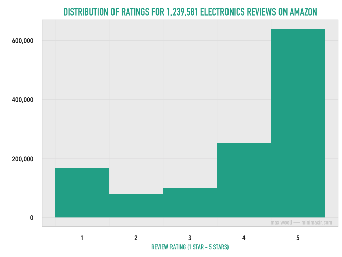

Back then, I was only limited to 1.2M reviews because attempting to process more data caused out-of-memory issues and my R code took *hours* to run.

[Apache Spark](http://spark.apache.org/), which makes processing gigantic amounts of data efficient and sensible, has become very popular in the past couple years (for good tutorials on using Spark with Python, I recommend the [free](https://courses.edx.org/courses/course-v1:BerkeleyX+CS105x+1T2016/info)  [eDX](https://courses.edx.org/courses/course-v1:BerkeleyX+CS110x+2T2016/info)  [courses](https://courses.edx.org/courses/course-v1:BerkeleyX+CS120x+2T2016/info)). Although data scientists often use Spark to process data with distributed cloud computing via [Amazon EC2](https://aws.amazon.com/ec2/) or [Microsoft Azure](https://azure.microsoft.com/en-us/services/hdinsight/apache-spark/), Spark works just fine even on a typical laptop, given enough memory (for this post, I use a 2016 MacBook Pro/16GB RAM, with 8GB allocated to the Spark driver).

I wrote a [simple Python script](https://github.com/minimaxir/amazon-spark/blob/master/amazon_preprocess.py) to combine the per-category ratings-only data from the [Amazon product reviews dataset](http://jmcauley.ucsd.edu/data/amazon/) curated by Julian McAuley, Rahul Pandey, and Jure Leskovec for their 2015 paper [Inferring Networks of Substitutable and Complementary Products](http://cseweb.ucsd.edu/~jmcauley/pdfs/kdd15.pdf). The result is a 4.53 GB CSV that would definitely not open in Microsoft Excel. The truncated and combined dataset includes the **user_id** of the user leaving the review, the **item_id** indicating the Amazon product receiving the review, the **rating** the user gave the product from 1 to 5, and the **timestamp** indicating the time when the review was written (truncated to the Day). We can also infer the **category** of the reviewed product from the name of the data subset.

Afterwards, using the new [sparklyr](http://spark.rstudio.com/) package for R, I can easily start a local Spark cluster with a single `spark_connect()` command and load the entire CSV into the cluster in seconds with a single `spark_read_csv()` command.

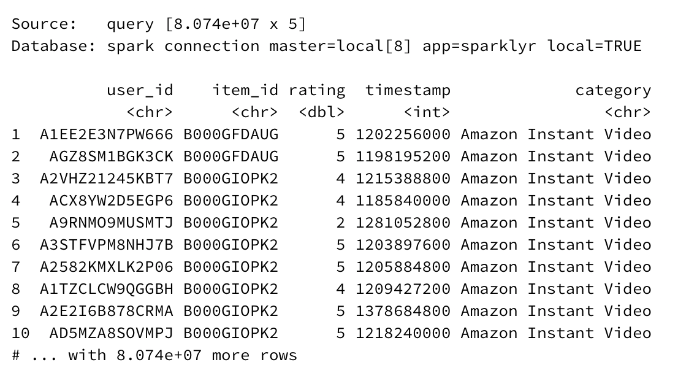

There are 80.74 million records total in the dataset, or as the output helpfully reports, `8.074e+07` records. Performing advanced queries with traditional tools like [dplyr](https://cran.rstudio.com/web/packages/dplyr/vignettes/introduction.html) or even Python’s [pandas](http://pandas.pydata.org/) on such a dataset would take a considerable amount of time to execute.

With sparklyr, manipulating actually-big-data is *just as easy* as performing an analysis on a dataset with only a few records (and an order of magnitude easier than the Python approaches taught in the eDX class mentioned above!).

## Exploratory Analysis

*(You can view the R code used to process the data with Spark and generate the data visualizations in [this R Notebook](http://minimaxir.com/notebooks/amazon-spark/))*

There are **20,368,412** unique users who provided reviews in this dataset. **51.9%** of those users have only written one review.

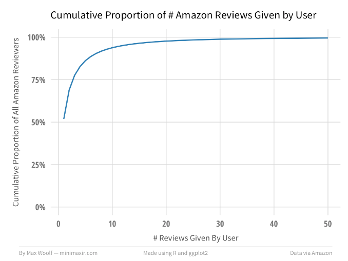

Relatedly, there are **8,210,439** unique products in this dataset, where **43.3%** have only one review.

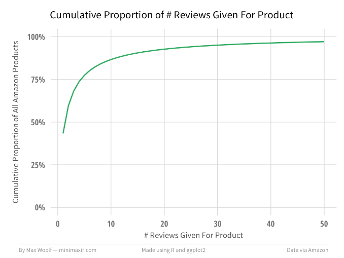

After removing duplicate ratings, I added a few more features to each rating which may help illustrate how review behavior changed over time: a ranking value indicating the # review that the author of a given review has written (1st review by author, 2nd review by author, etc.), a ranking value indicating the # review that the product of a given review has received (1st review for product, 2nd review for product, etc.), and the month and year the review was made.

The first two added features require a *very* large amount of processing power, and highlight the convenience of Spark’s speed (and the fact that Spark uses all CPU cores by default, while typical R/Python approaches are single-threaded!)

These changes are cached into a Spark DataFrame `df_t`. If I wanted to determine which Amazon product category receives the best review ratings on average, I can aggregate the data by category, calculate the average rating score for each category, and sort. Thanks to the power of Spark, the data processing for this many-millions-of-records takes seconds.

	df_agg <- df_t %>%
	            group_by(category) %>%
	            summarize(count = n(), avg_rating = mean(rating)) %>%
	            arrange(desc(avg_rating)) %>%
	            collect()

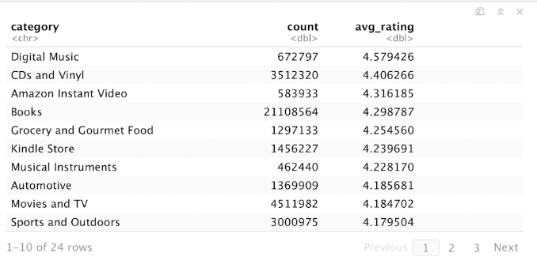
Or, visualized in chart form using [ggplot2](http://ggplot2.org/):
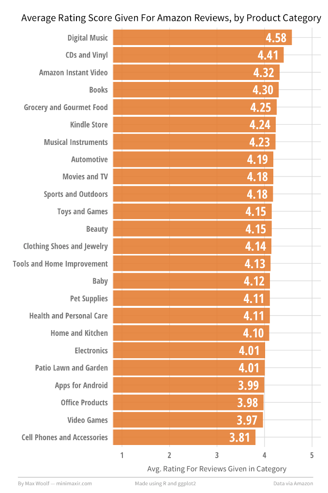

Digital Music/CD products receive the highest reviews on average, while Video Games and Cell Phones receive the lowest reviews on average, with a **0.77** rating range between them. This does make some intuitive sense; Digital Music and CDs are types of products where you know *exactly* what you are getting with no chance of a random product defect, while Cell Phones and Accessories can have variable quality from shady third-party sellers (Video Games in particular are also prone to irrational [review bombing](http://steamed.kotaku.com/steam-games-are-now-even-more-susceptible-to-review-bom-1774940065) over minor grievances).

We can refine this visualization by splitting each bar into a percentage breakdown of each rating from 1-5. This could be plotted with a pie chart for each category, however a stacked bar chart, scaled to 100%, looks much cleaner.

The new visualization does help support the theory above; the top categories have a significantly higher percentage of 4/5-star ratings than the bottom categories, and a much a lower proportion of 1/2/3-star ratings. The inverse holds true for the bottom categories.

How have these breakdowns changed over time? Are there other factors in play?

## Rating Breakdowns Over Time

Perhaps the advent of the binary Like/Dislike behaviors in social media in the 2000’s have translated into a change in behavior for a 5-star review system. Here are the rating breakdowns for reviews written in each month from January 2000 to July 2014:

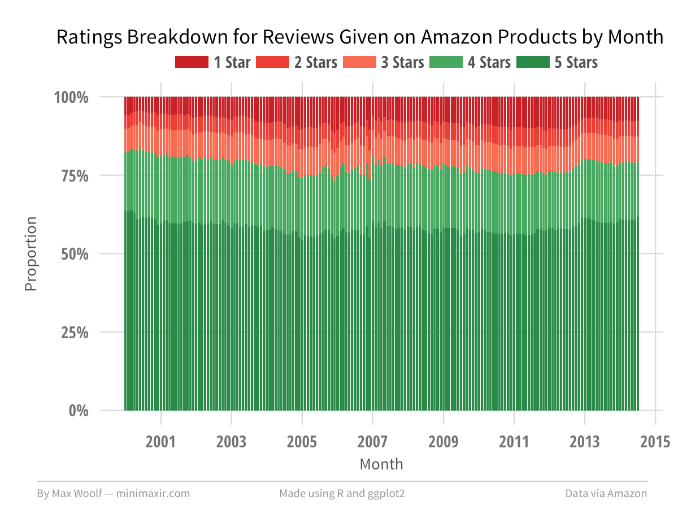

The voting behavior oscillates very slightly over time with no clear spikes or inflection points, which dashes that theory.

## Distribution of Average Scores

We should look at the global averages of Amazon product scores (i.e. what customers see when they buy products), and the users who give the ratings. We would expect the distributions to match, so any deviations would be interesting.

Products on average, when looking at products with atleast 5 ratings, have a **4.16** overall rating.

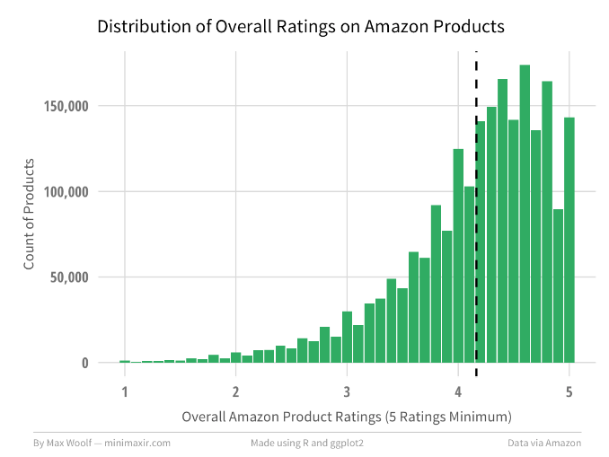

When looking at a similar graph for the overall ratings given by users, (5 ratings minimum), the average rating is slightly higher at **4.20**.

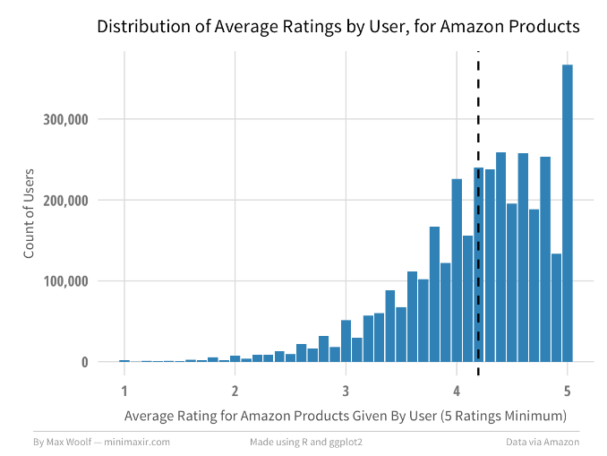

The primary difference between the two distributions is that there is significantly higher proportion of Amazon customers giving *only* 5-star reviews. Normalizing and overlaying the two charts clearly highlights that discrepancy.

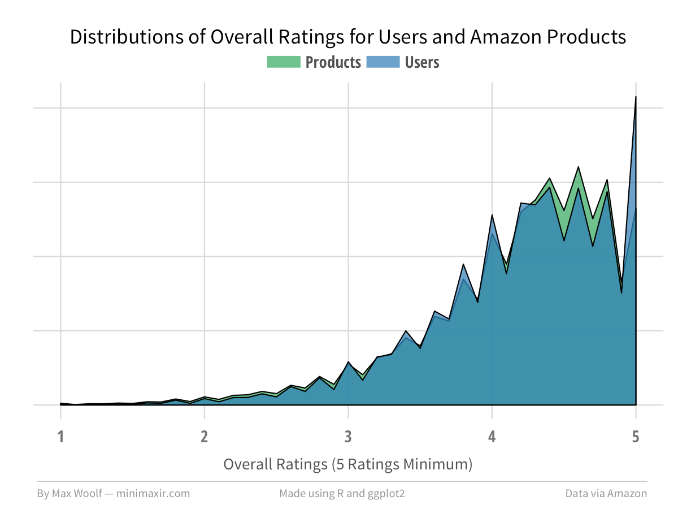

## The Marginal Review

A few posts ago, I discussed how the [first comment on a Reddit post](http://minimaxir.com/2016/11/first-comment/) has dramatically more influence than subsequent comments. Does user rating behavior change after making more and more reviews? Is the typical rating behavior different for the first review of a given product?

Here is the ratings breakdown for the *n*-th Amazon review a user gives:
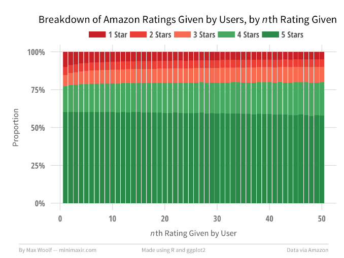

The first user review has a slightly higher proportion of being a 1-star review than subsequent reviews. Otherwise, the voting behavior is mostly the same overtime, although users have an increased proportion of giving a 4-star review instead of a 5-star review as they get more comfortable.

In contrast, here is the ratings breakdown for the *n*-th review an Amazon product received:

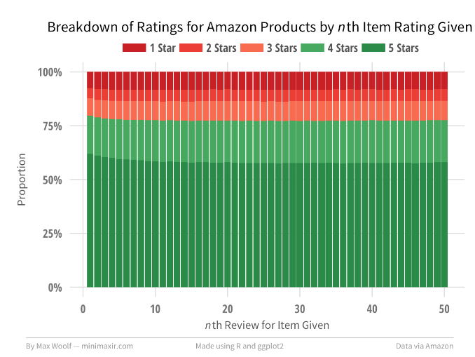

The first product review has a slightly higher proportion of being a 5-star review than subsequent reviews. However, after the 10th review, there is *zero* change in the distribution of ratings, which implies that the marginal rating behavior is independent from the current score after that threshold.

## Summary

Granted, this blog post is more playing with data and less analyzing data. What might be interesting to look into for future technical posts is conditional behavior, such as predicting the rating of a review given the previous ratings on that product/by that user. However, this post shows that while “big data” may be an inscrutable buzzword nowadays, you don’t have to work for a Fortune 500 company to be able to understand it. Even with a data set consisting of 5 simple features, you can extract a large number of insights.

And this post doesn’t even look at the text of the Amazon product reviews or the metadata associated with the products! I do have a few ideas lined up there which I won’t spoil.

* * *

*You can view all the R and ggplot2 code used to visualize the Amazon data in [this R Notebook](http://minimaxir.com/notebooks/amazon-spark/). You can also view the images/data used for this post in [this GitHub repository](https://github.com/minimaxir/amazon-spark)*.

*You are free to use the data visualizations from this article however you wish, but it would be greatly appreciated if proper attribution is given to this article and/or myself!*

Share this article[**](http://twitter.com/home/?status=Playing%20with%2080%20Million%20Amazon%20Product%20Review%20Ratings%20Using%20Apache%20Spark%20-%20http://minimaxir.com/2017/01/amazon-spark/%20-%20via%20@minimaxir)  [** 167](http://www.linkedin.com/shareArticle?mini=true&title=&url=http://minimaxir.com/2017/01/amazon-spark/)

- [7 comments]()
- [**minimaxir**](https://disqus.com/home/forums/minimaxir/)
- [Login](https://disqus.com/embed/comments/?base=default&version=60c69418f14a8b7401cd956e1062204c&f=minimaxir&t_i=http%3A%2F%2Fminimaxir.com%2F2017%2F01%2Famazon-spark%2F&t_u=http%3A%2F%2Fminimaxir.com%2F2017%2F01%2Famazon-spark%2F&t_d=Playing%20with%2080%20Million%20Amazon%20Product%20Review%20Ratings%20Using%20Apache%20Spark&t_t=Playing%20with%2080%20Million%20Amazon%20Product%20Review%20Ratings%20Using%20Apache%20Spark&s_o=default#)
- [1](https://disqus.com/home/inbox/)
- [ Recommend3](https://disqus.com/embed/comments/?base=default&version=60c69418f14a8b7401cd956e1062204c&f=minimaxir&t_i=http%3A%2F%2Fminimaxir.com%2F2017%2F01%2Famazon-spark%2F&t_u=http%3A%2F%2Fminimaxir.com%2F2017%2F01%2Famazon-spark%2F&t_d=Playing%20with%2080%20Million%20Amazon%20Product%20Review%20Ratings%20Using%20Apache%20Spark&t_t=Playing%20with%2080%20Million%20Amazon%20Product%20Review%20Ratings%20Using%20Apache%20Spark&s_o=default#)
- [⤤Share](https://disqus.com/embed/comments/?base=default&version=60c69418f14a8b7401cd956e1062204c&f=minimaxir&t_i=http%3A%2F%2Fminimaxir.com%2F2017%2F01%2Famazon-spark%2F&t_u=http%3A%2F%2Fminimaxir.com%2F2017%2F01%2Famazon-spark%2F&t_d=Playing%20with%2080%20Million%20Amazon%20Product%20Review%20Ratings%20Using%20Apache%20Spark&t_t=Playing%20with%2080%20Million%20Amazon%20Product%20Review%20Ratings%20Using%20Apache%20Spark&s_o=default#)
- [Sort by Best](https://disqus.com/embed/comments/?base=default&version=60c69418f14a8b7401cd956e1062204c&f=minimaxir&t_i=http%3A%2F%2Fminimaxir.com%2F2017%2F01%2Famazon-spark%2F&t_u=http%3A%2F%2Fminimaxir.com%2F2017%2F01%2Famazon-spark%2F&t_d=Playing%20with%2080%20Million%20Amazon%20Product%20Review%20Ratings%20Using%20Apache%20Spark&t_t=Playing%20with%2080%20Million%20Amazon%20Product%20Review%20Ratings%20Using%20Apache%20Spark&s_o=default#)

Join the discussion…

- [Attach](https://disqus.com/embed/comments/?base=default&version=60c69418f14a8b7401cd956e1062204c&f=minimaxir&t_i=http%3A%2F%2Fminimaxir.com%2F2017%2F01%2Famazon-spark%2F&t_u=http%3A%2F%2Fminimaxir.com%2F2017%2F01%2Famazon-spark%2F&t_d=Playing%20with%2080%20Million%20Amazon%20Product%20Review%20Ratings%20Using%20Apache%20Spark&t_t=Playing%20with%2080%20Million%20Amazon%20Product%20Review%20Ratings%20Using%20Apache%20Spark&s_o=default#)

-

    - [−](https://disqus.com/embed/comments/?base=default&version=60c69418f14a8b7401cd956e1062204c&f=minimaxir&t_i=http%3A%2F%2Fminimaxir.com%2F2017%2F01%2Famazon-spark%2F&t_u=http%3A%2F%2Fminimaxir.com%2F2017%2F01%2Famazon-spark%2F&t_d=Playing%20with%2080%20Million%20Amazon%20Product%20Review%20Ratings%20Using%20Apache%20Spark&t_t=Playing%20with%2080%20Million%20Amazon%20Product%20Review%20Ratings%20Using%20Apache%20Spark&s_o=default#)
    - [*⚑*](https://disqus.com/embed/comments/?base=default&version=60c69418f14a8b7401cd956e1062204c&f=minimaxir&t_i=http%3A%2F%2Fminimaxir.com%2F2017%2F01%2Famazon-spark%2F&t_u=http%3A%2F%2Fminimaxir.com%2F2017%2F01%2Famazon-spark%2F&t_d=Playing%20with%2080%20Million%20Amazon%20Product%20Review%20Ratings%20Using%20Apache%20Spark&t_t=Playing%20with%2080%20Million%20Amazon%20Product%20Review%20Ratings%20Using%20Apache%20Spark&s_o=default#)

[Vivek Sancheti](https://disqus.com/by/eyuva/)•[2 months ago](http://minimaxir.com/2017/01/amazon-spark/#comment-3107351176)

What kind of api did you use to pull all reviews out of amazon? As I see they have blocked giving reviews via api they give it via iframe in api nowadays.

How did you curate the list of each and every product present in amazon?
P.S. Awesome analysis.

    -

        - [−](https://disqus.com/embed/comments/?base=default&version=60c69418f14a8b7401cd956e1062204c&f=minimaxir&t_i=http%3A%2F%2Fminimaxir.com%2F2017%2F01%2Famazon-spark%2F&t_u=http%3A%2F%2Fminimaxir.com%2F2017%2F01%2Famazon-spark%2F&t_d=Playing%20with%2080%20Million%20Amazon%20Product%20Review%20Ratings%20Using%20Apache%20Spark&t_t=Playing%20with%2080%20Million%20Amazon%20Product%20Review%20Ratings%20Using%20Apache%20Spark&s_o=default#)
        - [*⚑*](https://disqus.com/embed/comments/?base=default&version=60c69418f14a8b7401cd956e1062204c&f=minimaxir&t_i=http%3A%2F%2Fminimaxir.com%2F2017%2F01%2Famazon-spark%2F&t_u=http%3A%2F%2Fminimaxir.com%2F2017%2F01%2Famazon-spark%2F&t_d=Playing%20with%2080%20Million%20Amazon%20Product%20Review%20Ratings%20Using%20Apache%20Spark&t_t=Playing%20with%2080%20Million%20Amazon%20Product%20Review%20Ratings%20Using%20Apache%20Spark&s_o=default#)

[이상훈](https://disqus.com/by/disqus_VZHzT24PQu/)[*>* Vivek Sancheti](http://minimaxir.com/2017/01/amazon-spark/#comment-3107351176)•[2 months ago](http://minimaxir.com/2017/01/amazon-spark/#comment-3108589056)

[http://jmcauley.ucsd.edu/da...](http://disq.us/url?url=http%3A%2F%2Fjmcauley.ucsd.edu%2Fdata%2Famazon%2F%3A1AmJVW3mbNjCgMNn5-KRAuKRvzU&cuid=660018)

-

    - [−](https://disqus.com/embed/comments/?base=default&version=60c69418f14a8b7401cd956e1062204c&f=minimaxir&t_i=http%3A%2F%2Fminimaxir.com%2F2017%2F01%2Famazon-spark%2F&t_u=http%3A%2F%2Fminimaxir.com%2F2017%2F01%2Famazon-spark%2F&t_d=Playing%20with%2080%20Million%20Amazon%20Product%20Review%20Ratings%20Using%20Apache%20Spark&t_t=Playing%20with%2080%20Million%20Amazon%20Product%20Review%20Ratings%20Using%20Apache%20Spark&s_o=default#)
    - [*⚑*](https://disqus.com/embed/comments/?base=default&version=60c69418f14a8b7401cd956e1062204c&f=minimaxir&t_i=http%3A%2F%2Fminimaxir.com%2F2017%2F01%2Famazon-spark%2F&t_u=http%3A%2F%2Fminimaxir.com%2F2017%2F01%2Famazon-spark%2F&t_d=Playing%20with%2080%20Million%20Amazon%20Product%20Review%20Ratings%20Using%20Apache%20Spark&t_t=Playing%20with%2080%20Million%20Amazon%20Product%20Review%20Ratings%20Using%20Apache%20Spark&s_o=default#)

[Dae Won Kim](https://disqus.com/by/dae_won_kim/)•[2 months ago](http://minimaxir.com/2017/01/amazon-spark/#comment-3080638509)

just curious, is this an extension of sparkR?

    -

        - [−](https://disqus.com/embed/comments/?base=default&version=60c69418f14a8b7401cd956e1062204c&f=minimaxir&t_i=http%3A%2F%2Fminimaxir.com%2F2017%2F01%2Famazon-spark%2F&t_u=http%3A%2F%2Fminimaxir.com%2F2017%2F01%2Famazon-spark%2F&t_d=Playing%20with%2080%20Million%20Amazon%20Product%20Review%20Ratings%20Using%20Apache%20Spark&t_t=Playing%20with%2080%20Million%20Amazon%20Product%20Review%20Ratings%20Using%20Apache%20Spark&s_o=default#)
        - [*⚑*](https://disqus.com/embed/comments/?base=default&version=60c69418f14a8b7401cd956e1062204c&f=minimaxir&t_i=http%3A%2F%2Fminimaxir.com%2F2017%2F01%2Famazon-spark%2F&t_u=http%3A%2F%2Fminimaxir.com%2F2017%2F01%2Famazon-spark%2F&t_d=Playing%20with%2080%20Million%20Amazon%20Product%20Review%20Ratings%20Using%20Apache%20Spark&t_t=Playing%20with%2080%20Million%20Amazon%20Product%20Review%20Ratings%20Using%20Apache%20Spark&s_o=default#)

[Javier Luraschi](https://disqus.com/by/javierluraschi/)[*>* Dae Won Kim](http://minimaxir.com/2017/01/amazon-spark/#comment-3080638509)•[2 months ago](http://minimaxir.com/2017/01/amazon-spark/#comment-3106913468)

No, sparklyr is not an extension to sparkR, they are different packages.

    -

        - [−](https://disqus.com/embed/comments/?base=default&version=60c69418f14a8b7401cd956e1062204c&f=minimaxir&t_i=http%3A%2F%2Fminimaxir.com%2F2017%2F01%2Famazon-spark%2F&t_u=http%3A%2F%2Fminimaxir.com%2F2017%2F01%2Famazon-spark%2F&t_d=Playing%20with%2080%20Million%20Amazon%20Product%20Review%20Ratings%20Using%20Apache%20Spark&t_t=Playing%20with%2080%20Million%20Amazon%20Product%20Review%20Ratings%20Using%20Apache%20Spark&s_o=default#)
        - [*⚑*](https://disqus.com/embed/comments/?base=default&version=60c69418f14a8b7401cd956e1062204c&f=minimaxir&t_i=http%3A%2F%2Fminimaxir.com%2F2017%2F01%2Famazon-spark%2F&t_u=http%3A%2F%2Fminimaxir.com%2F2017%2F01%2Famazon-spark%2F&t_d=Playing%20with%2080%20Million%20Amazon%20Product%20Review%20Ratings%20Using%20Apache%20Spark&t_t=Playing%20with%2080%20Million%20Amazon%20Product%20Review%20Ratings%20Using%20Apache%20Spark&s_o=default#)

[Max Woolf](https://disqus.com/by/minimaxir/)Mod[*>* Dae Won Kim](http://minimaxir.com/2017/01/amazon-spark/#comment-3080638509)•[2 months ago](http://minimaxir.com/2017/01/amazon-spark/#comment-3080803402)

Unclear. The repo has sparklyr starting the SparkR shell ([https://github.com/rstudio/...](https://disq.us/url?url=https%3A%2F%2Fgithub.com%2Frstudio%2Fsparklyr%2Fblob%2Fmaster%2FR%2Fspark_shell.R%29%3AI76C5sMckM5gHTCOBRfFlzz6J3g&cuid=660018), but sparklyr has a few perks not described in the article such as being able to use feature transformers, which aren't in SparkR.

        -

            - [−](https://disqus.com/embed/comments/?base=default&version=60c69418f14a8b7401cd956e1062204c&f=minimaxir&t_i=http%3A%2F%2Fminimaxir.com%2F2017%2F01%2Famazon-spark%2F&t_u=http%3A%2F%2Fminimaxir.com%2F2017%2F01%2Famazon-spark%2F&t_d=Playing%20with%2080%20Million%20Amazon%20Product%20Review%20Ratings%20Using%20Apache%20Spark&t_t=Playing%20with%2080%20Million%20Amazon%20Product%20Review%20Ratings%20Using%20Apache%20Spark&s_o=default#)
            - [*⚑*](https://disqus.com/embed/comments/?base=default&version=60c69418f14a8b7401cd956e1062204c&f=minimaxir&t_i=http%3A%2F%2Fminimaxir.com%2F2017%2F01%2Famazon-spark%2F&t_u=http%3A%2F%2Fminimaxir.com%2F2017%2F01%2Famazon-spark%2F&t_d=Playing%20with%2080%20Million%20Amazon%20Product%20Review%20Ratings%20Using%20Apache%20Spark&t_t=Playing%20with%2080%20Million%20Amazon%20Product%20Review%20Ratings%20Using%20Apache%20Spark&s_o=default#)

[Javier Luraschi](https://disqus.com/by/javierluraschi/)[*>* Max Woolf](http://minimaxir.com/2017/01/amazon-spark/#comment-3080803402)•[2 months ago](http://minimaxir.com/2017/01/amazon-spark/#comment-3106925442)

Great post Max! Regarding sparkR, sparklyr uses spark-submit to push the sparklyr backend into Spark and does not require any component of sparkR, they are independent codebases with different functionality and trade-offs. Again, great post!

        -

            - [−](https://disqus.com/embed/comments/?base=default&version=60c69418f14a8b7401cd956e1062204c&f=minimaxir&t_i=http%3A%2F%2Fminimaxir.com%2F2017%2F01%2Famazon-spark%2F&t_u=http%3A%2F%2Fminimaxir.com%2F2017%2F01%2Famazon-spark%2F&t_d=Playing%20with%2080%20Million%20Amazon%20Product%20Review%20Ratings%20Using%20Apache%20Spark&t_t=Playing%20with%2080%20Million%20Amazon%20Product%20Review%20Ratings%20Using%20Apache%20Spark&s_o=default#)
            - [*⚑*](https://disqus.com/embed/comments/?base=default&version=60c69418f14a8b7401cd956e1062204c&f=minimaxir&t_i=http%3A%2F%2Fminimaxir.com%2F2017%2F01%2Famazon-spark%2F&t_u=http%3A%2F%2Fminimaxir.com%2F2017%2F01%2Famazon-spark%2F&t_d=Playing%20with%2080%20Million%20Amazon%20Product%20Review%20Ratings%20Using%20Apache%20Spark&t_t=Playing%20with%2080%20Million%20Amazon%20Product%20Review%20Ratings%20Using%20Apache%20Spark&s_o=default#)

dataslee[*>* Max Woolf](http://minimaxir.com/2017/01/amazon-spark/#comment-3080803402)•[2 months ago](http://minimaxir.com/2017/01/amazon-spark/#comment-3081899866)

sparklyr has much more ML function than sparkR,the spark sql can be write with the dplyr of R.also,there is some more useful function,such as H2O(Sparkling Water (H2O) Machine Learning),i like this,thks.

- [Powered by Disqus](https://disqus.com/)
- [*✉*Subscribe  *✔*](https://disqus.com/embed/comments/?base=default&version=60c69418f14a8b7401cd956e1062204c&f=minimaxir&t_i=http%3A%2F%2Fminimaxir.com%2F2017%2F01%2Famazon-spark%2F&t_u=http%3A%2F%2Fminimaxir.com%2F2017%2F01%2Famazon-spark%2F&t_d=Playing%20with%2080%20Million%20Amazon%20Product%20Review%20Ratings%20Using%20Apache%20Spark&t_t=Playing%20with%2080%20Million%20Amazon%20Product%20Review%20Ratings%20Using%20Apache%20Spark&s_o=default#)
- [*d*Add Disqus to your site](https://publishers.disqus.com/engage?utm_source=minimaxir&utm_medium=Disqus-Footer)
- [*🔒*Privacy](https://help.disqus.com/customer/portal/articles/1657951?utm_source=disqus&utm_medium=embed-footer&utm_content=privacy-btn)

#### Author

**Max Woolf (@minimaxir)** is a Software QA Engineer living and working in the San Francisco Bay Area for over 4 years and a 2012 Carnegie Mellon University graduate.

In his spare time, Max uses [Python](https://www.python.org/) to gather data from public APIs and [ggplot2](http://ggplot2.org/) to make pretty charts from that data.

You can learn more about Max [here](http://minimaxir.com/about), or view his portfolio [here](http://minimaxir.com/portfolio).

- [**](https://facebook.com/max.woolf)
- [**](https://twitter.com/minimaxir)
- [**](https://linkedin.com/in/minimaxir)
- [**](https://github.com/minimaxir)
- [**](https://youtube.com/minimaxir)
- [**](http://minimaxir.com/2017/01/amazon-spark/mailto:max@minimaxir.com)
- [**](http://minimaxir.com/rss.xml)

#### Recent Posts

##### [Predicting And Mapping Arrest Types in San Francisco with LightGBM, R, ggplot2](http://minimaxir.com/2017/02/predicting-arrests/)

Feb 8, 2017

##### [Playing with 80 Million Amazon Product Review Ratings Using Apache Spark](http://minimaxir.com/2017/01/amazon-spark/)

Jan 2, 2017

##### [Network Visualization of Breached Internet Services Using HaveIBeenPwned? Data](http://minimaxir.com/2016/12/pwned-network/)

Dec 19, 2016

##### [Infinite-Quality Abstract Art and Animations with Primitive](http://minimaxir.com/2016/12/primitive/)

Dec 12, 2016

##### [How to Create an Interactive WebGL Network Graph Using R](http://minimaxir.com/2016/12/interactive-network/)

Dec 5, 2016

##### [What Percent of the Top-Voted Comments in Reddit Threads Were Also 1st Comment?](http://minimaxir.com/2016/11/first-comment/)

Nov 7, 2016

#### Top GitHub Repositories

##### [Big List of Naughty Strings](http://github.com/minimaxir/big-list-of-naughty-strings)

** 20,128+

##### [Facebook Page Post Scraper](http://github.com/minimaxir/facebook-page-post-scraper)

** 967+

##### [Copy Syntax Highlight for OS X](http://github.com/minimaxir/copy-syntax-highlight-osx)

** 347+

##### [Convert Video to GIF on OS X](http://github.com/minimaxir/video-to-gif-osx)

** 261+

##### [Reddit Data with BigQuery Notebook](http://github.com/minimaxir/reddit-bigquery)

** 78+

##### [Get All Hacker News Submissions & Comments](http://github.com/minimaxir/get-all-hacker-news-submissions-comments)

** 54+

##### [Convert Frames to GIF on OS X](http://github.com/minimaxir/frames-to-gif-osx)

** 16+

##### [Analyzing When and Where San Francisco Criminal Arrests Occur](http://github.com/minimaxir/sf-arrests-when-where)

** 16+

##### [NYC Yellow Taxi Visualization Notebook](http://github.com/minimaxir/nyc-taxi-notebook)

** 13+

You can contact through any of the following channels, although e-mail is preferred. Following me on Facebook and Twitter certainly doesn't hurt either!

### Contact Info

- **

SOMA, San Francisco, CA

- **

[max.woolf](https://facebook.com/max.woolf)

- **

[@minimaxir](https://twitter.com/minimaxir)

- **

 [minimaxir](https://linkedin.com/in/minimaxir)

- **

 [max@minimaxir.com](http://minimaxir.com/2017/01/amazon-spark/mailto:max@minimaxir.com)

 Copyright © 2017 Max Woolf. All Rights Reserved. minimaxir.com is powered by Jekyll and GitHub Pages.

[](#)