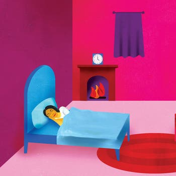
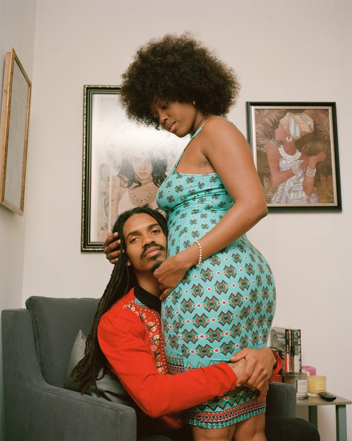
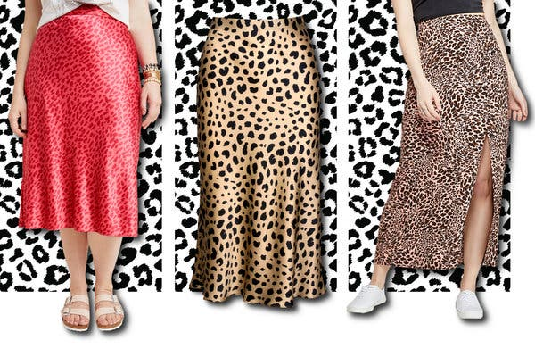
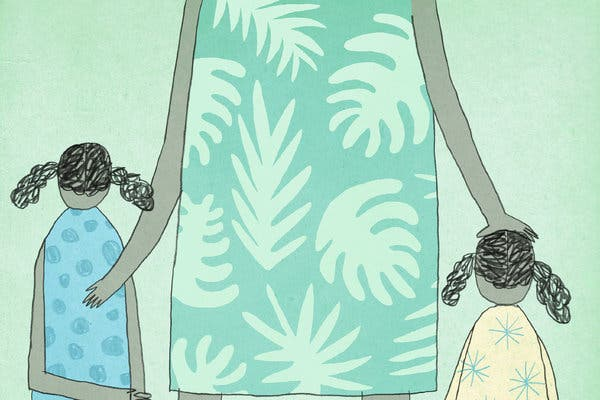
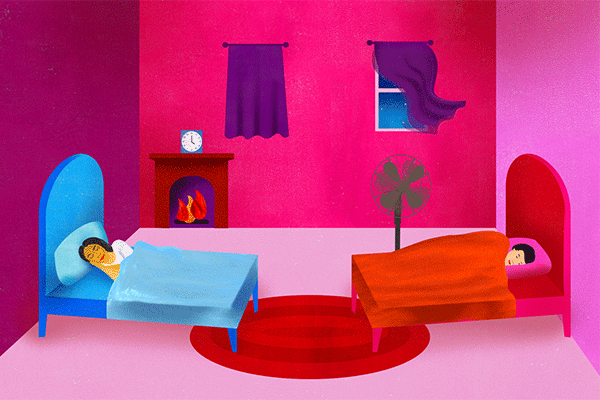

Polyamory Works for Them

The Look

# Polyamory Works for ThemPolyamory Works for Them

Having multiple partners can mean more pleasure, but it’s not always easy.
Photographs by Yael Malka
Text by Alice Hines
Produced by [Eve Lyons](https://www.nytimes.com/by/eve-lyons)

Image

Polyamory breaks a mind-set that Narjesi Tragic, right, calls “the relationship escalator: meet at school, get married, have kids, continue until we get old.” Here, Narjesi is pictured with Tiana North, whom they date, Orion Starbreeze, who dates Tiana but not Narjesi, and Mr. Starbreeze’s partner Brat James. All four are friends.CreditYael Malka for The New York Times

Through a half-century of sexual upheaval, monogamy has been a curious stalwart.

The tradition of having a single sexual partner is among the only sexual practices liberals and conservatives rarely disagree about. Its blandness belies mysterious origins: Scientists have [yet to conclude](https://www.frontiersin.org/articles/10.3389/fevo.2018.00202/full) why prairie voles, much less people, prefer to bond in long-term pairs.

Yet in certain concrete burrows, monogamy’s inverse is on the rise. Jade Marks, a 26-year-old artist and herbalist in the Bedford-Stuyvesant neighborhood of Brooklyn, recalled a recent post by a friend on Instagram: “Are there any*  *other queers out there who are monogamous?”

That feeling may have something to do with the immediate environment. Most weekends in New York, a smattering of events cater to the non-monogamous. There are lecture series, workshops and discussion groups. There are cocktail hours and meet-and-greets. And there are, of course, parties.

## Sign Up for the Wait — Newsletter

Each week, you'll get stories about money, power, sex and scrunchies.

Image

“I told someone I have two boyfriends, and they were immediately like, ‘I don’t need to hear about your sex life,’” said Karen Ambert, at center, of a colleague at the hospital where she works. “I wasn’t talking about my sex life.” Here she is pictured with Kenneth Play, right, a founder of the sex-positive community Hacienda, and Geronimo Frias. She dates both men, but they don’t date each other.CreditYael Malka for The New York Times

On a recent Saturday night in Crown Heights, an angelic gatekeeper in a pastel harness did her best to assure a reporter that she wouldn’t be a total buzz kill at a private party of 200 mostly straight, mostly non-monogamous New Yorkers. “Just watching is O.K.!” she said outside the site, a loft lit like an infrared sauna. “Have a good time! Stay hydrated! And always ask for consent!”

Inside were some of the happiest-looking sober adults ever seen after 2 a.m. “It’s like ‘Eyes Wide Shut’ meets a Gaspar Noé film,” said a Scandinavian digital artist and recent Brooklyn transplant. He and his girlfriend were attending for the first time; they had read about [the party](https://www.ns-fw.com/), called NSFW, on the internet.

NSFW caters to the 25-to-35 age bracket, has an all-black dress code and is made up of 60 percent women, according to its founder, Daniel Saynt. Its [application for membership](https://play.ns-fw.com/) requires a social media profile link (“It’s very curated,” Mr. Saynt said) and responses to open-ended and check-box questions (“ultimate fantasy” is a short answer; optional boxes to check include “hedonist,” “daddy” and “label-less”). That may sound like the precursor to a job interview, but the point is to ensure that the needs of attendees are met. Wouldn’t it be nice if other [clubs](https://www.nytimes.com/2019/03/08/style/self-care/how-to-stay-safe-in-the-club.html?module=inline) worked that way?

“I don’t think that polyamory is somehow more evolved*  *than monogamy,” said Zhana Vrangalova, a sex researcher who will teach [an online course](https://drzhana.com/open-relationships-sign-up/) for couples and individuals seeking to open their relationships this fall. “But it should be an option. People should have more*  *options.”

That was a maxim for the two dozen non-monogamous people interviewed for this article. The subjects, who represent a range of ethnicities, sexual orientations, gender identities and professions, agreed on this: For them, more partners means more exploration and more pleasure.

## Editors’ Picks

[  ### Is It Time for a Sleep Divorce?](https://www.nytimes.com/2019/07/31/fashion/weddings/is-it-time-for-a-sleep-divorce.html?fallback=0&recId=1P14WO6AAkaOTmNzLFMjcX6mM6F&locked=0&geoContinent=NA&geoRegion=FL&recAlloc=story&geoCountry=US&blockId=home-featured&imp_id=639534126&action=click&module=editorContent&pgtype=Article&region=CompanionColumn&contentCollection=Trending)

[  ### The Bralette Is Back. This Time Blouses Are Optional.](https://www.nytimes.com/2019/07/31/fashion/bralettes-bras-no-underwire.html?fallback=0&recId=1P14WO6AAkaOTmNzLFMjcX6mM6F&locked=0&geoContinent=NA&geoRegion=FL&recAlloc=story&geoCountry=US&blockId=home-featured&imp_id=759784663&action=click&module=editorContent&pgtype=Article&region=CompanionColumn&contentCollection=Trending)

[  ### Lana Wood, Natalie’s Little Sister, Has Plenty to Say](https://www.nytimes.com/2019/08/03/style/lana-wood-natalie-sister-death.html?fallback=0&recId=1P14WO6AAkaOTmNzLFMjcX6mM6F&locked=0&geoContinent=NA&geoRegion=FL&recAlloc=story&geoCountry=US&blockId=home-featured&imp_id=59551171&action=click&module=editorContent&pgtype=Article&region=CompanionColumn&contentCollection=Trending)

 

 [ PAID POST: Zenith](https://adclick.g.doubleclick.net/pcs/click?xai=AKAOjsuoNkK_WIwT6KNlKrMLebag5Vxn5I1jGIrCbJif6jljgt7maVvaCNIkb5bz9FEL0O8aIXGcJ_J9J26utvySNDAgp93LNpXWPQj9FqQ9_C41qhW123rb6JZGU62r8fjQKO49nos0l4JzjVgg16wbmB7uq1ACAMEjO9Y66m_UDzKrNE9cD0R2oh4Zj1ljzkdh7_rvXAnA9fNL04Oada6udMqUZ1IDF94XTqvp2Sja1ym9ZC4kPQDxpXBbgwldERqawlM&sig=Cg0ArKJSzAmMGo20zl34EAE&urlfix=1&adurl=https://www.nytimes.com/paidpost/zenith/defying-watchmakings-past.html%3Fcpv_ap_id%3D50018349%26sr_source%3Dlift_ed%26tbs_nyt%3D2019-june-nytnative_ed)[ How the Modern Chronograph Was Created](https://adclick.g.doubleclick.net/pcs/click?xai=AKAOjsuoNkK_WIwT6KNlKrMLebag5Vxn5I1jGIrCbJif6jljgt7maVvaCNIkb5bz9FEL0O8aIXGcJ_J9J26utvySNDAgp93LNpXWPQj9FqQ9_C41qhW123rb6JZGU62r8fjQKO49nos0l4JzjVgg16wbmB7uq1ACAMEjO9Y66m_UDzKrNE9cD0R2oh4Zj1ljzkdh7_rvXAnA9fNL04Oada6udMqUZ1IDF94XTqvp2Sja1ym9ZC4kPQDxpXBbgwldERqawlM&sig=Cg0ArKJSzAmMGo20zl34EAE&urlfix=1&adurl=https://www.nytimes.com/paidpost/zenith/defying-watchmakings-past.html%3Fcpv_ap_id%3D50018349%26sr_source%3Dlift_ed%26tbs_nyt%3D2019-june-nytnative_ed)

Image

Na’Im Najieb and Tyomi Morgan, who are in an open marriage, often find themselves imparting advice to friends in monogamous relationships. “If you want to watch Netflix and they want to go bowling, do both. We’re advocates for freedom,” Mr. Najieb said.CreditYael Malka for The New York Times

Consensual or ethical non-monogamy is an umbrella term that encompasses various relationship models, including polyamory, open relationships, sexual encounters with more than two people and swinging. Polyamorists are interested in exploring long-term relationships with multiple people. Swingers tend to be older couples opening their marriages recreationally.

According to [a 2014 Chapman University survey](https://digitalcommons.chapman.edu/cgi/viewcontent.cgi?article=1133&context=psychology_articles), 5 percent of American relationships identify themselves as non-monogamous. In [a more recent survey](https://www.tandfonline.com/doi/abs/10.1080/0092623X.2016.1178675) of single adults in the United States, in 2017, one-fifth of respondents said they would try some form of non-monogamy at some point in their lifetime.

In major cities, there are plenty of ways for non-monogamous and polycurious people to meet, among them apps, dinners, friends, blind dates and parties. In New York, organized sex parties include [Chemistry](http://chemistry-nyc.com/), which requires a Q. and A. application and photo, but doesn’t screen for a particular look; [NYC Inferno](https://www.instagram.com/nycinfernoparty/?hl=en), a gay play party that mostly attracts cisgender men but is open to queer, trans and nonbinary people (Playhouse, a spinoff event, revolves around trans guys); [Skirt Club](https://skirtclub.co.uk/about#our-story), a members-only club for bisexual women; and Wonderland, which welcomes everyone as long as they bring a buddy who will vouch for them, and are committed to fantastical dress codes (“Ancients vs. Aliens,” “Dungeons and Drag Queens”).

Image

When the sexuality doula Ev’Yan Whitney’s husband told her he was polyamorous, her first reaction was: “If you love someone else, how can you love me?” Eventually, she “realized that, like, I never opted in into monogamy, that it was automatically assigned to me, like straightness.”CreditYael Malka for The New York Times

Image

From left, Beth and Andrew Sparksfire, who are married, with Effy Blue and Thomas Kavanagh, who are dating. They live in a residential location of Hacienda, which Mr. Sparksfire helped found with Mr. Play. Ms. Blue and Mr. Sparksfire also date; the relationship structure is called a “z”.CreditYael Malka for The New York Times

Now a cottage industry of coaches and educators has cropped up to help polyamorous partners strive for [compersion](https://www.psychologytoday.com/us/blog/the-polyamorists-next-door/201312/jealousy-and-compersion-multiple-partners-1), the happy-for-you alternative to jealousy. Effy Blue, a relationship coach in Brooklyn, works with all of the following: triads, or three people in a committed relationship together; individuals seeking to transparently date multiple lovers simultaneously; partners who each have intimate friends, all of whom are close; and clients cultivating long-term relationships with someone who already has a primary partner.

“There is no single model that suits everyone,” Ms. Blue said. She also wrote a book on play-party etiquette. “Consent is the cornerstone of any well-produced, healthy and fun sex party,” she said. “This makes it safer and more fun than an average nightclub on any given day.”

Ella Quinlan, a 27-year-old event planner, said she knows hundreds of peers on the East and West Coasts practicing their own flavors of non-monogamy. In her own relationship with Lawrence Blume, a 55-year-old tech investor, Ms. Quinlan’s goal is to enhance what is conventionally beloved about monogamy, she said.

“We want to show people that it’s actually possible to be in a long-term, healthy, satisfying, deeply rooted and connected emotional relationship with somebody — *and *do this,” Mr. Blume said.

It’s not always easy. “There’s a lot of talking, and it takes*  *a lot*  *of work,” said Jade Marks. When Jade began exploring non-monogamy with Tourmaline, Jade’s primary partner, the pair quickly realized they had different expectations: Jade wanted casual encounters, while Tourmaline preferred sustained relationships with multiple people.

It took a lengthy negotiating period. Boundaries helped: Jade and Tourmaline established safe sex guidelines, and a rule of not bringing any partners to the apartment they share, though Jade said they have “a clause” for unexpected encounters.

Some emotions come with the territory. “A lot of us grew up with few of examples of what supportive queer, trans or non-monogamous relationships look like,” Tourmaline said. Among the couple’s queer and trans peers, non-monogamy can sometimes seem compulsory. “It’s O.K. to feel jealous,” Jade said. “It’s O.K. for this to be hard.”

Image

“We all grew up having these lessons of what love means, some of which are terrible and a lot to unlearn, and others which are beautiful,” said Jade Marks, left, with their primary partner, Tourmaline, at the apartment the two share in the Bedford-Stuyvesant section of Brooklyn.CreditYael Malka for The New York Times

Karen Ambert, 35, met Kenneth Play, a 38-year-old sex educator, three years ago on an art bus that was touring their neighborhood of Bushwick. Two years later, Mr. Play introduced Ms. Ambert, an emergency-room physician, to the man who became her second boyfriend, Geronimo Frias, the co-owner of a parkour gym.

It’s not technically a triad, but a V, as the relationship configuration is known in the poly community. Mr. Play and Mr. Frias don’t date each other, but they do date other people. (Mr. Play employs an assistant, in part to help book his rotating cast.)

Polyamorous for most of her adult life, Ms. Ambert hid it from her colleagues in medical school and residency. “I was always worrying about the next step. How will this impact my education and career?” she said. But recently she has grown more comfortable in her professional standing, and felt ready to come out about her love life too.

Mr. Frias was sitting on a couch at the home of Mr. Play with Ms. Ambert wedged in the middle, basking in the gaze of four adoring eyes.

Image

Mr. Frias, Ms. Ambert and Mr. Play view their arrangement as cooperative. “We are co-loving Karen,” Mr. Play said. “It’s teamwork. She’ll never be neglected.”CreditYael Malka for The New York Times

Sexual repression is at the root of the wider public stigma about non-monogamy, said Narjesi Tragic, an environmental science student in Queens.

But that’s rapidly changing along with “tolerance of different kinds of lifestyles, traditions, religions,” said Orion Starbreeze, Narjesi’s metamour (both date Tiana North, a professional dominatrix and dog trainer, but not each other).

“We’re returning to that nomadic sharing of partners and resources,” Ms. North said. “There’s ride shares, there’s house shares, bike shares — we’re in a sharing generation now.”

Which, for some, is easier to intellectualize than practice. “The biggest obstacle to free love is the emotion we call jealousy,” the sex educators Janet W. Hardy and Dossie Easton [write](https://archive.org/stream/DossieEastonJanetW.HardyTheEthicalSlutAPracticalGuideToPolyamoryOpenRelationshipsOtherAdventures.pd1/Dossie+Easton+&+Janet+W.+Hardy+-+The+Ethical+Slut+-+A+Practical+Guide+to+Polyamory,+Open+Relationships+&+Other+Adventures.pd+(1)_djvu.txt) in the 1997 edition of their book “The Ethical Slut,” which introduced many Americans to the concept of non-monogamy.

One morning, I Skyped with Na’Im Najieb, a 33-year-old author, and Tyomi Morgan, 31, who is a sexuality coach. The two of them have been in an open marriage for a year and a half, and they recommend the use of mindfulness techniques to overcome jealousy.

“Is this really my partner separating from me?” Ms. Morgan said she asks herself when feelings of insecurity arise. “Or am I struggling my own abandonment issues, and needing to clearly express to Na’Im what affirmation I need to receive?”

Instead of jealousy, Ms. Morgan said she tries to think about gratitude and send messages like, “I was thinking about how much I appreciate you,” rather than, “Where are you?” and “Who are you with?”

Image

“Working through jealousy is like training a muscle,” said Ella Quinlan, pictured with her primary partner, Lawrence Blume. “It’s made my self-worth more unshakable.”CreditYael Malka for The New York Times

Image

“We were going to spaces and parties and noticing there’s not a lot of people of color,” said Ms. North, right. So she started an Instagram group, “chocolate factory,” recently renamed the more inclusive “united colors of poly-kink.” It now has 30 members.CreditYael Malka for The New York Times

Ms. Ambert, Mr. Play and Mr. Frias are all members of [Hacienda](https://www.wearehacienda.com/), an intentional sex-positive community in Bushwick. (Mr. Play is a founder .)

Hacienda Villa, one of four locations, is an unassuming brick rowhouse across from an auto-body shop. Below the open concept kitchen-living room where 14 roommates have house meetings about chores, is a basement where events like Learn to Love Oral Sex: Tips from a Real Sex Worker (open to the public) and Second-Base Brunch (members only) are held.

“There’s a lot of sex problems in the world, like harassment,” Mr. Play said of the community’s mission. “We’re trying to engineer a way to coexist and celebrate sex without harming each other.”

He, Ms. Ambert, and Mr. Frias were currently in the process of contemplating a practice new to many of their open-minded friends and acquaintances: raising children.

Image

“I got indoctrinated with monogamy,” Tourmaline, left, said. “It’s important for us not to reproduce that with non-monogamy.”CreditYael Malka for The New York Times

“We’re in an extremely happy situation, and yet with a future that’s uncertain,” said Mr. Frias, 41, who is discussing starting a family with Ms. Ambert. “Being married and having kids in a V, I don’t know anyone else personally who’s done it.”

The idea was spurred during a conversation between Mr. Play and Ms. Ambert. It started much like any couple’s might, with Ms. Ambert saying she wanted children sooner rather than later, and Mr. Play hesitating.

Then Mr. Frias was in the picture. Like Ms. Ambert, he, too, wants children.

It was precisely her quality of “accepting people exactly as they are,” without trying to curtail their individual desires, that makes talk of such a long-term commitment possible, he said. “I’m not trying to change anything about her, and she’s not trying to change anything about me,” he added.

And those are just the emotional perks, said Mr. Play, who is coming around to the idea of helping raise children who aren’t his own. “Three incomes. Three parents. No one feels like they’re drowning in responsibility,” he said. “And the kid, surrounded by more loving adults.”

“I think this is really beneficial — a good life hack.”

Image

Ms. Morgan grew up Baptist and now works as a sexuality coach; she views education about non-monogamy as part of a spiritual mission. “Within the black community there’s a lot of people holding on to a mind-set that living this way is evil,” she said. “We think God is love.”CreditYael Malka for The New York Times

Yael Malka is a photographer and artist raised in the Bronx and now based in Brooklyn. Alice Hines is a writer in New York City.

* * *

* * *

Non-monogamy in The New York Times:

[ Is an Open Marriage a Happier Marriage? May 11, 2017  ](https://www.nytimes.com/2017/05/11/magazine/is-an-open-marriage-a-happier-marriage.html?action=click&module=RelatedLinks&pgtype=Article)

A version of this article appears in print on Aug. 4, 2019, Section ST, Page 4 of the New York edition with the headline: Polyamory. [Order Reprints](http://www.nytreprints.com/) | [Today’s Paper](http://www.nytimes.com/pages/todayspaper/index.html) | [Subscribe](https://www.nytimes.com/subscriptions/Multiproduct/lp8HYKU.html?campaignId=48JQY)

- 
- 
- 

-

## [The Look](https://www.nytimes.com/column/the-look)

Examining style, identity and culture through a visual-first lens.

[## ‘Paris Is Burning’ Goes Global](https://www.nytimes.com/2019/06/29/style/paris-is-burning-queer-ballroom-culture.html)June 29

[## Latinx Artists Explain Their Process](https://www.nytimes.com/2019/06/15/style/latinx-artists-designers-new-york-los-angeles.html)June 15

[## Traditional Dresses as Resistance](https://www.nytimes.com/2019/05/25/style/raramuri-tarahumara-dresses-mexico.html)May 25

## [More in Style](https://www.nytimes.com/section/style?action=click&module=MoreInSection&pgtype=Article&region=Footer&contentCollection=The%20Look)

[   Mondadori Portfolio by Getty Images](https://www.nytimes.com/2019/08/03/style/lana-wood-natalie-sister-death.html?action=click&module=MoreInSection&pgtype=Article&region=Footer&contentCollection=The%20Look)

[## Lana Wood, Natalie’s Little Sister, Has Plenty to Say](https://www.nytimes.com/2019/08/03/style/lana-wood-natalie-sister-death.html?action=click&module=MoreInSection&pgtype=Article&region=Footer&contentCollection=The%20Look)Aug. 3

[## The Leopard-Print Midi Skirt Is the Summer Trend That Won’t Die](https://www.nytimes.com/2019/08/05/fashion/leopard-print-midi-skirt.html?action=click&module=MoreInSection&pgtype=Article&region=Footer&contentCollection=The%20Look)2h ago

 [   PAID POST: Rosewood Hotels and Resorts](https://adclick.g.doubleclick.net/pcs/click?xai=AKAOjsvwA039x3imSJn1l_M1fRYBuQbsNZIHfdG-Gojl16q6A3iRFIA88lH101oC2Fir8jlFdu8O6oj2lIh-JydNnmZcMlb0wAPTmQ4fz_LRUCjuh37Z4WWnT5pX1gM1Pu5xgB2kS92CEOYhJ_j0zNNbxWFAaJ_Zj7rcO2qo1VZ11fbgzfBEbs7UD25A3WJ1jV934imzP3T3KrcxwS_8bI1RE1ZXMkTBaInwA5RCdvAjscxnSsDHn2ZiH_8f04yMf0M7ns0&sig=Cg0ArKJSzCgg823R7dkbEAE&urlfix=1&adurl=https://www.nytimes.com/paidpost/rosewood/in-hong-kong-wellness-is-cultivating-a-holistic-sense-of-self.html%3Fcpv_ap_id%3D50006631%26sr_source%3Dlift_morein%26tbs_nyt%3D2019-July-nytnative_morein)  [In One of the World’s Busiest Cities, Wellness Is Everywhere](https://adclick.g.doubleclick.net/pcs/click?xai=AKAOjsvwA039x3imSJn1l_M1fRYBuQbsNZIHfdG-Gojl16q6A3iRFIA88lH101oC2Fir8jlFdu8O6oj2lIh-JydNnmZcMlb0wAPTmQ4fz_LRUCjuh37Z4WWnT5pX1gM1Pu5xgB2kS92CEOYhJ_j0zNNbxWFAaJ_Zj7rcO2qo1VZ11fbgzfBEbs7UD25A3WJ1jV934imzP3T3KrcxwS_8bI1RE1ZXMkTBaInwA5RCdvAjscxnSsDHn2ZiH_8f04yMf0M7ns0&sig=Cg0ArKJSzCgg823R7dkbEAE&urlfix=1&adurl=https://www.nytimes.com/paidpost/rosewood/in-hong-kong-wellness-is-cultivating-a-holistic-sense-of-self.html%3Fcpv_ap_id%3D50006631%26sr_source%3Dlift_morein%26tbs_nyt%3D2019-July-nytnative_morein)

[](https://adclick.g.doubleclick.net/pcs/click?xai=AKAOjsvwA039x3imSJn1l_M1fRYBuQbsNZIHfdG-Gojl16q6A3iRFIA88lH101oC2Fir8jlFdu8O6oj2lIh-JydNnmZcMlb0wAPTmQ4fz_LRUCjuh37Z4WWnT5pX1gM1Pu5xgB2kS92CEOYhJ_j0zNNbxWFAaJ_Zj7rcO2qo1VZ11fbgzfBEbs7UD25A3WJ1jV934imzP3T3KrcxwS_8bI1RE1ZXMkTBaInwA5RCdvAjscxnSsDHn2ZiH_8f04yMf0M7ns0&sig=Cg0ArKJSzCgg823R7dkbEAE&urlfix=1&adurl=https://www.nytimes.com/paidpost/rosewood/in-hong-kong-wellness-is-cultivating-a-holistic-sense-of-self.html%3Fcpv_ap_id%3D50006631%26sr_source%3Dlift_morein%26tbs_nyt%3D2019-July-nytnative_morein)

[   NASA/Getty Images](https://www.nytimes.com/2019/08/02/style/50-year-woodstock-stonewall-moon-landing.html?action=click&module=MoreInSection&pgtype=Article&region=Footer&contentCollection=The%20Look)

[## It’s the Anniversary of Everything!](https://www.nytimes.com/2019/08/02/style/50-year-woodstock-stonewall-moon-landing.html?action=click&module=MoreInSection&pgtype=Article&region=Footer&contentCollection=The%20Look)Aug. 2

[   Brian Rea](https://www.nytimes.com/2019/08/02/style/modern-love-breakup-obsession.html?action=click&module=MoreInSection&pgtype=Article&region=Footer&contentCollection=The%20Look)

[## I Had to Know if He Was Seeing Someone Else](https://www.nytimes.com/2019/08/02/style/modern-love-breakup-obsession.html?action=click&module=MoreInSection&pgtype=Article&region=Footer&contentCollection=The%20Look)Aug. 2

[   Photo Illustration by The New York Times; Getty Images](https://www.nytimes.com/2019/08/01/style/board-games-cancel-culture.html?action=click&module=MoreInSection&pgtype=Article&region=Footer&contentCollection=The%20Look)

[## Should Board Gamers Play the Roles of Racists, Slavers and Nazis?](https://www.nytimes.com/2019/08/01/style/board-games-cancel-culture.html?action=click&module=MoreInSection&pgtype=Article&region=Footer&contentCollection=The%20Look)Aug. 1

## Editors’ Picks

[   Jacob Moscovitch for The New York Times](https://www.nytimes.com/interactive/2019/08/01/arts/best-summer-friends.html?fallback=0&recId=1P15bUEv5Co0bfyHgiowZSlOFGD&locked=0&geoContinent=NA&geoRegion=FL&recAlloc=story&geoCountry=US&blockId=home-featured&imp_id=23133361&action=click&module=editorsPicks&pgtype=Article&region=Footer)

[## The Secret to Having the Best Summer Ever](https://www.nytimes.com/interactive/2019/08/01/arts/best-summer-friends.html?fallback=0&recId=1P15bUEv5Co0bfyHgiowZSlOFGD&locked=0&geoContinent=NA&geoRegion=FL&recAlloc=story&geoCountry=US&blockId=home-featured&imp_id=23133361&action=click&module=editorsPicks&pgtype=Article&region=Footer)Aug. 1

[   Reno Gazette-Journal-Usa Today Network/Sipa Usa](https://www.nytimes.com/2019/08/01/fashion/masks-air-pollution-burning-man-dust.html?fallback=0&recId=1P15bUEv5Co0bfyHgiowZSlOFGD&locked=0&geoContinent=NA&geoRegion=FL&recAlloc=story&geoCountry=US&blockId=home-featured&imp_id=169619675&action=click&module=editorsPicks&pgtype=Article&region=Footer)

[## Going to Burning Man? Don’t Forget to Pack a Mask](https://www.nytimes.com/2019/08/01/fashion/masks-air-pollution-burning-man-dust.html?fallback=0&recId=1P15bUEv5Co0bfyHgiowZSlOFGD&locked=0&geoContinent=NA&geoRegion=FL&recAlloc=story&geoCountry=US&blockId=home-featured&imp_id=169619675&action=click&module=editorsPicks&pgtype=Article&region=Footer)Aug. 1

[   Ellen Weinstein](https://www.nytimes.com/2019/07/31/fashion/weddings/is-it-time-for-a-sleep-divorce.html?fallback=0&recId=1P15bUEv5Co0bfyHgiowZSlOFGD&locked=0&geoContinent=NA&geoRegion=FL&recAlloc=story&geoCountry=US&blockId=home-featured&imp_id=285366106&action=click&module=editorsPicks&pgtype=Article&region=Footer)

[## Is It Time for a Sleep Divorce?](https://www.nytimes.com/2019/07/31/fashion/weddings/is-it-time-for-a-sleep-divorce.html?fallback=0&recId=1P15bUEv5Co0bfyHgiowZSlOFGD&locked=0&geoContinent=NA&geoRegion=FL&recAlloc=story&geoCountry=US&blockId=home-featured&imp_id=285366106&action=click&module=editorsPicks&pgtype=Article&region=Footer)July 31

Most Popular

- [Where Hollywood’s Golden Age Stars Found Safe Harbor](https://www.nytimes.com/interactive/2019/08/05/travel/newport-beach-california-sailing.html?fallback=0&recId=1P15bWKNOAHRPX6ibjC8WoE1jeR&locked=0&geoContinent=NA&geoRegion=FL&recAlloc=top_conversion&geoCountry=US&blockId=most-popular&imp_id=913410438&action=click&module=trending&pgtype=Article&region=Footer)
- [Opinion: Requiem for White Men](https://www.nytimes.com/2019/08/03/opinion/sunday/trump-white-men.html?fallback=0&recId=1P15bWKNOAHRPX6ibjC8WoE1jeR&locked=0&geoContinent=NA&geoRegion=FL&recAlloc=top_conversion&geoCountry=US&blockId=most-popular&imp_id=286854099&action=click&module=trending&pgtype=Article&region=Footer)
- [A Song in His Heart. It Was for Her.](https://www.nytimes.com/2019/08/02/style/a-song-in-his-heart-it-was-for-her.html?fallback=0&recId=1P15bWKNOAHRPX6ibjC8WoE1jeR&locked=0&geoContinent=NA&geoRegion=FL&recAlloc=top_conversion&geoCountry=US&blockId=most-popular&imp_id=270594227&action=click&module=trending&pgtype=Article&region=Footer)
- [Gunman Kills 9 in Dayton Entertainment District](https://www.nytimes.com/2019/08/04/us/dayton-ohio-shooting.html?fallback=0&recId=1P15bWKNOAHRPX6ibjC8WoE1jeR&locked=0&geoContinent=NA&geoRegion=FL&recAlloc=top_conversion&geoCountry=US&blockId=most-popular&imp_id=60181023&action=click&module=trending&pgtype=Article&region=Footer)
- [Jia Tolentino on the ‘Unlivable Hell’ of the Web and Other Millennial Conundrums](https://www.nytimes.com/2019/08/04/books/review/jia-tolentino-trick-mirror.html?fallback=0&recId=1P15bWKNOAHRPX6ibjC8WoE1jeR&locked=0&geoContinent=NA&geoRegion=FL&recAlloc=top_conversion&geoCountry=US&blockId=most-popular&imp_id=467073946&action=click&module=trending&pgtype=Article&region=Footer)
- [Massacre at a Crowded Walmart in Texas Leaves 20 Dead](https://www.nytimes.com/2019/08/03/us/el-paso-shooting.html?fallback=0&recId=1P15bWKNOAHRPX6ibjC8WoE1jeR&locked=0&geoContinent=NA&geoRegion=FL&recAlloc=top_conversion&geoCountry=US&blockId=most-popular&imp_id=443673972&action=click&module=trending&pgtype=Article&region=Footer)
- [Minutes Before El Paso Killing, Hate-Filled Manifesto Appears Online](https://www.nytimes.com/2019/08/03/us/patrick-crusius-el-paso-shooter-manifesto.html?fallback=0&recId=1P15bWKNOAHRPX6ibjC8WoE1jeR&locked=0&geoContinent=NA&geoRegion=FL&recAlloc=top_conversion&geoCountry=US&blockId=most-popular&imp_id=850427016&action=click&module=trending&pgtype=Article&region=Footer)
- [Why a Woman’s Sex Life Declines After Menopause (Hint: Sometimes It’s Her Partner)](https://www.nytimes.com/2019/07/30/well/live/menopause-sex-decline-partner-husband-wife.html?fallback=0&recId=1P15bWKNOAHRPX6ibjC8WoE1jeR&locked=0&geoContinent=NA&geoRegion=FL&recAlloc=top_conversion&geoCountry=US&blockId=most-popular&imp_id=227724262&action=click&module=trending&pgtype=Article&region=Footer)
- [The Best Movies and TV Shows New to Netflix, Amazon and More in August](https://www.nytimes.com/2019/08/01/arts/television/best-tv-movies-netflix-amazon-hulu-hbo-august.html?fallback=0&recId=1P15bWKNOAHRPX6ibjC8WoE1jeR&locked=0&geoContinent=NA&geoRegion=FL&recAlloc=top_conversion&geoCountry=US&blockId=most-popular&imp_id=437477415&action=click&module=trending&pgtype=Article&region=Footer)
- [El Paso Shooting: Massacre That Killed 20 Being Investigated as Domestic Terrorism](https://www.nytimes.com/2019/08/04/us/el-paso-shooting-updates.html?fallback=0&recId=1P15bWKNOAHRPX6ibjC8WoE1jeR&locked=0&geoContinent=NA&geoRegion=FL&recAlloc=top_conversion&geoCountry=US&blockId=most-popular&imp_id=849611109&action=click&module=trending&pgtype=Article&region=Footer)