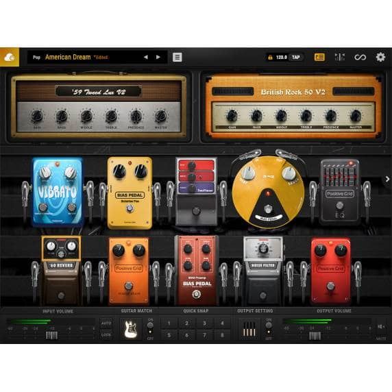
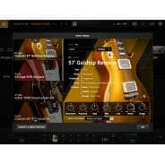

Positive Grid BIAS FX 2 Standard (Serial Download) - Positive Grid from Inta Audio UK

 

- 
- 
- 
- 
- 
- [(L)](https://www.inta-audio.com/images/positive-grid-bias-fx-2-standard-serial-download-p12860-35797_image.jpg)
- [(L)](https://www.inta-audio.com/images/positive-grid-bias-fx-2-standard-serial-download-p12860-35798_image.jpg)
- [(L)](https://www.inta-audio.com/images/positive-grid-bias-fx-2-standard-serial-download-p12860-35799_image.jpg)

# Positive Grid BIAS FX 2 Standard (Serial Download)

Code: BIASFX2-STD

0 reviews

[Read Reviews](https://www.inta-audio.com/positive-grid-bias-fx-2-standard-serial-download-p12860#reviews_tab)

- 30 New Amplifiers
- 45 New Effects
- Guitar Match - Essential (2 Guitars)
- Greatly Improved New DSP Engine
- New Easy-To-Use User Interface
- 60 New Built-in Factory Presets

[Read Full Description](https://www.inta-audio.com/positive-grid-bias-fx-2-standard-serial-download-p12860#info_tab)

RRP:      £135.00

Save: 37%

Your Price:      £85.00      (inc. VAT)

 Item in Stock  |  Usually dispatched within 24 hours

- Delivery Information

- Standard Delivery - (FREE UK Delivery)

- Express Delivery Available

- [View All Positive Grid](https://www.inta-audio.com/positive-grid-m319)

- [View All Virtual Instrument Software](https://www.inta-audio.com/computer-music-c36/virtual-instrument-software-c528)

- [View All Positive Grid Virtual Instrument Software](https://www.inta-audio.com/computer-music-c36/virtual-instrument-software-c528/positive-grid-m319)

|     |     |     |
| --- | --- | --- |
|     | [(L)](https://www.facebook.com/sharer/sharer.php?u=https%3A%2F%2Fwww.inta-audio.com%2Fpositive-grid-bias-fx-2-standard-serial-download-p12860&display=popup&ref=plugin&src=like&kid_directed_site=0) | [Sign Up](https://www.facebook.com/ad_campaign/landing.php?campaign_id=137675572948107&partner_id=inta-audio.com&placement=like_plugin&extra_1=https%3A%2F%2Fwww.inta-audio.com%2Fpositive-grid-bias-fx-2-standard-serial-download-p12860&extra_2=GB) to see what your friends like. |

[**Tweet](https://twitter.com/intent/tweet?original_referer=https%3A%2F%2Fwww.inta-audio.com%2Fpositive-grid-bias-fx-2-standard-serial-download-p12860&ref_src=twsrc%5Etfw&text=Positive%20Grid%20BIAS%20FX%202%20Standard%20(Serial%20Download)%20-%20Positive%20Grid%20from%20Inta%20Audio%20UK&tw_p=tweetbutton&url=https%3A%2F%2Fwww.inta-audio.com%2Fpositive-grid-bias-fx-2-standard-serial-download-p12860&via=intaaudio)

Excellent

**4.9** Average
**1701** Reviews
[](http://www.reviews.co.uk/company-reviews/store/inta-audio)

               

- [Product **Info**](https://www.inta-audio.com/positive-grid-bias-fx-2-standard-serial-download-p12860#info_tab)

- [The **Specs**](https://www.inta-audio.com/positive-grid-bias-fx-2-standard-serial-download-p12860#specs_tab)

- [Read **Reviews**](https://www.inta-audio.com/positive-grid-bias-fx-2-standard-serial-download-p12860#reviews_tab)

- [Delivery **Details**](https://www.inta-audio.com/positive-grid-bias-fx-2-standard-serial-download-p12860#delivery_tab)

**Positive Grid BIAS FX 2 Standard (Serial Download)**

**Please note, this product is a serial download and not a boxed version. Once your order has been placed, you will be emailed shortly after will a download key to access your software. **

The ever-popular BIAS Software from Positive Grid has got an update!

BIAS FX 2 contains everything you loved in the previous version, however with a high-resolution DSP engine containing award-winning Celestion cab emulation and a newly introduced guitar match feature, each and every guitar tone is emulated with stunning realism!

The guitar match feature is something which is never found in other guitar modelling software. Each guitar is precisely recreated into legendary guitar tones!

With a studio's worth of guitar effects such as; harmonizer, compression, Guitar Synth amongst others. Creating your dream tone has never been easier!

Quickly record ideas for riffs, vamps and songs with a simple click and loop your recording while you play it back through BIAS FX 2’s foot pedals, amps and rack FX.

With new presets created by world-renowned artists, studio engineers and session players, this complete library of presets will inspire your playing and unleash your creativity.

Features:

- 30 New Amplifiers
- 45 New Effects
- Guitar Match - Essential (2 Guitars)
- Greatly Improved New DSP Engine
- New Easy-To-Use User Interface
- 60 New Built-in Factory Presets
- Redesigned ToneCloud® Access
- New Looper/Recorder Functionality
- Dual Signal Path With Multiple Splitters

customers also bought...

- 

 Positive Grid BIAS FX 2 Pro (Serial Download)

RRP      £199.00

    £169.00

- 

 Positive Grid BIAS FX 2 Elite (Serial Download)

RRP      £299.00

    £235.00

- 

 Positive Grid BIAS Elite Combo Bundle (Serial Download)

RRP      £499.00

    £320.00

- 

 ILok 3 - 3rd Generation Authorisation Key USB Dongle

RRP      £59.99

    £39.99

- 

 ToonTrack EZMix 2 Rock & Metal Guitar Bundle (Serial Download)

RRP      £199.00

    £179.00

- 

 ToonTrack Beatstation Virtual Instrument (Serial Download)

RRP      £75.99

    £69.95