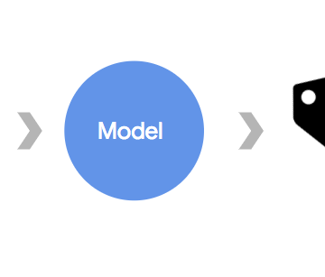

Predicting the price of wine with the Keras Functional API and TensorFlow

Predicting the price of wine with the Keras Functional API and TensorFlow

https://medium.com/tensorflow/predicting-the-price-of-wine-with-the-keras-functional-api-and-tensorflow-a95d1c2c1b03

Can you put a dollar value on “elegant, fine tannins,” “ripe aromas of cassis,” or “dense and toasty”? It turns out a machine learning…