Preparing a Container Engine Environment for Production  |  Solutions       |  Google Cloud Platform

star_border
star_border
star_border
star_border
star_border

- [Solutions](https://cloud.google.com/solutions/)

#  Preparing a Container Engine Environment for Production

- [Contents](https://cloud.google.com/solutions/prep-container-engine-for-prod#top_of_page)
- [Structuring projects, networks, and clusters](https://cloud.google.com/solutions/prep-container-engine-for-prod#structuring_projects_networks_and_clusters)
    - [Projects](https://cloud.google.com/solutions/prep-container-engine-for-prod#projects)
    - [Networks and subnetworks](https://cloud.google.com/solutions/prep-container-engine-for-prod#networks_and_subnetworks)
- [Managing identity and access](https://cloud.google.com/solutions/prep-container-engine-for-prod#managing_identity_and_access)

    -
    -
    -
-
    -
    -
    -
    -
    -
    -
-
-

This solution provides a blueprint and methodology for onboarding your workloads more securely, reliably, and cost-effectively to Google Container Engine. It provides guidance for configuring administrative and network access to clusters. This article assumes a working understanding of Kubernetes resources and cluster administration as well as familiarity with Google Cloud Platform (GCP) networking features.

## [arrow_upward](https://cloud.google.com/solutions/prep-container-engine-for-prod#top_of_page)Structuring projects, networks, and clusters

The following diagram shows the best structure for projects, networks, regions, subnetworks, zones, and clusters.

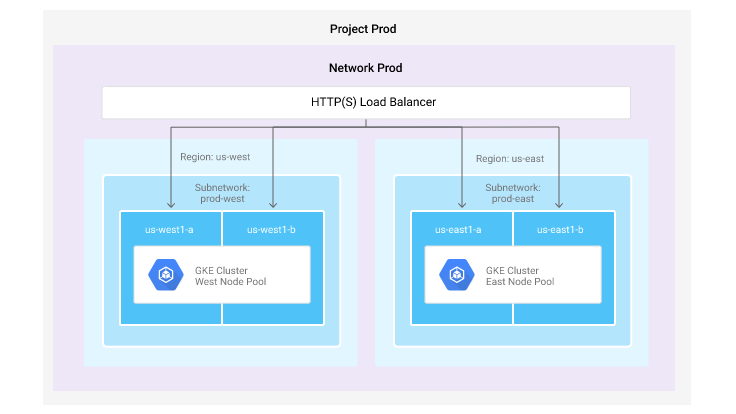

### Projects

Google Cloud Platform creates all of its resources within a[project entity](https://cloud.google.com/resource-manager/docs/creating-managing-projects). Projects are the unit of billing and allow administrators to associate IAM roles with users. When roles are applied at the project level they apply to all resources encapsulated within project. You should use projects to encapsulate your various operating environments. For example, you may have *production* and *staging* projects for operations teams as well as a *test-dev* project for developers. You can apply more granular and strict policies to the projects that hold your most mission critical and sensitive data and workloads, namely *production*, while applying permissive and flexible policies for developers in the *test-dev* environment to experiment.

### Networks and subnetworks

Within each project you have networks with subnetworks. The Network resource holds a collection of other resources including subnetworks, external IP addresses, firewall rules, routes, your VPN, and Cloud Router. On GCP, for performance and simplicity of configuration, a Network can span many regions. Subnetworks offer you the flexibility to isolate and control traffic into or out of each region between your Container Engine clusters. By default, you will have one created in your project but it is recommended that you create and configure your own network to map to your existing IP address management (IPAM) convention.[Firewall rules](https://cloud.google.com/compute/docs/networking#firewall_rules)can then be applied with this network to filter traffic ingressing or egressing your Container Engine nodes. By default all internet traffic to your Container Engine nodes is denied.

[Subnetworks](https://cloud.google.com/compute/docs/subnetworks#subnetworks)can span multiple zones but not regions. To control communication between subnetworks, you will need to[create firewall rules](https://cloud.google.com/compute/docs/subnetworks#subnetworks_and_firewall_rules)allowing traffic to pass between them. Use the[`--tags` flag](https://cloud.google.com/sdk/gcloud/reference/container/clusters/create#--tags)during cluster or node-pool creation to appropriately tag your Container Engine nodes for the firewall rules to take effect. In addition to firewalling, tags can be used to create routes between your custom subnetworks. In auto-mode subnetworks[routing between subnets is enabled by default](https://cloud.google.com/compute/docs/subnetworks#default_routes), with custom subnetworks you will need to[create the routes manually](https://cloud.google.com/compute/docs/subnetworks#isolation_of_subnetworks).

## [arrow_upward](https://cloud.google.com/solutions/prep-container-engine-for-prod#top_of_page)Managing identity and access

### Project-level access

The previous section noted that you can bind[IAM roles](https://cloud.google.com/container-engine/docs/iam-integration#iam_roles)to users at the project level. In addition to granting roles to individual users, you can also use[groups](https://cloud.google.com/iam/docs/overview#google_group)to simplify the application of roles.

Below is an illustration of IAM policy layout that provides the principle of least privilege for a dev project that is set up for developers to develop and test their upcoming features and bug fixes, as well as a prod project for production traffic:

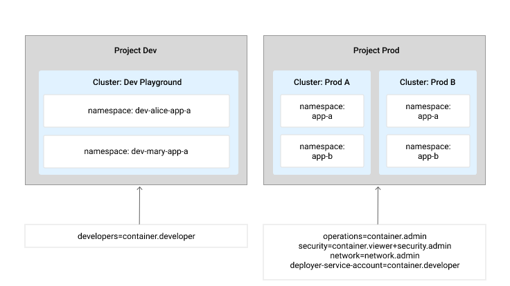

As the following table shows, there are 4 groups of users within the organization with varying levels of permissions, granted through[IAM roles](https://cloud.google.com/container-engine/docs/iam-integration#iam_roles)across the 2 projects:

Team
[IAM Role](https://cloud.google.com/compute/docs/access/iam#iam_roles)
Project
Permissions
Developers
[object Object]
dev

Can create Kubernetes resources for the existing clusters within the project, is not allowed to create or delete clusters.

Operations
[object Object]
prod

Full administrative access to the clusters and Kubernetes resources running within the project.

Security
[object Object]
 [object Object]
prod

Create, modify, and delete firewall rules and SSL certificates as well as view resources that were created within each cluster including the logs of the running pods.

Network
[object Object]
prod

Create, modify, and delete networking resources, except for firewall rules and SSL certificates.

In addition to the 3 teams with access to the *prod* project, an additional[service account](https://cloud.google.com/iam/docs/overview#service_account)is given the `container.developer` role for *prod*, allowing it to create, list, and delete resources within the cluster. Service accounts can be used to give automation scripts or deployment frameworks the ability to act on your behalf. Deployments to your production project and clusters should go through an automated pipeline.

In the *dev* project there are multiple developers working on the same application within the same cluster. This is facilitated by[namespaces](http://kubernetes.io/docs/user-guide/namespaces/), which the cluster user can create. Each developer can create resources within their own namespace, therefore avoiding naming conflicts. They can also reuse the same YAML configuration files for their deployments so that their configurations stay as similar as possible during development iterations. Namespaces can also be used to create[quotas on CPU, memory, and storage](http://kubernetes.io/docs/admin/resourcequota/)usage within the cluster, ensuring that one developer isn't using too many resources within the cluster. The next section discusses restricting users to operating within certain namespaces.

### RBAC authorization

Container Engine clusters running Kubernetes 1.6 and above can take advantage of further restrictions to what users are authorized to do in individual clusters. Cloud IAM can provide users access to full clusters and the resources within them, but[Kubernetes' Role Based Access Control](https://kubernetes.io/docs/admin/authorization/rbac/)(RBAC) allows you to use the Kubernetes API to further constrain the actions users can perform inside their clusters.

With RBAC, cluster administrators apply fine-grained policies to individual namespaces within their clusters or to the cluster as a whole. The Kubernetes command line interface `kubectl` uses the active credentials from the `gcloud`tool, allowing cluster admins to map roles to GCP identities (users and service accounts) as subjects in RoleBindings.

For example, in the figure below there are two users, *user-a* and *user-b*, who have been granted the*config-reader* and *pod-reader* roles on the *app-a* namespace.

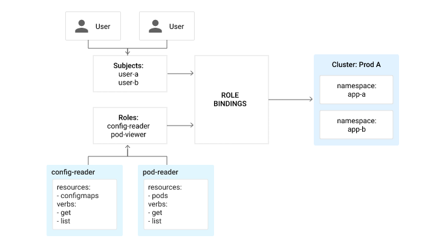

As another example, there are GCP project-level IAM roles that give certain users access to all clusters in a project. In addition, individual namespace- and cluster-level role bindings are added through RBAC to give fine-grained access to resources within particular clusters or namespaces.

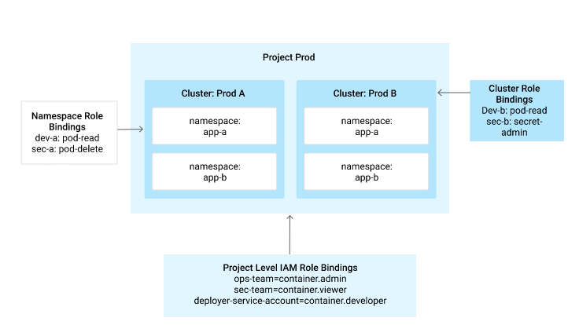

Kubernetes includes some default roles, but as a cluster administrator, you can create your own that map more closely to your organizational needs. Below is an example role that allows users only to view, edit, and update ConfigMaps but not delete them, because the `delete` verb is not included:

hdr_strong
content_copy

`kind:Role[[NEWLINE]]apiVersion: rbac.authorization.k8s.io/v1beta1[[NEWLINE]]metadata[[NEWLINE]]  namespace: default[[NEWLINE]]  name: config-editor[[NEWLINE]]rules:[[NEWLINE]]- apiGroups: [""][[NEWLINE]]  resources: ["configmaps"][[NEWLINE]]  verbs: ["get", "list", "watch", "create", "update", "patch"][[NEWLINE]]`

After you have defined roles, you can apply those roles to the cluster or namespace through "bindings". Bindings associate roles to their users, groups, or service accounts. Below is an example of binding our previously created role (config-editor) to the bob@example.org user and the "development" namespace.

hdr_strong
content_copy

`kind: RoleBinding[[NEWLINE]]apiVersion: rbac.authorization.k8s.io/v1beta1[[NEWLINE]]metadata:[[NEWLINE]]  name: config-editors[[NEWLINE]]  namespace: development[[NEWLINE]]subjects:[[NEWLINE]]- kind: User[[NEWLINE]]  name: bob@example.org[[NEWLINE]]  apiGroup: rbac.authorization.k8s.io[[NEWLINE]]roleRef:[[NEWLINE]]  kind: ClusterRole[[NEWLINE]]  name: config-editor[[NEWLINE]]  apiGroup: rbac.authorization.k8s.io[[NEWLINE]]`

For more information on RBAC, see the[Container Engine documentation](https://cloud.google.com/container-engine/docs/role-based-access-control).

### Image access and sharing

Images in [Google Container Registry](https://cloud.google.com/container-registry/)are stored in[Google Cloud Storage](https://cloud.google.com/storage/docs/). This section discusses how to make images public and share them between projects.

#### Making images public

You can make images public by making the objects and buckets backing them public. For more detailed instructions, see the Container Registry[Access Control documentation](https://cloud.google.com/container-registry/docs/access-control#making_the_images_in_your_registry_publicly_available).

#### Accessing images across projects

You can share container images between projects by ensuring that your Kubernetes nodes use a service account. The[default service account](https://cloud.google.com/compute/docs/access/service-accounts#compute_engine_default_service_account)associated with your project is in the form `[PROJECT_ID]`[-compute@developer.gserviceaccount.com](https://cloud.google.com/solutions/prep-container-engine-for-prodmailto:-compute@developer.gserviceaccount.com). After you have this identifier, you can[grant it access](https://cloud.google.com/iam/docs/granting-roles-to-service-accounts)as [a storage.viewer](https://cloud.google.com/container-registry/docs/access-control#permissions_and_roles)on projects where you want to use the Container Registry. You should, however, use a custom service account that has restricted permissions, because the default has[editor access](https://cloud.google.com/iam/docs/understanding-roles#primitive_roles)to the entire project.

To use a different service account for your clusters, you can provide the service account at cluster or node-pool creation with the `--service-account`flag. For example, to use the *gke-sa* service account in the project *my- project*:

hdr_strong
content_copy

`gcloud container clusters create west --service-account \[[NEWLINE]]  gke-sa@my-project.google.com.iam.gserviceaccount.com[[NEWLINE]]`

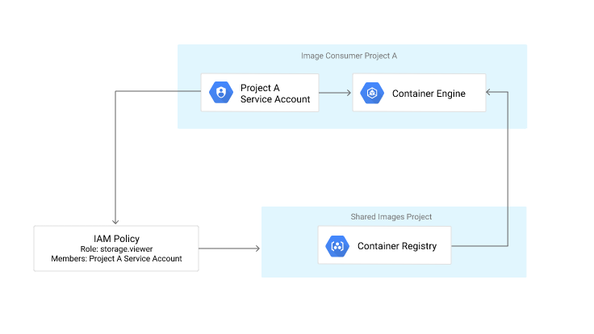

## [arrow_upward](https://cloud.google.com/solutions/prep-container-engine-for-prod#top_of_page)Configuring networking

Kubernetes provides the Service abstraction that provides load-balancing and service discovery across sets of pods within a cluster as well as to legacy systems running outside the cluster. The sections below describe best practices for communication between Kubernetes pods and with other systems, including other Kubernetes clusters.

### Communicating within the same cluster

#### Service discovery

Kubernetes allows you to define services that group pods that are running in the cluster based on a set of labels. This group of pods can be discovered within your cluster using DNS. For more information on service discovery in Kubernetes, go to the Connecting Applications with Services documentation.

#### DNS

A cluster-local DNS server, kube-dns, is deployed in each Container Engine cluster that handles mapping service names to healthy pod IPs. By default, the Kubernetes DNS server returns the service's cluster IP address. This IP address is static throughout the lifetime of the service. When sending traffic to this IP the iptables on the node will load balance packets across the ready pods that match the selectors of the service. These iptables are programmed automatically by the kube-proxy service running on each node.

If you want service discovery and health monitoring but would rather have the DNS service return you the IPs of pods rather than a virtual IP, you can provision the service with the ClusterIP field set to "None," which makes the service headless. In this case the DNS server returns a list of A records that map the DNS name of your service to the A records of the ready pods that match the label selectors defined by the service. The records in the response rotates to facilitate spreading load across the various pods. Some client-side DNS resolvers may cache DNS replies, rendering the A record rotation ineffective. The advantages of using the ClusterIP are listed here.

One typical use case for headless services is with StatefulSets. StatefulSets are well-suited to run stateful applications that require stable storage and networking among their replicas. This type of deployment provisions pods that have a stable network identity, meaning their hostnames can be resolved in the cluster. Although the pod's IP may change, its hostname DNS entry will be kept up to date and resolvable.

#### Packet flow: ClusterIP

The following diagram shows the DNS response and packet flow of a standard Kubernetes service. While pod IPs are routable from outside the cluster, a service's cluster IP is only accessible within the cluster. These virtual IPs are implemented by doing destination network address translation in each Kubernetes node. The kube-proxy service running on each node keeps forwarding rules up to date on each node that map the cluster IP to the IPs of healthy pods across the cluster. If there is a pod of the service running on the local node, then that pod is used, otherwise a random pod in the cluster is chosen.

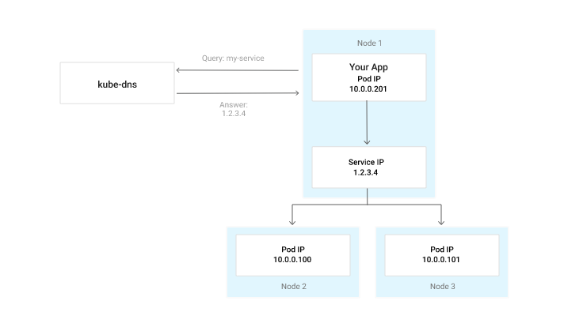

For more information on how Service IPs are implemented, go to the Kubernetes documentation. For a deep dive into Container Engine networking watch the Next 2017 talk on YouTube:

#### Headless services

Below is an example of the DNS response and traffic pattern for a headless service. Pod IPs are routable through the default GCP subnetwork route tables and are accessed by your application directly.

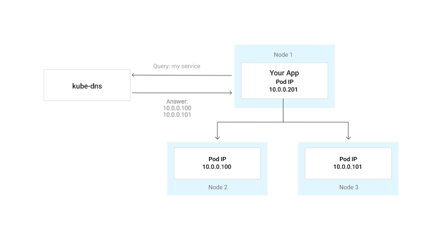

### Connecting to a Container Engine cluster from inside GCP

To connect to your services from outside of your cluster but within the GCP network's private IP space, you should use[internal load balancing](https://cloud.google.com/compute/docs/load-balancing/internal/#about_internal_load_balancing). For your service to be reachable outside the cluster, you must expose it using a NodePort.

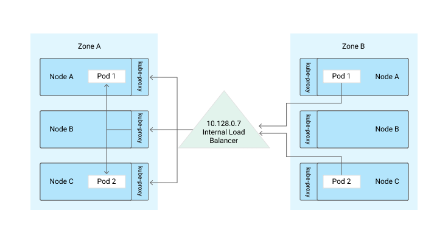

With this service type, Kubernetes allocates a port on all your cluster nodes that can be used to access your service from outside the cluster. Because Container Engine nodes are all members of an[instance group](https://cloud.google.com/compute/docs/instance-groups/), you can use it as a[backend service](https://cloud.google.com/compute/docs/load-balancing/internal/#backend-service)for an internal load balancer. This instance group includes all your cluster nodes and is kept up to date as the cluster is scaled or upgraded. Clients of the internal load balancer must be in the same region as your cluster. To ensure that traffic from the local network can't access your services, apply ingress firewall rules to your nodes.

A connection to the internal load balancer will first hit one of the nodes in the cluster based on the configured[session affinity](https://cloud.google.com/compute/docs/load-balancing/internal/#session-affinity). The kube-proxy process keeps an up-to-date set of iptables rules that can forward traffic to ready pods for the service. If no ready pods matching your service label selectors are available, then it sends your traffic to a pod on an adjacent node.

### Connecting from inside a cluster to external services

In many cases it may be necessary to connect your applications running inside of Kubernetes with a service, database, or application that lives outside of the cluster. You have 3 options, as outlined below.

#### Stub domains

In Kubernetes 1.6 and above, you can configure the cluster internal DNS service (kube-dns) to forward DNS queries for a certain domain to an external DNS server. This is useful when you have authoritative DNS servers that should be queried for a domain that your Kubernetes pods will need to leverage.

#### External name services

External name services allow you to map a DNS record to a service name within the cluster. In this case, DNS lookups for the in-cluster service will return a CNAME record of your choosing. You should use this if you only have a few records that you want to map back to existing DNS services.

#### Services without selectors

You can create services without a selector and then manually add endpoints to it to populate service discovery with the correct values. This allows you to use the same service discovery mechanism for your in- cluster services while ensuring that systems without service discovery through DNS are still reachable. While this approach is the most flexible, it also requires the most configuration and maintenance in the long term.

For more information on DNS, go to the[Kubernetes DNS Pods and Services](https://kubernetes.io/docs/concepts/services-networking/dns-pod-service/) documentation page.

### Receiving traffic from the Internet to your cluster

Traffic from the Internet can be directed to your services running in Kubernetes by using two different methods, namely network- or HTTP(s)-load balancing.

Kubernetes services should be created as LoadBalancer type for external TCP/UDP load balancing. Kubernetes creates a[Network Load Balancer](https://cloud.google.com/compute/docs/load-balancing/network/)in your GCP project and maps it to the nodes of your Container Engine cluster. This is an easy way to get load balancing for your TCP and UDP workloads with minimal configuration. The Network Load Balancer is scoped regionally, so it can only balance traffic against pods running within the same region.

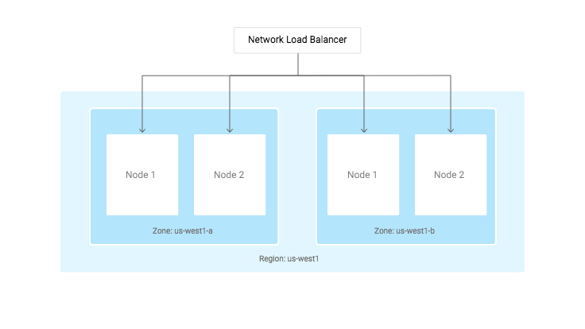

For HTTP(S) Load Balancing, you should take advantage of[Google's Global HTTP(S) Load Balancer](https://cloud.google.com/compute/docs/load-balancing/http/), which can load balance traffic across multiple regions using a single anycast IP address. In Kubernetes, you can create Ingress Resources that allow you to map hostnames and paths to services within your cluster. For ingress to work properly your services must be created with `type: NodePort`.

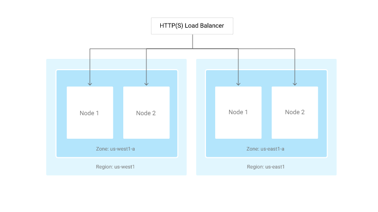

### Firewalling

Container Engine nodes are provisioned as[instances](https://cloud.google.com/compute/docs/instances/)in Compute Engine. As such, they adhere to the same[stateful firewall mechanism](https://cloud.google.com/compute/docs/networking#firewalls) as other instances. These firewall rules are applied within your network to instances by[using tags](https://cloud.google.com/compute/docs/label-or-tag-resources#tags). Each [node pool](https://cloud.google.com/container-engine/docs/node-pools)receives its own set of tags that you can use in rules. By default, each node pool receives a single tag that identifies it. You can add your own custom tags at either cluster or node pool creation time using [the `--tags` flag](https://cloud.google.com/sdk/gcloud/reference/container/clusters/create#--tags)in the `gcloud` command line.

For example, to allow an[internal load balancer](https://cloud.google.com/compute/docs/load-balancing/internal/)to access port 8080 on all your nodes, you would use the following commands:

hdr_strong
content_copy

`gcloud compute firewall-rules create \[[NEWLINE]]  allow-8080-fwr --target-tags allow-8080 --allow tcp:8080 \[[NEWLINE]]  --network gke --source-range 130.211.0.0/22[[NEWLINE]]gcloud container clusters create my-cluster --tags allow-8080[[NEWLINE]]`

Below is an example tagging one cluster so that internet traffic can access nodes on port 30000 while the other cluster is tagged to allow traffic from the VPN to port 40000. This is useful when exposing a service through a NodePort that should only be accessible using privileged networks like a VPN back to a corporate data center, or from another cluster within your project.

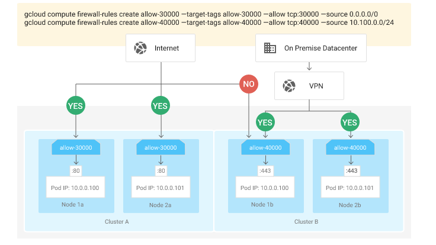

### Connecting to an on-premises data center

There are several[Cloud Interconnect](https://cloud.google.com/interconnect/)options for connecting to on-premises data centers. These options are not mutually exclusive, so you may have a combination, based on workload and requirements:

1. Internet for workloads that aren't data intensive or latency sensitive. Google has more than 100 points of presence (PoPs) connecting to service providers across the world.

2. [Direct Peering](https://cloud.google.com/interconnect/direct-peering) for workloads that require dedicated bandwidth, are latency sensitive, and access to all Google services, including the full suite of Google Cloud Platform products. Direct Peering is a Layer 3 connection, done by exchanging BGP routes, and thus requires a registered ASN.

3. [Carrier Interconnect](https://cloud.google.com/interconnect/docs#cloud_interconnect_service_providers) is that same as Direct Peering, but done through a service provider. This is a great option if you don't have a registered ASN, or have existing relationships with a preferred service provider.

4. [Cloud VPN](https://cloud.google.com/compute/docs/vpn/overview) is configured over Layer 3 interconnect and internet options (1, 2, and 3), if IPsec encryption is required, or if you want to extend your private network into your private Compute Engine network.

## [arrow_upward](https://cloud.google.com/solutions/prep-container-engine-for-prod#top_of_page)What's next

- Try out other Google Cloud Platform features for yourself. Have a look at our[tutorials](https://cloud.google.com/docs/tutorials).

Was this page helpful? Let us know how we did:
star_border
star_border
star_border
star_border
star_border

Except as otherwise noted, the content of this page is licensed under the [Creative Commons Attribution 3.0 License](http://creativecommons.org/licenses/by/3.0/), and code samples are licensed under the [Apache 2.0 License](http://www.apache.org/licenses/LICENSE-2.0). For details, see our [Site Policies](https://developers.google.com/terms/site-policies). Java is a registered trademark of Oracle and/or its affiliates.

Last updated June 2, 2017.