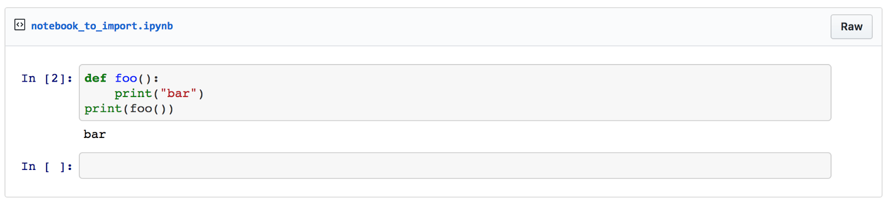
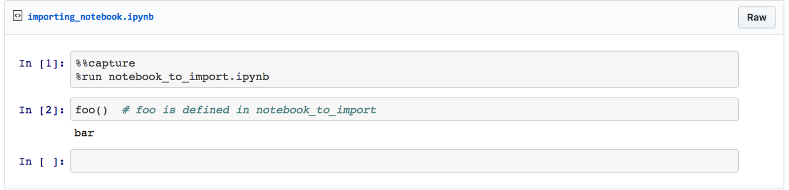
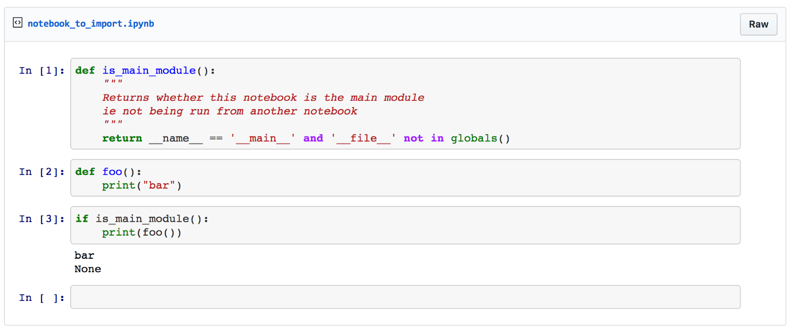

Present your data science results in a Jupyter notebook, the right way

# Present Your Data Science Results in a Jupyter Notebook, the Right Way

## How to import one Jupyter notebook into another

**You can use one Jupyter notebook to handle the data science code, and another to present your results**.

At [Sicara](https://www.sicara.com/), we know that **showing the results of our day-to-day data science **work to our clients is one of their greatest joy — and it’s the same if you work in a non-service company and show your results to a decision maker. Using **two notebooks** keeps that link as simple and as clear as one could wish!

[**Here’s an example**](https://github.com/adrienlina/jupyter-silent-import/blob/master/results_presentation.ipynb) of two notebooks that explain how to compute the number π :

- •There’s a first notebook, hidden from the reader, that has defined a Monte-Carlo function to approximate π and how to plot graphs.
- •The second notebook focuses on explaining the algorithm and presenting the resulting data in a nice way.

The best way to present your result is by **combining complex visualizations and algorithms** with a **clear plan and extensive explanations of the data science**.

* * *

*...*

### Install Jupyter Notebook

Install Jupyter notebook (you may want to use a [virtualenv](https://virtualenvwrapper.readthedocs.io/en/latest/)):

$ pip install jupyter

You can also get Jupyter by installing [Anaconda](https://www.continuum.io/downloads). Run a regular Jupyter notebook by typing:

$ jupyter notebook
and opening http://localhost:8888/.

### The greedy solution

Here’s some code I wrote, but I don’t want my client or decision maker to see:

and here’s how to use it:

Find the above example in [this gist](https://gist.github.com/adrienlina/c547c38721f706ad66df46a2f2749025).

### Running a few cells of the child notebook during import

When importing the notebook, you actually run all the code in `notebook_to_import.ipynb`, which can be very long (lots of graphs, heavy example-related computation).

Using the `__name__` variable and the `globals` function, you can decide which cells to run.

And keep the same importing notebook:

You could also [define a custom Jupyter magic function](https://www.google.fr/url?sa=t&rct=j&q=&esrc=s&source=web&cd=3&cad=rja&uact=8&ved=0ahUKEwiC7e79ub3WAhWkL8AKHf09CMQQFgg2MAI&url=https%3A%2F%2Fipython.org%2Fipython-doc%2F3%2Fconfig%2Fcustommagics.html&usg=AFQjCNHsPGBzvePfGaS0utJaP81BDN6n9Q) but this is left as an exercise . Here’s this part’s [gist link](https://gist.github.com/adrienlina/87fa43ada8e4799ed3e1f9464a633acc).

### How does it work?

The parent part is fairly simple.
%%capture # Hides the output of the current cell
%run path/to/notebook.py # works like from notebook import *
While there is no real magic in the module folder.
def is_main_module():
return __name__ == '__main__' and '__file__' not in globals()

is a slightly more complex way than what’s standard to determine the main module, but necessary since the `__name__` builtin variable isn’t set by the `%run` command as happens in normal python scripts.

### Pros & Cons

#### Pros

- •Fast to implement
- •Fast on runtime with the `is_main_module` function
- •Short
- •Silent (*i.e.* doesn’t print the imported notebook outputs)
- •Doesn’t require to change the Jupyter configuration
- •Relative paths in `%run` work well, including POSIX shortcuts (`..`)
- •Modules variables are loaded in the current namespace, which is very useful to hide painful declarations in a notebook

#### Cons

- •**Modules variables are loaded in the current namespace** and can liter the namespace and lead to bugs if not handled carefully
- •I have not found this solution elsewhere… is it non-standard?

* * *

*...*

Now you are going to be able to only show your data science results to your client or decision maker. Do you have a better way to do it? Let me know!

*If you want to be notified when the next article comes out, feel free to click on follow just below.*

*Do you want to apply for a job at Sicara? Feel free to *[*contact us*](https://www.sicara.com/contact/?utm_source=blog)*, we would be glad to welcome you in our Paris office!*