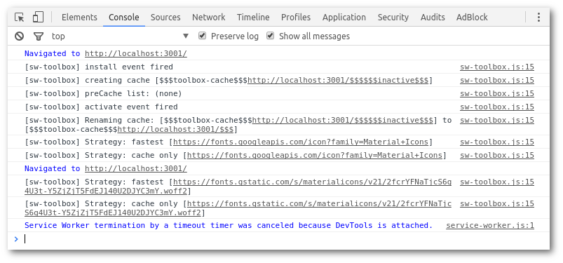
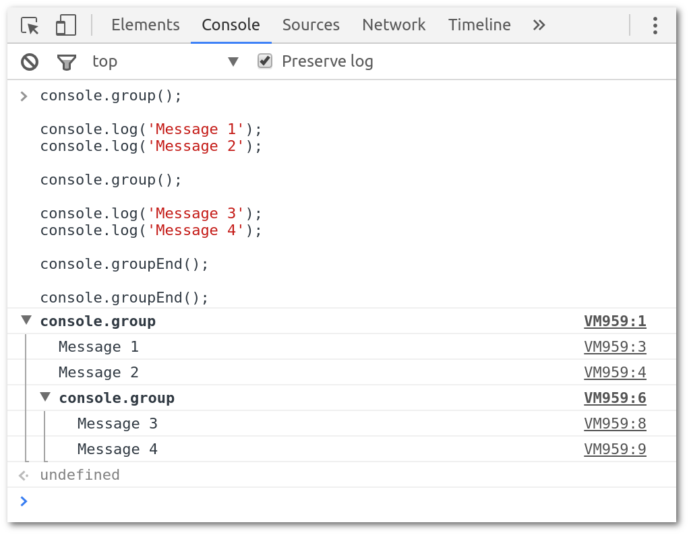
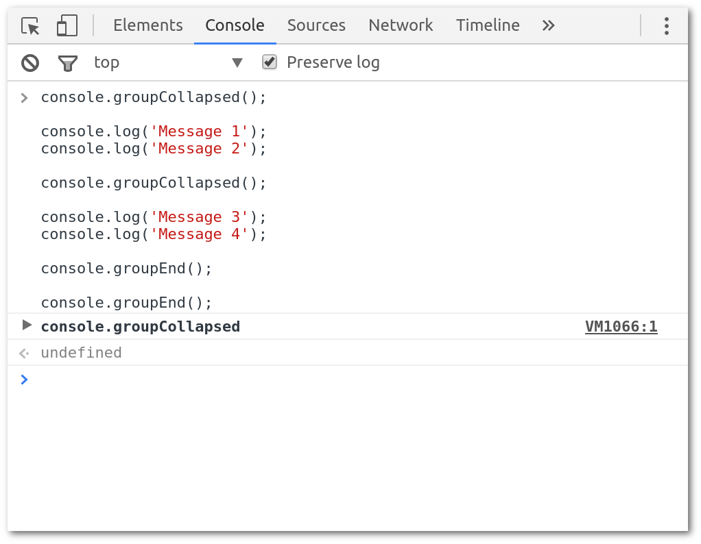
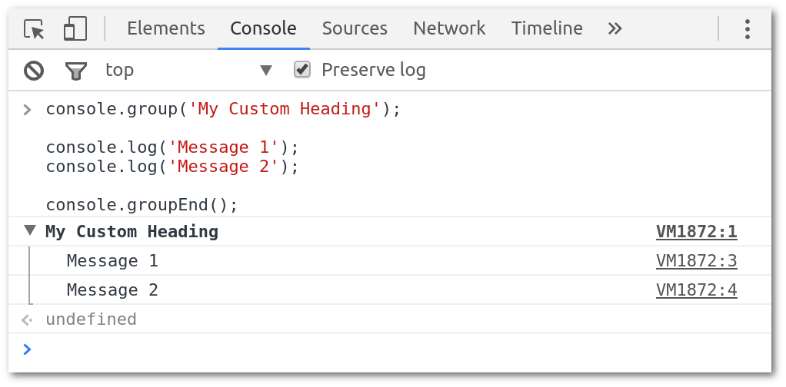
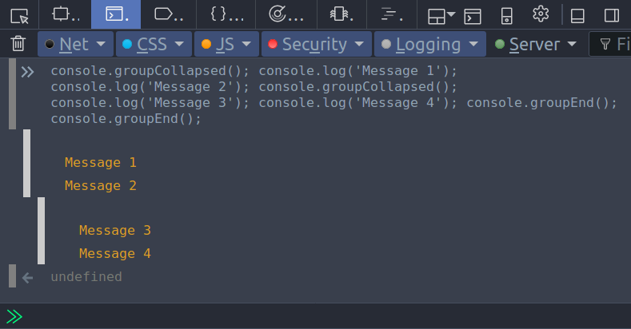

Pretty Printing – Matt Gaunt – Medium

# Pretty Printing

Myself and Addy spent a few hours banging our heads against a wall trying to understand why our samples using our new Service Worker libraries ([sw-helpers](https://github.com/googlechrome/sw-helpers/))were failing. It turned out to be a stupid quirk of the libraries, bugs were raised etc, but ultimately logs would have helped.

One of the reasons these libraries aren’t logging anything to the console is that in previous service worker libraries, it becomes “spammy” pretty quick.

Example of sw-toolbox logs from Web Starter Kit

While I’m not 100% sure our new libraries can avoid drowning the console (although we’ll try), one thing that I often wanted from our old libraries, was access to more information about the current state from a log, while also reduce the size / number of logs.

For example, in the image above the log: ‘[sw-toolbox] Strategy: fastest [https://………..]’ has a few issues:

1. 1The message doesn’t actually explain anything. “Strategy: fastest” doesn’t mean anything.

2. 2There is information lost (i.e. what was the original request, what cache will it look at, did the strategy find a cache hit or did it go to the network, what rule intercepted the original request).

That being said, sw-toolbox has these super short succinct messages, to reduce the amount of noise in the console.

To try and enable sharing more information from out library without growing the size of our logging, I started digging into the console options for grouping and coloring logs and it’s a kind of great / upsetting state of affairs.

### Console Groups

Grouping of logs is awesome, you simply open and close a group and any logs between those will be added to that group.

|     |     |
| --- | --- |
| 1   | console.group(); |
| 2   |     |
| 3   | console.log('Message 1'); |
| 4   | console.log('Message 2'); |
| 5   |     |
| 6   | console.group(); |
| 7   |     |
| 8   | console.log('Message 3'); |
| 9   | console.log('Message 4'); |
| 10  |     |
| 11  | console.groupEnd(); |
| 12  |     |
| 13  | console.groupEnd(); |

 [view raw](https://gist.github.com/gauntface/279b1ac15082a108b0894abccd2f0b8c/raw/21f7d6c6f90fac3cc893a61f6fddf2dfa70a5b35/console-groups.js)  [console-groups.js](https://gist.github.com/gauntface/279b1ac15082a108b0894abccd2f0b8c#file-console-groups-js) hosted with ❤ by [GitHub](https://github.com/)

There are a few options to call out with this.
You can call `console.groupCollapsed()` so that the group is initially closed.

|     |     |
| --- | --- |
| 1   | console.groupCollapsed(); |
| 2   |     |
| 3   | console.log('Message 1'); |
| 4   | console.log('Message 2'); |
| 5   |     |
| 6   | console.groupCollapsed(); |
| 7   |     |
| 8   | console.log('Message 3'); |
| 9   | console.log('Message 4'); |
| 10  |     |
| 11  | console.groupEnd(); |
| 12  |     |
| 13  | console.groupEnd(); |

 [view raw](https://gist.github.com/gauntface/b937079ce3ecef953293d483bbaeb17b/raw/d5bf11a2e8a1df99d1a7f9b690d73c18ca4a5f3c/console-groups-collapsed)  [console-groups-collapsed](https://gist.github.com/gauntface/b937079ce3ecef953293d483bbaeb17b#file-console-groups-collapsed) hosted with ❤ by [GitHub](https://github.com/)

What this looks like after logging.

Developer can open the collapsed group.
You can also set a title on these methods.

|     |     |
| --- | --- |
| 1   | console.group('My Custom Heading'); |
| 2   |     |
| 3   | console.log('Message 1'); |
| 4   | console.log('Message 2'); |
| 5   |     |
| 6   | console.groupEnd(); |

 [view raw](https://gist.github.com/gauntface/6775a21b960c876b3ea98a7f5599f856/raw/070b3666222c33a0d0f05adc5cb33b8311a9a15c/group-headings.js)  [group-headings.js](https://gist.github.com/gauntface/6775a21b960c876b3ea98a7f5599f856#file-group-headings-js) hosted with ❤ by [GitHub](https://github.com/)

Grouping helps if you have a chunk of information you’d like to expose to developers but it’s only relevant some of the time.

#### Console Group: Support

The support of `console.group()` is kind of wonky.
Chrome and Safari are good for both `group()` and `groupCollapsed()`

Firefox supports both methods, but it doesn’t actually collapse groups, meaning calling`console.groupCollapsed()` doesn’t save space in the console.

Also worth calling out that Firefox shows no title by default — which I quite like.

Edge “has support” for these, but [it’s broken](https://developer.microsoft.com/en-us/microsoft-edge/platform/issues/11363242/). The logs seem to come out of order.

The arrow doesn’t actually contain any of the messages — it’s an empty group

These differences are frustrating. Firefox can result in verbose logs and Edge is just unreliable (i.e. it feels pretty damaging to use console grouping in Edge at the moment).

### Console Color

I wanted to explore the use of colors in the console, largely because it’s super helpful in terminal logging. Turns out that using the [**%c** format specifier](https://console.spec.whatwg.org/#formatting-specifiers) in a log message, followed by CSS styles enables just this.

What’s great about this is that you can apply multiple format specifiers (i.e. include multiple ‘%c’ in a console message).

#### Console Color: Support

Ah the good old question of support.
Chrome, Firefox and Safari support colors.

There is one gotcha with Firefox. [Colors aren’t supported in the title of groups](https://bugzilla.mozilla.org/show_bug.cgi?id=1088900):

Chrome vs Firefox with Colors in console.group() call.

Colors are unfortunately not available in Edge *sad face*. (No issue for this on the issue tracker).

It’s a struggle to deal with these issues in that where it’s not support, the log will actually print ‘%c’ (Compare the logs in the image above).

### Pretty Printing

With all of this, I’ve been toying with the following in our new service worker libraries (sw-helpers).

At the most basic level, these libraries will have a nice spanner emoji (cos reasons), a colored log level (to indicate importance of the message) and I’ve colored the primary message to make it visually separate from the pages logs.

Basic Message Logging

Additional pieces of information are displayed under “Extra Information”. This restricts the amount of data displayed by default to just the log message while allowing extra information to be added.

Log with Additional Data (Collapsed by default)

Lastly, if there is a relevant error, its promoted to the top group since it’s likely to be relevant to the developer and it’s default coloring helps.

Log with Promoted Error and Additional Data.

In Firefox I’ve had to use `console.log()` to print the top level message instead of making it the title in `console.group()` (This doesn’t break the visual result while supporting colors). The one downside to Firefox is that the logs could be verbose since groups can’t/don’t collapse.

In Edge, I’ve just fallen back to logging, no groups and a no colors.

Edge Logging

I’m fairly certain I’m going to change the output on Edge — the log has no structure and the filename and line number added by DevTools exacerbates the cluttered look of the logs. (Maybe just logging extra information as an object will trigger a DevTools group like it’s done with the Array)

There is an additional goal to allow developers to filter based on log level: info | debug | warn | error ***or*** supply a custom function to only log specific messages, which should reduce the number of logs / enable better debugging for developers.

It’s been interesting viewing logging in the light of “how can we give developers friendly and informative logs” and interesting exploring support for these features.

I’d love to hear what people think of this kind of logging — does it look useful? Should a message be enough (i.e. don’t use groups for extra info)? Does it look too verbose in Firefox and actually less information is better in that case?

If you are reading this and wanting to add styling to your logs, it’s worth checking out [Log](http://adamschwartz.co/log/) and [console.style](https://github.com/daniellmb/console.style), two libraries that aim to make it easier to write styled logs by using markdown or inline HTML.

*As always H/T *[*Addy Osmani*](https://twitter.com/addyosmani)* for review.*