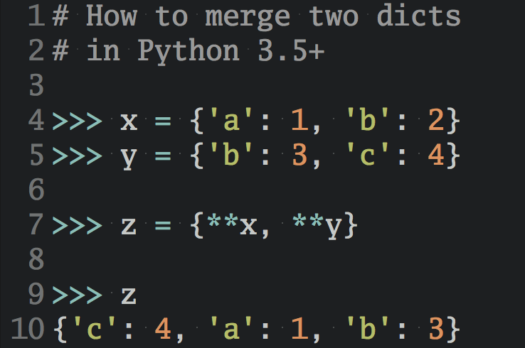

Primer on Python Decorators – Real Python

# Primer on Python Decorators

by [Geir Arne Hjelle](https://realpython.com/primer-on-python-decorators/#author)[159 Comments](https://realpython.com/primer-on-python-decorators/#reader-comments)[intermediate](https://realpython.com/tutorials/intermediate/)[python](https://realpython.com/tutorials/python/)

[**Tweet](https://twitter.com/intent/tweet/?text=Check%20out%20this%20%23Python%20tutorial:%20Primer%20on%20Python%20Decorators%20by%20@realpython&url=https%3A//realpython.com/primer-on-python-decorators/)[**Share](https://facebook.com/sharer/sharer.php?u=https%3A//realpython.com/primer-on-python-decorators/)[**Email](https://realpython.com/primer-on-python-decorators/mailto:?subject=Python%20article%20for%20you&body=Check%20out%20this%20Python%20tutorial:%0A%0APrimer%20on%20Python%20Decorators%0A%0Ahttps%3A//realpython.com/primer-on-python-decorators/)

Table of Contents

- [Functions](https://realpython.com/primer-on-python-decorators/#functions)
    - [First-Class Objects](https://realpython.com/primer-on-python-decorators/#first-class-objects)
    - [Inner Functions](https://realpython.com/primer-on-python-decorators/#inner-functions)
    - [Returning Functions From Functions](https://realpython.com/primer-on-python-decorators/#returning-functions-from-functions)
- [Simple Decorators](https://realpython.com/primer-on-python-decorators/#simple-decorators)
    - [Syntactic Sugar!](https://realpython.com/primer-on-python-decorators/#syntactic-sugar)
    - [Reusing Decorators](https://realpython.com/primer-on-python-decorators/#reusing-decorators)
    - [Decorating Functions With Arguments](https://realpython.com/primer-on-python-decorators/#decorating-functions-with-arguments)
    - [Returning Values From Decorated Functions](https://realpython.com/primer-on-python-decorators/#returning-values-from-decorated-functions)
    - [Who Are You, Really?](https://realpython.com/primer-on-python-decorators/#who-are-you-really)
- [A Few Real World Examples](https://realpython.com/primer-on-python-decorators/#a-few-real-world-examples)
    - [Timing Functions](https://realpython.com/primer-on-python-decorators/#timing-functions)
    - [Debugging Code](https://realpython.com/primer-on-python-decorators/#debugging-code)
    - [Slowing Down Code](https://realpython.com/primer-on-python-decorators/#slowing-down-code)
    - [Registering Plugins](https://realpython.com/primer-on-python-decorators/#registering-plugins)
    - [Is the User Logged In?](https://realpython.com/primer-on-python-decorators/#is-the-user-logged-in)
- [Fancy Decorators](https://realpython.com/primer-on-python-decorators/#fancy-decorators)
    - [Decorating Classes](https://realpython.com/primer-on-python-decorators/#decorating-classes)
    - [Nesting Decorators](https://realpython.com/primer-on-python-decorators/#nesting-decorators)
    - [Decorators With Arguments](https://realpython.com/primer-on-python-decorators/#decorators-with-arguments)
    - [Both Please, But Never Mind the Bread](https://realpython.com/primer-on-python-decorators/#both-please-but-never-mind-the-bread)
    - [Stateful Decorators](https://realpython.com/primer-on-python-decorators/#stateful-decorators)
    - [Classes as Decorators](https://realpython.com/primer-on-python-decorators/#classes-as-decorators)
- [More Real World Examples](https://realpython.com/primer-on-python-decorators/#more-real-world-examples)
    - [Slowing Down Code, Revisited](https://realpython.com/primer-on-python-decorators/#slowing-down-code-revisited)
    - [Creating Singletons](https://realpython.com/primer-on-python-decorators/#creating-singletons)
    - [Caching Return Values](https://realpython.com/primer-on-python-decorators/#caching-return-values)
    - [Adding Information About Units](https://realpython.com/primer-on-python-decorators/#adding-information-about-units)
    - [Validating JSON](https://realpython.com/primer-on-python-decorators/#validating-json)
- [Conclusion](https://realpython.com/primer-on-python-decorators/#conclusion)
- [Further Reading](https://realpython.com/primer-on-python-decorators/#further-reading)

[[bsolomon.2a5a05833ac0.webp](../_resources/28ecf2562b5f595d24390be4e00ee4bf.webp)](https://srv.realpython.net/click/58257184031/?c=31941813441&p=58946116052&r=34946)

** Watch Now This tutorial has a related video course created by the Real Python team. Watch it together with the written tutorial to deepen your understanding: [**Python Decorators 101**](https://realpython.com/courses/python-decorators-101/)

In this tutorial on decorators, we’ll look at what they are and how to create and use them. Decorators provide a simple syntax for calling [higher-order functions](http://en.wikipedia.org/wiki/Higher-order_function).

By definition, a decorator is a function that takes another function and extends the behavior of the latter function without explicitly modifying it.

This sounds confusing, but it’s really not, especially after you’ve seen a few examples of how decorators work. You can find all the examples from this article [here](https://github.com/realpython/materials/tree/master/primer-on-python-decorators).

**Free Bonus:**  [Click here to get access to a free "The Power of Python Decorators" guide](https://realpython.com/primer-on-python-decorators/) that shows you 3 advanced decorator patterns and techniques you can use to write to cleaner and more Pythonic programs.

**Decorators Cheat Sheet:**  [Click here to get access to a free 3-page Python decorators cheat sheet](https://realpython.com/bonus/decorators-cheatsheet/) that summarizes the techniques explained in this tutorial.

**Decorators Q&A Transcript:**  [Click here to get access to a 25-page chat log from our recent Python decorators Q&A session](https://realpython.com/bonus/decorators-qa-2019/) in the Real Python Community Slack where we discussed common decorator questions.

**Updates:**

- *08/22/2018:* Major update adding more examples and more advanced decorators
- *01/12/2016:* Updated examples to Python 3 (v3.5.1) syntax and added a new example
- *11/01/2015:* Added a brief explanation on the `functools.wraps()` decorator

 [*  * Remove ads](https://realpython.com/account/join/)

## Functions

Before you can understand decorators, you must first understand how functions work. For our purposes, **a function returns a value based on the given arguments**. Here is a very simple example:

Python>>>
>>> def  add_one(number):...   return  number  +  1>>> add_one(2)3

In general, functions in Python may also have side effects rather than just turning an input into an output. The `print()` function is a basic example of this: it returns `None` while having the side effect of outputting something to the console. However, to understand decorators, it is enough to think about functions as something that turns given arguments into a value.

**Note:** In [functional programming](https://en.wikipedia.org/wiki/Functional_programming), you work (almost) only with pure functions without side effects. While not a purely functional language, Python supports many of the functional programming concepts, including functions as first-class objects.

### First-Class Objects

In Python, functions are [first-class objects](https://dbader.org/blog/python-first-class-functions). This means that **functions can be passed around and used as arguments**, just like [any other object (string, int, float, list, and so on)](https://realpython.com/python-data-types/). Consider the following three functions:

Python

def  say_hello(name):  return  f"Hello {name}"def  be_awesome(name):  return  f"Yo {name}, together we are the awesomest!"def  greet_bob(greeter_func):  return  greeter_func("Bob")

Here, `say_hello()` and `be_awesome()` are regular functions that expect a name given as a string. The `greet_bob()` function however, expects a function as its argument. We can, for instance, pass it the `say_hello()` or the `be_awesome()` function:

Python>>>

>>> greet_bob(say_hello)'Hello Bob'>>> greet_bob(be_awesome)'Yo Bob, together we are the awesomest!'

Note that `greet_bob(say_hello)` refers to two functions, but in different ways: `greet_bob()` and `say_hello`. The `say_hello` function is named without parentheses. This means that only a reference to the function is passed. The function is not executed. The `greet_bob()` function, on the other hand, is written with parentheses, so it will be called as usual.

### Inner Functions

It’s possible to **define functions inside other functions**. Such functions are called [inner functions](https://realpython.com/inner-functions-what-are-they-good-for/). Here’s an example of a function with two inner functions:

Python

def  parent():  print("Printing from the parent() function")  def  first_child():  print("Printing from the first_child() function")  def  second_child():  print("Printing from the second_child() function")  second_child()  first_child()

What happens when you call the `parent()` function? Think about this for a minute. The output will be as follows:

Python>>>

>>> parent()Printing from the parent() functionPrinting from the second_child() functionPrinting from the first_child() function

Note that the order in which the inner functions are defined does not matter. Like with any other functions, the printing only happens when the inner functions are executed.

Furthermore, the inner functions are not defined until the parent function is called. They are locally scoped to `parent()`: they only exist inside the `parent()` function as local variables. Try calling `first_child()`. You should get an error:

Python

Traceback (most recent call last): File "<stdin>", line 1, in <module>NameError: name 'first_child' is not defined

Whenever you call `parent()`, the inner functions `first_child()` and `second_child()` are also called. But because of their local scope, they aren’t available outside of the `parent()` function.

 [*  * Remove ads](https://realpython.com/account/join/)

### Returning Functions From Functions

Python also allows you to use functions as return values. The following example returns one of the inner functions from the outer `parent()` function:

Python

def  parent(num):  def  first_child():  return  "Hi, I am Emma"  def  second_child():  return  "Call me Liam"  if  num  ==  1:  return  first_child  else:  return  second_child

Note that you are returning `first_child` without the parentheses. Recall that this means that you are **returning a reference to the function `first_child`**. In contrast `first_child()` with parentheses refers to the result of evaluating the function. This can be seen in the following example:

Python>>>

>>> first  =  parent(1)>>> second  =  parent(2)>>> first<function parent.<locals>.first_child at 0x7f599f1e2e18>>>> second<function parent.<locals>.second_child at 0x7f599dad5268>

The somewhat cryptic output simply means that the `first` variable refers to the local `first_child()` function inside of `parent()`, while `second` points to `second_child()`.

You can now use `first` and `second` as if they are regular functions, even though the functions they point to can’t be accessed directly:

Python>>>
>>> first()'Hi, I am Emma'>>> second()'Call me Liam'

Finally, note that in the earlier example you executed the inner functions within the parent function, for instance `first_child()`. However, in this last example, you did not add parentheses to the inner functions—`first_child`—upon returning. That way, you got a reference to each function that you could call in the future. Make sense?

## Simple Decorators

Now that you’ve seen that functions are just like any other object in Python, you’re ready to move on and see the magical beast that is the Python decorator. Let’s start with an example:

Python

def  my_decorator(func):  def  wrapper():  print("Something is happening before the function is called.")  func()  print("Something is happening after the function is called.")  return  wrapperdef  say_whee():  print("Whee!")say_whee  =  my_decorator(say_whee)

Can you guess what happens when you call `say_whee()`? Try it:
Python>>>

>>> say_whee()Something is happening before the function is called.Whee!Something is happening after the function is called.

To understand what’s going on here, look back at the previous examples. We are literally just applying everything you have learned so far.

The so-called decoration happens at the following line:
Python
say_whee  =  my_decorator(say_whee)

In effect, the name `say_whee` now points to the `wrapper()` inner function. Remember that you return `wrapper` as a function when you call `my_decorator(say_whee)`:

Python>>>
>>> say_whee<function my_decorator.<locals>.wrapper at 0x7f3c5dfd42f0>

However, `wrapper()` has a reference to the original `say_whee()` as `func`, and calls that function between the two calls to `print()`.

Put simply: **decorators wrap a function, modifying its behavior.**

Before moving on, let’s have a look at a second example. Because `wrapper()` is a regular Python function, the way a decorator modifies a function can change dynamically. So as not to disturb your neighbors, the following example will only run the decorated code during the day:

Python

from  datetime  import  datetimedef  not_during_the_night(func):  def  wrapper():  if  7  <=  datetime.now().hour  <  22:  func()  else:  pass  # Hush, the neighbors are asleep  return  wrapperdef  say_whee():  print("Whee!")say_whee  =  not_during_the_night(say_whee)

If you try to call `say_whee()` after bedtime, nothing will happen:
Python>>>
>>> say_whee()>>>

 [*  * Remove ads](https://realpython.com/account/join/)

### Syntactic Sugar!

The way you decorated `say_whee()` above is a little clunky. First of all, you end up typing the name `say_whee` three times. In addition, the decoration gets a bit hidden away below the definition of the function.

Instead, Python allows you to **use decorators in a simpler way with the `@` symbol**, sometimes called the [“pie” syntax](https://www.python.org/dev/peps/pep-0318/#background). The following example does the exact same thing as the first decorator example:

Python

def  my_decorator(func):  def  wrapper():  print("Something is happening before the function is called.")  func()  print("Something is happening after the function is called.")  return  wrapper@my_decoratordef  say_whee():  print("Whee!")

So, `@my_decorator` is just an easier way of saying `say_whee = my_decorator(say_whee)`. It’s how you apply a decorator to a function.

### Reusing Decorators

Recall that a decorator is just a regular Python function. All the usual tools for easy reusability are available. Let’s move the decorator to its own [module](https://realpython.com/python-modules-packages/) that can be used in many other functions.

Create a file called `decorators.py` with the following content:
Python

def  do_twice(func):  def  wrapper_do_twice():  func()  func()  return  wrapper_do_twice

**Note:** You can name your inner function whatever you want, and a generic name like `wrapper()` is usually okay. You’ll see a lot of decorators in this article. To keep them apart, we’ll name the inner function with the same name as the decorator but with a `wrapper_` prefix.

You can now use this new decorator in other files by doing a regular import:
Python
from  decorators  import  do_twice@do_twicedef  say_whee():  print("Whee!")

When you run this example, you should see that the original `say_whee()` is executed twice:

Python>>>
>>> say_whee()Whee!Whee!

**Free Bonus:**  [Click here to get access to a free "The Power of Python Decorators" guide](https://realpython.com/primer-on-python-decorators/) that shows you 3 advanced decorator patterns and techniques you can use to write to cleaner and more Pythonic programs.

### Decorating Functions With Arguments

Say that you have a function that accepts some arguments. Can you still decorate it? Let’s try:

Python

from  decorators  import  do_twice@do_twicedef  greet(name):  print(f"Hello {name}")

Unfortunately, running this code raises an error:
Python>>>

>>> greet("World")Traceback (most recent call last): File "<stdin>", line 1, in <module>TypeError: wrapper_do_twice() takes 0 positional arguments but 1 was given

The problem is that the inner function `wrapper_do_twice()` does not take any arguments, but `name="World"` was passed to it. You could fix this by letting `wrapper_do_twice()` accept one argument, but then it would not work for the `say_whee()` function you created earlier.

The solution is to use [`*args` and `**kwargs`](https://stackoverflow.com/questions/36901/what-does-double-star-asterisk-and-star-asterisk-do-for-parameters) in the inner wrapper function. Then it will accept an arbitrary number of positional and keyword arguments. Rewrite `decorators.py` as follows:

Python

def  do_twice(func):  def  wrapper_do_twice(*args,  **kwargs):  func(*args,  **kwargs)  func(*args,  **kwargs)  return  wrapper_do_twice

The `wrapper_do_twice()` inner function now accepts any number of arguments and passes them on to the function it decorates. Now both your `say_whee()` and `greet()` examples works:

Python>>>
>>> say_whee()Whee!Whee!>>> greet("World")Hello WorldHello World

 [*  * Remove ads](https://realpython.com/account/join/)

### Returning Values From Decorated Functions

What happens to the return value of decorated functions? Well, that’s up to the decorator to decide. Let’s say you decorate a simple function as follows:

Python

from  decorators  import  do_twice@do_twicedef  return_greeting(name):  print("Creating greeting")  return  f"Hi {name}"

Try to use it:
Python>>>

>>> hi_adam  =  return_greeting("Adam")Creating greetingCreating greeting>>> print(hi_adam)None

Oops, your decorator ate the return value from the function.

Because the `do_twice_wrapper()` doesn’t explicitly return a value, the call `return_greeting("Adam")` ended up returning `None`.

To fix this, you need to **make sure the wrapper function returns the return value of the decorated function**. Change your `decorators.py` file:

Python

def  do_twice(func):  def  wrapper_do_twice(*args,  **kwargs):  func(*args,  **kwargs)  return  func(*args,  **kwargs)  return  wrapper_do_twice

The return value from the last execution of the function is returned:
Python>>>
>>> return_greeting("Adam")Creating greetingCreating greeting'Hi Adam'

### Who Are You, Really?

A great convenience when working with Python, especially in the interactive shell, is its powerful introspection ability. [Introspection](https://en.wikipedia.org/wiki/Type_introspection) is the ability of an object to know about its own attributes at runtime. For instance, a function knows its own name and documentation:

Python>>>

>>> print<built-in function print>>>> print.__name__'print'>>> help(print)Help on built-in function print in module builtins:print(...) <full help message>

The introspection works for functions you define yourself as well:
Python>>>

>>> say_whee<function do_twice.<locals>.wrapper_do_twice at 0x7f43700e52f0>>>> say_whee.__name__'wrapper_do_twice'>>> help(say_whee)Help on function wrapper_do_twice in module decorators:wrapper_do_twice()

However, after being decorated, `say_whee()` has gotten very confused about its identity. It now reports being the `wrapper_do_twice()` inner function inside the `do_twice()` decorator. Although technically true, this is not very useful information.

To fix this, decorators should use the [`@functools.wraps`](https://docs.python.org/library/functools.html#functools.wraps) decorator, which will preserve information about the original function. Update `decorators.py` again:

Python

import  functoolsdef  do_twice(func):  @functools.wraps(func)  def  wrapper_do_twice(*args,  **kwargs):  func(*args,  **kwargs)  return  func(*args,  **kwargs)  return  wrapper_do_twice

You do not need to change anything about the decorated `say_whee()` function:
Python>>>

>>> say_whee<function say_whee at 0x7ff79a60f2f0>>>> say_whee.__name__'say_whee'>>> help(say_whee)Help on function say_whee in module whee:say_whee()

Much better! Now `say_whee()` is still itself after decoration.

**Technical Detail:** The `@functools.wraps` decorator [uses](https://github.com/python/cpython/blob/5d4cb54800966947db2e86f65fb109c5067076be/Lib/functools.py#L34) the function `functools.update_wrapper()` to update special attributes like `__name__` and `__doc__` that are used in the introspection.

 [*  * Remove ads](https://realpython.com/account/join/)

## A Few Real World Examples

Let’s look at a few more useful examples of decorators. You’ll notice that they’ll mainly follow the same pattern that you’ve learned so far:

Python

import  functoolsdef  decorator(func):  @functools.wraps(func)  def  wrapper_decorator(*args,  **kwargs):  # Do something before  value  =  func(*args,  **kwargs)  # Do something after  return  value  return  wrapper_decorator

This formula is a good boilerplate template for building more complex decorators.

**Note:** In later examples, we will assume that these decorators are saved in your `decorators.py` file as well. Recall that you can download [all the examples in this tutorial](https://github.com/realpython/materials/tree/master/primer-on-python-decorators).

### Timing Functions

Let’s start by creating a `@timer` decorator. It will measure the time a function takes to execute and print the duration to the console. Here’s the code:

Python

import  functoolsimport  timedef  timer(func):  """Print the runtime of the decorated function"""  @functools.wraps(func)  def  wrapper_timer(*args,  **kwargs):  start_time  =  time.perf_counter()  # 1  value  =  func(*args,  **kwargs)  end_time  =  time.perf_counter()  # 2  run_time  =  end_time  -  start_time  # 3  print(f"Finished {func.__name__!r} in {run_time:.4f} secs")  return  value  return  wrapper_timer@timerdef  waste_some_time(num_times):  for  _  in  range(num_times):  sum([i**2  for  i  in  range(10000)])

This decorator works by storing the time just before the function starts running (at the line marked `# 1`) and just after the function finishes (at `# 2`). The time the function takes is then the difference between the two (at `# 3`). We use the [`time.perf_counter()`](https://docs.python.org/library/time.html#time.perf_counter) function, which does a good job of measuring time intervals. Here are some examples of timings:

Python>>>

>>> waste_some_time(1)Finished 'waste_some_time' in 0.0010 secs>>> waste_some_time(999)Finished 'waste_some_time' in 0.3260 secs

Run it yourself. Work through the code line by line. Make sure you understand how it works. Don’t worry if you don’t get it, though. Decorators are advanced beings. Try to sleep on it or make a drawing of the program flow.

**Note:** The `@timer` decorator is great if you just want to get an idea about the runtime of your functions. If you want to do more precise measurements of code, you should instead consider the [`timeit` module](https://docs.python.org/library/timeit.html) in the standard library. It temporarily disables garbage collection and runs multiple trials to strip out noise from quick function calls.

### Debugging Code

The following `@debug` decorator will print the arguments a function is called with as well as its return value every time the function is called:

Python

import  functoolsdef  debug(func):  """Print the function signature and return value"""  @functools.wraps(func)  def  wrapper_debug(*args,  **kwargs):  args_repr  =  [repr(a)  for  a  in  args]  # 1  kwargs_repr  =  [f"{k}={v!r}"  for  k,  v  in  kwargs.items()]  # 2  signature  =  ", ".join(args_repr  +  kwargs_repr)  # 3  print(f"Calling {func.__name__}({signature})")  value  =  func(*args,  **kwargs)  print(f"{func.__name__!r} returned {value!r}")  # 4  return  value  return  wrapper_debug

The signature is created by joining the [string representations](https://dbader.org/blog/python-repr-vs-str) of all the arguments. The numbers in the following list correspond to the numbered comments in the code:

1. Create a list of the positional arguments. Use `repr()` to get a nice string representing each argument.

2. Create a list of the keyword arguments. The [f-string](https://realpython.com/python-f-strings/) formats each argument as `key=value` where the `!r` specifier means that `repr()` is used to represent the value.

3. The lists of positional and keyword arguments is joined together to one signature string with each argument separated by a comma.

4. The return value is printed after the function is executed.

Let’s see how the decorator works in practice by applying it to a simple function with one position and one keyword argument:

Python

@debugdef  make_greeting(name,  age=None):  if  age  is  None:  return  f"Howdy {name}!"  else:  return  f"Whoa {name}! {age} already, you are growing up!"

Note how the `@debug` decorator prints the signature and return value of the `make_greeting()` function:

Python>>>

>>> make_greeting("Benjamin")Calling make_greeting('Benjamin')'make_greeting' returned 'Howdy Benjamin!''Howdy Benjamin!'>>> make_greeting("Richard",  age=112)Calling make_greeting('Richard', age=112)'make_greeting' returned 'Whoa Richard! 112 already, you are growing up!''Whoa Richard! 112 already, you are growing up!'>>> make_greeting(name="Dorrisile",  age=116)Calling make_greeting(name='Dorrisile', age=116)'make_greeting' returned 'Whoa Dorrisile! 116 already, you are growing up!''Whoa Dorrisile! 116 already, you are growing up!'

This example might not seem immediately useful since the `@debug` decorator just repeats what you just wrote. It’s more powerful when applied to small convenience functions that you don’t call directly yourself.

The following example calculates an approximation to the [mathematical constant *e*](https://en.wikipedia.org/wiki/E_(mathematical_constant)):

Python

import  mathfrom  decorators  import  debug# Apply a decorator to a standard library functionmath.factorial  =  debug(math.factorial)def  approximate_e(terms=18):  return  sum(1  /  math.factorial(n)  for  n  in  range(terms))

This example also shows how you can apply a decorator to a function that has already been defined. The approximation of *e* is based on the following [series expansion](https://en.wikipedia.org/wiki/E_(mathematical_constant)):

When calling the `approximate_e()` function, you can see the `@debug` decorator at work:

Python>>>

>>> approximate_e(5)Calling factorial(0)'factorial' returned 1Calling factorial(1)'factorial' returned 1Calling factorial(2)'factorial' returned 2Calling factorial(3)'factorial' returned 6Calling factorial(4)'factorial' returned 242.708333333333333

In this example, you get a decent approximation to the true value *e* = 2.718281828, adding only 5 terms.

 [*  * Remove ads](https://realpython.com/account/join/)

### Slowing Down Code

This next example might not seem very useful. Why would you want to slow down your Python code? Probably the most common use case is that you want to rate-limit a function that continuously checks whether a resource—like a web page—has changed. The `@slow_down` decorator will sleep one second before it calls the decorated function:

Python

import  functoolsimport  timedef  slow_down(func):  """Sleep 1 second before calling the function"""  @functools.wraps(func)  def  wrapper_slow_down(*args,  **kwargs):  time.sleep(1)  return  func(*args,  **kwargs)  return  wrapper_slow_down@slow_downdef  countdown(from_number):  if  from_number  <  1:  print("Liftoff!")  else:  print(from_number)  countdown(from_number  -  1)

To see the effect of the `@slow_down` decorator, you really need to run the example yourself:

Python>>>
>>> countdown(3)321Liftoff!

**Note:** The `countdown()` function is a recursive function. In other words, it’s a function calling itself. To learn more about recursive functions in Python, see our guide on [Thinking Recursively in Python](https://realpython.com/python-thinking-recursively/).

The `@slow_down` decorator always sleeps for one second. [Later](https://realpython.com/primer-on-python-decorators/#slowing-down-code-revisited), you’ll see how to control the rate by passing an argument to the decorator.

### Registering Plugins

Decorators don’t have to wrap the function they’re decorating. They can also simply register that a function exists and return it unwrapped. This can be used, for instance, to create a light-weight plug-in architecture:

Python

import  randomPLUGINS  =  dict()def  register(func):  """Register a function as a plug-in"""  PLUGINS[func.__name__]  =  func  return  func@registerdef  say_hello(name):  return  f"Hello {name}"@registerdef  be_awesome(name):  return  f"Yo {name}, together we are the awesomest!"def  randomly_greet(name):  greeter,  greeter_func  =  random.choice(list(PLUGINS.items()))  print(f"Using {greeter!r}")  return  greeter_func(name)

The `@register` decorator simply stores a reference to the decorated function in the global `PLUGINS` dict. Note that you do not have to write an inner function or use `@functools.wraps` in this example because you are returning the original function unmodified.

The `randomly_greet()` function randomly chooses one of the registered functions to use. Note that the `PLUGINS` dictionary already contains references to each function object that is registered as a plugin:

Python>>>

>>> PLUGINS{'say_hello': <function say_hello at 0x7f768eae6730>, 'be_awesome': <function be_awesome at 0x7f768eae67b8>}>>> randomly_greet("Alice")Using 'say_hello''Hello Alice'

The main benefit of this simple plugin architecture is that you do not need to maintain a list of which plugins exist. That list is created when the plugins register themselves. This makes it trivial to add a new plugin: just define the function and decorate it with `@register`.

If you are familiar with `globals()` in Python, you might see some similarities to how the plugin architecture works. `globals()` gives access to all global variables in the current scope, including your plugins:

Python>>>

>>> globals(){..., # Lots of variables not shown here. 'say_hello': <function say_hello at 0x7f768eae6730>, 'be_awesome': <function be_awesome at 0x7f768eae67b8>, 'randomly_greet': <function randomly_greet at 0x7f768eae6840>}

Using the `@register` decorator, you can create your own curated list of interesting variables, effectively hand-picking some functions from `globals()`.

### Is the User Logged In?

The final example before moving on to some fancier decorators is commonly used when working with a web framework. In this example, we are using [Flask](https://realpython.com/tutorials/flask/) to set up a `/secret` web page that should only be visible to users that are logged in or otherwise authenticated:

Python

from  flask  import  Flask,  g,  request,  redirect,  url_forimport  functoolsapp  =  Flask(__name__)def  login_required(func):  """Make sure user is logged in before proceeding"""  @functools.wraps(func)  def  wrapper_login_required(*args,  **kwargs):  if  g.user  is  None:  return  redirect(url_for("login",  next=request.url))  return  func(*args,  **kwargs)  return  wrapper_login_required@app.route("/secret")@login_requireddef  secret():  ...

While this gives an idea about how to add authentication to your web framework, you should usually not write these types of decorators yourself. For Flask, you can use [the Flask-Login extension](https://flask-login.readthedocs.io/en/latest/#flask_login.login_required) instead, which adds more security and functionality.

 [*  * Remove ads](https://realpython.com/account/join/)

## Fancy Decorators

So far, you’ve seen how to create simple decorators. You already have a pretty good understanding of what decorators are and how they work. Feel free to take a break from this article to practice everything you’ve learned.

In the second part of this tutorial, we’ll explore more advanced features, including how to use the following:

- [Decorators on classes](https://realpython.com/primer-on-python-decorators/#decorating-classes)
- [Several decorators on one function](https://realpython.com/primer-on-python-decorators/#nesting-decorators)
- [Decorators with arguments](https://realpython.com/primer-on-python-decorators/#decorators-with-arguments)
- [Decorators that can optionally take arguments](https://realpython.com/primer-on-python-decorators/#both-please-but-never-mind-the-bread)
- [Stateful decorators](https://realpython.com/primer-on-python-decorators/#stateful-decorators)
- [Classes as decorators](https://realpython.com/primer-on-python-decorators/#classes-as-decorators)

### Decorating Classes

There are two different ways you can use decorators on classes. The first one is very close to what you have already done with functions: you can **decorate the methods of a class**. This was [one of the motivations](https://www.python.org/dev/peps/pep-0318/#motivation) for introducing decorators back in the day.

Some commonly used decorators that are even built-ins in Python are [`@classmethod`, `@staticmethod`](https://realpython.com/instance-class-and-static-methods-demystified/), and [`@property`](https://docs.python.org/library/functions.html#property). The `@classmethod` and `@staticmethod` decorators are used to define methods inside a class namespace that are not connected to a particular instance of that class. The `@property` decorator is used to customize [getters and setters](https://docs.python.org/howto/descriptor.html#properties) for class attributes. Expand the box below for an example using these decorators.

Let’s define a class where we decorate some of its methods using the [`@debug`](https://realpython.com/primer-on-python-decorators/#debugging-code) and [`@timer`](https://realpython.com/primer-on-python-decorators/#timing-functions) decorators from [earlier](https://realpython.com/primer-on-python-decorators/#a-few-real-world-examples):

Python

from  decorators  import  debug,  timerclass  TimeWaster:  @debug  def  __init__(self,  max_num):  self.max_num  =  max_num  @timer  def  waste_time(self,  num_times):  for  _  in  range(num_times):  sum([i**2  for  i  in  range(self.max_num)])

Using this class, you can see the effect of the decorators:
Python>>>

>>> tw  =  TimeWaster(1000)Calling __init__(<time_waster.TimeWaster object at 0x7efccce03908>, 1000)'__init__' returned None>>> tw.waste_time(999)Finished 'waste_time' in 0.3376 secs

The other way to use decorators on classes is to **decorate the whole class**. This is, for example, done in the new [`dataclasses` module](https://realpython.com/python-data-classes/) in [Python 3.7](https://realpython.com/python37-new-features/):

Python

from  dataclasses  import  dataclass@dataclassclass  PlayingCard:  rank:  str  suit:  str

The meaning of the syntax is similar to the function decorators. In the example above, you could have done the decoration by writing `PlayingCard = dataclass(PlayingCard)`.

A [common use of class decorators](https://www.python.org/dev/peps/pep-3129/#rationale) is to be a simpler alternative to some use-cases of [metaclasses](https://realpython.com/python-metaclasses/). In both cases, you are changing the definition of a class dynamically.

Writing a class decorator is very similar to writing a function decorator. The only difference is that the decorator will receive a class and not a function as an argument. In fact, all the decorators [you saw above](https://realpython.com/primer-on-python-decorators/#a-few-real-world-examples) will work as class decorators. When you are using them on a class instead of a function, their effect might not be what you want. In the following example, the `@timer` decorator is applied to a class:

Python

from  decorators  import  timer@timerclass  TimeWaster:  def  __init__(self,  max_num):  self.max_num  =  max_num  def  waste_time(self,  num_times):  for  _  in  range(num_times):  sum([i**2  for  i  in  range(self.max_num)])

Decorating a class does not decorate its methods. Recall that `@timer` is just shorthand for `TimeWaster = timer(TimeWaster)`.

Here, `@timer` only measures the time it takes to instantiate the class:
Python>>>

>>> tw  =  TimeWaster(1000)Finished 'TimeWaster' in 0.0000 secs>>> tw.waste_time(999)>>>

[Later](https://realpython.com/primer-on-python-decorators/#creating-singletons), you will see an example defining a proper class decorator, namely `@singleton`, which ensures that there is only one instance of a class.

 [*  * Remove ads](https://realpython.com/account/join/)

### Nesting Decorators

You can **apply several decorators** to a function by stacking them on top of each other:

Python

from  decorators  import  debug,  do_twice@debug@do_twicedef  greet(name):  print(f"Hello {name}")

Think about this as the decorators being executed in the order they are listed. In other words, `@debug` calls `@do_twice`, which calls `greet()`, or `debug(do_twice(greet()))`:

Python>>>
>>> greet("Eva")Calling greet('Eva')Hello EvaHello Eva'greet' returned None
Observe the difference if we change the order of `@debug` and `@do_twice`:
Python

from  decorators  import  debug,  do_twice@do_twice@debugdef  greet(name):  print(f"Hello {name}")

In this case, `@do_twice` will be applied to `@debug` as well:
Python>>>

>>> greet("Eva")Calling greet('Eva')Hello Eva'greet' returned NoneCalling greet('Eva')Hello Eva'greet' returned None

### Decorators With Arguments

Sometimes, it’s useful to **pass arguments to your decorators**. For instance, `@do_twice` could be extended to a `@repeat(num_times)` decorator. The number of times to execute the decorated function could then be given as an argument.

This would allow you to do something like this:
Python
@repeat(num_times=4)def  greet(name):  print(f"Hello {name}")
Python>>>
>>> greet("World")Hello WorldHello WorldHello WorldHello World
Think about how you could achieve this.

So far, the name written after the `@` has referred to a function object that can be called with another function. To be consistent, you then need `repeat(num_times=4)` to return a function object that can act as a decorator. Luckily, you [already know how to return functions](https://realpython.com/primer-on-python-decorators/#returning-functions-from-functions)! In general, you want something like the following:

Python

def  repeat(num_times):  def  decorator_repeat(func):  ...  # Create and return a wrapper function  return  decorator_repeat

Typically, the decorator creates and returns an inner wrapper function, so writing the example out in full will give you an inner function within an inner function. While this might sound like the programming equivalent of the [Inception movie](https://en.wikipedia.org/wiki/Inception), we’ll untangle it all in a moment:

Python

def  repeat(num_times):  def  decorator_repeat(func):  @functools.wraps(func)  def  wrapper_repeat(*args,  **kwargs):  for  _  in  range(num_times):  value  =  func(*args,  **kwargs)  return  value  return  wrapper_repeat  return  decorator_repeat

It looks a little messy, but we have only put the same decorator pattern you have seen many times by now inside one additional `def` that handles the arguments to the decorator. Let’s start with the innermost function:

Python

def  wrapper_repeat(*args,  **kwargs):  for  _  in  range(num_times):  value  =  func(*args,  **kwargs)  return  value

This `wrapper_repeat()` function takes arbitrary arguments and returns the value of the decorated function, `func()`. This wrapper function also contains the loop that calls the decorated function `num_times` times. This is no different from the earlier wrapper functions you have seen, except that it is using the `num_times` parameter that must be supplied from the outside.

One step out, you’ll find the decorator function:
Python

def  decorator_repeat(func):  @functools.wraps(func)  def  wrapper_repeat(*args,  **kwargs):  ...  return  wrapper_repeat

Again, `decorator_repeat()` looks exactly like the decorator functions you have written earlier, except that it’s named differently. That’s because we reserve the base name—`repeat()`—for the outermost function, which is the one the user will call.

As you have already seen, the outermost function returns a reference to the decorator function:

Python

def  repeat(num_times):  def  decorator_repeat(func):  ...  return  decorator_repeat

There are a few subtle things happening in the `repeat()` function:

- Defining `decorator_repeat()` as an inner function means that `repeat()` will refer to a function object—`decorator_repeat`. Earlier, we used `repeat` without parentheses to refer to the function object. The added parentheses are necessary when defining decorators that take arguments.
- The `num_times` argument is seemingly not used in `repeat()` itself. But by passing `num_times` a [closure](https://realpython.com/inner-functions-what-are-they-good-for/) is created where the value of `num_times` is stored until it will be used later by `wrapper_repeat()`.

With everything set up, let’s see if the results are as expected:
Python
@repeat(num_times=4)def  greet(name):  print(f"Hello {name}")
Python>>>
>>> greet("World")Hello WorldHello WorldHello WorldHello World
Just the result we were aiming for.

 [*  * Remove ads](https://realpython.com/account/join/)

### Both Please, But Never Mind the Bread

With a little bit of care, you can also define **decorators that can be used both with and without arguments**. Most likely, you don’t need this, but it is nice to have the flexibility.

As you saw in the previous section, when a decorator uses arguments, you need to add an extra outer function. The challenge is for your code to figure out if the decorator has been called with or without arguments.

Since the function to decorate is only passed in directly if the decorator is called without arguments, the function must be an optional argument. This means that the decorator arguments must all be specified by keyword. You can enforce this with the special `*` syntax, which means that [all following parameters are keyword-only](https://www.python.org/dev/peps/pep-3102/):

Python

def  name(_func=None,  *,  kw1=val1,  kw2=val2,  ...):  # 1  def  decorator_name(func):  ...  # Create and return a wrapper function.  if  _func  is  None:  return  decorator_name  # 2  else:  return  decorator_name(_func)  # 3

Here, the `_func` argument acts as a marker, noting whether the decorator has been called with arguments or not:

1. If `name` has been called without arguments, the decorated function will be passed in as `_func`. If it has been called with arguments, then `_func` will be `None`, and some of the keyword arguments may have been changed from their default values. The `*` in the argument list means that the remaining arguments can’t be called as positional arguments.

2. In this case, the decorator was called with arguments. Return a decorator function that can read and return a function.

3. In this case, the decorator was called without arguments. Apply the decorator to the function immediately.

Using this boilerplate on the `@repeat` decorator in the previous section, you can write the following:

Python

def  repeat(_func=None,  *,  num_times=2):  def  decorator_repeat(func):  @functools.wraps(func)  def  wrapper_repeat(*args,  **kwargs):  for  _  in  range(num_times):  value  =  func(*args,  **kwargs)  return  value  return  wrapper_repeat  if  _func  is  None:  return  decorator_repeat  else:  return  decorator_repeat(_func)

Compare this with the original `@repeat`. The only changes are the added `_func` parameter and the `if`-`else` at the end.

[Recipe 9.6](https://github.com/dabeaz/python-cookbook/blob/master/src/9/defining_a_decorator_that_takes_an_optional_argument/example.py) of the excellent [Python Cookbook](https://realpython.com/asins/1449340377/) shows an alternative solution using [`functools.partial()`](https://docs.python.org/library/functools.html#functools.partial).

These examples show that `@repeat` can now be used with or without arguments:
Python

@repeatdef  say_whee():  print("Whee!")@repeat(num_times=3)def  greet(name):  print(f"Hello {name}")

Recall that the default value of `num_times` is 2:
Python>>>
>>> say_whee()Whee!Whee!>>> greet("Penny")Hello PennyHello PennyHello Penny

### Stateful Decorators

Sometimes, it’s useful to have **a decorator that can keep track of state**. As a simple example, we will create a decorator that counts the number of times a function is called.

**Note:** In [the beginning of this guide](https://realpython.com/primer-on-python-decorators/#functions), we talked about pure functions returning a value based on given arguments. Stateful decorators are quite the opposite, where the return value will depend on the current state, as well as the given arguments.

In the [next section](https://realpython.com/primer-on-python-decorators/#classes-as-decorators), you will see how to use classes to keep state. But in simple cases, you can also get away with using [function attributes](https://www.python.org/dev/peps/pep-0232/):

Python

import  functoolsdef  count_calls(func):  @functools.wraps(func)  def  wrapper_count_calls(*args,  **kwargs):  wrapper_count_calls.num_calls  +=  1  print(f"Call {wrapper_count_calls.num_calls} of {func.__name__!r}")  return  func(*args,  **kwargs)  wrapper_count_calls.num_calls  =  0  return  wrapper_count_calls@count_callsdef  say_whee():  print("Whee!")

The state—the number of calls to the function—is stored in the function attribute `.num_calls` on the wrapper function. Here is the effect of using it:

Python>>>

>>> say_whee()Call 1 of 'say_whee'Whee!>>> say_whee()Call 2 of 'say_whee'Whee!>>> say_whee.num_calls2

### Classes as Decorators

The typical way to maintain state is by [using classes](https://realpython.com/python3-object-oriented-programming/). In this section, you’ll see how to rewrite the `@count_calls` example from the previous section **using a class as a decorator**.

Recall that the decorator syntax `@my_decorator` is just an easier way of saying `func = my_decorator(func)`. Therefore, if `my_decorator` is a class, it needs to take `func` as an argument in its `.__init__()` method. Furthermore, the class needs to be [callable](https://docs.python.org/reference/datamodel.html#emulating-callable-objects) so that it can stand in for the decorated function.

For a class to be callable, you implement the special `.__call__()` method:
Python

class  Counter:  def  __init__(self,  start=0):  self.count  =  start  def  __call__(self):  self.count  +=  1  print(f"Current count is {self.count}")

The `.__call__()` method is executed each time you try to call an instance of the class:

Python>>>

>>> counter  =  Counter()>>> counter()Current count is 1>>> counter()Current count is 2>>> counter.count2

Therefore, a typical implementation of a decorator class needs to implement `.__init__()` and `.__call__()`:

Python

import  functoolsclass  CountCalls:  def  __init__(self,  func):  functools.update_wrapper(self,  func)  self.func  =  func  self.num_calls  =  0  def  __call__(self,  *args,  **kwargs):  self.num_calls  +=  1  print(f"Call {self.num_calls} of {self.func.__name__!r}")  return  self.func(*args,  **kwargs)@CountCallsdef  say_whee():  print("Whee!")

The `.__init__()` method must store a reference to the function and can do any other necessary initialization. The `.__call__()` method will be called instead of the decorated function. It does essentially the same thing as the `wrapper()` function in our earlier examples. Note that you need to use the [`functools.update_wrapper()`](https://docs.python.org/library/functools.html#functools.update_wrapper) function instead of `@functools.wraps`.

This `@CountCalls` decorator works the same as the one in the previous section:
Python>>>

>>> say_whee()Call 1 of 'say_whee'Whee!>>> say_whee()Call 2 of 'say_whee'Whee!>>> say_whee.num_calls2

## More Real World Examples

We’ve come a far way now, having figured out how to create all kinds of decorators. Let’s wrap it up, putting our newfound knowledge into creating a few more examples that might actually be useful in the real world.

### Slowing Down Code, Revisited

As noted earlier, our [previous implementation of `@slow_down`](https://realpython.com/primer-on-python-decorators/#slowing-down-code) always sleeps for one second. Now you know how to add parameters to decorators, so let’s rewrite `@slow_down` using an optional `rate` argument that controls how long it sleeps:

Python

import  functoolsimport  timedef  slow_down(_func=None,  *,  rate=1):  """Sleep given amount of seconds before calling the function"""  def  decorator_slow_down(func):  @functools.wraps(func)  def  wrapper_slow_down(*args,  **kwargs):  time.sleep(rate)  return  func(*args,  **kwargs)  return  wrapper_slow_down  if  _func  is  None:  return  decorator_slow_down  else:  return  decorator_slow_down(_func)

We’re using the boilerplate introduced in the [Both Please, But Never Mind the Bread](https://realpython.com/primer-on-python-decorators/#both-please-but-never-mind-the-bread) section to make `@slow_down` callable both with and without arguments. The same recursive `countdown()` function [as earlier](https://realpython.com/primer-on-python-decorators/#slowing-down-code) now sleeps two seconds between each count:

Python

@slow_down(rate=2)def  countdown(from_number):  if  from_number  <  1:  print("Liftoff!")  else:  print(from_number)  countdown(from_number  -  1)

As before, you must run the example yourself to see the effect of the decorator:

Python>>>
>>> countdown(3)321Liftoff!

### Creating Singletons

A singleton is a class with only one instance. There are several singletons in Python that you use frequently, including `None`, `True`, and `False`. It is the fact that `None` is a singleton that allows you to compare for `None` using the `is` keyword, like you saw in the [Both Please](https://realpython.com/primer-on-python-decorators/#both-please-but-never-mind-the-bread) section:

Python

if  _func  is  None:  return  decorator_nameelse:  return  decorator_name(_func)

Using `is` returns `True` only for objects that are the exact same instance. The following `@singleton` decorator turns a class into a singleton by storing the first instance of the class as an attribute. Later attempts at creating an instance simply return the stored instance:

Python

import  functoolsdef  singleton(cls):  """Make a class a Singleton class (only one instance)"""  @functools.wraps(cls)  def  wrapper_singleton(*args,  **kwargs):  if  not  wrapper_singleton.instance:  wrapper_singleton.instance  =  cls(*args,  **kwargs)  return  wrapper_singleton.instance  wrapper_singleton.instance  =  None  return  wrapper_singleton@singletonclass  TheOne:  pass

As you see, this class decorator follows the same template as our function decorators. The only difference is that we are using `cls` instead of `func` as the parameter name to indicate that it is meant to be a class decorator.

Let’s see if it works:
Python>>>

>>> first_one  =  TheOne()>>> another_one  =  TheOne()>>> id(first_one)140094218762280>>> id(another_one)140094218762280>>> first_one  is  another_oneTrue

It seems clear that `first_one` is indeed the exact same instance as `another_one`.

**Note:** Singleton classes are not really used as often in Python as in other languages. The effect of a singleton is usually better implemented as a global variable in a module.

### Caching Return Values

Decorators can provide a nice mechanism for caching and memoization. As an example, let’s look at a [recursive](https://realpython.com/python-thinking-recursively/) definition of the [Fibonacci sequence](https://en.wikipedia.org/wiki/Fibonacci_number):

Python

from  decorators  import  count_calls@count_callsdef  fibonacci(num):  if  num  <  2:  return  num  return  fibonacci(num  -  1)  +  fibonacci(num  -  2)

While the implementation is simple, its runtime performance is terrible:
Python>>>
>>> fibonacci(10)<Lots of output from count_calls>55>>> fibonacci.num_calls177

To calculate the tenth Fibonacci number, you should really only need to calculate the preceding Fibonacci numbers, but this implementation somehow needs a whopping 177 calculations. It gets worse quickly: 21891 calculations are needed for `fibonacci(20)` and almost 2.7 million calculations for the 30th number. This is because the code keeps recalculating Fibonacci numbers that are already known.

The usual solution is to implement Fibonacci numbers using a `for` loop and a lookup table. However, simple caching of the calculations will also do the trick:

Python

import  functoolsfrom  decorators  import  count_callsdef  cache(func):  """Keep a cache of previous function calls"""  @functools.wraps(func)  def  wrapper_cache(*args,  **kwargs):  cache_key  =  args  +  tuple(kwargs.items())  if  cache_key  not  in  wrapper_cache.cache:  wrapper_cache.cache[cache_key]  =  func(*args,  **kwargs)  return  wrapper_cache.cache[cache_key]  wrapper_cache.cache  =  dict()  return  wrapper_cache@cache@count_callsdef  fibonacci(num):  if  num  <  2:  return  num  return  fibonacci(num  -  1)  +  fibonacci(num  -  2)

The cache works as a lookup table, so now `fibonacci()` only does the necessary calculations once:

Python>>>

>>> fibonacci(10)Call 1 of 'fibonacci'...Call 11 of 'fibonacci'55>>> fibonacci(8)21

Note that in the final call to `fibonacci(8)`, no new calculations were needed, since the eighth Fibonacci number had already been calculated for `fibonacci(10)`.

In the standard library, a [Least Recently Used (LRU) cache](https://en.wikipedia.org/wiki/Cache_replacement_policies#Least_recently_used_(LRU)) is available as [`@functools.lru_cache`](https://docs.python.org/library/functools.html#functools.lru_cache).

This decorator has more features than the one you saw above. You should use `@functools.lru_cache` instead of writing your own cache decorator:

Python

import  functools@functools.lru_cache(maxsize=4)def  fibonacci(num):  print(f"Calculating fibonacci({num})")  if  num  <  2:  return  num  return  fibonacci(num  -  1)  +  fibonacci(num  -  2)

The `maxsize` parameter specifies how many recent calls are cached. The default value is 128, but you can specify `maxsize=None` to cache all function calls. However, be aware that this can cause memory problems if you are caching many large objects.

You can use the `.cache_info()` method to see how the cache performs, and you can tune it if needed. In our example, we used an artificially small `maxsize` to see the effect of elements being removed from the cache:

Python>>>

>>> fibonacci(10)Calculating fibonacci(10)Calculating fibonacci(9)Calculating fibonacci(8)Calculating fibonacci(7)Calculating fibonacci(6)Calculating fibonacci(5)Calculating fibonacci(4)Calculating fibonacci(3)Calculating fibonacci(2)Calculating fibonacci(1)Calculating fibonacci(0)55>>> fibonacci(8)21>>> fibonacci(5)Calculating fibonacci(5)Calculating fibonacci(4)Calculating fibonacci(3)Calculating fibonacci(2)Calculating fibonacci(1)Calculating fibonacci(0)5>>> fibonacci(8)Calculating fibonacci(8)Calculating fibonacci(7)Calculating fibonacci(6)21>>> fibonacci(5)5>>> fibonacci.cache_info()CacheInfo(hits=17, misses=20, maxsize=4, currsize=4)

### Adding Information About Units

The following example is somewhat similar to the [Registering Plugins](https://realpython.com/primer-on-python-decorators/#registering-plugins) example from earlier, in that it does not really change the behavior of the decorated function. Instead, it simply adds `unit` as a function attribute:

Python

def  set_unit(unit):  """Register a unit on a function"""  def  decorator_set_unit(func):  func.unit  =  unit  return  func  return  decorator_set_unit

The following example calculates the volume of a cylinder based on its radius and height in centimeters:

Python

import  math@set_unit("cm^3")def  volume(radius,  height):  return  math.pi  *  radius**2  *  height

This `.unit` function attribute can later be accessed when needed:
Python>>>
>>> volume(3,  5)141.3716694115407>>> volume.unit'cm^3'

Note that you could have achieved something similar using [function annotations](https://www.python.org/dev/peps/pep-3107/):

Python

import  mathdef  volume(radius,  height)  ->  "cm^3":  return  math.pi  *  radius**2  *  height

However, since annotations are [used for type hints](https://www.python.org/dev/peps/pep-0484/), it would be hard to combine such units as annotations with static type checking.

Units become even more powerful and fun when connected with a library that can convert between units. One such library is [`pint`](http://pint.readthedocs.io/). With `pint` installed ([`pip install Pint`](https://pypi.org/project/Pint/)), you can for instance convert the volume to cubic inches or gallons:

Python>>>

>>> import  pint>>> ureg  =  pint.UnitRegistry()>>> vol  =  volume(3,  5)  *  ureg(volume.unit)>>> vol<Quantity(141.3716694115407, 'centimeter ** 3')>>>> vol.to("cubic inches")<Quantity(8.627028576414954, 'inch ** 3')>>>> vol.to("gallons").m  # Magnitude0.0373464440537444

You could also modify the decorator to return a `pint`  [`Quantity`](https://pint.readthedocs.io/en/latest/tutorial.html) directly. Such a `Quantity` is made by multiplying a value with the unit. In `pint`, units must be looked up in a `UnitRegistry`. The registry is stored as a function attribute to avoid cluttering the namespace:

Python

def  use_unit(unit):  """Have a function return a Quantity with given unit"""  use_unit.ureg  =  pint.UnitRegistry()  def  decorator_use_unit(func):  @functools.wraps(func)  def  wrapper_use_unit(*args,  **kwargs):  value  =  func(*args,  **kwargs)  return  value  *  use_unit.ureg(unit)  return  wrapper_use_unit  return  decorator_use_unit@use_unit("meters per second")def  average_speed(distance,  duration):  return  distance  /  duration

With the `@use_unit` decorator, converting units is practically effortless:
Python>>>

>>> bolt  =  average_speed(100,  9.58)>>> bolt<Quantity(10.438413361169102, 'meter / second')>>>> bolt.to("km per hour")<Quantity(37.578288100208766, 'kilometer / hour')>>>> bolt.to("mph").m  # Magnitude23.350065679064745

### Validating JSON

Let’s look at one last use case. Take a quick look at the following [Flask](https://realpython.com/tutorials/flask/) route handler:

Python

@app.route("/grade",  methods=["POST"])def  update_grade():  json_data  =  request.get_json()  if  "student_id"  not  in  json_data:  abort(400)  # Update database  return  "success!"

Here we ensure that the key `student_id` is part of the request. Although this validation works, it really does not belong in the function itself. Plus, perhaps there are other routes that use the exact same validation. So, let’s keep it [DRY](https://en.wikipedia.org/wiki/Don%27t_repeat_yourself) and abstract out any unnecessary logic with a decorator. The following `@validate_json` decorator will do the job:

Python

from  flask  import  Flask,  request,  abortimport  functoolsapp  =  Flask(__name__)def  validate_json(*expected_args):  # 1  def  decorator_validate_json(func):  @functools.wraps(func)  def  wrapper_validate_json(*args,  **kwargs):  json_object  =  request.get_json()  for  expected_arg  in  expected_args:  # 2  if  expected_arg  not  in  json_object:  abort(400)  return  func(*args,  **kwargs)  return  wrapper_validate_json  return  decorator_validate_json

In the above code, the decorator takes a variable length list as an argument so that we can pass in as many string arguments as necessary, each representing a key used to validate the [JSON](https://realpython.com/python-json/) data:

1. The list of keys that must be present in the JSON is given as arguments to the decorator.

2. The wrapper function validates that each expected key is present in the JSON data.

The route handler can then focus on its real job—updating grades—as it can safely assume that JSON data are valid:

Python

@app.route("/grade",  methods=["POST"])@validate_json("student_id")def  update_grade():  json_data  =  request.get_json()  # Update database.  return  "success!"

## Conclusion

This has been quite a journey! You started this tutorial by looking a little closer at functions, particularly how they can be defined inside other functions and passed around just like any other Python object. Then you learned about decorators and how to write them such that:

- They can be reused.
- They can decorate functions with arguments and return values.
- They can use `@functools.wraps` to look more like the decorated function.

In the second part of the tutorial, you saw more advanced decorators and learned how to:

- Decorate classes
- Nest decorators
- Add arguments to decorators
- Keep state within decorators
- Use classes as decorators

You saw that, to define a decorator, you typically define a function returning a wrapper function. The wrapper function uses `*args` and `**kwargs` to pass on arguments to the decorated function. If you want your decorator to also take arguments, you need to nest the wrapper function inside another function. In this case, you usually end up with three `return` statements.

You can find the [code from this tutorial online](https://github.com/realpython/materials/tree/master/primer-on-python-decorators).

## Further Reading

If you are still looking for more, our book [Python Tricks](https://realpython.com/products/python-tricks-book/) has a section on decorators, as does the [Python Cookbook](https://realpython.com/asins/1449340377/) by David Beazley and Brian K. Jones.

For a deep dive into the historical discussion on how decorators should be implemented in Python, see [PEP 318](https://www.python.org/dev/peps/pep-0318/) as well as the [Python Decorator Wiki](https://wiki.python.org/moin/PythonDecorators). More examples of decorators can be found in the [Python Decorator Library](https://wiki.python.org/moin/PythonDecoratorLibrary). The [`decorator` module](https://github.com/micheles/decorator) can simplify creating your own decorators, and its [documentation](https://decorator.readthedocs.io/) contains further decorator examples.

Also, we’ve put together a short & sweet Python decorators cheat sheet for you:

**Decorators Cheat Sheet:**  [Click here to get access to a free 3-page Python decorators cheat sheet](https://realpython.com/bonus/decorators-cheatsheet/) that summarizes the techniques explained in this tutorial.

** Watch Now This tutorial has a related video course created by the Real Python team. Watch it together with the written tutorial to deepen your understanding: [**Python Decorators 101**](https://realpython.com/courses/python-decorators-101/)

Python Tricks

Get a short & sweet **Python Trick** delivered to your inbox every couple of days. No spam ever. Unsubscribe any time. Curated by the Real Python team.

About **Geir Arne Hjelle**

Geir Arne is an avid Pythonista and a member of the Real Python tutorial team.
[» More about Geir Arne](https://realpython.com/team/gahjelle/)

* * *

*Each tutorial at Real Python is created by a team of developers so that it meets our high quality standards. The team members who worked on this tutorial are:*

[[1e343db533d77c15c03a534a86d34a0c](../_resources/ee94619e501441b9bb153716759926a7.webp)](https://realpython.com/team/asantos/)

[Aldren](https://realpython.com/team/asantos/)

[[16bf1efe41b538fae54711c58c701f0e](../_resources/3e997a327a5157375f92fb05c209bba1.webp)](https://realpython.com/team/bsolomon/)

[Brad](https://realpython.com/team/bsolomon/)

[[jjablonksi-avatar.e37c4f83308e.webp](../_resources/1fe47b403dc48d17386199dddfb9e38f.webp)](https://realpython.com/team/dbader/)

[Dan](https://realpython.com/team/dbader/)

[[daniel-square.d58bf4388750.webp](../_resources/2f2e063e5a121eec3a12e4dc05e1e94c.webp)](https://realpython.com/team/jjablonski/)

[Joanna](https://realpython.com/team/jjablonski/)

[Michael](https://realpython.com/team/mherman/)

[[asantos-avatar.888c78fffab3.webp](../_resources/10886481b792bfeff78e777d499b707a.webp)](https://srv.realpython.net/click/43555883729/?c=10466391474&p=58946116052&r=70309)

What Do You Think?

[**Tweet](https://twitter.com/intent/tweet/?text=Check%20out%20this%20%23Python%20tutorial:%20Primer%20on%20Python%20Decorators%20by%20@realpython&url=https%3A//realpython.com/primer-on-python-decorators/)[**Share](https://facebook.com/sharer/sharer.php?u=https%3A//realpython.com/primer-on-python-decorators/)[**Email](https://realpython.com/primer-on-python-decorators/mailto:?subject=Python%20article%20for%20you&body=Check%20out%20this%20Python%20tutorial:%0A%0APrimer%20on%20Python%20Decorators%0A%0Ahttps%3A//realpython.com/primer-on-python-decorators/)

**Real Python Comment Policy:** The most useful comments are those written with the goal of learning from or helping out other readers—after reading the whole article and all the earlier comments. Complaints and insults generally won’t make the cut here.

What’s your #1 takeaway or favorite thing you learned? How are you going to put your newfound skills to use? Leave a comment below and let us know.

Keep Learning

Related Tutorial Categories:[intermediate](https://realpython.com/tutorials/intermediate/)[python](https://realpython.com/tutorials/python/)

Recommended Video Course: [Python Decorators 101](https://realpython.com/courses/python-decorators-101/)