Print-Inspired Layout on the Web | CSS-Tricks

I always love seeing people get inspired by print design and trying to port it over to the web. There is a much deeper history of interesting print work to draw from, and still a ton of modern work happening that eclipses most digital design work today. The web is fully capable of bold, interesting designs, yet we see it all-too-rarely.

Just lately, we've seen a little surge of interest...

Dan Davies took inspiration from nine different print articles and [built layouts that are similar in spirit](https://www.dan-davies.co.uk/print-to-css) to each of them.

[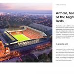](https://css-tricks.com/print-inspired-layout-on-the-web/davies-02/)

[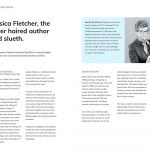](https://css-tricks.com/print-inspired-layout-on-the-web/davies-03/)

[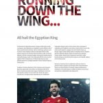](https://css-tricks.com/print-inspired-layout-on-the-web/davies-04/)

[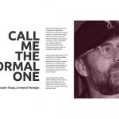](https://css-tricks.com/print-inspired-layout-on-the-web/davies-05/)

[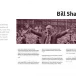](https://css-tricks.com/print-inspired-layout-on-the-web/davies-06/)

[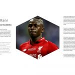](https://css-tricks.com/print-inspired-layout-on-the-web/davies-08/)

[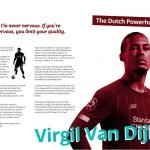](https://css-tricks.com/print-inspired-layout-on-the-web/davies-07/)

Ahmad Shadeed [rebuilt a rather complex grid layout](https://ishadeed.com/article/magazine-layout-highlights/) with bold typography inspired by an image from a book.

[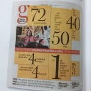](https://css-tricks.com/wp-content/uploads/2019/12/shadeed-01.jpg)

[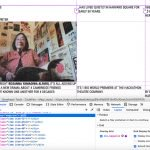](https://css-tricks.com/wp-content/uploads/2019/12/shadeed-03.jpg)

[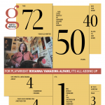](https://css-tricks.com/wp-content/uploads/2019/12/shadeed-04.png)

Facundo Corradini [built out a design](https://blog.logrocket.com/web-layouts-like-its-2020/) from The New York Times Style Magazine.

[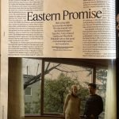](https://css-tricks.com/print-inspired-layout-on-the-web/corradini-01/)

[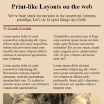](https://css-tricks.com/print-inspired-layout-on-the-web/corradini-02/)

[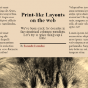](https://css-tricks.com/print-inspired-layout-on-the-web/corradini-03/)

[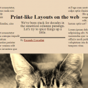](https://css-tricks.com/print-inspired-layout-on-the-web/corradini-04/)

Frederick O’Brien [compared newspaper design to web design](https://www.smashingmagazine.com/2019/11/newspapers-teach-web-design/).

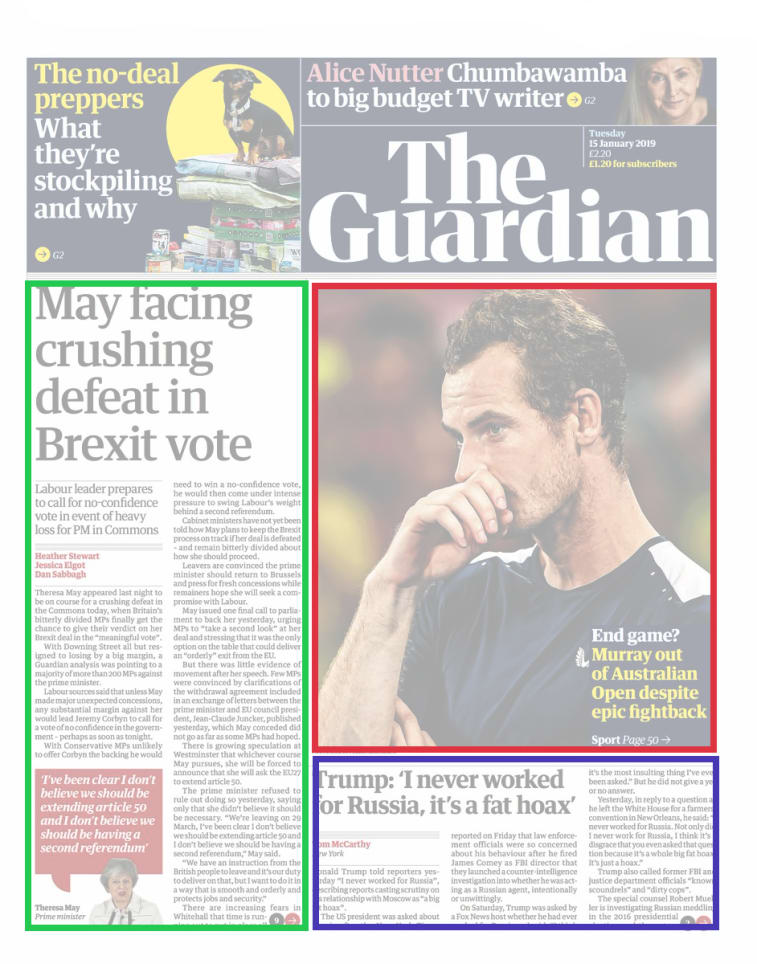

We've seen this kind of exploration before. I explored it [in this article](https://css-tricks.com/print-magazine-layouts-converted-to-web-layouts/), which is largely about the CSS tools we have to do this work better, but also includes demos like [this one I made](https://codepen.io/chriscoyier/pen/mewZzy) as well as [this one from Stuart Robson](https://codepen.io/sturobson/pen/gaGzKw).

Also:

- •Jen Simmons has been banging this drum for ages. ["Getting out of our ruts"](https://aneventapart.com/news/post/modern-layouts-getting-out-of-our-ruts-by-jen-simmons-an-event-apart-video) is a phrase she used in a presentation that hits home for me.
- •Jules Forrest has done lots of grid explorations [like this one](https://codepen.io/julesforrest/pen/oeVKjg) that appears to be highly print-inspired.
- •Raisa Yang has [explored magazine layout](https://codepen.io/raiscake/pen/YNvJao), this one using `columns`, which I don't see used all that much out in the wild but is highly inspired by print.

I think it would be fun to put together an article with all the main CSS tools we have for replicating print-like designs. I just might do that, but what might talk me out of it is the fact that it's sorta *everything* in CSS. CSS is about styling, and all styling is on the table for building unique designs.