Probability — Fundamentals of Machine Learning (Part 1)

# Probability Theory

## Fundamentals of Machine Learning (Part 1)

[William Fleshman](https://towardsdatascience.com/@william.fleshman)

Jan 29·18 min read

This is part one in a series of topics I consider fundamental to machine learning. Probability theory is a mathematical framework for quantifying our uncertainty about the world. It allows us (and our software) to reason effectively in situations where being certain is impossible. Probability theory is at the foundation of many machine learning algorithms. The goal of this post is to cover the vocabulary and mathematics needed before applying probability theory to machine learning applications. The topics covered will be built upon in future posts!

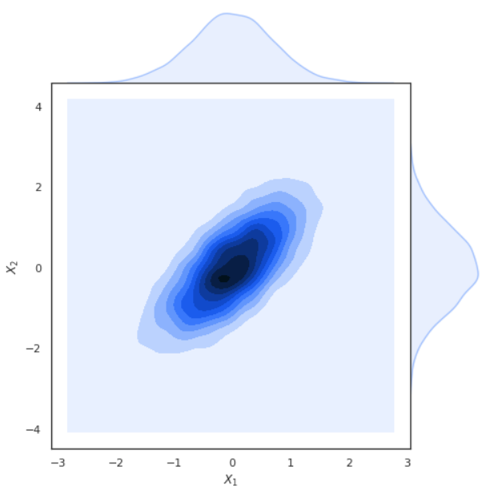

### Some Philosophy on Probability

What exactly is probability? Most people know that the probability of an event is some value between 0 and 1 which indicates how likely the event is to occur. Seems simple enough, but where do those values actually come from?

The **objectivist **perspective is that randomness is fundamental to the universe. They would say that the probability of a fair coin coming up heads is 0.5, because that’s the nature of fair coins. Alternatively, the **subjectivist **viewpoint is that probabilities represent our degree of belief that an event will occur. If we knew the initial position of the coin and how the force was applied, then we could determine with certainty if it would come up heads or tails. Under this perspective, probability is a measure of our ignorance (like not knowing how the force is applied to the coin).

Personally, I’m a subjectivist. If we have the proper measurements we should be able to predict anything with certainty. One area where this isn’t true (yet) is quantum mechanics. To understand some quantum phenomena, we have to treat them as being truly random. It’s possible that one day we will have a better understanding of how the universe works, and therefore how to properly predict these phenomena as well. It seems that Albert Einstein shares in my subjectivism:

> “God does not play dice with the universe.”

Whatever our beliefs of the true nature of randomness, we need some principled methods for actually estimating probabilities.

The **frequentist’s **position is that estimations come from experiments and experiments only. If we want to estimate how likely a six sided die is to roll a 4, we should roll the die a number of times and observe the frequency in which a 4 appears.

This method works well when we have a large amount of data, but with fewer examples we can’t be confident in our estimates. If we haven’t seen a 4 after five rolls, does that mean a 4 is impossible? The other issue is that we can’t inject any of our prior knowledge about dice into our estimates. If we knew the die was fair, not seeing a 4 in the first five rolls is completely understandable.

Another popular estimation philosophy is that of the **Bayesian**. A Bayesian treatment of probability allows us to combine our prior beliefs with our observations. Imagine that a coin we believe to be fair is flipped three times and results in three heads. A frequentist calculation would suggest the coin is loaded (although with low confidence), but our Bayesian prior that the coin is fair allows us to maintain some degree of belief that a tails is still possible. The actual mechanics of how we combine our prior belief relies on something called Bayes’ rule, which will be covered later.

* * *

*...*

### The Mathematics of Probability

In the beginning, I suggested that probability theory is a mathematical framework. As with any mathematical framework there is some vocabulary and important axioms needed to fully leverage the theory as a tool for machine learning.

Probability is all about the possibility of various outcomes. The set of all possible outcomes is called the **sample space**. The sample space for a coin flip is {heads, tails}. The sample space for the temperature of water is all values between the freezing and boiling point. Only one outcome in the sample space is possible at a time, and the sample space must contain all possible values. The sample space is often depicted as Ω (capital omega) and a specific outcome as ω (lowercase omega). We represent the probability of an event ω as P(ω).

The two basic axioms of probability are:

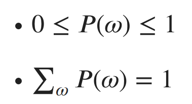

Axioms of Probability

In plain English, the probability of any event has to be between 0 (impossible) and 1 (certain), and the sum of the probabilities of all events should be 1. This follows from the fact that the sample space must contain all possible outcomes. Therefore, we are certain (probability 1) that one of the possible outcomes will occur.

A **random variable** x, is a variable which randomly takes on values from a sample space. We often indicate a specific value x can take on with italics. For example, if x represented the outcome of a coin flip, we might discuss a specific outcome as *x* = heads. Random variables can either be discrete like the coin, or continuous (can take on an uncountably infinite amount of possible values).

To describe the likelihood of each possible value of a random variable x, we specify a **probability distribution**. We write x ~ P(x) to indicate that x is a random variable which is drawn from a probability distribution P(x). Probability distributions are described differently depending on if the random variable is discrete or continuous.

#### **Discrete Distributions:**

Discrete random variables are described with a **probability mass function** (PMF). A PMF maps each value in the variable’s sample space to a probability. One such PMF is the uniform distribution over *n* possible outcomes: P(x=*x*) = 1/*n*. This reads as “The probability of x taking on the value *x* is 1 divided by the number of possible values”. It’s called the uniform distribution because each outcome is equally likely (the likelihood is spread uniformly over all possible values). Fair dice rolls are modeled by a uniform distribution since each face of the die is equally likely. A loaded die is modeled by a categorical distribution, where each outcome is assigned a different probability.

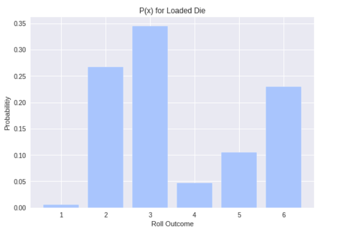

Another common discrete distribution is the Bernoulli. A Bernoulli distribution specifies the probability for a random variable which can take on one of two values (1/0, heads/tails, true/false, rain/no rain, etc.). The PMF of a Bernoulli distribution is P(*x*) = {*p *if *x* =1, and 1-*p* if *x*=0}. Therefore, we can specify the entire distribution with a single parameter *p*, the probability of the positive outcome. For a fair coin we have *p* = 0.5, and so heads or tails is equally likely. Alternatively, if we say that the probability of rain tomorrow is *p* = 0.2, then we can infer that the probability of no rain is 0.8.

#### **Continuous Distributions:**

Continuous random variables are described by **probability density functions **(PDF) which can be a bit more difficult to understand. We generally indicate the PDF for a random variable x as *f*(*x*). PDFs map an infinite sample space to relative likelihood values. To understand this, let’s look at an example with one of the most famous continuous distributions, the Gaussian (Normal) distribution.

The Gaussian distribution (colloquially called the bell curve) can be used to model several natural phenomena. For example, heights of each gender are approximately Gaussian distributed. The Gaussian distribution is parameterized by two values: the mean μ (mu) and variance σ² (sigma squared). The mean specifies the center of the distribution, and the variance specifies the width of the distribution. You may have also heard about the standard deviation σ, which is just the square root of the variance. To indicate that x is a random variable drawn from a Gaussian with mean μ and variance σ², we write:

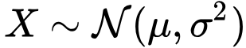
X is drawn from a Normal distribution with mean μ and variance σ².

The functional form of the PDF for the Gaussian can be intimidating at first glance. I promise that after working with Gaussian distributions in applications the fear goes away! The functional form of the PDF is:

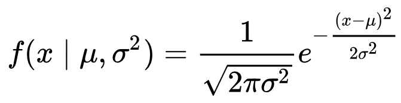

The PDF of x given μ and σ²

The left hand side of the equation says “The PDF of *x* given μ and σ² ”. The vertical bar represents the word “given” and indicates that we already know all of the values after it in the parenthesis . Let’s plot this equation given μ = 0 and σ² = 4:

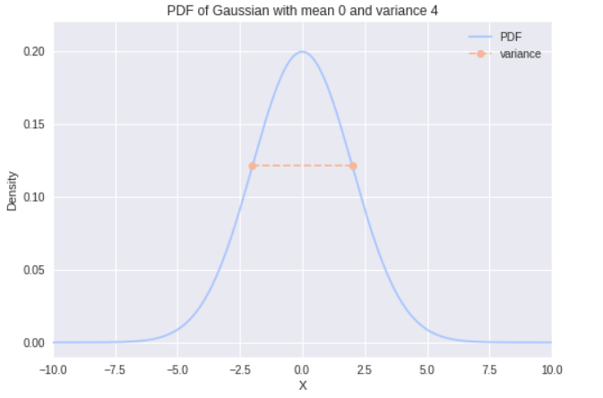

So what do I mean by relative likelihoods? Unlike discrete distributions, the value of the PDF at x = *x* is not the actual probability of *x*. This is a common misconception when people first start dabbling with probability theory. Since there are infinitely many values that x could take on, the probability of x taking on any specific value is actually 0! I’m guessing you don’t believe me, but let’s think about it together while we revisit our axioms.

Recall that the total probability for every possible value needs to sum to 1. How do we sum over an infinite number of values? The answer comes from calculus in the form of the integral. We can rewrite our axiom in terms of the PDF using the integral:

The integral of the PDF over the sample space is 1.

If you aren’t familiar with calculus, the integral is an operator which calculates the area under the curve *f*(*x*). It’s a generalization of the summation to an infinite amount of values. So the area under the PDF represents the total probability of the Gaussian! If you are familiar with calculus (and feel up to it) you can calculate the integral of the Gaussian yourself to confirm that the area is 1.

Because the area is what we’re interested in, it’s often more useful to work with a continuous random variable’s **cumulative distribution function** (CDF). We write the CDF, *F*(*x*) as:

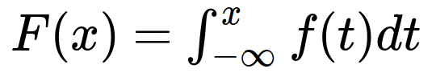

CDF is a function of the integral of the PDF.

What in the world does that mean? Well, for a given value *x*, we’re taking the integral of the PDF from negative infinity to that value. So *F*(*x*) gives us the the area under the PDF for the interval negative infinity to *x*.

We just determined that the area corresponds to the probability, so *F*(*x*) gives us P(x≤*x*). Now, we can use the CDF to determine the probability of any given range [*a*,*b*] by noticing that P(*a*≤x≤*b*) = *F*(*b*)-*F*(*a*). This answers the question, “What is the probability that x will be between *a* and *b?”*.

Asking for P(x=*x*) is equivalent to asking P(*x*≤x≤*x*) = F(*x*)-F(*x*) = 0. So there you have it, the probability of sampling a specific number from the distribution is 0! (Stronger arguments could be made by actually taking the limit). Here’s the CDF for the same Gaussian from before:

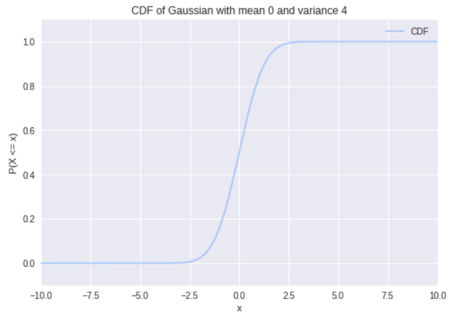

We see that the probability of x taking on values less than -2.5 is nearly 0. We also see that the values sampled from x will mostly be less than 2.5.

* * *

*...*

#### **Joint Probability Distributions:**

A distribution over multiple random variables is called a **joint probability distribution**. We can write a collection of random variables as a vector **x**. A joint distribution over **x **specifies the probability of any particular setting of all the random variables contained in **x**. To make this more clear, let’s consider two random variables x and y. We write the joint probability as P(x=*x*, y=*y*) or just P(*x*, *y*) for short. I say this out loud as “The probability that x=*x* and y=*y*”. If both random variables are discrete, we can represent the joint distribution as a simple table of probabilities. For example, let’s consider the joint distribution of which outer garment I wear with the weather conditions (in a universe where these are the only options):

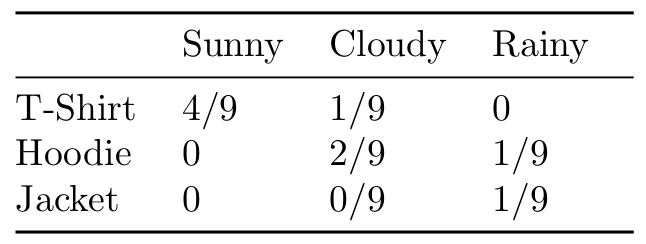

Joint Distribution of clothes and weather (in an odd universe)

This toy example highlights a few important things. First, I’m terrible at making toy examples. Second, notice that the table meets the requirements laid out by our axioms. We can immediately answer questions of the form P(clothes=T-Shirt, weather=Sunny), but joint distributions give us so much more!

#### **Marginal Probability Distributions:**

First, let’s look at the **sum rule**:

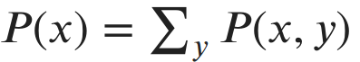
Sum Rule

The term P(*x*) is called the **marginal probability distribution**, since we’ve “marginalized” away the random variable y. Let’s use the sum rule to calculate the probability I’ll wear a hoodie. P(Hoodie) = P(Hoodie, Sunny) + P(Hoodie, Cloudy) + P(Hoodie, Rainy) = 3/9. We could use the same process to find the marginal probability of any of the clothing items or any weather condition.

If P(*x*, *y*) was a joint distribution over continuous random variables, then to marginalize out y we turn the summation into an integration over y just like before.

#### **Conditional Probability Distributions:**

We’re also often interested in the probability of an event given that another event has already been observed. We denote the **conditional probability distributions **of x given y as:

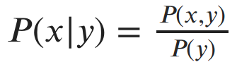
Probability of x conditioned on observing y

In other words, if I’ve observed that y=*y*, then the probability that x=*x* is P(*x, y*)/P(*y*). Why does observing y change the probability of x? Well, imagine you saw me walk inside with a jacket on. Knowing that I’m wearing a jacket gives you information about the weather without observing the weather directly.

Note that the conditional probability only exists if P(*y*) > 0. If it’s impossible for *y* to occur, then we couldn’t have observed *y *to begin with.

By multiplying both sides of the last equation by P(*y*) we get the **chain rule** of probability, P(*x, y*) = P(*x*|*y*) ⋅ P(*y*). The chain rule can be generalized to joint distributions with any number of random variables: P(*x, y, z*) = P(*x*|*y, z*) ⋅ P(*y, z*) = P(*x*|*y, z*) ⋅ P(*y*|*z*) ⋅ P(*z*).

#### **Bayes’ Rule:**

Notice that we can write the chain rule for two variables in two equivalent ways:

- •P(*x, y*) = P(*x*|*y*) ⋅ P(*y*)
- •P(*x, y*) = P(y|*x*) ⋅ P(*x*)

If we set both right sides equal to each other and divide by P(*y*), we get Bayes’ rule:

Bayes Rule

Bayes’s rule is crucially important to much of statistics and machine learning. As alluded to earlier, it’s the driving force behind Bayesian statistics. This simple rule allows us to update our beliefs about quantities as we gather more observations from data. I’ll definitely discuss Bayes’ rule (and Bayesian statistics) some more in a later post.

#### **Independence and Conditional Independence:**

In the previous example, we saw that P(*x|y*) ≠ P(*x*) because observing *y* gave us information about *x*. Is this always the case? Let’s imagine that P(*x, y*) is a joint distribution with x representing the amount of ice cream in a store and y representing the number of times per day that the moon is struck by an object. Does knowing either value give us any information about the other? Of course not! So in this case P(*x|y*) = P(*x*)! By plugging this into the chain rule, we find that in this scenario we get P(*x, y*) = P(*x|y) ⋅ P(*y*) = P(x*) ⋅ P(*y*). This leads us directly to our definition of** independence**. Two variables x and y are said to be independent if P(*x, y*) = P(*x*) ⋅ P(*y*).

A similar concept is that of **conditional independence**. Two variables x and y are called conditionally independent given another variable z if P(*x, y|z*) = P(*x|z*) ⋅ P(*y|z*). Let’s do an example to see what this is all about.

Let’s assume x is a random variable indicating whether I brought an umbrella to work, and y is a random variable indicating whether my grass is wet. It seems pretty obvious that these events are not independent. If I brought an umbrella it probably means it’s raining, and if it’s raining my grass is wet. Now let’s assume we observe variable z, which represents that it is in fact raining outside. Now, regardless of whether I brought an umbrella to work, you know that my grass is wet. So the condition of rain has made my umbrella independent of my grass being wet!

Independence and conditional independence become very important when we need to represent very large joint distributions. Independence let’s us factor our distribution into simpler terms, enabling efficient memory usage and faster calculations. We’ll see this concretely in a future post on Bayesian Networks!

* * *

*...*

### Functions of Random Variables

It’s often useful to create functions which take random variables as input. Let’s consider a trip to the casino. It costs $2 to play my favorite game “guess a number between 1 and 10”. If you guess correctly you win $10. If you guess incorrectly you win nothing. Let x be a random variable indicating whether you guessed correctly. Then we can write a function* h*(*x*) = {$8 if *x *= 1, and -$2 if *x* = 0}. In other words, if you guess right you get $10 minus the $2 you paid to play, otherwise you just lose your $2. You might be interested in knowing in advance what the expected outcome will be.

#### **Expectation:**

The expected value, or** expectation,** of a function *h*(x) on a random variable x ~ P(x) is the average value of *h*(*x*) weighted by P(x). For a discrete x, we write this as:

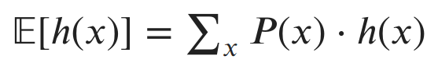
Expected Value of h(x) with respect to P(x)

If x had been continuous, we would replace the summation with an integral (I’ll bet you’re seeing a pattern by now). So the expectation acts as a weighted average over *h*(*x*), where the weights are the probabilities of each *x*.

What’s the expected value of playing the guessing game at the casino if we assume we have a 1/10 chance of guessing the correct number?

[*h*(x)] = P(winning) ⋅ *h*(winning) + P(loosing) ⋅ *h*(loosing)= (1/10) ⋅ $8 + (9/10) ⋅ (-$2) = $0.80 + (-$1.80) = -$1. So on average, we’ll loose $1 every time we play!

Another nice property of expectations is that they’re linear. Let’s assume *g *is another function of x, and α and β are constants. Then we have:

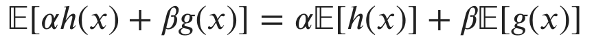
Expectations are linear

#### **Variance and Covariance:**

We saw variance with respect to a Gaussian distribution when we were talking about continuous random variables. In general, **variance** is a measure of how much random values vary from their mean. Similarly, for functions of random variables, the variance is a measure of the variability of the function’s output from its expected value.

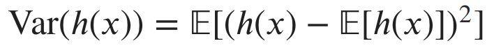
Variance of h(x) with respect to P(x)

Another important concept is **covariance**. Covariance is a measure of how linearly related two random variables (or functions on random variables) are with each other. The covariance between functions *h*(x) and *g*(y) is written as:

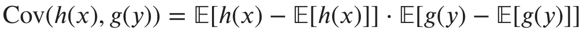
Covariance between h(x) and g(y).

When the absolute value of covariance is high, the two functions tend to vary far from their means at the same time. When the sign of the covariance is positive, the two functions map to higher values together. If the sign is negative, one function maps to higher values, while the other function maps to lower values and vice versa. The visualization at the beginning of this post shows samples from a joint Gaussian distribution with positive covariance between the variables. You can see that as the first variable increases, so does the second.

#### Moments:

Note that we can calculate the expectation and variance for a random variable by replacing the function *h*(x) with x itself. The expectation of a distribution is its mean, or first moment. The variance of a distribution is its second moment. Higher order moments for probability distributions capture other characteristics like skewness and kurtosis.

* * *

*...*

### Important Distributions

We’ve covered most of the important aspects of probability theory. These ideas act as building blocks for developing the underpinnings of the majority of statistics and machine learning. In order to master probability theory and start bridging the gap toward statistics, one needs to become somewhat familiar with the more useful probability distributions.

The functional forms of probability distributions can be intimidating. My advice is to not focus too much on that aspect and instead focus on what types of situation each distribution is good at modeling. Some examples of model/purpose descriptions include:

- •Bernoulli: models the outcome of coin flips and other binary events
- •Binomial: models a series of Bernoulli trials (a series of coin flips, etc.)
- •Geometric: models how many flips necessary before you get a success
- •Multinomial: a generalization of the Binomial to more than two outcomes (like a die roll)
- •Poisson: models the number of events that occur in a certain interval

For continuous distributions it’s also useful to know the shape. For example, we saw that the Gaussian distribution is shaped like a bell, with most of its density close to the mean. The Beta distribution can take on a wide range of shapes over the interval [0,1]. This makes the Beta distribution a good choice for modeling our beliefs about particular probabilities.

It’s also important to remember that these well formed distributions are more like templates than anything else. The true distribution of your data is probably not so nice and may even be changing over time.

* * *

*...*

### Great, but what’s all this have to do with Machine Learning?

The goal of this post was to build up our language of probability so that we can frame machine learning in a probabilistic light. I’ll cover specific machine learning algorithms and applications in future posts, but I’d like to describe a bit of what we’ve just enabled.

#### **Supervised Learning:**

In supervised machine learning, our goal is to learn from labeled data. Data being labeled means that for some inputs X, we know the desired outputs Y. Some possible tasks include:

- •Identify what’s in an image.
- •Predict the price of a stock given some features about the company.
- •Detect if a file is malicious.
- •Diagnose a patient with an illness.

How can probability help us in these scenarios? We can learn a mapping from X to Y in various ways. First, you could learn P(Y|X), that is to say, a probability distribution over possible values of Y given that you’ve observed a new sample X. Machine learning algorithms that find this distribution are called **discriminative**. Imagine I tell you that I saw an animal that had fur, a long tail, and was two inches tall. Can you discriminate between possible animals and guess what it was?

Photo by [Ricky Kharawala](https://unsplash.com/@sweetmangostudios?utm_source=medium&utm_medium=referral) on [Unsplash](https://unsplash.com/?utm_source=medium&utm_medium=referral)

Alternatively, we could instead try to learn P(X|Y), the probability distribution over inputs given labels. Algorithms for doing this are called **generative**. Given that I want a mouse, can you describe the possible heights, furriness, and length of tails that mice have? Enumerating the possible values for the features is sort of like generating all possible mice.

You may be wondering how knowing a generative model would help us with our task of classifying animals? Remember Bayes’ Rule? From our training data we can learn P(Y), the probability of any specific animal, and P(X), the probability of any specific configuration of the features. Using these terms we can answer queries in the form of P(Y|X) using Bayes’ Rule.

It’s possible to learn a mapping from X to Y which isn’t in the form of a probability distribution. We could fit a deterministic function *f *to our training data such that *f*(*X*) ≈ Y. What makes having a distribution better? Well, imagine an algorithm is diagnosing your illness, and it tells you that you have a month left to live. The function *f* can’t express to you how confident it is in the assessment. Maybe you have features that the algorithm never saw in the training data, causing it to more or less guess an outcome. The probabilistic model **quantifies uncertainty**, the regular function does not.

#### Unsupervised Learning:

Unsupervised learning is a broad set of techniques for learning from unlabeled data, where we just have some samples X but no output Y. Common unsupervised tasks include:

- •Grouping similar data points together (clustering).
- •Taking high dimensional data and projecting it into a meaningful lower dimensional space (dimension reduction, factor analysis, embedding).
- •Representing the data with a distribution (density estimation).

Characterizing the distribution of unlabeled data is useful for many tasks. One example is anomaly detection. If we learn P(X), where X represents normal bank transactions, then we can use P(X) to measure the likelihood of future transactions. If we observe a transaction with low probability, we can flag it as suspicious and possibly fraudulent.

Clustering is one of the canonical problems of unsupervised learning. Given some data points originating from separate groups, how can we determine which group each point belongs? One method is to assume that each group is generated from a different probability distribution. Solving the problem then becomes finding the most likely configuration of these distributions.

Dimension reduction is the other main area of unsupervised learning. High dimensional data takes up memory, slows down computations, and is hard to visualize and interpret. We’d like to have ways of reducing the data to a lower dimension without loosing too much information. One can think of this problem as finding a distribution in a lower dimensional space with similar characteristics to the distribution of the original data.

#### Reinforcement Learning:

The field of reinforcement learning is all about training artificial agents to perform well at specific tasks. The agents learn by taking actions in their environment and observing reward signals based on their behavior. The goal of the agent is to maximize its expected long term reward. Probability is used in reinforcement learning for several aspects of the learning process. You may have picked up on the word “expected” in the goal. The agent’s learning process often revolves around quantifying the uncertainty of the utility of taking one specific action over another.

* * *

*...*

### Conclusion

This has been a gentle overview of the language of probability theory with a brief discussion on how we will apply these concepts to more advanced machine learning and statistics moving forward. Be sure to check out part two on Maximum Likelihood Estimation:

[**Maximum Likelihood Estimation** *Fundamentals of Machine Learning (Part 2)*towardsdatascience.com](https://towardsdatascience.com/maximum-likelihood-estimation-984af2dcfcac)[(L)](https://towardsdatascience.com/maximum-likelihood-estimation-984af2dcfcac)

If you’d like to tackle probability theory from another angle, I highly recommend checking out this amazing visual introduction from Seeing Theory:

[**Seeing Theory** *A visual introduction to probability and statistics.*seeing-theory.brown.edu](https://seeing-theory.brown.edu/)[(L)](https://seeing-theory.brown.edu/)

See you next time!