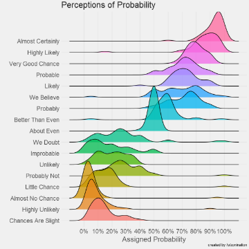

Probable more likely than probably

Probable more likely than probably

https://blog.revolutionanalytics.com/2017/08/probably-more-probably-than-probable.html

What kind of probability are people talking about when they say something is "highly likely" or has "almost no chance"? The chart below, created by Reddit user zonination, visualizes the responses of 46 other Reddit users to "What probability would you assign to the phase: <phrase>" for various statements of probability. Each set of responses has been converted to a kernel destiny estimate and presented as a joyplot using R. Somewhat surprisingly, the results from the Redditors hew quite closely to a simi