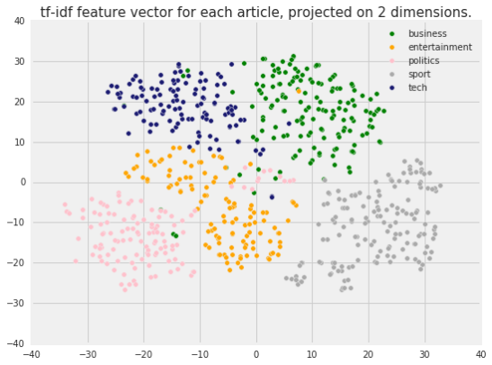
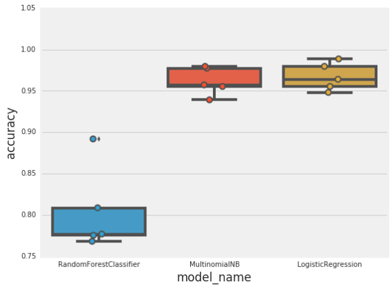
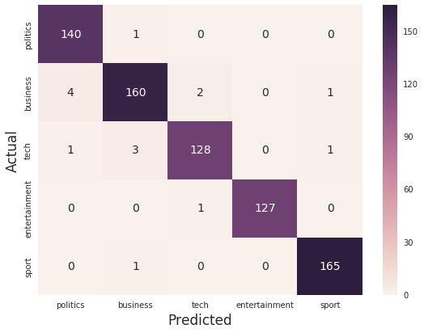

Problem-solving with ML: automatic document classification | Google Cloud Big Data and Machine Learning Blog  |  Google Cloud Platform

# Problem-solving with ML: automatic document classification

Wednesday, January 10, 2018

*By Ahmed Kachkach, Software Engineer*

Text documents are one of the richest sources of data for businesses: whether in the shape of customer support tickets, emails, technical documents, user reviews or news articles, they all contain valuable information that can be used to automate slow manual processes, better understand users, or find valuable insights. However, traditional algorithms struggle at processing these unstructured documents, and this is where machine learning comes to the rescue!

In this blog post, we will show how off-the-shelf ML tools can be used to automatically label news articles. The approach we’ll describe can be used in any task related to processing text documents, and even to other types of ML tasks. We will also learn how data can be extracted and pre-processed, how we can make some initial observations about it, how to build ML models, and—last but not least—how to evaluate and interpret them.

We’ll use a public dataset from the BBC comprised of 2225 articles, each labeled under one of 5 categories: business, entertainment, politics, sport or tech. Our goal will be to build a system that can accurately classify previously unseen news articles into the right category.

The Python code used in this article and some accompanying text and plots are available as a [Colab notebook](https://colab.research.google.com/notebook#fileId=1JW2I6cU_ypfRXfIfqMPQwMEA6LzGav-Y).

### Data extraction and exploration

**Loading data**

Data is the essential resource for any ML project. Fortunately, there are plenty of datasets freely available in [Google BigQuery Public Datasets](https://cloud.google.com/bigquery/public-data/).

For this blog post, we’ll use the BBC News dataset. It can either be extracted from BigQuery and exported to CSV, or directly [downloaded from its original source](http://mlg.ucd.ie/datasets/bbc.html).

Here is a sample from this dataset:

|     |     |     |     |
| --- | --- | --- | --- |
| **category** | **filename** | **title** | **content** |
| politics | 385.txt | UK pledges £1bn to vaccine effort | UK pledges £1bn to vaccine effort UK Chance... |
| sport | 270.txt | Strachan turns down Pompey | Strachan turns down Pompey Former Southampt... |
| tech | 059.txt | Mobiles 'not media players yet' | Mobiles 'not media players yet' Mobiles are... |
| entertainment | 059.txt | Sky takes over Oscar night mantle | Sky takes over Oscar night mantle Sky has s... |
| tech | 368.txt | Net fingerprints combat attacks | Net fingerprints combat attacks Eighty larg... |

We use [pandas](http://pandas.pydata.org/) to load this as a [DataFrame](https://pandas.pydata.org/pandas-docs/stable/generated/pandas.DataFrame.html), and add an integer category_id (which will be handy later on):

import pandas as pd
    df = pd.load_csv(“bbc-news.csv”)
    df[‘category_id’]= df.category.factorize()[0]

The DataFrame is a useful data structure, first popularized by the [R](https://cran.r-project.org/) language, that allows us to easily transform and navigate our dataset in an efficient manner.

**Data analysis**

Before diving head-first into training machine learning models, we should become familiar with the structure and characteristics of our dataset: these properties might inform our problem-solving approach.First, it’s always useful to look at the number of documents per class:

Here, we see that the number of articles per class is roughly balanced, which is helpful! If our dataset were imbalanced, we would need to carefully configure our model or artificially balance the dataset, for example by [undersampling or oversampling](https://en.wikipedia.org/wiki/Oversampling_and_undersampling_in_data_analysis) each class.

To further analyze our dataset, we need to transform each article's text to a [feature vector](https://en.wikipedia.org/wiki/Feature_vector), a list of numerical values representing some of the text’s characteristics. This is because most ML models cannot process raw text, instead only dealing with numerical values.

One common approach for extracting features from text is to use the [bag of words](https://en.wikipedia.org/wiki/Bag-of-words_model) model: a model where for each document, an article in our case, the presence (and often the frequency) of words is taken into consideration, but the order in which they occur is ignored.

Specifically, for each term in our dataset, we will calculate a measure called *Term Frequency, Inverse Document Frequency*, abbreviated to [tf-idf](https://en.wikipedia.org/wiki/Tf%E2%80%93idf). This statistic represents words’ importance in each document. We use a word's frequency as a proxy for its importance: if "football" is mentioned 25 times in a document, it might be more important than if it was only mentioned once. We also use the document frequency (the number of documents containing a given word) as a measure of how common the word is. This minimizes the effect of stop-words such as pronouns, or domain-specific language that does not add much information (for example, a word such as "news" that might be present in most documents).

We’ll use `sklearn` (also known as `scikit-learn`), a machine learning library that is particularly accessible to beginners. Within `sklearn`, we’ll use the `[TfidfVectorizer](http://scikit-learn.org/stable/modules/generated/sklearn.feature_extraction.text.TfidfVectorizer.html)` class to calculate a `tf-idf` vector for each of our documents:

from sklearn.feature_extraction.text import TfidfVectorizer

tfidf = TfidfVectorizer(sublinear_tf=True, min_df=5, norm='l2', encoding='latin-1', ngram_range=(1, 2), stop_words='english')

features = tfidf.fit_transform(df.content).toarray()
labels = df.category_id

Note that we pass some additional parameters to the tfidf class: setting `sublinear_tf` means that we will use the log of the frequency, as word frequencies follow an exponential distribution (see [Zipf law](https://en.wikipedia.org/wiki/Zipf%27s_law)), we normalize our vectors to [l2 norm](https://en.wikipedia.org/wiki/Norm_(mathematics)#Euclidean_norm) so that the length of a document does not bias its representation, and we also consider bigrams (pairs of words) as these might carry a different meaning than each of their components separately (e.g “box office” vs “box” and “office”).

The resulting features variable contains one row of numerical features (each representing the `tf-idf` for a word or pair of words) for each of our documents. This representation is not only useful for solving our classification task, but also to familiarize ourselves with the dataset. For example, we can use the [chi-squared test](https://en.wikipedia.org/wiki/Pearson%27s_chi-squared_test) to find the terms are the most correlated with each of the categories:

# 'business':

 . Most correlated unigrams:
      . oil
      . growth
      . shares
 . Most correlated bigrams:
      . analysts said
      . economic growth
      . stock market

# 'entertainment':

 . Most correlated unigrams:
      . singer
      . actor
      . film
 . Most correlated bigrams:
      . los angeles
      . film festival
      . box office
…

We can also use dimensionality reduction techniques, such as [PCA](https://en.wikipedia.org/wiki/Principal_component_analysis) or [t-SNE](https://en.wikipedia.org/wiki/T-distributed_stochastic_neighbor_embedding) to project our high dimensional tf-idf features into a 2D plane, where they can be visualized. This is done by finding a projection that minimizes the information lost (PCA) or keeps nearby points in the high-dimensional space close to each other in the projected space (t-SNE). Below is the result of clustering a third of the articles in our dataset using t-SNE:

Good news: we can clearly see that different article categories fall in different areas, which means that we should expect highly accurate classification performance.One thing to note, however, is the presence of some outliers: articles from one category appearing within the bounds of a different category. Upon closer inspection, these seem to be articles that are difficult to classify even by hand, for example articles about two topics at once (e.g., an article about the football club Arsenal seeking to be listed on the London Stock Exchange).

### Model training and evaluation

With this initial data exploration achieved, we are now more familiar with the way data is represented, and relatively confident that machine learning is a good fit to solve our classification problem. We are now ready to experiment with different machine learning models, evaluate their accuracy, and tweak our model to avoid any potential issues.

**Metrics**

First, it is vital to choose which metric to optimize for. Accuracy (the percentage of correct classifications) is the most commonly used metric, but it is not always the right choice: if we are trying to detect fraudulent monetary transactions, which might constitute less than 0.01% of the total transactions, a model that would classify all users as being non-fraudulent would have 99.99% accuracy! Because of this, we need to carefully choose our metrics.

Here, we are dealing with a multi-class classification task (assigning a label out of multiple possible values). Given the relative balance of our dataset, accuracy would be an appropriate metric. If one of the labels was more important than the others, we could look at [Precision and Recall](https://en.wikipedia.org/wiki/Precision_and_recall) for each class, or use the [ROC curve](https://en.wikipedia.org/wiki/Receiver_operating_characteristic), and optimize the Area Under the Curve (ROC AUC).

**Choice of model**

scikit-learn provides implementations for a large number of machine learning models, spanning a few different families:

- **Linear models**: Linear Regression, Logistic Regression, ...
- **Ensemble models**: Random Forest, Gradient Boosting Trees, Adaboost, ...
- **Bayesian models**: (Multinomial/Gaussian/...) Naive Bayes, Gaussian Processes, ...
- Support Vector Machines, k-Nearest Neighbors, and various other models.

scikit-learn, on the other hand, does not implement deep learning models or more specialized models, such as Bayesian graphical models or sequenced-based models. For those, you’ll have to use specialized libraries such as `tensorflow`, `keras` or `hmmlearn`.

Ultimately, no model is universally superior to all other models, and the performance of a model greatly depends on the the data used and the nature of the classification/prediction problem solved. This is known as the [No Free Lunch Theorem](https://en.wikipedia.org/wiki/No_free_lunch_theorem).

Now, let’s benchmark the following three models:

- **Logistic Regression**: A linear classifier, mostly similar to traditional linear regression, but that fits the output of the logistic function.
- **(Multinomial) Naive Bayes**: A Bayesian model that assumes total independence between features. In our case, this means that P("football") is unrelated to P("stadium"), which of course is a terrible assumption. Still, this model works surprisingly well with the Bag of Words model, and has notably been used for spam detection.
- **Random Forest**: Random Forest (as the name might suggest) is the [ensembling](https://www.kaggle.com/wiki/Ensembling) of a large number of decision trees, each trained on a random subset of the input features. They work well when complex feature-relations are involved and are relatively robust to overfitting.

We usually also perform a hyperparameter search for each model: tuning each of its "knobs" (number of trees for Random Forest, penalty for Logistic Regression) until we find the optimal ones. For simplicity, we skip this step below and directly provide reasonably good parameters for each model.

**Model evaluation**

One common mistake when evaluating a model is to train and test it on the same dataset: this is problematic because this will not evaluate how well the model works in realistic conditions, on unseen data, and models that overfit to the data will seem to perform better.

It is common practice to split the data in three parts:

- A training set that the model will be trained on.
- A validation set used for finding the optimal parameters (as discussed previously).
- A test set to evaluate the model’s performance.

Since we are not performing a hyperparameter search, we will only use a train/test split.To evaluate each model, we will use the [K-fold](http://scikit-learn.org/stable/modules/generated/sklearn.model_selection.KFold.html)  [cross-validation](https://en.wikipedia.org/wiki/Cross-validation_(statistics)) technique: iteratively training the model on different subsets of the data, and testing against the held-out data. scikit-learn provides a utility function (cross_val_score) that allows us to run this operation in a single line of code!

We evaluate our models using this technique (with five validation folds) to obtain the following results:

The results for the Random Forest model show a large variance, the sign of a model that is overfitting to its training data. Running cross-validation is vital, because results from a single train/test split might be misleading.We also notice that both [Multinomial Naive Bayes](http://scikit-learn.org/stable/modules/generated/sklearn.naive_bayes.MultinomialNB.html) and [Logistic Regression](http://scikit-learn.org/stable/modules/generated/sklearn.linear_model.LogisticRegression.html) perform extremely well, with Logistic Regression having a slight advantage with a median accuracy of around 97%!With such results, we could just pack our things and consider the task complete, but it’s good to apply a healthy dose of skepticism, especially when results are this good.

### Model interpretation

It’s not enough to have a model that performs well according to a given metric: we must also have a model that we can understand and whose results we can explain.We will start by training our model on part of the dataset, and then analyze the main sources of misclassification on the test set. One way to eliminate sources of error is to look at the [confusion matrix](https://en.wikipedia.org/wiki/Confusion_matrix), a matrix used to show the discrepancies between predicted and actual labels.

Given the very high accuracy of our model, almost all the predictions end up on the diagonal (predicted label = actual label), right where we want them to be!

Let’s examine the misclassified examples:
'business' predicted as 'politics' : 2 examples.

|     |     |
| --- | --- |
| **title** | **content** |
| Crossrail link 'to get go-ahead' | Crossrail link 'to get go-ahead' The £10bn ... |
| Golden rule boost for Chancellor | Golden rule boost for Chancellor Chancellor... |

'tech' predicted as 'business' : 5 examples.

|     |     |
| --- | --- |
| **title** | **content** |
| US duo in first spam conviction | US duo in first spam conviction A brother a... |
| PC ownership to 'double by 2010' | PC ownership to 'double by 2010' The number... |
| Argonaut founder rebuilds empire | Argonaut founder rebuilds empire Jez San, t... |
| US duo in first spam conviction | US duo in first spam conviction A brother a... |
| Games maker fights for survival | Games maker fights for survival One of Brit... |

'politics' predicted as 'tech' : 2 examples.

|     |     |
| --- | --- |
| **title** | **content** |
| MPs issued with Blackberry threat | MPs issued with Blackberry threat MPs will ... |
| MPs issued with Blackberry threat | MPs issued with Blackberry threat MPs will ... |

Most of these examples are at the intersection of the ground truth category and the one predicted,  which means even humans would struggle to classify them. This sort of noise is expected, and it is often unrealistic to aim for a model that achieves 100% accuracy.

We can look deeper into how the model works by determing which terms contribute the most to a document’s classification in each of the categories:

. 'business':
  . Top unigrams:
      . firm
      . company
      . bank
      . market
 . Top bigrams:
      . oil prices
      . economic growth
      . stock market
      . **analysts said** . 'entertainment':
 . Top unigrams:
      . film
      . singer
      . music
      . band
 . Top bigrams:
      . box office
      . new york
      . los angeles
      . big brother
. 'politics':
 . Top unigrams:
      . labour
      . party
      . mr
      . election
 . Top bigrams:
      . mr blair
      . tony blair
      . general election
      . prime minister
. 'sport':
 . Top unigrams:
      . cup
      . match
      . coach
      . season
  . Top bigrams:
      . **year old**       . australian open
      . world cup
      . **bbc sport** . 'tech':
  . Top unigrams:
      . users
      . technology
      . computer
      . software
  . Top bigrams:
      . **said mr**       . **news website**       . mobile phone
      . **bbc news**

This output seems consistent with the terms we would expect, with the exception of the terms in bold, especially in the "tech" category, that are either more reflective of the editorial style ("**said mr**" or "**analysts said**") of each category, or even explicit bigrams (such as "**bbc news**", "**news website**" or "**bbc sport**") that are among the most predictive for different categories.

We can confirm that although unrelated to technology, more than 81% of articles containing the bigram "news website" are ‘tech’ articles. This is called a [data leakage](https://www.kaggle.com/wiki/Leakage), which occurs when information about the label we want to predict is accidentally added to the training set. In this specific case, our model still works equally well when excluding the leaky terms, but it's always good to be skeptical when a model performs much better than expected. Accordingly, a robust approach requires an interpretable model instead of black-boxes that might work very well on the test set, but fail on unseen data.

### Conclusion

Using off-the-shelf tools and simple models, we solved a complex task, that of document classification, which might have seemed daunting at first! To do so, we followed steps common to solving any task with machine learning:

1. Load and pre-process data.
2. Analyze patterns in the data, to gain insights.
3. Train different models, and rigorously evaluate each of them.
4. Interpret the trained model.

Each of these steps comes with a number of pitfalls to avoid, and although we tried to cover as many of those, different tasks (such as those involving regression, sequential data, images, etc) come with their own challenges.

To learn more about these topics, check out the following posts: