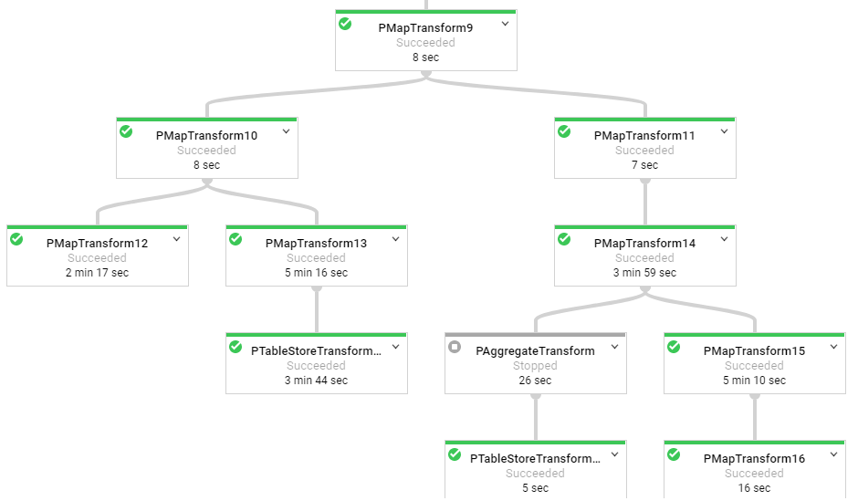
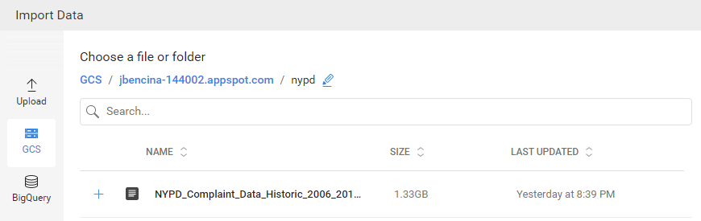
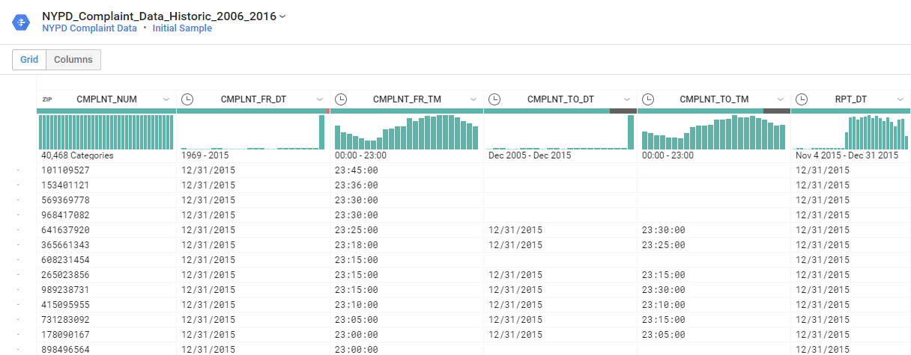
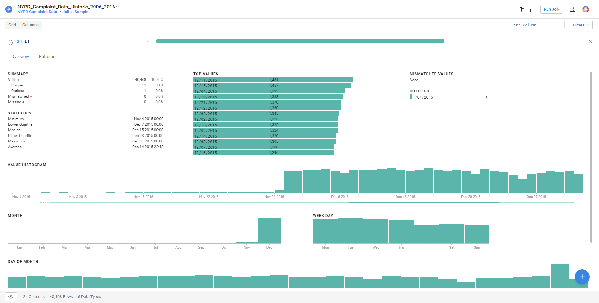
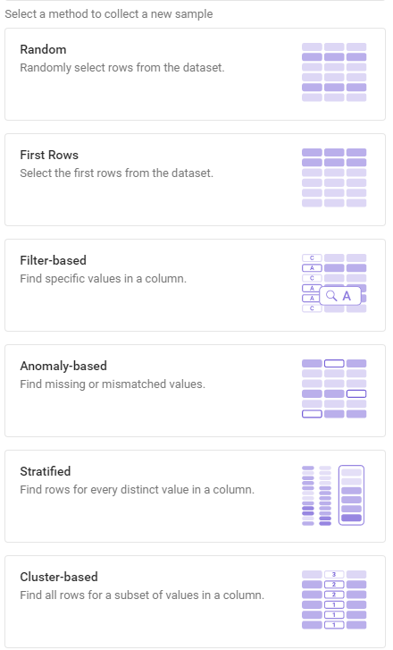
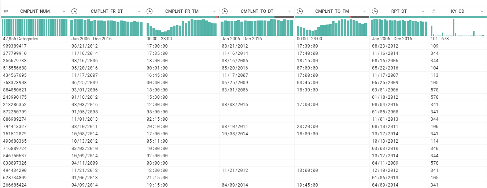
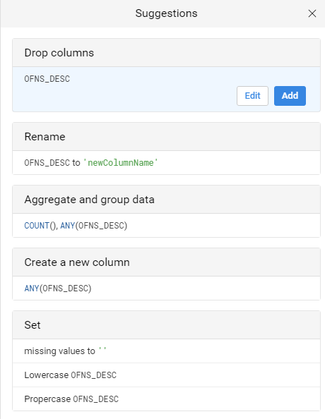
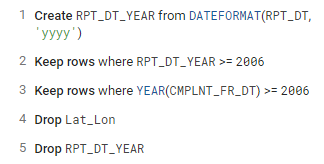
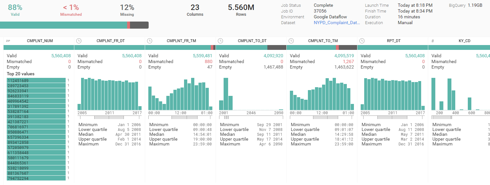
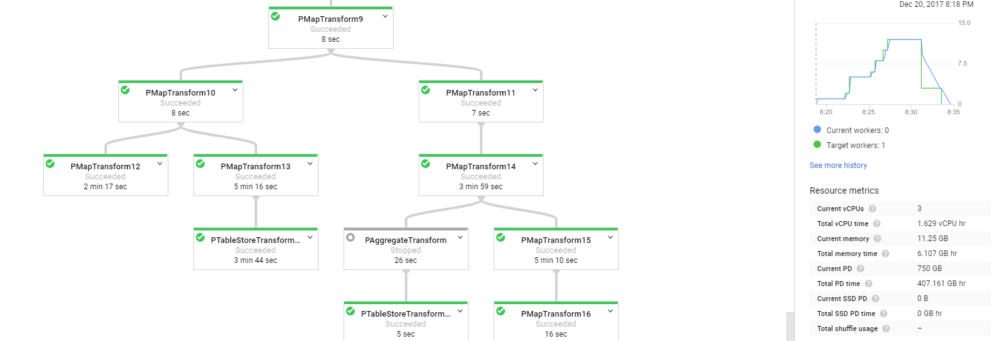

Processing data with Google Cloud Dataprep – Data Insights – Medium

# Processing data with Google Cloud Dataprep

[John Bencina](https://medium.com/@jbencina)
Dec 21, 2017·6 min read

A few months ago, Google launched its [Cloud Dataprep](https://cloud.google.com/dataprep/) service (still in beta) which is intended to be a serverless solution for prepping and exploring data before analysis. Unlike [Cloud Dataflow](https://cloud.google.com/dataflow/), this service doesn’t involve any coding. Under the hood, this is essentially an [implementation of Trifacta](https://www.trifacta.com/blog/data-preparation-solution-google-trifacta/). I saw some neat demo videos and decided to try out the service without reading much into it beforehand.

For testing out Cloud Dataprep, I’ll be working with the [NYPD Historic Complaint data](https://data.cityofnewyork.us/Public-Safety/NYPD-Complaint-Data-Historic/qgea-i56i) released by NYC on their open data platform. The data contains 5.58 million crimes reported to the NYPD between 2006 and 2016 and downloads as a 1.3GB CSV file. Something like this isn’t *that* big that it wouldn’t load straight into Pandas (it does easily), but it’s still a sizable example to work with.

**TL;DR** — Cloud Dataprep is still in beta but will likely get more robust in the coming months. For the right data tasks, Dataprep is definitely useful, especially for data teams in enterprise environments. Not so useful for the analyst at home on most tasks.

### Loading the data

In Cloud Dataprep, I start by defining a dataset. This can be data from a direct file upload, Google Cloud Storage (GCS), or Google BigQuery. I had already uploaded the NYPD crime data to GCS so I just had to navigate to the folder and select the right file.

### Creating the data flow

Once the dataset is created, I’m ready to create a data flow. Data flows are a series of ETL steps which Google calls “recipes”. Before creating the first recipe, I added the NYPD dataset to the data flow and inspected it.

Cloud Dataprep automatically creates this neat dashboard which quickly lets you visualize the data in all of your columns. The indicators show distributions, missing values, and data types. For any column you can drill in for additional details.

I immediately noticed something was wrong. I knew the data set I had loaded was supposed to cover crime reports from 2006 to 2016, yet the distribution chart showed only 2015 data for the RPT_DT column. Drilling deeper into the statistics of this column, I confirmed the charts only had partial year 2015. What was going on?

The answer is that Cloud Dataprep is designed for big data scenarios where it wouldn’t be feasible sample 100% of the data in a data prep stage. What happened here is that Dataprep simple was showing me the last 40,000 or so records in the file.

To get a better representation of our data, you can choose from six different sampling methods. Since my data is time based, what I ended up doing was creating a year column from RPT_DT and chose to use a stratified sample based on year.

Having run that, the distributions were now much more even. I didn’t see too many anomalies in the data according to this dashboard. There were some bad records which were keyed in with the year 1015 (presumably 2015…), but otherwise it seemed pretty clean.

### Applying transformations

Cloud Dataprep has a library of functions to chose from that you would expect in an ETL tool. Aggregations, splits, pivots, merges, extractions are just some of the included functions. One particularly neat sample I saw on a Google demo was the ability to split out nested JSON data into tabular format in a few clicks.

If you’re not specifically sure which transformation is appropriate, Cloud Dataprep also has auto suggestions. For the OFNS_DESC column I selected, some suggestions were to aggregate counts and lowercase all of the data. I suspect over time Google will be adding deeper suggestions by leveraging its AI capabilities. I would like to see more ML based suggestions here like binning, clustering, and scaling. Also, tie ins with their ML APIs would be amazing!

So to process the NYPD complaint data, I made some basic recipes which dropped a redundant lat/lon column and removed old complaints.

I changed the output of this data to reside in BigQuery through a truncate & load operation. You can schedule data flows to run periodically which is nice when you have data that gets regularly updated. This actual job took 16 minutes to filter and load into BQ. Note that the final job report shows the 100% statistics.

The Dataprep tool spins up a series of Google Dataflow jobs for you automatically to carry out the recipe you wrote. In this case I peaked at around 12 workers which automatically scaled up/down as needed. I actually couldn’t find a way to limit the number of workers for this operation. The tool has other [limitations](https://cloud.google.com/dataprep/docs/html/Product-Limitations_60720399)as well which I’m sure will be improved with over time.

In the end, the data was loaded into BQ and ready to be queried. You can find the table loaded at https://bigquery.cloud.google.com/table/jbencina-144002:nypd_complaint.nypd_complaints_2006_2016

### Summary

In short, I wouldn’t yet recommend this tool for the sole purpose of data exploration. I don’t see it as quick as tools like Tableau or Python/R. [Tableau’s Maestro](https://www.tableau.com/project-maestro) is going to do something similar for EDA right on the desktop. And many distribution questions can be answered in a couple of lines of Python. If you’re on a smaller enterprise team, tools like [Alteryx](https://www.alteryx.com/) can do more than Dataprep on the desktop.

> For data in a similar size and format, I’m not sure Dataprep actually sped up my data prep time.

I was easily able to load the entire file into Pandas on my desktop and perform queries in seconds. When you factor in the time to upload to GCS, design of the recipe, and run of the job, going this route took much longer. It also cost some money to run 12 workers for 16 minutes. If I just wanted the data in BQ I would’ve been better off loading the original CSV there.

> I **> do**>  see a value in Cloud Dataprep when you start getting upwards of 10GB+ of data OR if you have repeating batch/stream loads.

In both cases, the Dataprep framework drastically simplifies the design and scheduling of data flows. The lack of UDFs is a bummer but might come in a later release. But overall, having such a simple pipeline framework that can easily scale is a huge win, especially in the enterprise environment. Data Scientists can rapidly build pipelines without needing IT developers. The auto scaleability of the architecture is also nice since I don’t have to worry about configuring clusters.