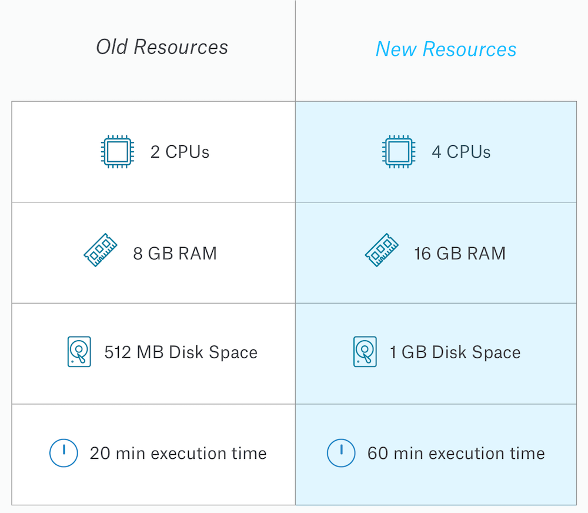
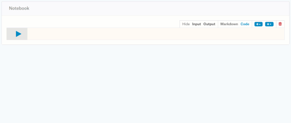

Product Launch: Amped up Kernels Resources + Code Tips & Hidden Cells

# Product Launch: Amped up Kernels Resources + Code Tips & Hidden Cells

[Anna Montoya](http://blog.kaggle.com/author/annamontoya/)|09.21.2017

Kaggle’s [kernels](https://www.kaggle.com/kernels) focused engineering team has been working hard to make our coding environment one that you want to use for all of your side projects. We’re excited to announce a host of new changes that we believe make Kernels the default place you’ll want to train your competition models, explore open data, and build your data science portfolio. Here’s exactly what’s changed:

## Additional Computational Resources (doubled and tripled)

- **Execution time**: Now your kernels can run for up to 60 minutes instead of our past 20 minute limit.
- **CPUs**: Use up to four CPUs for multithreaded workloads..
- **RAM**: Work with twice as much data with 16 GB of RAM available for every kernel.
- **Disk space**: Create killer output with 1 GB of disk space.

## Code Tips

Code tips catch common mistakes as you work through coding a kernel. They will pop up when you run code with an identifiable error and significantly cut down your troubleshooting time.

Here are some examples of the most common code tips you’ll run into:

*Although you specified the "R" language, you might be writing Python code. Was this intentional? If not, start a Python script instead.*

*Couldn't show a character. Did you happen to load binary data as text?*
*Did you mean "from bs4 import BeautifulSoup"?*
*Did you mean "ggplot2"?*
*Do you mean pandas.DataFrame?*

## Hidden Cells

You publish public kernels so you can share your data science work to build a portfolio, get feedback, and help others learn. We've added the ability to hide cells, making it possible to present your analysis cleanly so people can focus on what's useful. If viewers want to dig in, it’s still possible to unhide cells to see the dirty details.

## Improved Reliability

We know how frustrating it is to lose work, get stuck on Kaggle-side errors, or simply have a workbench that’s down when you’re trying to get up and running. It’s a priority of the Kernels engineering team to improve reliability so you can count on your code. Here are a few recent improvements:

- Fewer notebook disconnections
- Notebook editor now works with “Block Third Party Cookies” browser setting enabled
- More reliable notebook auto-save

What else can we do to make Kernels your default data science and ML workbench? [Aurelio](https://www.kaggle.com/aagundez) will be monitoring [this forum post](https://www.kaggle.com/product-feedback/39790) closely...let us know what you'd like to see next!